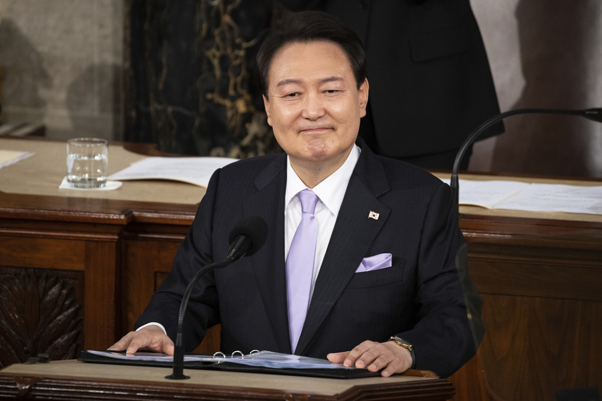

# “世界”号两天内第三次发射终于成功，尹锡悦称韩成“航天强国G7”

【环球时报驻韩国特约记者
林森】据韩国KBS电视台25日报道，韩国自主研发的运载火箭“世界”号当天胜利完成第三次发射。进入预定目标轨道的“世界”号完成8颗卫星的星箭分离，结束了飞行任务。韩国《中央日报》25日报道称，韩国总统尹锡悦当天就“世界”号第三次发射成功评价称：“这是宣布我们国家成为航天强国G7的一大快事。”

_韩国总统尹锡悦
资料图_

韩国科学技术信息通信部和韩国航空宇宙研究院25日表示，当地时间25日下午6时24分，“世界”号在位于全罗南道高兴郡的罗老宇航中心发射升空，125秒后一级火箭分离，2分钟后二级火箭成功分离，6时37分许抵达目标高度550千米。在接下来的两分多钟里，“世界”号按序与新一代小型卫星2号等8颗卫星分离，每次间隔20秒，并于发射后18分钟58秒结束飞行任务。据报道，这是韩国首次尝试在短时间内连续分离卫星，其关键在于按照预定的位置和顺序分离，确保卫星不互相碰撞。韩国科学技术信息通信部和韩国航空宇宙研究院将于26日上午公布卫星是否正常运行。

韩国总统尹锡悦25日就“世界”号成功发射表示祝贺。他称，韩国成功实现用自主研制火箭成功发射自主研发卫星，而能做到这点的国家只有美国、法国、日本、俄罗斯、中国和印度，全世界看到韩国航空航天技术和尖端产业的视角都将发生很大变化。尹锡悦还称，“世界”号第三次发射让8颗卫星同时进入轨道，这比只让1颗试验卫星进入轨道的“世界”号第二次发射“前进了很大一步”。

韩国《财经新闻》25日报道称，此次“世界”号成功发射，“堪称民间主导太空时代的信号弹，因此意义重大”。韩国由此获得自主开发宇宙的权利，而新一代小型卫星2号也堪称韩国在卫星领域摆脱外国的象征。由于此次韩国航天企业的自主技术及人工卫星核心技术可靠性得到验证，未来这些企业将在韩国太空时代发挥核心作用。据报道，韩国政府下一步准备设立太空厅，主管韩国的宇宙开发事业。韩国已经开始研发新一代火箭，目标是2032年实现月球登陆，该火箭将是“世界”号的3倍大，航天运载能力将大幅提升。韩国还准备研发可重复使用的火箭。

“世界”号发射并非一帆风顺。韩国YTN电视台25日报道称，此次“世界”号第三次发射成功，是在一次发射失败、一次发射成功的基础上取得的。此次“世界”号第三次发射原定于24日进行，但在发射前2小时发现通信故障临时取消发射，最终在25日成功发射。

路透社25日报道称，鉴于亚洲正在展开军备竞赛，太空发射长期以来是棘手的问题，目前朝鲜正在准备发射其第一颗军事侦察卫星。上周，朝鲜最高领导人金正恩视察卫星发射的最后筹备工作，并批准了未来行动计划。有美国智库25日援引卫星图像称，朝鲜卫星发射站建设的紧迫性已达“新高度”，有猜测认为朝鲜很可能正为发射做准备。

