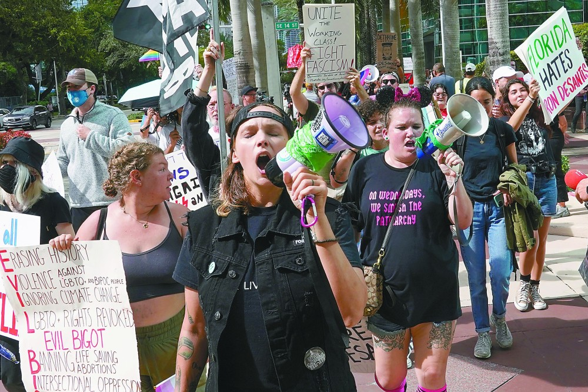

# “中国组”负责人辞职，国务院“二把手”将退休，美对华政策班子接连调整

【环球时报综合报道】“美中关系陷入动荡之际，美国国务院负责中国事务的最高官员宣布辞职”，彭博社25日报道称，美国国务院分管亚太事务的副助理国务卿兼“中国事务协调办公室”（非正式名称为“中国组”）主管华自强（Rick
Waters）将卸任。美媒注意到，拜登政府负责中国问题的高级官员近期出现不少变动，华自强只是其中一例。路透社认为，相关人事变动可能与美国政府内部在对华政策上存在分歧有关，而这些分歧已经影响“中国组”的运行。与此同时，中国商务部长王文涛将同美国商务部长雷蒙多、贸易代表戴琪举行会谈。美媒称，此次会谈将成为中美关系回暖的首场考验，将决定双方能否恢复因“气球事件”而“脱轨”的高层交往。对于拜登政府为缓和美中关系应作出哪些务实工作，美国一些媒体和分析人士给出建设性提议。有美国学者警告称，美国越是完全依赖威胁和惩罚来与中国打交道，并从生存的角度来构建竞争，美国的盟友和伙伴就越可能“踩刹车”。

_美国佛罗里达州州长德桑蒂斯24日宣布参选下一届美国总统，反对他的民众当天聚集在佛州迈阿密四季酒店附近游行抗议。
（视觉中国）_

**“中国组”士气低迷**

据路透社25日报道，美国国务院发言人24日称，华自强将于6月23日卸任，并继续担任高级外交官。该发言人没有透露华自强离职的原因。知情人士对路透社称，华自强在24日早些时候的一次员工会议上宣布了他辞职的意向。去年12月，美国国务院成立“中国组”，旨在“管理美中竞争”。该机构由国务卿布林肯主持设立，华自强担任负责人，日常向美国常务副国务卿舍曼及负责亚太事务的助理国务卿康达汇报。

“对华政策班子继续大调整”，“美国之音”25日称，华自强在美国国务院担任副助理国务卿负责中国事务已两年，是拜登政府内较倾向与中国往来的官员。华自强今年3月曾低调访华，被认为是为布林肯访华“铺路”。路透社获得的美国国务院内部信息与邮件显示，“气球事件”发生后，美国推迟进一步对华制裁，希望降低双方关系恶化的程度。当时华自强在内部邮件中称：“国务卿的指示是暂缓跟气球无关的行动，这样我们就可以专注于对称和协调的反应。我们可以过几周再考虑其他做法。”

路透社提到，对华新制裁的延迟令一些美国官员感到震惊，并显示出美国政府在对华政策上存在分歧：一部分人主张对中国采取更强硬行动；另一部分人则主张采取更克制态度。一些消息人士表示，该分歧已经影响“中国组”的运行，导致该小组士气低迷、人员空缺率高达40%。当时有知情人士透露，最近，该小组还有一些工作人员要求离职。

“美国政府重大人事异动”，“德国之声”25日报道称，华自强宣布将离职是处理美中关系的官员最近一系列变动中的最新一例，今年2月，白宫国家安全委员会宣布，负责中国事务的高级官员罗森伯格离职。本月早些时候，美国国务院“二号人物”舍曼宣布将于6月底退休，她的继任者人选尚未公布。

南京大学国际关系学院执行院长朱锋25日对《环球时报》记者表示，华盛顿近期的人事调整说明，拜登政府内部在应该执行怎样的对华政策以及如何协调平衡美国国内日趋多元化的对华声音等方面，面临新的难题和政治压力。与此同时，也反映出美国一味强硬打压中国、试图把“新冷战”强加给中美关系的政策，正引发美国国内和国际社会的更多争论。中国人民大学美国研究中心副主任刁大明认为，相关人事变动可能和美国中期选举后政府进入新的阶段有关，但这并不意味着拜登的对华政策将出现重大变化。

**中美商务部长会谈是“首场考验”**

今年以来，中美关系因为“气球事件”、台湾、贸易等问题遭遇严重困难，面临严峻挑战。进入5月，美中高层官员开始互动。中国商务部新闻发言人束珏婷25日在例行记者会上表示，5月25日至26日，王文涛部长赴美国参加亚太经合组织贸易部长会，其间将分别与美国商务部长雷蒙多、贸易代表戴琪举行会谈。中方将就中美经贸关系和双方共同关心的问题与美方进行交流。

“美中两国看到修复关系的脆弱契机”，美国《华尔街日报》24日称，作为拜登任内两国首次在华盛顿举行的部长级会谈，王文涛与雷蒙多的会谈将成为中美关系回暖的首场考验，将决定双方能否恢复因“气球事件”而“脱轨”的高层交往。曾任白宫国家安全会议亚洲事务资深主任的乔治敦大学教授梅代罗斯称，美中尝试重建基本沟通管道，此刻是“脆弱的机会”。美国政论网站Counterpunch24日发文对当前美中之间存在“沟通鸿沟”感到担忧。不过，近期两国沟通开始回升，中美都认为双边关系进一步恶化不符合任何一方的利益。从本月双方会晤来看，商贸问题或许是推动两国走到一起的主要力量。美国和平研究所对美中两国很快恢复高层交往持乐观态度，该智库认为，双方至少能就一个问题达成共识，那就是更好地管控分歧符合双方共同的利益。“美国之音”称，美中商务部长的对话可能开启更多美方官员的中国之行。白宫新闻秘书让-
皮埃尔23日在记者会上表示，时机成熟时，美方将再次寻求安排布林肯等官员访问中国。

外交学院教授李海东25日对《环球时报》记者表示，经贸作为中美关系压舱石的地位实际上是没有变化的，正是基于这个现实，中方强调中美需要合作，美方不能一味寻求竞争对抗，而美方的对华政策一贯倾向于把经贸问题武器化和地缘政治化。李海东表示，经贸领域的合作顺畅展开可以看作中美关系回暖的重要指标，接下来要对拜登政府听其言而观其行。

“接下来有两件事情可能为美中关系埋雷”，“美国之音”称，拜登近期拟签署一项行政命令，试图限制美国对中国某些高科技领域的投资。这是继去年10月拜登政府实施对中国高级半导体和芯片制造设备的出口管制措施后的又一项举措。此外，美国可能继续拿“气球事件”的“调查结果”说事。

**“关键是如何重建信任”**

在美国对华政策班子出现调整之际，一些政客仍不遗余力地抹黑中国，并粗暴干涉中国内政。据美联社25日报道，美国众议院下辖的“中国问题特别委员会”24日表决通过“涉疆”“涉台”两份提案，施压国会对中国采取行动。美国国家安全局24日援引微软公司的报告声称，近期一个中国黑客组织“针对美国关键基础设施发起网络攻击”。英国、澳大利亚、加拿大、新西兰等国相关机构也发布了类似报告。

中国外交部发言人毛宁25日在例行记者会上表示，很明显，这是美国出于地缘政治目的，发动“五眼联盟”国家采取的集体虚假信息行动。众所周知，“五眼联盟”是世界上最大的情报组织，美国国家安全局是世界上最大的黑客组织，他们联手发布虚假信息报告，本身就很讽刺。

“中美关系解冻，拜登政府可以做哪些工作？”美国布鲁金斯学会高级研究员、中国问题专家何瑞恩23日撰文称，首先，华盛顿可以优先考虑与中国的直接、私下外交，“私人信件、电话、国家安全顾问之间的安静谈话、低调的访问以及通过大使馆进行的工作，将为美中关系取得进展带来更大的前景”。其次，美国应暂停与北京就处理两国关系的危机管理机制和原则进行谈判，在目前的关系气氛下，推动这些话题将会加剧而不是降低风险。何瑞恩称，美国越是完全依赖威胁和惩罚来与中国打交道，并从生存的角度来构建竞争，美国的盟友和伙伴就越可能“踩刹车”，以防止被推入与最大贸易伙伴的正面对抗，美国的合作伙伴中很少有国家对加入一个反华集团感兴趣。

“关键是如何重建信任”，美国智库史汀生中心资深研究员罗伯特·曼宁建议美中“以互惠措施为基础，一小步一小步、一块砖一块砖地，建立某种程度的信任”。比如双方重新开放被关闭的领事馆、放宽学生和教师的签证、开展贸易技术谈判以及为人工智能等新兴科技制定规则等。

【环球时报驻美国特约记者 冯亚仁 环球时报记者 赵觉珵 陈青青 环球时报特约记者 甄 翔】

