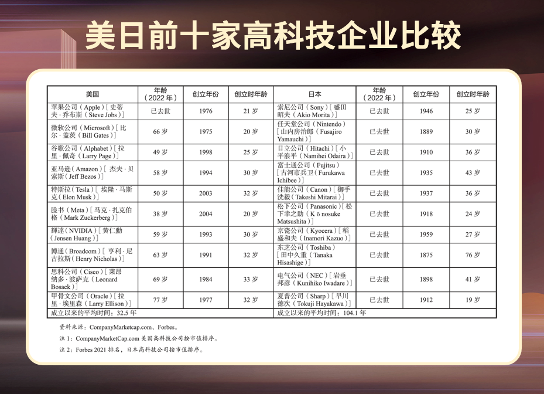
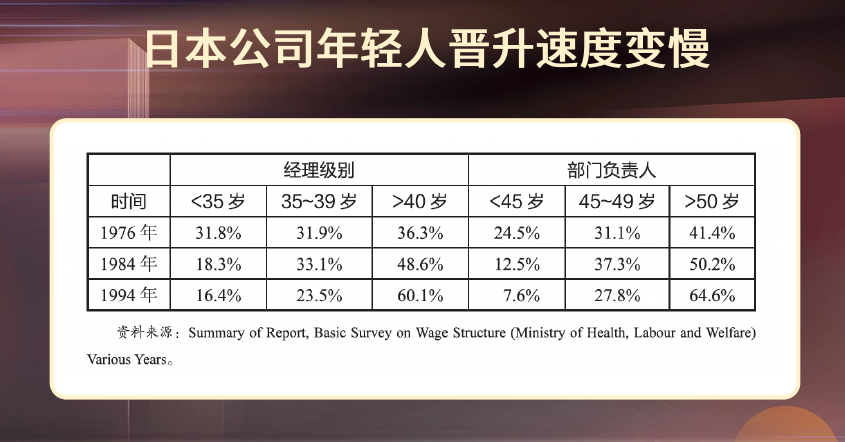
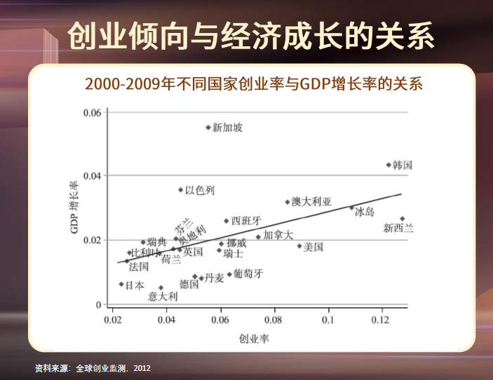
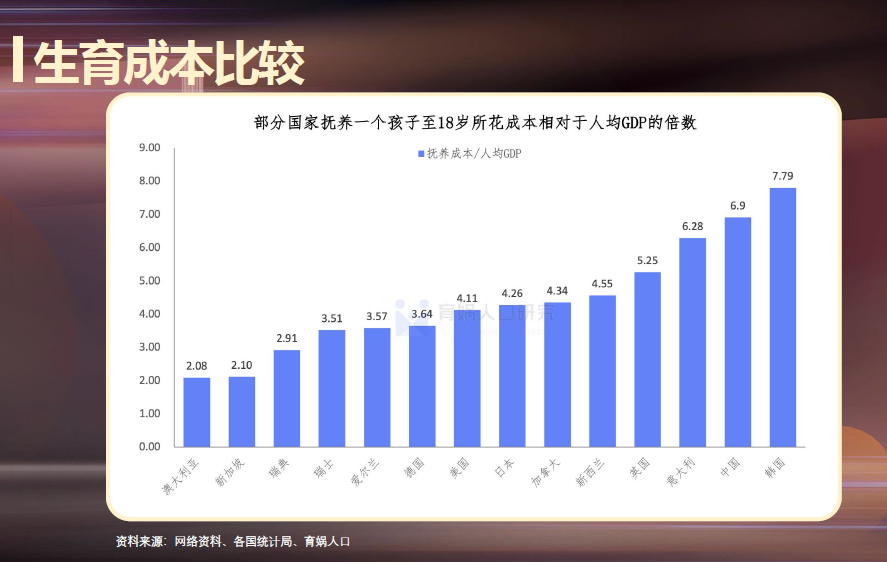
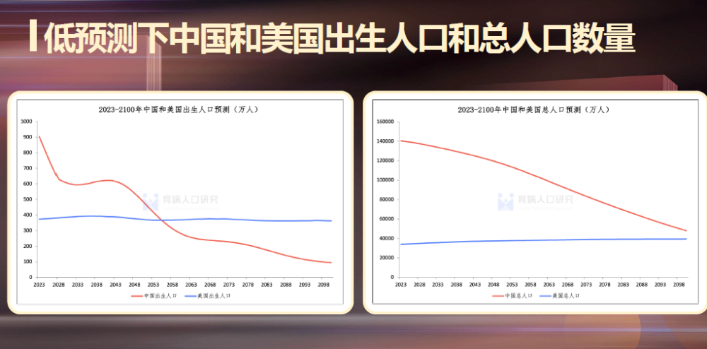
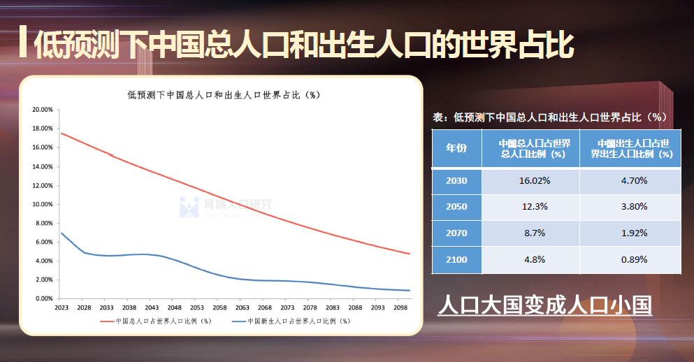

# 一线｜梁建章：现在经济形势下，发钱鼓励生育是非常好的时机

腾讯新闻《一线》 作者 刘鹏

5月26日，携程集团联合创始人兼董事局主席、人口学家梁建章发布新书《人口战略：人口如何影响经济与创新》，在书中他分析并预测了中国未来人口情况和经济的长期竞争力，并就公共政策如何降低生育成本，提振民众生育意愿给出了建议。

他建言，对于当前的经济形势，发钱鼓励生育是非常好的时机。“发钱不光为了长期中国创新力、人力资源去做投资，在短期也能够提振经济、提振需求，能解决短期就业不足跟需求不足的问题。”

具体来讲，为提振民众生育意愿，梁建章提出四大财税补贴建议，分别是：现金补贴，每个孩子累进1000-2000；税务补贴，二孩家庭，所得税和社保减半，三孩家庭全免；购房补贴，二孩家庭，房贷利息减半，三孩家庭全免；福利托儿所，建设大量福利性托儿所，把入托率提高到50%。

之所以如此发声鼓励生育，梁建章例举了一组数据，“过去七年，我们新出生人口从1800多万到几乎减半，去年只有900多万，这个是在中国历史上空前的，在世界历史上也是空前的”，他甚至用“人口结构崩塌”来形容。

梁建章提醒，人口不光是发展的问题，也是安全的问题。“如果人口规模出现了问题，科技实力会受影响、经济实力也会受影响，供应链可能就不完整，我们中国现在供应链不完整的话，半导体行业已经受到很大安全的隐患，科技实力、经济实力、供应链受影响，军事安全就会受到一定的影响……人口对创新的作用不仅会影响财富、国力，也会影响国家的安全。”

当然，数据隐忧之外也有乐观因素。梁建章表示，新生人口减少是发生在过去几年，影响到中国经济可能还要十几年、二十年的时间，在这之前，中国仍然具有年轻人总体规模优势，中国人均GDP现在还是比较低，还有比较大的上升空间，所以中国经济总体短期还是比较乐观。

以下为梁建章讲话全文：

今天很高兴见到很多人口界、经济界的老朋友，也有很多媒体跟出版业的新朋友，非常感谢大家能够光临，也非常感谢大家持续地关注人口问题。

刚才其实讲了一些背景，但是这个背景，我觉得还是不够触目惊心，最触目惊心的一组背景数据就是过去七年，我们新出生人口从1800多万几乎“腰斩”，到了去年只有900多万，这个是在中国历史上空前的，在世界历史上也是空前的，我们说新出生人口会决定着未来人口的结构，决定未来人口的总量，我们的人口结构出现“崩塌”，用“崩塌”这个词应该说并不是夸大的，在这样一种背景下，我觉得大家真的是要考虑一下我们国家的人口战略。

这本书当然是我十多年来很多研究的总结跟结晶，今天时间关系，只能拿出里面最重要的，我认为是最重要的，或者最独创的观点跟大家分享，大家有什么问题可以等会再继续讨论。

首先，贯穿这本书的就是“人口创新力模型”，这是我独创的一种分析框架，人口的创新力等于人口数量跟人口能力，还有内部交流跟外部交流，应该是个很简单的模型，大家如果仔细想想，也是很自然的，一个比喻就是人类的大脑，现在AI的算法，人工智能也是模拟人类大脑，智能取决于神经元的数量，相当于人口，神经元的强度，神经元的连接，跟内部、跟外部的连接，一个国家创新力也是这样，一个个人创新力也是这样，需要自己有强的能力，也有跟内部跟外部的交流能力。

当然，还有很多后面的论证跟案例，是从这个框架引出了人口对于创新力的几个最重要的效应，就是规模效应、老龄化效应、聚集效应跟流动效应，今天没有办法跟大家一一讲，每个效应书里面都详细介绍了，拉出今天最重要的两个效应，就把规模效应跟老龄化效应跟大家稍微详细地再分析一下。

规模效应。人越多，他对创新力是有促进作用的，过去农业社会，人口越多可能人均耕地就越少，就马尔萨斯那一套人口规模对于经济拖累的事情，这个思想其实是影响了很多人口学家、经济学家，包括大众的观念很多很多年，但现在农业已经占GDP比例非常小了，一个经济的竞争力、财富的创造能力基本上取决于经济的创新能力。

规模效应就对创新能力有很大的正效应，规模效应在经济当中很普遍，尤其工业化之后，比如制造业，我们知道设计制造，比如一辆电动车，量产以后，可以分摊到100万辆，产量越高分摊成本越低，这是制造业上的规模效应；服务业中也有规模效应，简单的服务业，餐饮等等，服务的量有限，所以没有太大的规模效应，但是一些异地服务业，比如说酒店业，有全国性的品牌效应，连锁酒店有规模效应，连锁的这些商业有它的规模效应，就是在服务业。

这些过去都是可能一些最重要的产业，但是过去几十年，最重要的一些产业或者财富创造力最强的一些产业，也是科技竞争力至关重要的这些产业是什么产业呢？我们叫做信息服务业。信息服务业是一个广义的信息服务业，包括了像携程这样的平台公司，互联网公司，也包括我们说的这些AI公司，也包括文化创意类的公司、游戏公司，这些都是未来占GDP比例越来越高的产业。这些产业的特点就是它的规模效应更大，它的特点是什么？就是客户本身就是服务的提供商，社交网络客户本身就是提供商。而且客户本身参与了创新，参与了创造，为什么？因为客户用得越多，比如你的搜索引擎用的人越多，你的算法越好，越多的人用携程，我的客服流程优化得越好，在AI时代更是这样，AI时代需要大量的数据训练，用的人越多场景、数据训练越多，算法就更好，在新兴的互联网信息服务行业，在AI这些行业，在文创、游戏这些行业，庞大的市场、庞大的本土市场是一个巨大的优势。

这个例子就很多了，美国实际上即使在几十年前，虽然他一直是世界上人口最多、经济规模最大的国家，但是在制造业，甚至于传统的服务业品牌，他并没有那么大的优势，其实德国或者是日本的企业，也具有很大的优势，但是最近几十年，当信息服务产业成为经济体中最重要的，未来AI成为一个支柱产业也是同样的，机器人这些都是同样的，美国这样的大国中的企业，就可以享受这样的规模效应，而且他会占领先机，因为它形成一个临界点，美国1%的人口几百万，可以领先小国达到临界点，商业成功的临界点，他自己在本国取得成功以后可以占领其他国家的市场。

另外一个具有这样的规模优势当然是中国，中国的人口规模比美国还大，中国在AI方面能力也很强，未来机器人到处都是替代人类，中国机器人有很好训练的场景，因为它有很大的本土市场，它的产量很高，它也有很多的人才，所以中国未来的智能产业也会享受这样的规模优势。

这就是我觉得最要强调的一点，因为规模优势可能大家传统的经济学里也有，但是这一点，在未来最重要的，附加值最高的产业，规模效应比以前更加强烈，人口规模更加重要。

另外一个效应，这个也是我做博士生研究的时候发现的，也是越来越得到大家的认可，就是人口能力的老龄化效应。

最概括性的就是如果是一个倒金字塔人口结构，头重脚轻的，年轻人相对老人比较少，年轻人就会被压制在更多的年长人的社会层级体系底端，他的活力会受到影响。

为什么拿日本做案例？因为日本是世界上低生育率最早受到影响的国家，因为他的生育率在二战以后就下降了，其他国家，像美国，可能到六七十年代才会经历低生育率。如果是五六十年代经历了低生育率，影响日本经济其实就是八九十年代，因为有二三十年的延迟。日本80年代很强，GDP曾经一度达到美国120%，人均GDP超过美国，最近几十年创新力确实受到了很大的问题，很多人说日本经济的问题到底是什么？从刚才这张表可以看出来，他还是创业创新活力的缺失，因为我们没有看到像美国这样这么多高科技公司都是最近几十年发展起来的，日本最近几十年高科技公司还是那么老的公司，即使这些老公司在新的领域竞争也落败下来。

为什么日本曾经很强的这些高科技公司在新的创业创新领域做得这么差呢？其实跟年轻人的活力下降是很有关系。这个数据就是日本过去从70年代到90年代，年轻人的晋升速度，在70年代，他做到中级管理人员的比例，在年轻人的比例还有30%，这个比例到90年代直接降到六分之一，下降得很快，到部门负责人这个级别，在70年代还有四分之一的人是45岁以下的，45岁以下做到部门经理应该是比较年轻的，但这个比例到了90年代只有7.6，这个很自然，老人占据位置，年轻人晋升空间就小，年轻人晋升空间小，各方面活力，包括创业活力，包括在大公司里面引领一些创新型项目的能力都会下降。

不光是日本的数据，其实我也看了全球的数据，创业的概率跟国家的老龄化程度是有明显负相关的关系，越是年轻的国家创新活力越强，时间关系，我就不多讲了。

中国是什么状态呢？中国的老龄化程度跟日本相比是什么状态呢？差不多有35年的延迟，日本发生的事可能在90年代，如果是中国老龄化会影响创新活力，也可能到2020、2030年，也就是未来会受到一定的影响。

书里面还讲了另外两个效应，就是内部交流的畅通跟外部交流的畅通，跟内部跟外部交流密切程度，也可以促进创新，今天可能就没有时间详细讲了，大家可以看书。

从创新力模型就可以，书的第二部分就分析了几个主要的创新国家，他们未来的创新力，从这几个维度来分析，他们现在的创新力和预测未来的创新力，尤其是中国。我们知道中美科技竞争正是大家非常关心的话题，我们可以看一下中美竞争的态势。

中美人口规模，中国比美国人口规模更强，中国14亿人，中国现在相对美国优势是人口规模更大，人口能力可能差不多，内部交流性这两个国家都非常好，因为是单一语言，单一文化，相对欧洲会好，欧洲不同语言内部交流，欧洲作为一个整体，他们不同的欧洲国家之间的交流就会差一些，所以欧洲作为一个整体内部交流会差一些；外部交流，因为美国是一个移民国家，他跟全球连接要比中国更好，中国跟美国是各有千秋，总体来说，中国完全有能力跟美国去一争高下，因为中国在人口规模超过美国，但美国在对外交流方面可能比中国有一定的优势，各有千秋。

但是，如果中国的人口持续萎缩，尤其是年轻人口持续萎缩的话，这样一种均势会发生逆转，据我估算，可能十几二十年以后，这本书里面有详细的估算，量化的分析，总的来说，我们人口规模原来是美国的4倍，我们如果每代人减半，现在人口崩塌速度就是每代人减半，过一代人过二三十年我们年轻人就不是4倍了，只有2倍了，这个规模方面的优势会逐代减弱，不是到2倍就停止，还会不断减弱，直到我们完全没有这样的优势。

老龄化使得年轻人的活力下降，如果中国出现严重老龄化，能力也会下降。这本书里面有很大一篇分析各个国家，尤其是分析了中国跟美国的创新力的情况。

这个书里面也不光是只是讲创新，我们知道传统的人口经济里面讲了很多人口影响经济的其他一些渠道，比如是资源到底会怎么样受人口影响，怎么样会影响到经济？还有资本，还有劳动力跟养老的问题，但这些问题书里面也都一一作了介绍，但是这本书里面还是强调，创新是未来最重要的一个维度。

尤其在智能时代，我现在看到未来可能几十年以后，机器人可以取代大部分的人的工作，AI也可以甚至取代一部分事务性的、重复性的创新劳动，未来就越来越把人分成两类，一种是创造智能的人，创造这些智能工具的人，另一个就是使用这些工具的人，被智能服务的这些人，这两部分人的要求不一样，能够分到的财富也是完全不一样的，前者创造智能的人可能分得蛋糕比后者大得多，这个对个人来说也是这样，对于国家来说更是这样，如果一个国家的创新力很强，他是制造这些智能的人，比如说中国继续在机器人，制造业机器人很强，把机器人卖给全世界其他的国家，那中国就能分到很大蛋糕，中国人均财富就会很高，如果你仅仅是使用方，你就分到比例很小。科技实力即使在智能时代，尤其在智能时代，是更加会决定了整体的经济实力，而人口是科技实力的保障。

人口不光是发展的问题，也是安全的问题。这本书里面没有讲得太多，但我稍微可以提一下，不光是一个发展问题，也是个安全问题，因为如果你的人口规模出现了问题，你的科技实力会受影响、经济实力也会受影响，你的供应链可能就不完整，我们知道我们中国现在供应链不完整的话，半导体行业已经受到很大安全的隐患，科技实力、经济实力、供应链受影响，军事安全就会受到一定的影响，如果你的经济实力受到影响，你的军事、安全受到影响，比如说能源长时间还会依赖进口，这个在能源方面的安全也会受到影响，人口对创新的作用不仅会影响财富、国力，也会影响国家的安全。

这个我刚才讲了一些，我没有时间跟大家细讲了，这本书里面有专门一章讲这个中美科技竞争。

结论就是，首先短期我们还是乐观的，因为短期我们刚才说的人口崩塌、新生人口崩塌是发生在过去几年，这个影响到中国经济可能还要十几年、二十年的时间，在这个之前，中国仍然具有年轻人总体规模优势，这个跟美国是可以一较高下的，中国人均GDP现在还是比较低，还有比较大的上升空间，所以中国经济总体短期还是比较乐观，但人口问题是一个“灰犀牛”，必然会影响我们20年以后的经济活力跟创新。

这个我就跳过了，书里面有很详细的分析中国跟美国的比较。

最后讲讲战略，就是怎么办？我分析了这些人口影响创新的渠道，分析了这些创新力模型，我们人口的形势到底是怎么样的？这个非常不乐观。

首先，育娲人口两年前出了一个生育成本的分析，首先要分析年轻人为什么在中国不愿意生孩子，从这个图上看出来，生育成本可以算得出来，每个孩子养到18岁需要多少钱，这个钱相对于一个年轻人的收入或者年轻家庭的收入倍数是多少，可以看出中国几乎是养育成本相对于收入来说是最高的，所有国家里面最高的，唯一一个比中国更高的是韩国，是两年前的数据，所以这样的一种生育成本也基本上决定了未来生育率的走向，生育率大家可能也知道，中国的生育率已经是世界上唯二的，还不是唯一的，现在还不是唯一，未来有可能是唯一，唯二生育率最低的国家，比1.1还低一点点，我们知道生2个，2.1个是更替水平，几乎是减半，正是因为中国生育成本几乎是世界上最高的，比中国更高的就是韩国，生育率确实比中国更低，中国生育率比日本还要低很多，因为中国生育成本比日本还要高很多。

虽然说我们知道工业化以后，生育率下降是全球的趋势，但是为什么中国的生育率是特别低呢？主要是这几个原因，一个是教育，一个是房价，一个生育福利缺失。

这个我就不详细讲了，大家看看，为什么中国的教育压力特别大，为什么中国的房价，这些都有详细的数据，生育福利现在确实没有落实，其他所有国家，包括韩国现在也在加大扶植生育的力度。

全球最低的生育率会对人口总量跟新出生人口产生什么大的影响呢？我们现在是900万，在图的左边，会继续下降，因为我们只有1.1的生育率，必然是每代人减半，不是说停留在某个新出生人口的数值，而是会每代人不断下降。

现在的新出生人口其实比美国只是多了1倍，中国总人口是美国4倍，但新出生人口900多万，只有美国1倍多，那再过一代人，到二零五几年的时候，中国新出生人口会少于美国，这个我们都可能看得到，这个也是非常令人震惊的，我从来没有想过中国的新出生人口在我有生一年有一天会低于美国，那个时候当然未来中国所谓的人口规模优势就不复存在了，总人口的下降会有一定的惯性，因为中国老人越来越多，但是我们说看年轻人口的话会很快发生。

这个跳过了，时间关系。

我总体还要提醒大家，我说的人口的问题影响中国经济可能要十年、二十年时间，是个“灰犀牛”时间必然会影响，但是最近十几年中国人均收入还有比较大的空间，因为中国创新力相对于人均收入来说是超前的，也就是说，按照中国的创新力来看中国的人均收入，应该是跟南欧国家，发达国家里面比较穷的国家是一个水平，应该是比现在的水平要高不少，2万美金左右，这个图大家仔细看一下，这个也是书里面很重要的，至少短期我们不要太悲观，短期中国经济还是乐观的，但长期的问题是必然会发生的。

回到我们到底怎么办呢？怎么样降低生育成本？生育成本是教育、房价，其他的生育成本，最快的，最立竿见影的就是政府给钱了，领工资生娃也好，发钱生娃也好，还是说生育补贴也好，就是给钱。当然，因为教育跟房价都比较难改，尤其是教育会牵扯到很大体制的改变，这个会需要很长的时间。

这个是刚才前面讲过的。

这个稍微再提一下，这也是触目惊心的，我们曾经占世界人口三分之一，大家都知道，这个是在清朝末年，现在可能就占百分之十几，我们新出生人口只占世界的5%，但这个只是现在，到本世纪末，我们有可能总人口占世界不到5%，未来可能跌破1%，中国不再是一个人口大国。

我们回到我们的人口政策的建议，立竿见影的就是财税补贴、现金补贴、税务减免、购房补贴、福利托儿所，还有其他一些减负建议，最难的是教育的改革。

稍微讲一下，财税建议详细的在书里面都有，比如每个孩子、二孩每个孩子每个月1000，三孩家庭每个孩子每个月2000，这样递进式；税务补贴，二孩家庭社保减半，三孩家庭社保全免；购房补贴，二孩家庭房贷利息减半，三孩全免，大量建立福利性托儿所，把入托率提高到50%，这个是最立竿见影，也是花真金白银。

还有一些确实有帮助，也是非常值得做的，5个减负建议，男女平等产假制度，灵活办公，就是说公司允许员工在一周中5天有2天时间在家里办公，这个其实是我们携程现在就是这么做的，对员工满意度，尤其女性员工，兼顾家庭跟职业发展都是有帮助的，开放外国保姆，降低养育成本也有帮助，辅助生育技术，还有保障单亲家庭的福利，同等的福利的权利。

最难的就是，书里面专门一章讲教育，最难的可能也是最关键的就是教育改革，现在的教育太大的浪费，刷题的浪费，家长的压力，我们都知道用“内卷”这样的词来描述，怎么改？不要那么多考试，不要那么多筛选，中考考一次，高考考一次，考研，小升初，筛选考一次必要，尽量延迟，不要那么早筛选，减少这些不必要的筛选考试以后，就可以节省大量的复习刷题的时间，就可以缩短学制，取消中考，缩短学制，把小学、中学阶段从12年缩短到10年，普及大学教育，大学是宽进严出，大学毕业考作为最重要的考试，前面的考试淡化或者取消，这是很复杂的问题，欢迎大家可以一起探讨。

上面说的这些政策建议需要很大的财力，也需要相关部门的协调，所以从机制上可能需要成立一个国家人口政策委员会，来统一制定协调各项政策。

时间关系，就只能跟大家分享到这，虽然说对我们的影响不是立刻的，但是我还说这是“灰犀牛”，是一个必然会发生的事，如果我们要改变中国20年以后的经济跟社会、跟创新力非常令人担忧的局面，我们必须现在就行动起来，让更多的社会资源去倾斜到有孩子的家庭，来逆转我们低生育率。

另外，最近我还稍微补充一个，最近中国经济特别地大家担忧，就业不足、需求不足、产能过剩，现在这样一种经济形势下发钱鼓励生育也是非常好的时机，因为发钱不光为了长期中国创新力、人力资源去做了投资，而且在短期也能够提振经济，提振需求，能来解决短期的中国经济的就业不足跟需求不足的问题。

