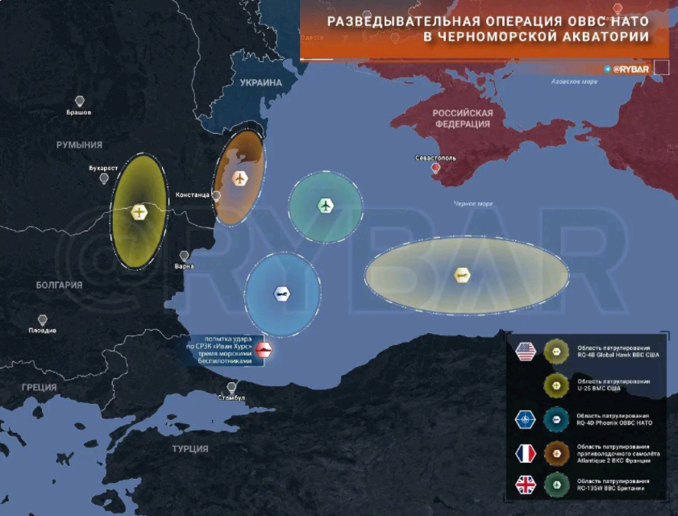

# 俄称黑海军舰击沉乌军3艘来袭无人艇，美俄：类似无人艇攻击还会持续

向来擅长以小搏大、将无人艇偷袭“玩出花样”的乌克兰海军，最近又闹了一个大动作。虽然俄军24日宣称，俄黑海舰队“伊万·胡尔斯”号侦察船“挫败3艘乌军无人艇的攻击”，但无论美国还是俄罗斯都承认，种种迹象表明，类似的无人艇攻击还会持续，“这不会是最后一次”。

根据俄国防部的声明：“24日5时30分，乌克兰军队试图用3艘无人驾驶快艇攻击俄黑海舰队‘伊万·胡尔斯’号侦察船，后者正在执行保护土耳其专属经济区内‘土耳其溪’和‘蓝色溪流’天然气管道安全的任务。所幸乌军无人艇的袭击没有成功，它们全都被俄侦察船在博斯普鲁斯海峡东北140公里处摧毁。”俄军侦察船通过无线电和水声设备发现乌军无人艇后，使用14.5毫米机枪在安全距离上将其摧毁。从俄国防部发布的现场视频中可以看到，乌军无人艇被机枪命中并发生猛烈爆炸。

显然，单从效果而言，乌军无人艇这次袭击并不算成功。但帐不是这么算的。

_乌军批量生产的自杀式无人艇_

去年10月，乌军率先利用无人机和无人艇同时对俄黑海舰队基地塞瓦斯托波尔发动攻击，这被称为是“史上首次大规模自杀式无人艇袭击”——之前各国海军发展无人艇时，考虑的都是利用它们执行巡逻、港口保护、反潜和反水雷等任务，却没有自杀式攻击这种看起来就很LOW的设计。直到乌军将自杀式无人艇投入实战后，外界才恍然大悟——这是一种全新的特殊海上威胁。

尽管俄军总结经验后，挫败了乌军后续几次攻击，但这次乌军无人艇对俄军侦察船的袭击，很可能是乌军在演练新的无人艇攻击战术——对海上机动目标而非固定或港口中缓慢航行的船只发动突袭。

_“伊万·胡尔斯”号侦察船_

遇袭的俄军“伊万·胡尔斯”号侦察船以电子战设备为主，仅配备有少量的大口径机枪和便携式防空导弹等自卫武器，但对付缺乏防御的自杀式无人艇，看起来似乎是够了。

不过美国“海军情报”网站称，俄军用机枪挫败了乌军无人艇的袭击，但“除非开发出一整套由智能弹药和导弹组成的、针对水面无人艇的复杂防御系统，否则仅仅依靠机枪无法防御大规模无人艇攻击”。

更让俄罗斯方面担忧的是这次袭击发生的地点。

美国“动力”网站称，发生袭击的地点距离最近的乌克兰海岸线也超过了200英里，乌军无人艇是如何获得俄舰海上活动情报并进行遥控指挥的？报道称，根据航班追踪网站的数据，当时多架北约飞机正在该地区执行明显的监视任务。俄方分析人士称，“这么多侦察机的出现并非巧合，通常在北约此类活动之后，乌军就会发动企图破坏或袭击克里米亚半岛等地目标的军事行动。”

俄罗斯军事专家瓦西里·丹德金称：“此次乌克兰无人艇可能是沿着‘粮食走廊’路线行驶的，这再次提出了乌克兰以出口粮食为借口试图将其用于军事目的的问题。我认为，北约向乌克兰提供了俄侦察船的坐标。情报可能来自美国大型无人侦察机和侦察卫星。此外，在保加利亚和罗马尼亚也有美国人的侦察系统。乌军袭击俄侦察船的无人艇也由北约国家提供。即便它们是在乌克兰组装的，所有配件也都来自西方。”

俄波罗的海舰队前司令弗拉基米尔·瓦鲁耶夫也认为，北约太空侦察系统可能参与了袭击俄罗斯侦察船事件。“他们有许多信息来源。也许在该地区进行战术侦察时，发现了‘伊万·胡尔斯’的位置，并向乌军通报了这一情报。”

俄罗斯《共青团真理报》25日引用俄军事专家亚历山大·米哈伊洛夫斯基的话称，对于乌军无人快艇在博斯普鲁斯海峡附近袭击俄军侦察船事件，最让人感兴趣的是这些无人艇是从哪里出发的，因为事件发生海域远离乌克兰领海。这种无人艇只能通过惯性导航或卫星系统控制，即便操控员可以在数百公里外进行控制，但快艇的动力储备并不是无限的。因此，它们更可能是从黑海的一艘商船上或军舰释放下海，然后自行前往附近的攻击地点待命。报道称，事发海域虽然是专属经济区，但不是领海，任何船只都可以在那里航行，都有机会释放这种无人艇。

因此，美俄媒体得出同一个结论：类似攻击行为将不会只有这一次。

