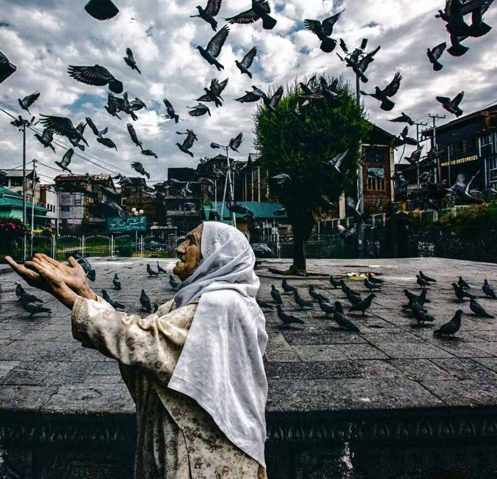
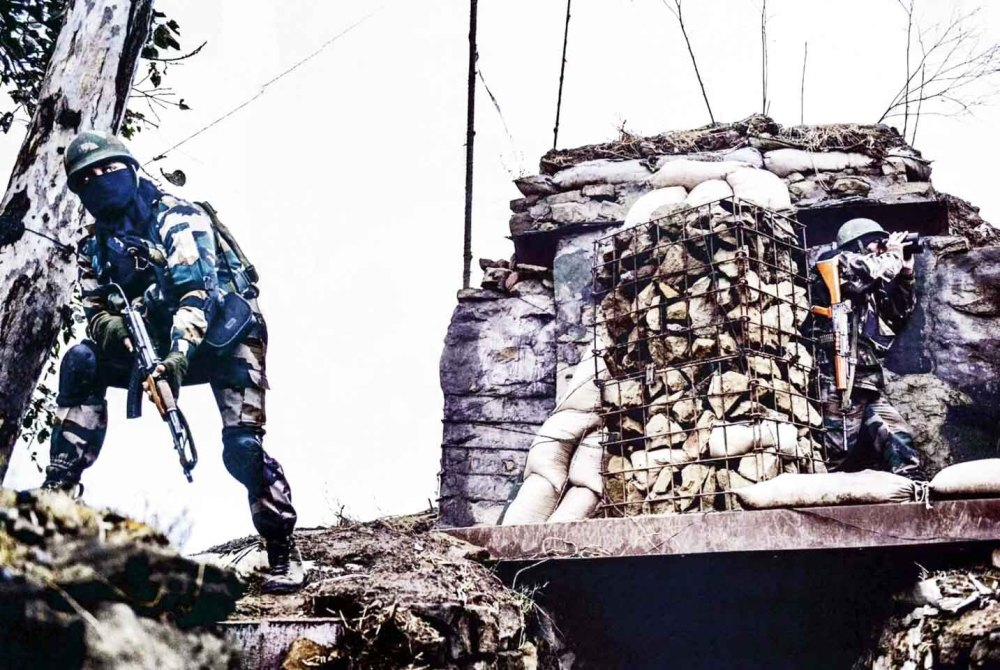

# 印度在印控克什米尔争议地区举行G20旅游会议，多个G20成员国拒绝参加

_印控克什米尔斯利那加警察局中央指挥中心。（作者供图/图）_

2023年5月22日至24日，一场议题并不敏感的国际会议，出现在一个敏感的地方，引发轩然大波。

作为二十国集团（G20）的轮值主席，印度执意把G20旅游会议安排到印控查谟-
克什米尔邦首府斯利那加，无视那里是印度和巴基斯坦的争议领土，也不顾国际社会的反对之声。

印度内政部长阿米特·沙阿在5月18日强硬表态：“谁说G20会议不能用到政治上？”

5月19日，中国外交部发表声明，不会以任何形式出席G20旅游会议，并坚决反对在争议领土举行会议。中国国务委员兼外长秦刚5月初在出席第四次中巴外长战略对话时，也重申了中方在克什米尔问题上的立场，即应该根据“《联合国宪章》和安理会有关决议以及双边协定，通过和平方式妥善解决”。

与中国的立场一样，多个G20成员国拒绝参加，反对印度利用G20旅游会议进行“政治捆绑”的做法。

_克什米尔妇女在斯利那加市中心的哈马丹清真寺祈祷和平。（作者供图/图）_

“军事化最高之地”

于5月24日结束的G20旅游会议，议题是生态旅游、旅游目的地开发、电影的旅游宣传作用等，与会嘉宾围绕克什米尔的“绿色财富”进行热烈的讨论。

印度总理莫迪希望，“这次会议是印度展示克什米尔丰富文化遗产、令人惊叹的自然美景和热情好客的机会”，能大大促进克什米尔旅游业发展，创造经济效益，为当地创造就业机会，并使其成为稳定的投资目的地。

然而，看似休闲的会议内容背后，却是激烈的政治较量。

巴基斯坦方面反应激烈。5月22日，巴控克什米尔首府穆扎法拉巴德爆发了大规模示威游行，抗议印度在争议地区举行国际会议，示威者打出标语“克什米尔不属于印度”“克什米尔的真实声音在这里”“只有谎言去斯利那加旅游”等等。

沙特政府强调要保持中立立场，不想卷入印巴之间的领土争端。土耳其外交部也强调与中国一起抵制印度利用G20会议进行政治捆绑炒作的做法。

耐人寻味的是，印度在克什米尔办会并不那么底气十足。

“印度希望外国游客忘却自己是在塞满军警的‘要塞’里旅行，并在游玩中悄然接受‘印度领土’的既成事实。”美联社记者阿贾兹描述道。

印度亚洲新闻社（ANI）5月24日承认，G20旅游会议绝非展示印控克什米尔风光那么简单，更主要是打击“以巴基斯坦为策源地”的“反印言论”，向世界展示“印度恢复克什米尔秩序”的成效，重申其对该地区主权及为人民带来“和平与繁荣”的承诺。

为了烘托气氛，克邦政府出钱鼓励市中心的商店比往常提前开张。自从2019年以后，许多店主通过关门或压缩营业时间，以表达对失去自治地位的愤怒。

为防节外生枝，克邦政府还决定在会议期间关闭斯利那加多所学校，因为那里有太多心怀不满的青年。

在克什米尔，印巴长期“不战不和”。

新德里指责巴基斯坦赞助克什米尔叛乱武装（当地人称“自由战士”）虔诚军和穆罕默德军，1989年至今已造成超过5万人死亡，伊斯兰堡则予以否认，并谴责印度的“压迫政策”导致近10万克什米尔人逃到巴控区。

2014年，莫迪上台后选择了“快刀斩乱麻”，首先结束克什米尔在印度法律上的模糊性，用其政治盟友阿米特的话说：“要消除隐患，不光用铁拳打击叛乱武装，还要堵住政治漏洞。”

当初，印度总理尼赫鲁为争取克什米尔土邦归附，不光厚待原印度教王公哈里·辛格，还积极笼络土邦上层的穆斯林贵族，专门以宪法370条赋予克什米尔高度自治地位，保护他们的特权。

正是得益于克什米尔权贵阶层的效忠，尼赫鲁才敢于1953年向巴基斯坦保证，“通过公民投票解决克什米尔的归属”，这也是巴基斯坦一直攻击印度的“舆论武器”。

但在外界一些人看来，宪法370条无异于绥靖，既讨好不了倾向与巴基斯坦合并或干脆独立的克什米尔穆斯林，也让印度国内强硬派不满。

莫迪随后决定走“第二条道路”。经过策划，2019年8月，印度以总统考温德的名义废除宪法第370条，接着闪电般软禁克什米尔主要政党领袖（无论亲印还是反印），安全部队逮捕一切被认为有暴力倾向的嫌疑人，对当地封网半年之久。

利用这一“真空期”，莫迪政府迅速消除国家法律和克什米尔地方法律之间的不协调，三年间累计废除205部邦法律，修改129部，所有890部国家法律都适用于克什米尔，那里的“印度化”程度大大加深，正如克什米尔副邦长马诺吉·辛哈2022年7月26日所言，“这里的印度味道越来越纯正，而不是相反。”

强势改造克什米尔的背后，是印度在查谟平原和克什米尔谷地维持着70万驻军，平均七个克什米尔人摊到一名军人或准军事人员。巴基斯坦《黎明报》形容：印控克什米尔是亚洲军事化最高的地区。单单克什米尔军警的开支，新德里每年就要掏170多亿卢比（1美元约合82.50卢比），这无疑是一笔巨大开销。

作为斯利那加主要的卫戍力量，印度陆军第15军为保障这次G20旅游会议，今年3月起就取消大部分休假，安排重兵清剿城郊可疑目标，还请求内政部增派国家安全卫队（NSG）。

克邦警监维贾伊·库马尔是个平叛老手，2019年8月调到斯利那加后，他推出强硬的“多重行动”计划（AdA），将克什米尔政治人物分为两类，A类是所有主要政党的领导人，从2019年8月开始，无论立场如何，一律软禁4到15个月，其余列入H类的政治人物面临“煽动恐怖主义”的指控，依据更严厉的《非法活动预防法》（UAPA）抓到监狱里。

过去三年多，至少有2162名克什米尔政治人士被逮捕。印控克什米尔副邦长马诺吉将上述组合拳解释为“镇静剂”，换来的是稳定与发展。

_印军位于克什米尔拉久伊的哨所。（作者供图/图）_

围城

2022年，印度军警在查谟-
克什米尔清剿93次，消灭172名武装分子。同2021年相比，暴力活动次数和死亡人数均下降超过10%，与2014年相比更减少了60%，尤其加入反印游击队的本地人数量下降37%。

与安全形势好转相伴，涌入克什米尔的游客数量实现翻番，2022年超过35万，达到“10年来最高水平”，旅游业成了当地支柱产业。

“尽管紧张局势有所缓和，但这里的生活仍可用‘ABC’概括，即AK-47步枪（A）、炸弹（Bomb）和宵禁（Curfew）。”2023年1月，在斯利那加纳金湖世代经营船屋的青年萨阿德（化名）告诉西班牙“环球网”记者，“安全人员管束着我们，没有夜生活，除了在家看电视。我们没有酒吧、夜总会、舞厅，甚至连电影院和戏院都没有。”

从自治改为中央直辖后，外地游客在缓慢增长，但克什米尔人对政府的观感没多少好转。

许多中央投到克什米尔的建设资金都不翼而飞。比如，克邦政府承诺到2023年能达到3500兆瓦的发电量，可至今连目标的一半都没达到，斯利那加还是时常停电。

西班牙“环球网”发现，克什米尔底层民众的感受犹如“冰火两重天”。印控区南郊的绍皮恩村盛产宝石与羊毛，却因许多村民参加抵抗运动，成了安全部队紧盯的地方。

据其报道，多年前，村里的青年达尼什和同学去距离斯利那加40公里的一座小村庄，途中被几名印度士兵叫住，要他们购买高价香烟，这种“强买强卖”很常见，达尼什一行听从了，可在回程时，他们无缘无故遭到印军殴打，香烟也被抢走。

2020年，达尼什模仿游击队首领瓦尼（2016年被印军打死）的样子在WhatsApp上发布视频，穿上迷彩服，用头巾遮住脸，宣布将加入武装斗争。

没想到先找上门的是警察，在坐牢与签悔过书之间，达尼什选择了后者，接受警方和村里长老的长期监督。

在印控克什米尔，贫困线以下人口比例远高于印度整体水平。即便是带来大规模就业的基建项目，也因施工方偏好外邦廉价劳工，常把“麻烦的本地人”拒之门外。

克邦劳动部门统计，每年有14万外邦人来打工，是农业和建筑业的主力。2021年至今，有数百名外邦劳工在克什米尔死伤，抵抗组织虔诚军多次警告外邦劳工离开。为了安抚外邦的不满，印度政府又进一步强化在克什米尔的安全措施，当地人的处境越发艰难。

如今，印控克什米尔正陷入“围城效应”：印度外邦人急于分享经济蛋糕，而当地人却难以走出去，获得生活的改善。

“忧伤的歌”

尽管印度在克什米尔问题上视巴基斯坦为最大对手，但论实力，它拥有规模三倍于巴基斯坦的军队，经济总量更是后者的七倍，克什米尔“脱印入巴”在很长时间里不大可能。

印度真正忧虑的，是如何治理克什米尔。

由于克什米尔争端长期胶着，印巴都在各自控制区举行选举，力图使自己在当地的统治合法化、制度化、稳定化。2019年废除宪法370条后，莫迪政府推出“先划界，后选举”的权力重塑战略，在克邦重新划分选区，构建三级议会机构，建立直接统治秩序。

这种划分的初衷，主要是分散穆斯林集中地区的选民，将一些穆斯林占优势的地区并入印度教徒、佛教徒占优势的地区，继而稀释穆斯林在未来邦议会中的代表权。

而在国际上，印度外交部加强对英国、美国和加拿大的游说工作，争取到这些国家宣布制裁多支以巴基斯坦为基地的克什米尔反印组织。

巴基斯坦则把巴控克什米尔当作有争议的地区对待，未列为中央政府的行政管辖范围，而是成立有自治权的自由克什米尔政府，设有总统、总理、议会和民事警察系统。虽然巴控区生活水平不如印控区，但由于生活相对安定，几十年来，一直有印控区居民投奔到巴控区，单单巴政府登记在册的就超过3万人，设立约15座难民营。

事实上，克什米尔人经由巴基斯坦到境外特别是中东产油国就业，在21世纪头十年进入高潮。同样工种的工资，中东产油国要比南亚当地至少高四倍以上，加之宗教、地理、语言的接近，中东就像磁石般吸引着成千上万的克什米尔人。

在巴基斯坦向中东出口劳务的地区中，巴控克什米尔仅次于旁遮普与信德，而劳务汇款也成为拮据的巴控区财政不可忽视的组成部分。

尽管许多克什米尔人在宗教和民族认同上亲近巴基斯坦，并在巴境内获得更多自治权，但印度高层仍相信，假以时日，一切都能改变。

莫迪曾发誓，只要选民提供支持，他有能力在任内拆掉“Dili ki door”（克什米尔与新德里的物理距离）和“Dil ki doori”（心与心的距离）。

“印控克什米尔的前景，与其说是军事来决定，不如说是经济来决定。”西班牙“环球网”提到，1989年大规模战乱前，印控克什米尔每年接待60万印度游客和6万外国游客，旅游收入占当地产值的37%，旅游业、手工业和农业繁荣，这里是印度治下最富的地区之一，“那时候，很少有人想到拿起枪”。

可自那以后，克什米尔冲突频繁，旅游业几乎破产，许多克什米尔人失去生计。如今，莫迪政府以军事高压与经济扶持为后盾，试图将克什米尔从“印度的加沙”重塑为“东方瑞士”，归根到底是如何实现发展的红利普惠到普通的克什米尔人身上。

正如G20旅游会议举办期间，斯利那加市民向媒体所表达的，“美丽的达尔湖是克什米尔的一面镜子，现在它日夜唱的，还是忧伤的歌。”

南方周末特约撰稿 吴健

