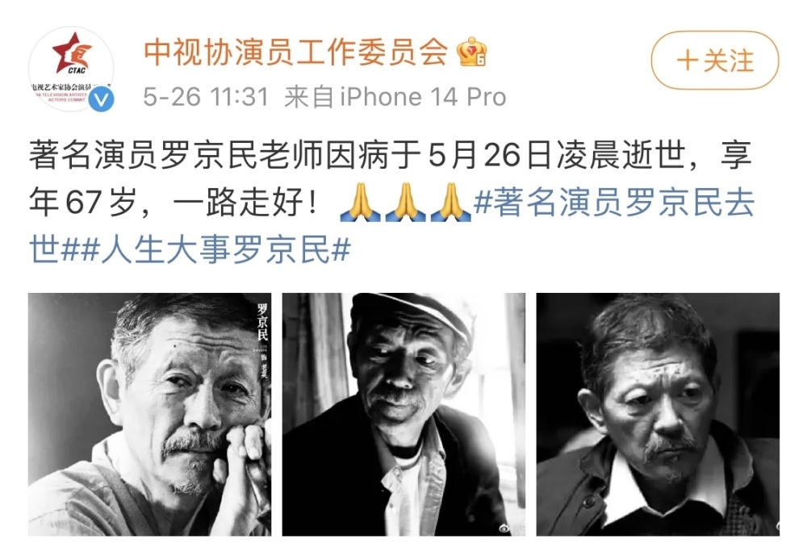
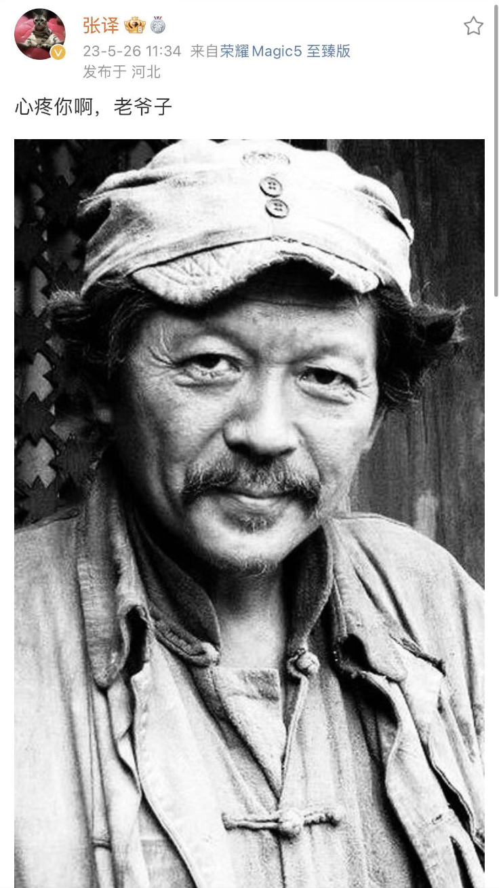

# 演员罗京民去世，留下《士兵突击》《人生大事》，张译等发文悼念

今（26）日，中视协演员工作委员会官方微博发布消息，著名演员罗京民因病于今日凌晨逝世，享年67岁。

张译发文悼念，“心疼你啊，老爷子”。

演员刘天佐发文悼念，“兽医，走好！”导演制片李文龙也写道：“罗京民老师驾鹤西去，影视行又一巨大业一大损失，愿罗老师千古”。

据悉，罗京民曾出演《士兵突击》《平凡的世界》《我的团长我的团》《人生大事》等多部影视作品。

红星新闻记者 蒋庆 李瑞峰 编辑 吴岚

