# 经济学家蔡昉：人口负增长的经济社会挑战

长安讲坛总第398期演讲专家｜蔡昉，中国经济50人论坛学术委员会成员蔡昉，现任中国社会科学院学部委员、国家高端智库首席专家

**核心观点：**

  * _1_ 61年前的人口负增长是冲击性的，短期偏离之后就会恢复，而且还有补偿性增长，而这次不会有恢复和补偿性增长，人口减少将成为长期趋势。
  * _2_ 中国人口转变具有特殊性，第一个特殊性是“未富先老”，加大了应对难度；第二个特殊性是“不期而至”，过去把人口问题看得过于乐观。
  * _3_ 人口负增长不会实质妨碍实现“中等发达国家”目标。无须悲观，但必须改革。
  * _4_ 农民工落户是“一石三鸟”的改革。除了扩大劳动力供给、提高资源配置效率和潜在增长率之外，户籍制度改革还可以提高收入、消费力和消费倾向，稳定社会总需求。

编者按：中国经济50人论坛学术委员会成员蔡昉，现任中国社会科学院学部委员、国家高端智库首席专家。他长期从事中国经济问题研究，主要研究领域包括：劳动经济学、人口经济学、中国经济改革与经济增长、收入分配和贫困，以及“三农”问题的理论和政策等。著有《人口负增长时代》、《读懂中国经济》、《从人口红利到改革红利》《四十不惑：中国改革开放发展经验分享》等，发表学术论文和理论文章数百篇。蔡昉曾获国家出版图书奖、孙冶方经济科学奖、中华人口奖、中国发展百人奖、中国农村发展研究奖等。

作为50人论坛学术委员会成员，蔡昉已多次受邀在长安讲坛演讲。2023年3月23日讲坛第398期，蔡昉以《人口负增长的经济社会挑战》为主题，详细阐述了如何认识人口负增长，并就如何应对挑战提出了政策建议。

蔡昉认为中国老龄化的特殊性在于“未富先老”和“不期而至”。老龄化对中国经济的影响，蔡昉认为，从供给侧来看，会对潜在增长能力带来新的冲击；从需求侧来看，会削弱总需求，进而影响经济增长速度。在政策建议方面，蔡昉提出提高社会福利水平、农民工落户、延长义务教育等。

「“长安讲坛”是中国经济50人论坛创办的经济政策讲坛。2021年-2023年，长安讲坛独家与腾讯合作。腾讯新闻将就该系列讲坛提供独家报道，敬请关注。」

更多精彩内容，请查看蔡昉演讲实录：

人口负增长的经济社会挑战

（长安讲坛总第398期）

蔡昉

国家统计局公布的数据显示，2022年全国人口自然增长率为-0.60‰，首次出现人口负增长，也就是说，2021年中国人口达到峰值。这是一个重要的转折，对经济社会发展带来巨大挑战。

一、人口负增长时代已经来临

随着人口负增长的出现，中国人口发展从此进入一个全新的时代，时代不同于时期、时间，它是一个重要的概念。

中国人口跨越两个关键拐点（见图1）。第一个是自然增长率，指一定时期内（通常为一年）人口自然增加数（出生人数减去死亡人数）与同期平均总人口数之比，用千分数表示。自然增长率不考虑移民因素。2021年之前的自然增长率接近0，2021年是0.34‰，2022年是-0.6‰。

第二个是老龄化率，是65岁及以上人口占总人口的比重，我国老龄化率在2021年达到14.2%。按照世界卫生组织的标准，老龄化率超过7%被定义为老龄化社会，超过14%为老龄社会，超过21%为超老龄社会。国家统计局新闻发言人说这是61年以来的第一次，其实不然，因为61年前的人口冲击是有天灾人祸，短期负增长之后就会恢复，而且还有补偿性增长，
**而这次不会有恢复和补偿性增长，人口减少将成为长期趋势。**

这是中国人口跨越的两个关键拐点。理论上，所有国家发展到一定阶段都应该经历这样两个拐点，但有些国家因为移民政策而没有经历，移民代替了自然增长。

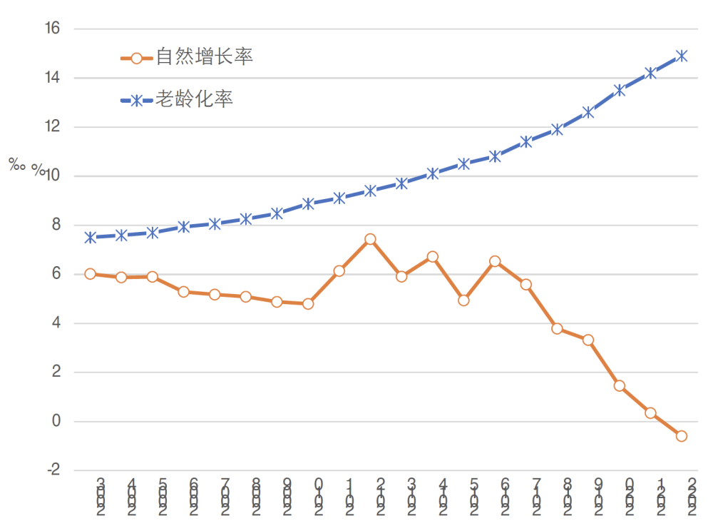

_图1_

老龄化社会是随着人均收入水平提高而到来的，也就是说，老龄化与富裕程度是正相关的。但中国有一些特殊性，第一个特殊性是 **“未富先老”**
（见图2）。如果底座大，塔顶尖，呈金字塔型，说明人口比较年轻；如果是橄榄型，说明人口开始老龄化。2021、2022年中国人均GDP超过12000美元，大体上达到世界平均水平。但从图中明显看到，中国老龄化程度远远超过世界其他国家。相比于经济发展阶段，中国人口老龄化程度和负增长时点来得较早，加大了应对难度。

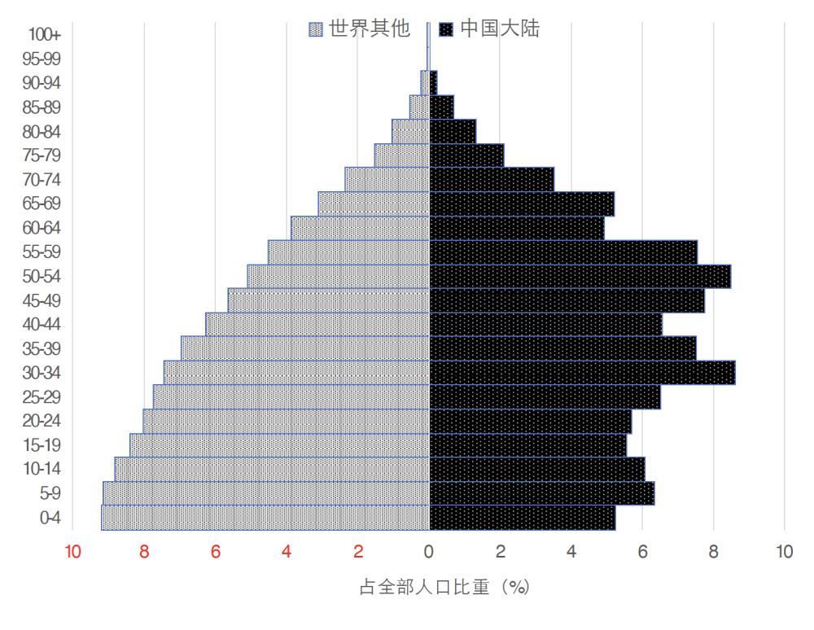

_图2_

第二个特殊性是 **“不期而至”** ，没有预料来得这么快，因为对人口数据认知均始终滞后于实际情况，如人口自然增长率、总和生育率、老龄化率等。
**过去把人口问题看得过于乐观。**

图3是联合国根据中国提供的数据做出的人口预测，以及中国实际人口情况。绿线显示，2030年中国人口达到峰值，老龄化程度也没有那么高。2020年中国第七次人口普查数据发布之后，联合国根据我们的最新数据重新进行预测，即图中红线。蓝线是我国的人口数字，可以看出，即使是联合国去年的预测，与我们的实际情况相比，仍然有所滞后。也就是说，对人口自然增长率、总和生育率、老龄化程度的反映都不够。这种滞后使得我们没有花足够的时间，引起足够的重视，来制定相应政策应对这个问题。

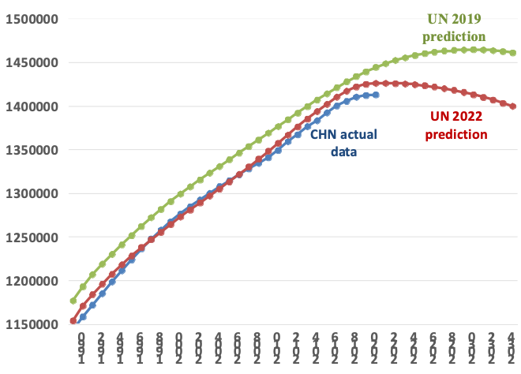

_图3_

二、如何认识人口负增长？

国家统计局公布数据之后，人口负增长自然而然地成为一个热门话题，学者都在讨论这个问题。我们50人论坛也专门召开会议进行研讨，让我做主题发言，因为我是喊出“狼来了”的那个孩子，喊了很多年，狼真的来了，现在大家都说我喊对了。当然，对于这个问题有一些不同意见，有的观点可以给我们启发，如何认识人口负增长也很重要。

**第一，人口负增长无涉“好”“坏”判断。**
增长到一定程度就不再增长，任何事物可能都是这样。伴随着经济社会发展，生育率降低是一个自然而然的过程，各国都会经历，人类发展指数与生育率呈反向变化关系。图4横坐标是人类发展指数，它是更全面的一个综合发展指标，包括人均GDP、教育、健康等。我们已经进入较高的人类发展阶段，指数大概在0.7-0.8之间，因此生育率也应该降下来。

尽管前面提到，中国具有“未富先老”“不期而至”的特殊性，但总体而言，生育率下降和人口负增长是水到渠成、符合发展规律的。
**我们讨论这个问题就是为了应对挑战，但无须在乐观或悲观之间简单选边站。**

_图4_

**第二，符号重要：正增长、零增长和负增长。**
2010年之后，劳动年龄人口开始减少，当时我提出中国将进入“刘易斯转折点”，人口红利消失。有人问，9亿劳动年龄人口还少吗？规模确实足够大，但并不能成为不重视规模减少的理由。这就像数学符号，人口增长是正，人口停滞是零，人口负增长就是负，正、零、负三者之间是质的差别，对经济增长的影响，方向上南辕北辙，程度上天壤之别。仅仅把人口红利归结为劳动力丰富，降低了对中国经济解释力，弱化了我们的预测能力。增量的负面变化是符号的变化，它给我们带来严峻挑战，但总量是中国的优势。简而言之，机遇和挑战并存，挑战来自增量，机遇源于存量。

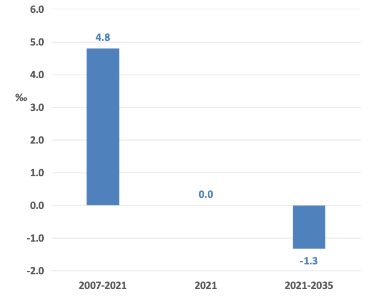

_图5_

**第三，经济学思维：“假设其他条件不变”。** 前提假设是经济学研究的基础，比如在推导一个公式的时候，首先要假设其他条件不变。

晋惠帝时期，有一年闹饥荒，老百姓没有粮食吃，很多人被饿死，晋惠帝知道之后说了一句：百姓无粟米充饥，何不食肉糜？他因为这句话被嘲笑了两千年。如果按照经济学思维来解读这句话，我们不一定会嘲笑他。原来老百姓的食物是一半粮一半肉，现在粮食歉收，假设不影响肉的产量，那么老百姓吃不上粮，只能吃肉。问题在于，畜牧业的饲料来自于粮食，如果粮食减产，肉糜自然也没有那么多。在假设其他条件不变的时候，变的那个因素影响了未来发展。

有人提出劳动力质量替代数量、机器替代人、ChatGPT提高生产率，因此应该更加注重发展教育培训，这些恰恰是我们要研究的问题。

图6是我们对中国潜在增长率的两次预测，蓝色曲线是假设其他不变，橙色曲线是假设其他变化，发生的变化是什么呢？假设变化是全要素生产率能够以更快的速度增长，这意味着未来潜在增长率虽然下降，但是如果人力资本得到提升、出台更好的政策让市场主体充分竞争、创造性破坏、提高生产率等等，最后综合体现为全要素生产率的增长速度更快，得到“取乎其上，得乎其中”的效果。我们研究当前的挑战就是为了找到那个应该变化的条件，而经济学思维中“假设其他条件不变”这一点很重要。

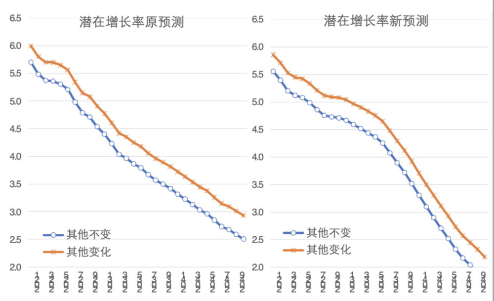

_图6_

**第四，增量的挑战、结构的潜力、总量的机遇。**
看待人口变化新趋势有三个角度——增量、结构和总量。从增量来看更多的是挑战，因为人口已经不增长，而人口增长与否的差别很大。从结构来看，是有潜力的。

举个例子，过去一些研究机构在预测中国未来增长的时候得出结论，中国将来达不到超过美国成为世界第一大经济体的目标，因为中国有一个最重要的条件不如美国，就是劳动力负增长，而美国劳动力是正增长，美国有比较宽松的移民政策，生育率也高于中国。但是中国有一个巨大的潜力，不靠总量增长，而是靠结构调整。讲劳动力短缺不是指农业，而是非农产业，从农业中劳动力的比重来看，美国只有1%，发达国家平均为3%，中国是23%，有20个百分点可以转移出来。
**即使只转出10%，非农就业就可以增加7800万人，比巴基斯坦或俄罗斯的全部劳动力还要多，这就是结构的潜力。**

总量能够带来一些机遇。中国人口占世界总人口的17.9%，但是居民消费仅占世界消费总支出的12.8%，这是一个巨大的差别，说明中国消费还未达到世界平均水平。如果缩小这个差距，使中国居民消费也达到占世界17.9%，那么中国消费总支出可以增加39.4%，增量比日本、德国、英国、印度等国家的总量还要大。

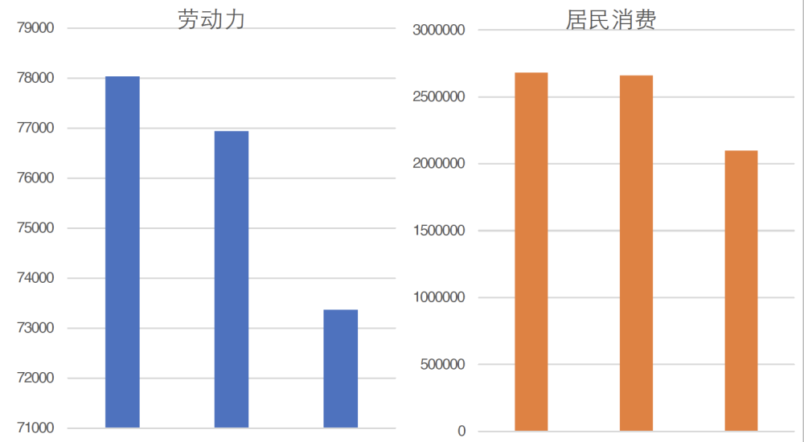

_图7_

三、如何认识供需两侧变化？

人口负增长、老龄化加剧对中国经济带来冲击，表现在供给侧和需求侧两端。从供给侧来看，对潜在增长能力带来一些新的冲击；从需求侧来看，会削弱总需求，进而影响经济增长速度。

**第一，劳动年龄人口下降缓冲期结束。**

总人口负增长以后，老龄化会加剧，劳动年龄人口减少速度也会加快。图8显示，我国人口已经历过一次转折点，蓝线（15-59岁劳动年龄人口）在2010年到达峰值，2011年之后负增长，每年都在减少。当时我就说，这标志着中国人口红利正在加速消失。有人说人口总量很大，劳动力质量可以替代数量，而且9亿多劳动年龄人口不可谓少。这种看法有两方面的谬误：第一，变化趋势和总量是两回事，变化趋势带来挑战；第二，把人口红利仅仅视为劳动力充分供给是不够的，是一种误导。

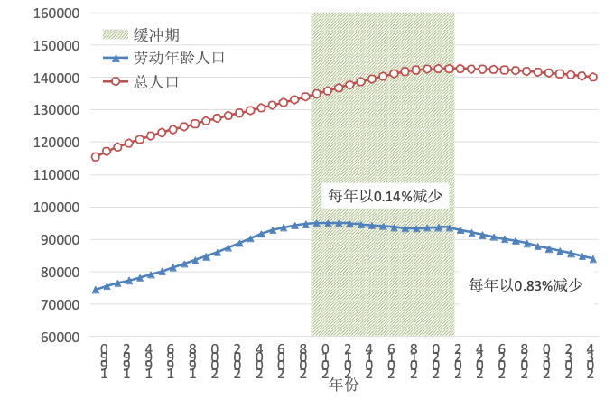

_图8_

通过以下因素，总人口负增长加快了劳动年龄人口减少。一是劳动力进一步短缺。归根结底，劳动力供给来自于劳动年龄人口，超过劳动年龄的人即使还在工作，也只是个别案例，并不典型。

二是劳动者受教育年限改善放慢。当劳动年龄人口增长的时候，每年新成长的劳动力数量很多，他们的受教育程度高于已在劳动力市场人口的平均水平，因此人力资本通过增量在改善。当增量越来越少的时候，尽管人力资本仍在改善，但是改善速度显著下降。

三是资本回报率下降。在劳动力短缺的时候，可以用机器替代劳动，比如目前最火的ChatGPT等，人工智能的发展已经改写了一些经济学原理，也比较复杂，为了便于讨论，我们还是采用传统的理论分析框架。在劳动力短缺严重的时候，如果机器替代人的速度太快，在资本劳动比率中，资本增长太快，而劳动力增长慢，就会出现资本报酬递减现象。如果资本回报率下降，投资意愿降低，增长源泉就会减弱。

四是生产率增长减速。人口红利消失意味着靠资本劳动力投入驱动的经济增长走到尽头，以后要靠生产率驱动，但是靠生产率驱动的时候正是生产率提高最艰难的时候，这是很矛盾的。过去生产率提高像是一个低垂的果子，伸手可得，现在是难之又难。在高速增长时期，劳动力从农业转向非农产业，从生产率低的部门转向生产率高的部门，进行资源重新配置，提高整体生产率。劳动力短缺以后，虽然仍在转移，但是速度降低，全要素生产率的提高速度也随之放慢。这就要求加大改革力度，挖掘新的增长潜力，因为低垂的果子已被摘尽。

2010年是转折点，劳动年龄人口开始负增长。2010-2022年的十年，劳动年龄人口的负增长还比较缓慢，每年以0.14%的速度减少，我们称之为缓冲期。但当总人口开始负增长之后（图8中阴影部分结束），劳动年龄人口负增长更快，到2035年将以每年0.83%的速度减少。

**第二，不会实质妨碍实现“中等发达国家”目标。**

我们使用新的人口数据对潜在增长率重新进行了估算。图9中，灰色线条叫做“中方案”，是假设条件不变得出的结果；黄色线条叫做“高方案”，是假设其他条件变化，全要素生产率提高更快一些。从这两个预测都可以看到，在今后相当长时间里，我们大体保持4%的增速，如果加大改革力度，获得改革红利，还可以实现4.5-4.8%的增速。按照这个速度，到2035年我国基本实现现代化，达到中等发达国家水平，人均GDP达到23000美元左右（相当于今天的葡萄牙）。所以，无须悲观，但必须改革。

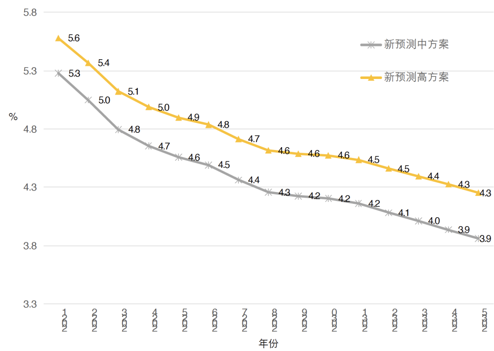

_图9_

供给侧的挑战不是新问题，看得见，可应对。最大的挑战，而且准备不够、经验不足的是需求侧冲击，可能导致增长潜力不能实现。

日本的经验教训富有启发。日本人口负增长出现在2010年，劳动年龄人口负增长则早在1995年就开始出现，从那时日本的潜在增长率就在下降。2010年日本总人口负增长以后，出现了新问题，需求更加不足。打个比方，你是一名运动员，身高、体重都符合要求，速度、体能也都有，教练团队很专业，可以保证你的能力。但是如果需求发生变化，比如奖金不够、心情不好或者其他原因，最后也会导致你的潜在能力无法发挥。这位日本官员提到，2010年之后日本潜在增长能力是1%，但实际增长率低于1%，这意味着需求因素造成制约，使其达不到1%的能力。

中国人口负增长以后，需求侧的新制约将成为经济增长的常态制约。

**第三，抑制居民消费的一般事实。**

我们通过几种效应来揭示一般发展规律。从人口负增长对居民消费的抑制来看，首先排除出口需求，因为随着劳动力价格上涨，制造业的比较优势丧失，国际市场需求不会大幅增长。其次，在经济增速下降的时候，投资需求不强，基础设施需求也不强，因为这些是派生的，自然而然的减弱，这是增长效应。当转向内需时，更强调的是消费需求，但这跟生产率一样，正是靠消费需求一柱擎天拉动经济的时候，这个柱子也受到冲击。由于增长效应、收入分配效应，经济增长速度降下来，就业增长和收入增长都没有那么快，使得消费需求增长也不会像过去那么快。

从今年的情况来看，我们还遇到一些短期冲击和长期挑战之间的衔接问题。过去三年我国失业率一直比较高，今年最新数据是5.6%，假设中国自然失业是5%，那么现在5.6%的失业率意味着超过该有的自然失业率，是周期性失业，还未回到原来的周期轨道上。而过去三年疫情造成的结果就是家庭资产负债表受损，收入和支出的平衡关系更糟糕，而消费不足就很难带动经济复苏。需求制约是长期趋势，可能很多国家在经历冲击（无论疫情还是金融危机）之后，都回不到原来的增长轨道上。我们也很担心这个问题，因此要做的事从现在就必须开始做。

**第四，老龄化抑制消费：能力与预期。**

再一个是年龄结构效应。年龄越大，劳动收入越低，加上养老保险不充分，保障水平不高，因此老年人消费能力不足，消费意愿不强，消费倾向也低。图10中，灰色线条是按年龄排列的消费支出，蓝色线条是劳动收入，可以看出，老年人的消费不高，在往下降，原因是存在“现收现付悖论”。

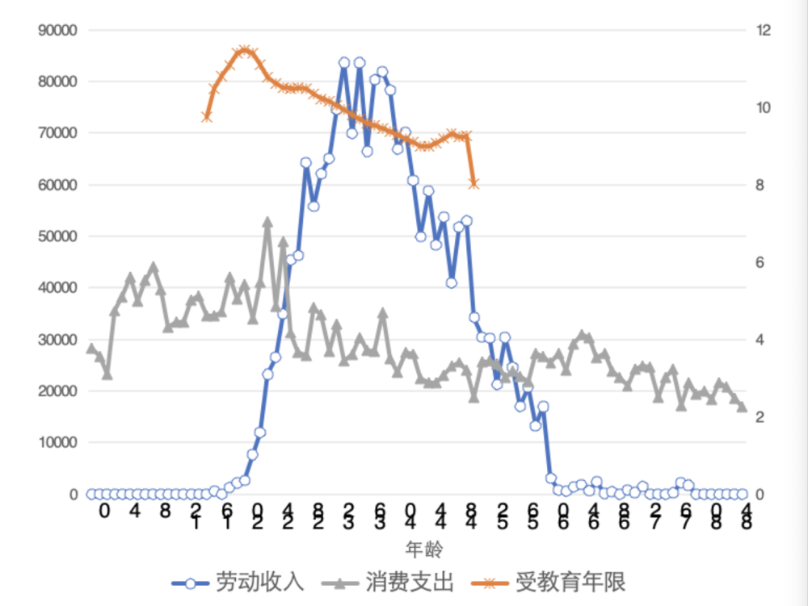

_图10_

现收现付的养老保险制度，就是以同一个时期正在工作的一代人的缴费来支付已经退休的一代人的养老金，而不是替你存起来以后还给你。现收现付给正在工作的人带来三个问题，或者说三重压力。第一，他要缴费。与之相应的是，收入减少，消费减少。第二，养老保险并不充分。比如我在工作，缴纳养老保险，然后社保向老年人支付养老金，包括我的父母，但是这点钱不够父母用，所以我还要拿出一部分收入来赡养父母。第三，随着人口抚养比的变化，等我退休的时候，退休老人比工作的人多，未雨绸缪，我要进行预防性储蓄。这是就业者的“现收现付悖论”：基本养老缴费者、家庭老人赡养者和预防性储蓄者，导致就业人群没有很好的消费预期。我们有一个局部调查显示，在23-85岁生命周期中，年龄每增长一岁，平均消费降低1.8%。

**第五，跨国数据：老龄社会的消费疲弱趋势。**

我们把很多国家在长时间的数字进行简单统计，画了下面这个图（见图11）。横坐标是老龄化率，纵坐标是家庭消费率，即家庭支出占GDP的比重，每个圆圈代表一个国家的数字。可以看出，家庭消费率并不是一味提高，而是到达一定程度就趋于转折，开始下降，大体上是U字型曲线。转折点出现在老龄化率达到14%的时候，2021年中国老龄化率超过14.2%，已经进入消费不充分时期。

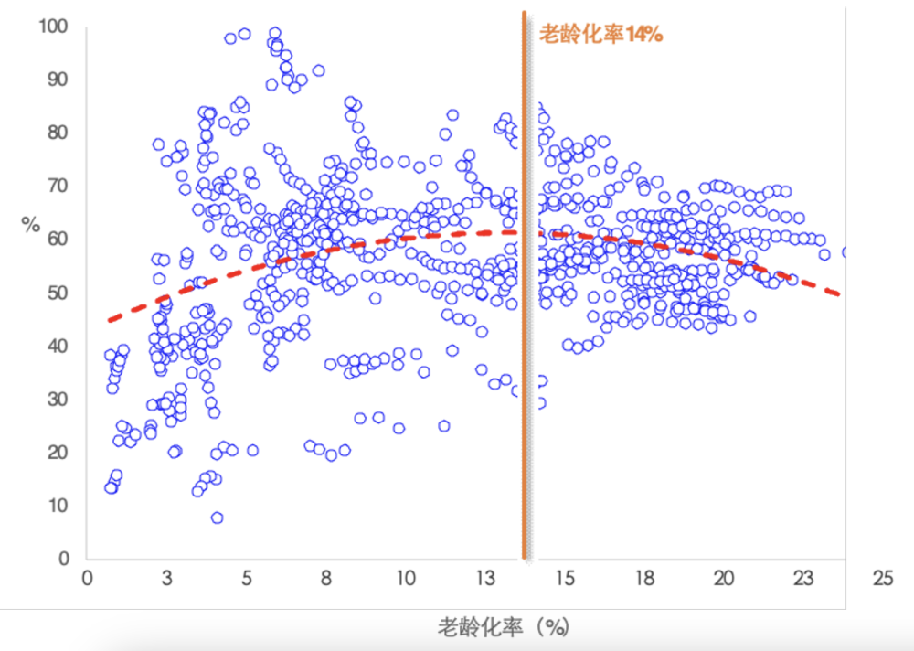

_图11_

近年来国际上提到一个概念——长期停滞，其含义是由于全球老龄化特别是发达国家老龄化，造成人们过度储蓄而不能充分消费，也没有充分投资，由此导致世界经济在较长时期处于停滞状态，长期的低利率、低通胀、低增长导致高负债。现在长期停滞被打破，美联储拼命加息，已经不再是低利率，有人说未来可能是高通胀、高利率，但也刺激不出高增长，低增长、高负债的组合仍然存在。

从中国的情况来看，我们担心消费上不去，不一定是低利率，但是通胀也不会上去，经济增长可能受到抑制，这是现在看到的一个趋势。当然中国也有潜力，因为家庭消费率只有39%，显著低于世界平均（56%）、中上收入国家（48%）和高收入国家（59%）。

四、改革和政策调整

改革和政策调整有很多方面，我简单说几个重要的问题。

**第一，需要着力提高生育率吗？**

生育率低导致老龄化和人口负增长，现在中央已经把积极应对人口老龄化作为一项国家战略，不仅针对老年人，而是针对整个人口。我们提出降低“三育”（生育、养育、教育）成本，希望有一个合理的总和生育率。什么是合理的总和生育率？联合国这些年在世界各国进行调查，最后归纳的结果如图12所示：横坐标都是国家，纵坐标是总和生育率，很多国家的实际水平达到四五个甚至六七个孩子，大多是低收入国家，韩国是零点几，中国2020年是1.3。

_图12_

联合国在调查的时候还得出一个结论，从最高到最低的国家，从北欧到非洲，平均来看，都认为生两个孩子最合理。从这个意义上来说，假如没有任何因素约束，大家都希望要两个孩子，这大体上相当于2.1的更替水平生育率。

但是对中国来说，第一，过去有生育政策抑制生育意愿，所以在生育政策结束之后，可能还有一点补偿性的生育意愿；第二，青年人面临的“三育”成本压力太大，生不起。所以，在没有约束的情况下，希望生两个孩子的意愿是很少的。我们的目的是打破这个约束，但是我们有多大能力呢？我也不太确定。当然做这些事是有意义的，因为这与构建中国式福利国家，构建覆盖全民和全生命周期的社会福利体系，是一致的。

诺贝尔经济学奖获得者、瑞典经济学家缪尔达尔，在上世纪30年代就开始关注瑞典人口问题，认为人口增长停滞将对经济社会带来种种不利因素。这是一种革命性的认识，因为在他之前大家都是马尔萨斯主义者，觉得人口越少越少。缪尔达尔最早看到人口不增长是有问题的，和他一起的还有凯恩斯，这是他们的重要贡献。缪尔达尔夫妇合著了《人口问题的危机》一书，由于缪尔达尔曾任瑞典商业部部长，书中所设计的社会福利政策被政府采纳。北欧福利国家是最有特色、最典型的，从摇篮到坟墓，其出发点是解决人口问题。

**提高生育率的有效举措都是提高社会福利水平，不能把政府的责任丢出去。**
比如有些地方政府强制休产假、给补贴等，其实是把球踢给企业，企业认为提高了用工成本，就会想办法不雇佣女职工。当然也有很多办法，比如产假必须男女同休等等。最重要的一点，这是国家的责任，具有社会效益和外部性的公共产品应该由政府提供。如果说气候变化是地平线级别的外部性，那么人口可持续以及人类的生存，其重要性一点不亚于它。

**第二，农民工落户“一石三鸟”。**

我在任何讲座都会说，各个方面的改革都能带来真金白银的改革红利。现在常住人口城镇化率是65%，但是户籍人口比重只有47%，中间有18个百分点的差距，其中最主要的就是农民工。农民工没有城市户口就带来几个问题，收入不稳定，就业不稳定，消费不稳定，由此造成劳动力供给也不稳定。这些问题最后都落在一个问题上，就是消费模式，他的就业不再是干农活，但他的消费模式没有变成城里人，没有均等的享受到城市的基本公共服务。

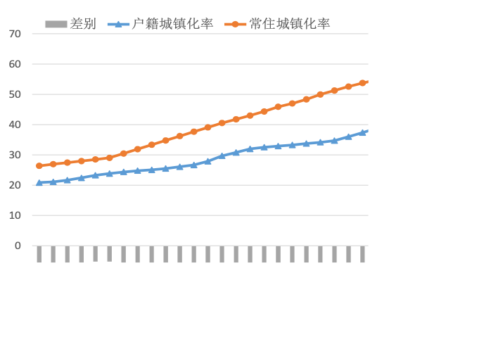

_图13_

根据OECD中国团队的估算，中国城镇化分两步走，第一步是农民工离开农村进城务工，生活在城市里，这让他们的消费提高28%；第二步，如果他们获得城市户口成为市民，消费还能提高28%。已经进城的农民工有1.72亿人，这个规模比很多国家总人口都多，如果他们的消费提高接近30%，那是一个什么量级！

农民工落户是“一石三鸟”的改革。除了扩大劳动力供给、提高资源配置效率和潜在增长率之外，户籍制度改革还可以提高收入、消费力和消费倾向，稳定社会总需求。

**第三，延长义务教育有能力、有回报。**

劳动力数量不足影响经济增长，可以用劳动力质量替代数量，怎么替代？必须培养人力资本。经济学家在做模型的时候，就简单的以受教育年限作为人力资本指标，只有劳动者受教育年限明显提高，才能用质量替代数量。

受教育年限以往有过两次大幅度提高，这是巨大的贡献，但有时候我们对其评价不高或不足。一个是普及九年制义务教育，另一个是高校扩招。这两件事都做完了，潜力没有原来那么大，怎么办？跟发达国家相比，我国义务教育或者免费教育的时间太短，下一步要把受教育年限延长，
**我的建议是向前向后各延长三年，即学前教育三年和高中三年，都纳入义务教育或者免费教育。**

大家会问，钱从哪来？我做了一个预测。我把4岁开始学前教育一直到18岁高中毕业的这部分人叫做义务教育人口，他们的教育要通过劳动年龄人口（19-64岁）来供养，把义务教育人口与劳动年龄人口的比值叫做义务教育人口负担比，即下图14中蓝色曲线。从现在到2035年是下降最快的时期，负担一年比一年小。与此同时，根据未来潜在增长率可以预测每年的GDP，国家财政性教育经费支出占GDP比例为4%，用每年GDP乘以4%即可得到预期教育公共支出。可以看出，资源在增长，而需要花钱的人群在缩小。

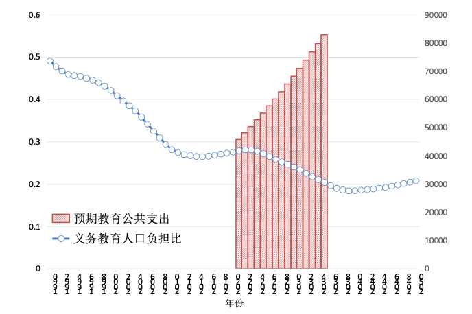

_图14_

**第四，中国语境下的“瓦格纳加速期”。**

**我们现在面临中国式福利国家建设的重要转折点，“七个有所”（幼有所育、学有所教、劳有所得、病有所医、老有所养、住有所居、弱有所扶）是中国式福利国家建设的主要内容。这是基本公共服务，是由政府花钱的。**
首先，政府要有这个财力；其次，钱要花在社会性支出上，而不是去投资。

19世纪80年代德国经济学家阿道夫·瓦格纳提出著名的瓦格纳法则，当国民收入增长时，财政支出会以更大比例增长。随着人均收入水平的提高，政府支出占GDP的比重将会提高。用现在的数据看也比较符合实际，提高最快的时期是人均10000-23000美元之间，这也是中国从现在到2035年基本实现现代化的时期。瓦格纳法则是已有定律，结合中国实际，我称之为中国语境下的“瓦格纳加速期”。在这段时期，我国经济增速比我们要超越的这些国家快得多，但是政府社会性支出占GDP的比重远低于这些国家。因此，无论是差距还是能力，都要求我们在这期间赶超，不但要花这个钱，还要花对地方。

_图15_

我没有过多提及提高生产率等问题，那是2011年之后应对的主要课题，是供给侧的问题。人口负增长和老龄化带来的冲击，常态挑战是需求侧的，需求侧重点在消费需求。在需求方面的因素中，初次分配有潜力可挖掘，但到达一定发展阶段之后，再分配将起支配性作用，而这恰恰是我们的短板，所以我主要就这个方面提出政策和改革建议。

