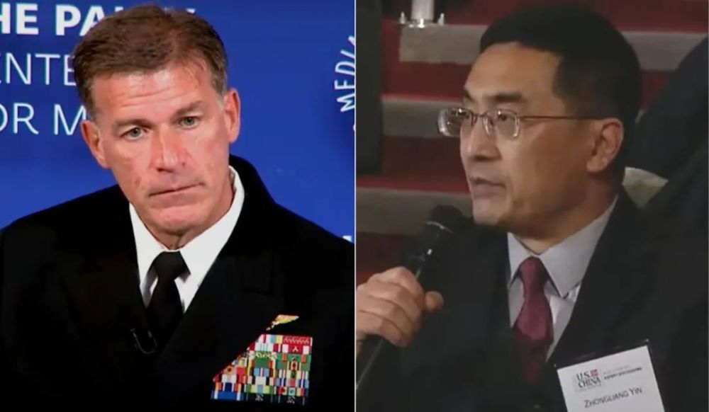
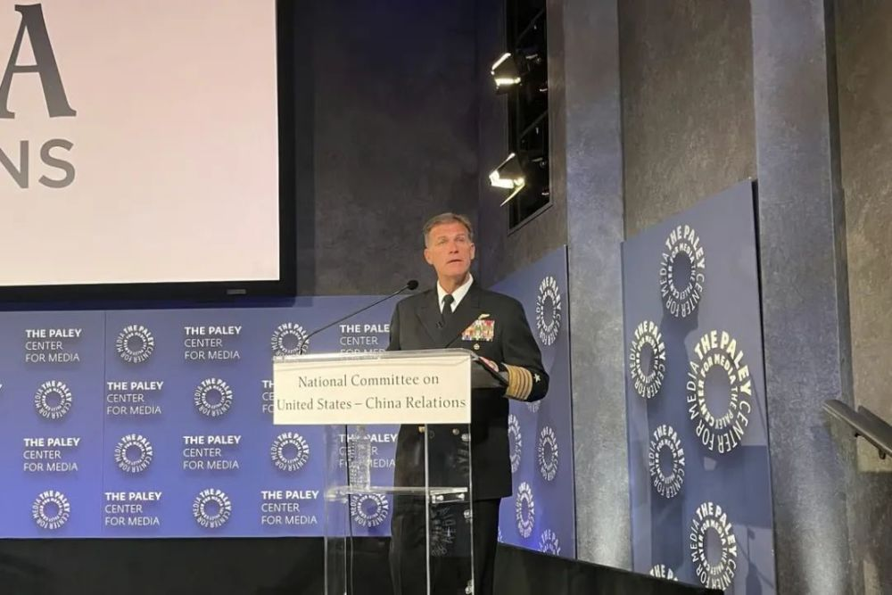
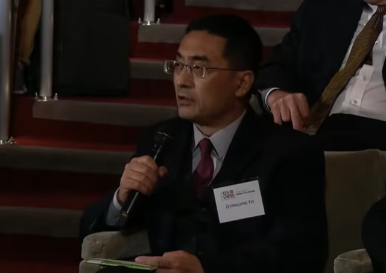

# 美军司令污蔑中国践踏国际规范，解放军少将反驳：我不同意你的看法

“中国正在有意识地调动其国家权力的各种形式，来改变和推翻目前的国际秩序。”

据《南华早报》报道，当地时间23日，美军印度洋-太平洋司令部司令约翰∙阿奎利诺（John C.
Aquilino）在美中关系全国委员会（NCUSCR）的一次公开活动上声称，美中军事对话对地区和平至关重要，他多次请求与中方交谈却未得到回应。

在整场演讲中，他频频抹黑中国，歪曲事实。就在其口出妄语之际，“意外”遭到了来自观众席中我国常驻联合国代表团军参团团长尹忠良少将的当面反驳。

_美军印度洋-
太平洋司令部司令约翰∙阿奎利诺（左），我国常驻联合国代表团军参团团长尹忠良少将（右）。图源：美媒_

公开资料显示，美中关系全国委员会成立于1966年，是一个非盈利性的、教育性的非政府组织，旨在促进美国和中国人民之间的相互了解，而眼下其所行之事似乎正与其出发点背道而驰。

“对我来说，沟通非常重要，我们需要通过讨论来确保地区和平。正因如此，我一再请求与中国军方进行交谈，但尚未获批。”据美国《国家评论》杂志报道，阿奎利诺在演讲中称，美中建立常态化军事沟通是负责任地管控竞争、降低风险、避免误判的关键。

同时，他还补充道，美军印太司令部的任务是避免冲突，而非挑衅。美国追求和平、稳定与繁荣，美中可以在遵守国际规范下和平共处，双方之间的军事冲突并非不可避免，并重申了美国对台政策不变，“不寻求台湾独立”。

_23日，阿奎利诺在美中关系全国委员会（NCUSCR）的一次公开活动上发表讲话。图源：《南华早报》_

一番装模作样的漂亮话说完，他话锋一转，开始公然指责中方，还借南海做文章，污蔑中国通过南海军事化来践踏国际规范。

一边在说“冲突的成本太大”，一边又在挑起对立；一边强调沟通的重要性，一边却仍自说自话，全然无视中方的态度。可以说，上述美军司令生动展现了美方一贯的姿态。

“老实说，我并不同意你刚才在很多议题上表达的看法。”据报道，在上述活动的提问环节，尹忠良少将当即用英语驳斥了阿奎利诺的相关言论。对于尹忠良的出席，阿奎利诺事先并不知情。

_尹忠良在提问环节提出反驳。视频截图_

在长约三分钟的反驳中，尹忠良再次简要阐明了中国在亚太地区安全合作中的基本政策，即始终致力于维护亚太地区的和平与稳定，坚持走和平发展道路，坚持合作共赢的开放战略，坚持在和平共处五项原则基础上，同所有国家发展友好合作。

“作为亚太地区的重要一员，中国深知和平发展与亚太未来息息相关，一直以来以促进亚太繁荣稳定为己任，中国愿同各方共同努力，本着互利共赢的原则通过对话沟通、拓展合作，谋求地区安全。”尹忠良同时强调，中国也致力于与美国建立以不冲突为特征的稳定关系。

作为常驻联合国代表团军参团团长，尹忠良的回应有理、有据、有节。

“我几乎同意你所说的一切，我也很乐意看到这一点得到证明。”在听完尹忠良少将的讲话后，阿奎利诺说。

事实上，就在阿奎利诺此番演讲的几小时之前，他刚刚结束与巴布亚新几内亚高层官员的对话。

据路透社报道，当地时间22日，美国国务卿布林肯代替总统拜登，对巴布亚新几内亚进行访问，阿奎利诺也随他一同前往巴新，随后两国签署了关于防务和海事合作的两项协议。布林肯称，防务合作协议将提升太平洋岛国的军事能力，使美国军队更容易与巴新部队一起训练。

_当地时间周一，巴布亚新几内亚总理詹姆斯·马拉佩（左）与美国国务卿安东尼·布林肯举行联合新闻发布会。图源：法新社_

自2022年4月，中国与所罗门群岛正式签署双边安全合作框架协议后，美国在太平洋地区的外交动作频率急速上升，很难说美方在太平洋岛国越伸越长的手，究竟是在避免冲突，还是在挑衅？

日前，美国总统拜登在日本广岛参加七国集团峰会期间就曾对记者放风称，美国与中国之间的关系应该会“在很短时间内缓和”。

事实上，中国始终秉持着开放沟通的态度，中美关系能否“解冻”，关键在于美方。

“当前中美存在深刻分歧，两国关系遭遇严重困难，面临严峻挑战.....中美关系再次站在历史十字路口。”5月23日，中国新任驻美大使谢锋抵美履新，在向中美媒体发表讲话时，他再次强调，两国应该顺应时代潮流，摒弃冷战思维和零和博弈，敞开胸襟，相向而行。

