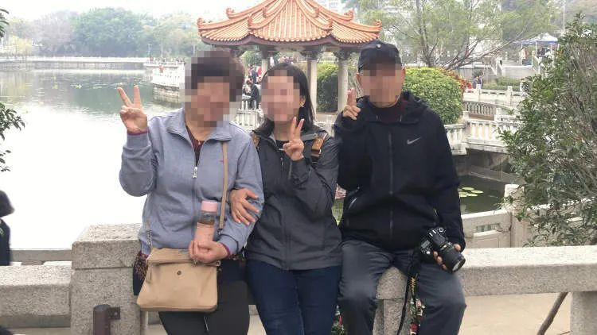
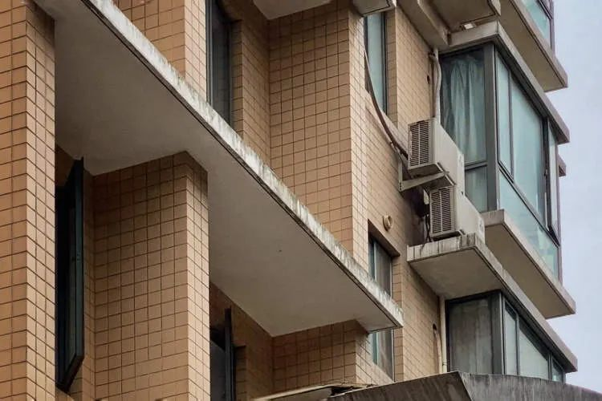

# 老人去世留上海房产，23年无来往的继子获产权，继女养老送终无继承权

**一个20多年没有来往的老人去世了：留下黄浦江边的一套住宅，他成了第一顺位法定继承人**

当你接到陌生的来电，说有人给你留下一笔遗产，需要你去办一下继承手续时，大多数情况下可能是电信诈骗，但也可能确有其事。这样从天而降的好事最近落到了上海市民吉先生的头上。

这个故事，我们要从房子的主人老丁说起。

去世四年家里仍放着丈夫的遗物

2017年，老丁查出肠癌的时候，已经67岁了。

住院32次，放疗化疗，西医院中医院，进进出出，与病魔抗争207天后，2019年9月，老丁走了。

在这207天里，陪伴他的，除了老伴伍女士外，还有女儿臧韵一家。住院期间，女儿臧韵以及女婿不时到医院看望，外孙女也去医院看望外公，让同病房的病友们羡慕不已。

细心的读者可能已经在嘀咕了，臧韵是老丁的女儿吗？她为什么不姓丁或者随妈姓伍？

她的确不是老丁的亲生女儿。

臧韵是伍女士与前夫的女儿。2004年丁某与伍女士再婚时，臧韵已经24岁了，但她一直随母亲与老丁一起生活。虽然是再婚家庭，但臧韵一家与继父老丁相处得很好，臧韵一直喊她爸爸。5月22日，记者在伍女士家采访时，老丁已经去世四年，但还能看到老丁的遗物和他们一家人的照片。

在臧韵的手机里，还有很多以前一家人外出旅游的照片，在厦门的鼓浪屿，在丽江的玉龙雪山，照片里的一家人其乐融融。

母亲伍女士眼睛残疾，病中的老丁，基本上是臧韵夫妻俩照顾的。老丁的后事，也是臧韵夫妻俩料理的，包括购买墓地。

**生养死葬，女儿该做到的，臧韵都做了。**

_▲老丁、伍女士和臧韵外出旅游的照片_

变更房产时得知继父有个继子

老丁生前做灯饰生意。1999年他与丧偶的伍女士相识，不久就住到伍女士的家里。2003年，老丁按揭买下了黄浦江边的一套房子，产证上只有他一个人的名字。2004年，他跟伍女士领了结婚证，终于名正言顺地把伍女士娶回了自己的家。

**在臧韵提供的一段录音中，老丁生前曾经说过，让臧韵把她和她女儿的名字加到房产证上去。**
老丁去世后，2020年夏天，臧韵才开始着手变更继父留下的这套住房的产权。

“我到不动产交易登记中心的窗口去了解情况，工作人员告诉我，要提交哪些材料，随后，我就把那些材料都送了过去。没多久，那边的工作人员告知我，这房子的产权有点儿复杂，因为审核材料时，
**发现我爸还有个继子吉先生** 。”

对于这个继子，伍女士说，她隐约知道，那是很久以前的事， **而且她也不认为吉先生与老丁还存在继父继子关系**
。后来，法院下达的判决书上，对这个继子吉先生的来历是这么记载的：

1988年，老丁与案外人吉女士登记结婚，吉女士携其与前夫所生之子吉先生（曾更名为丁先生）与老丁共同生活。1996年，吉女士与老丁经法院调解离婚，吉先生随母亲吉女士生活。此后，老丁与被告吉先生未曾往来。

臧韵说，如果从继父老丁与吉女士离婚算起，到老丁去世，吉先生与老丁23年未有往来。在这期间，曾经跟老丁姓的吉先生又把姓氏改了，恢复跟母亲姓吉。

臧韵：“不动产交易登记中心的人说，要完成产权变更，要吉先生到场。于是我就翻我爸生前的通讯录，找到了他前妻的电话，打过去。我先跟她聊家常，说我爸去世的事情。吉女士说她跟老丁没联系，也不知道老丁去世了，说老丁的房子跟他们没有关系。她告知我吉先生的电话。然后我们跟吉先生通话，说了我爸去世了，办房屋产权变更，需要他帮助的事。
**吉先生说，她跟老丁已经没有人情可言了，也不会帮忙，要我们自己想办法去办理** 。”

吉先生不愿帮忙，臧韵决定起诉到法院，通过法院判决的方式，完成产权变更。然而，判决结果却让她大出所料。

拟制血亲并非基于扶养关系而成立

2021年6月，臧韵和她母亲伍女士诉吉先生的遗产纠纷在法院立案。

她们请求法院确认老丁那套房子5%产权份额归伍女士所有，老丁的遗产为95%产权份额，伍女士取得 70%，臧韵取得25%。诉请排除了吉先生的继承权。

吉先生认可伍女士占有老丁遗产房屋5%的产权，但是不同意臧韵和她母亲主张的继承方案，理由是他作为老丁的继子，
**他与老丁的继父子关系并不因母亲与老丁婚姻关系的解除而解除**
，他仍有权以被继承人老丁第一顺位法定继承人身份继承老丁的遗产。吉先生不认可臧韵的继承人身份。所以，他要求与伍女士各半继承老丁的遗产。

**法院认为：** 公民合法的继承权受法律保护。老丁生前未立遗嘱，其遗产应依法按照法定继承由其第一顺位法定继承人继承。
**系争房屋是老丁与伍女士婚前购买并登记于其一人名下，贷款于婚后结清。**
原、被告一致确认伍女士对该房屋产权取得有贡献，并享有5%产权份额，剩余95%产权份额为老丁的遗产。

**本案争议焦点有三：一为吉先生是否有权继承老丁的遗产；二为臧韵的继承人资格；三为各继承人分别享有的继承权的份额。**

关于第一点，法院认为，
**吉先生的母亲吉女士与老丁结婚后，吉先生与老丁长期共同生活，老丁对吉先生形成抚养关系，成立拟制血亲，该拟制血亲原则上不能自然解除，在吉先生成年后，亦不当然受吉女士与老丁婚姻变动的影响。**
原告主张吉先生与老丁的父母子女关系已因他母亲和老丁的婚姻关系的解除而消灭，无法律依据，法院不予认可。

原告还主张，吉先生对老丁缺乏关心和照顾，故无权继承老丁的遗产。对此，法院认为，
**法定继承系基于特定的身份关系而发生，赡养义务的履行会对继承份额产生影响** ，但原告以此为据要求剥夺吉先生的继承权，于法无据，
**吉先生有权以第一顺位法定继承人身份继承老丁的遗产。**

**关于臧韵的继承人资格，法院认为，伍女士与老丁结婚时，臧韵已经成年，无需老丁抚养。因此，老丁和臧韵之间并未成立拟制血亲关系**
，彼此间的权利义务，不适用《民法典》关于父母子女关系的规定。判决书解释说，拟制血亲并非基于扶养关系而成立，法定继承人身份也非因赡养照顾而取得，因此，臧韵不是老丁的法定继承人。

此外，即便臧韵对老丁有照顾行为，考虑到老丁生前自有收入作为经济基础，有配偶进行日常扶养，并无额外的扶养需求，且臧韵提供的相关证据，不足以证明其对老丁尽了主要扶养义务。

**最终，法院判决系争房屋5%产权归伍女士所有；该房屋95%产权为老丁的遗产，伍女士继承60%，吉先生继承35%。**

二审维持原判。目前该房屋产权已经变更， **吉先生的名字已经登记到房产证上。**

本文来源：周到上海

作者：叶松丽 张佳琪

