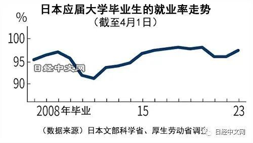

# 3年来首升！日本应届大学生就业率为97.3％

（观察者网讯）据日经中文网报道，日本文部科学省和厚生劳动省5月26日发布数据称，2023年3月毕业的日本大学生截至4月1日的就业率为97.3％，比上年高出1.5个百分点。这是3年来首次高于上年。报道称，此前日本企业的招聘积极性因新冠流行而降低，如今实现复苏，争夺人才的竞争变得激烈起来。

_图源：日经中文网_

报道称，该就业率数据统计了有就业意愿的人当中实际找到工作的人数比例。此调查的对象为从日本全国62所国立、公立及私立大学抽取的4770名大学生。

据报道，疫情前因企业缺少人手等原因，日本应届大学生的就业率一直保持上升趋势，但到了2021年，暂缓招聘新员工的企业增加，就业率下降至96.0％（同比下滑2个百分点）。2022年的就业率为95.8％，连续两年下降。2023年就业率出现回升，但未达到1997年开始实施调查以来就业率最高（98.0％）的2018年和2020年的水平。

除了新冠疫情之下暂缓招聘后的反弹之外，旅游及餐饮等行业增加招聘人数的动向也很明显。日本文部科学省认为，总体招聘人数已经恢复到疫情前的水平。

按性别来看，男生（97.3％）的就业率比上年提高2.7个百分点，女生（97.3％）提高0.2个百分点。按文理科来看，文科为97.1％，同比上升1.7个百分点，理工科为98.1％，上升0.7个百分点。

此外，日本高中毕业生就业率为98.0％，比上年高出0.1个百分点。

