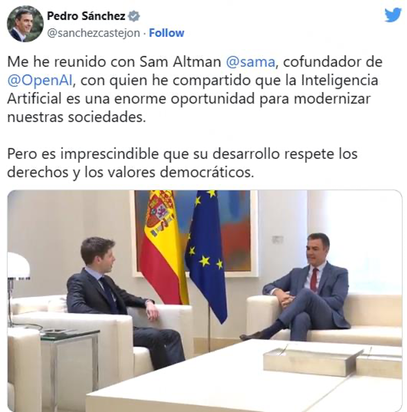
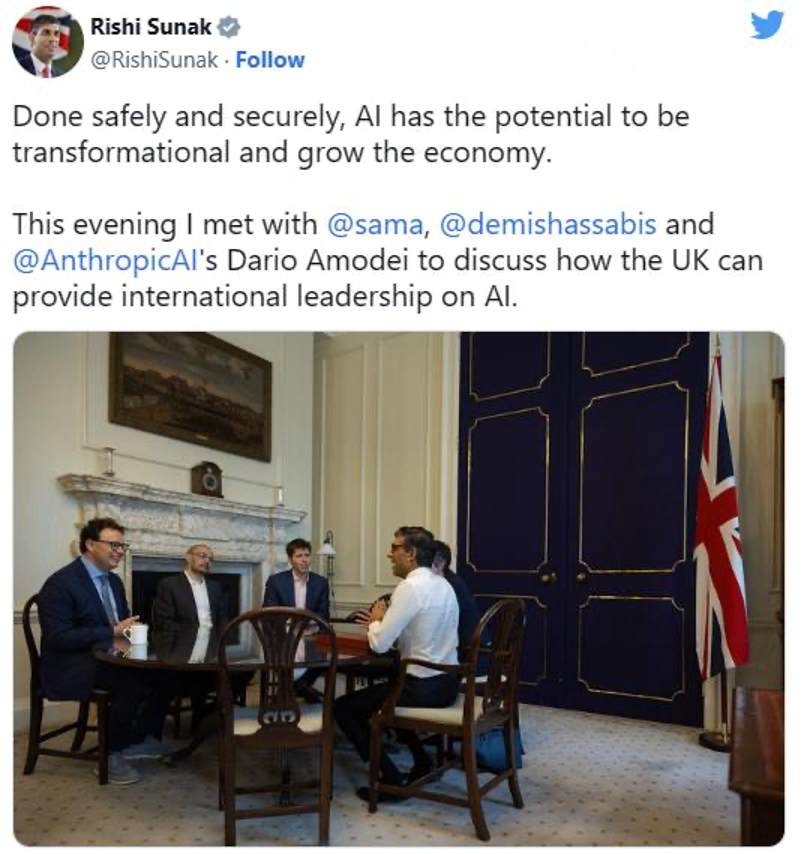
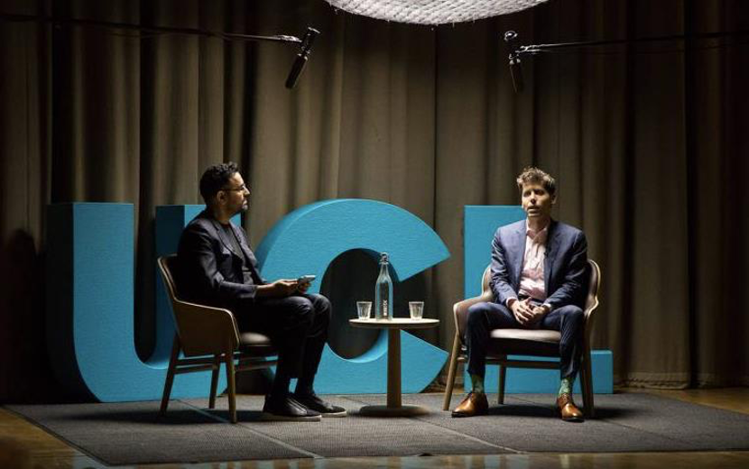
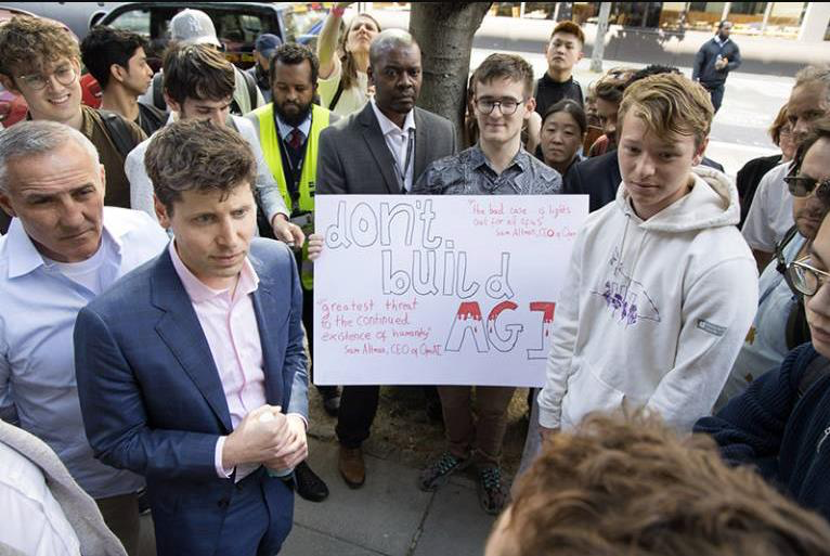
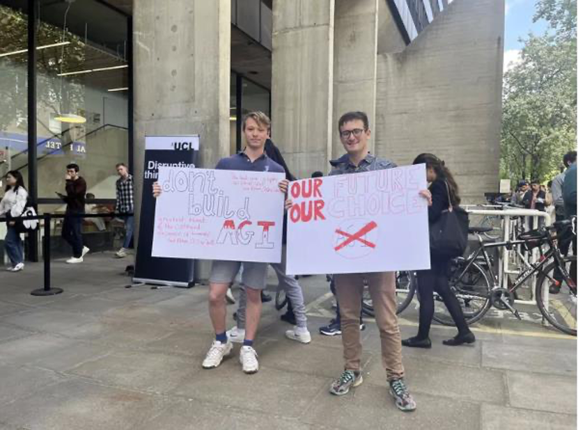

# OpenAI CEO欧洲之旅第一周：与各国政要畅聊，尝试干预监管立法

**划重点**

  * _1_ 奥特曼的欧洲之旅第一周显得十分繁忙，他与多国政府首脑进行了会面，就人工智能的发展潜力、威胁以及监管进行了讨论。
  * _2_ 奥特曼将重点放在了英国，不仅参加了英国首相召集的人工智能峰会，还在伦敦大学学院发表了演讲，试图利用英国干预欧盟监管立法。
  * _3_ 奥特曼安抚人工智能末日论者的目标似乎未能竟全功，许多人对其描述的未来愿景仍持怀疑态度，并呼吁全力解决当前的人工智能威胁。

腾讯科技讯 5月27日消息，人工智能研究公司OpenAI首席执行官萨姆·奥特曼（Sam
Altman）本周开始了其欧洲之旅，他在第一周都干了些啥？奥特曼与欧洲多国政要和监管机构代表会面，在多个场合公开阐述自己的未来愿景，并希望对当前的欧盟人工智能法案草案进行修订。奥特曼宣称自己支持对人工智能进行监管，但同时也警告不要监管过度，甚至威胁OpenAI可能离开欧盟。

**01 与多国政府首脑畅聊人工智能**

到目前为止，奥特曼已经到访过欧洲多国首都，并与西班牙、波兰、法国和英国的政府首脑进行了会谈。

奥特曼此次“魅力攻势”首先选中了西班牙首相佩德罗·桑切斯（Pedro Sanchez），理由是这个南欧国家将于今年夏天担任欧洲理事会(European
Council）为期六个月的轮值主席国。该机构又称欧洲首脑会议，是欧盟最高决策机构，这将使西班牙在欧盟人工智能法案谈判的关键时刻发挥巨大作用。西班牙也表示，希望在任期内通过这项法案。

_图1：奥特曼首先与西班牙首相佩德罗·桑切斯会面_

随后，奥特曼前往波兰，见到了波兰总理马泰乌什·莫拉维茨基（Mateusz
Morawiecki），两人的讨论主要围绕探索波兰公司参与人工智能开发过程的可能性展开。他们强调了开发符合社会价值观的人工智能技术的重要性，确保人工智能的使用合乎道德规范，并担负起责任。

奥特曼此次欧洲之旅的目标之一在于为OpenAI寻找欧洲总部，他看好波兰并不让人感到意外，因为包括谷歌、亚马逊、IBM和微软在内的诸多科技巨头都在波兰设有研发中心。

_图2：奥特曼与波兰总理马泰乌什·莫拉维茨基会谈_

5月24日，法国总统埃马纽埃尔·马克龙（Emmanuel
Macron）会见了奥特曼。他在推特上发文称：“在法国培养人才和开发技术，在法国、欧洲和全球层面进行监管，这些都是我们在人工智能方面的优先事项。我们与ChatGPT的创建者奥特曼讨论了这个问题。”

_图3：奥特曼与法国总统埃马纽埃尔·马克龙会谈_

当地时间周四，英国首相里希·苏纳克（Rishi Sunak）会见了奥特曼、谷歌旗下人工智能实验室DeepMind高管德米斯·哈萨比斯（Demis
Hassabis）以及人工智能创企Anthropic创始人Dario Amodei，讨论了人工智能带来的风险。

_图4：奥特曼与英国首相里希·苏纳克会谈_

苏纳克此前曾概述了加速英国人工智能行业发展的愿景，但他在会上承认，与这项技术相关的风险正在逼近。奥特曼同样认为，人工智能监管是一个需要努力实现的关键目标。

**02 采用两手策略，试图影响欧盟监管立法**

在这次欧洲之旅中，奥特曼似乎采取了两条路线并重的策略。除了与上述国家政府首脑闲聊，并希望通过欧洲理事会对欧盟人工智能法案的最终形成产生影响之外，他还多次在公开场合发表演讲。在英国伦敦大学学院，他讨论了对监管的看法，并谈及美欧之间的不同监管方式。

奥特曼甚至通过媒体发出威胁，如果无法遵守过度监管的人工智能规则，他的公司可能会停止在欧洲的运营。他说，“我们将努力遵守规则”，但抱怨称《欧盟人工智能法案》中的很多措辞不当。这大概意味着，他对欧洲议会议员最近提出的修正案不满意。

本月早些时候，欧洲议会两个关键委员会的成员支持对委员会最初(2021年4月)提出的人工智能监管框架进行修订，旨在确保通用人工智能、基础模型和生成式人工智能都被囊括在内。

欧洲议会议员支持基础模型提供商在将其模型投放市场之前有义务实施安全检查、数据治理措施和风险缓解措施，包括要求他们考虑“对健康、安全、基本权利、环境、民主和法治的可预见风险”。同时，基础模型制造商需要减少其系统的能源消耗和资源使用，并将它们登记在将根据该法规建立的欧盟数据库中。

对于生成式人工智能技术（如OpenAI的ChatGPT）的提供商，需要履行透明度义务。这意味着他们必须确保用户了解信息，知道其内容是机器生成的；对他们系统生成的内容实施“足够的保护”，并提供用于培训其人工智能的任何受版权保护的材料。

奥特曼似乎对所有这些提议都持异议。他说：“目前的欧盟人工智能法案草案可能会过度监管，但我们听说它将被撤回。”
可以肯定的是，在与上述几个国家的政府首脑会面时，奥特曼向他们重申了他对欧盟“过度监管”的担忧。

鉴于奥特曼访问欧洲的时间，OpenAI可能还会关注预计下月初在欧洲议会进行的全体投票，这将确认欧洲议会议员与欧洲理事会就人工智能法案文件进行谈判的授权。因此，该公司可能希望它对各国政府首脑的游说将转化为对议会中某些政治派别的压力，迫使他们投票反对两个关键委员会支持的修正案。

奥特曼的欧洲之旅可能也不会就此结束。据称，欧盟内部市场专员蒂埃里·布雷顿（Thierry Breton）预计将在未来几周与奥特曼会面。

**03 利用英国当筹码，迫使欧盟让步**

在与欧盟成员国政府首脑会面的同时，奥特曼特别抽出时间参加了英国首先苏纳克召集的人工智能峰会，与多家人工智能领域的竞争对手同聚一堂。

毋庸置疑，英国仍然是欧洲最重要的经济体之一。但至少在监管方面，英国不再是欧盟成员国，这意味着它在布鲁塞尔没有可以参与制定欧盟人工智能法案的议员。所以在人工智能规则制定方面，英国的影响力在减弱。

此外，苏纳克政府已经表示，它不打算制定任何新的国内立法来监管人工智能，其首选方案是依靠现有的监管机构（如竞争管理机构和隐私监管机构）为人工智能的安全发展提供指导，而不是立法制定安全护栏来监管该技术的使用。

所以，这次会面对奥特曼来说肯定是不寻常的。苏纳克与人工智能行业高管们的会面可能暗示，这些科技高管们游说政府和监管机构还有第三条战略轨道，这条轨道的重点是试图通过谈论人工智能的巨大潜力和对未来的巨大担忧来拖延和迷惑立法者，同时迎合自身的政治利益。

这项战略实际上是为了吸引立法者的注意力，使他们不再关注已经存在的人工智能危害，而这些危害显然是由当前人工智能系统的使用造成的，包括大规模的版权侵权、过度的虚假信息、系统性的隐私滥用、言论和安全问题、似是而非地谈论不存在的AGI(通用人工智能)对人类文明构成的生存风险等。值得注意的是，OpenAI多年来发布了几十篇博客文章，但却没有时间阐述应该如何管理人工智能。

对于奥特曼和与会的其他人工智能领域高管来说，他们希望获得社交媒体公司在扩展为平台巨头时所拥有的那种普遍免费许可，而没有限制他们的风格，问题在于，欧盟在监管人工智能的道路上走在了前面。

因此，如果布鲁塞尔首先将其基于风险的人工智能监管框架落实到位，它最终可能会为世界其他地区制定事实上的人工智能规则手册提供范例。奥特曼至少看起来希望避免传说中的“布鲁塞尔效应”为他的人工智能派对定下基调。

因此，在与苏纳克的会面中，这位OpenAI首席执行官很可能是在寻求在英国和欧盟之间制造更大的人工智能监管分歧。他鼓励英国支持制定不那么规范（模糊）的国际标准，而这些标准可以由人工智能公司自己界定。

在欧盟共同立法程序的关键时刻，这次会面可能也代表了OpenAI试图向欧盟立法者施加压力的举动。因为，如果一个主要的欧洲经济体（英国）被认为采取了不同的监管立场，支持更宽松的国际“标准”而不是具体规则，这可能会导致欧盟立法者重新考虑立法举措。

如果这真的是他的把戏，奥特曼应该意识到，欧盟议员也有自己的想法。欧盟领导人已经参与了人工智能的国际标准制定，包括本周早些时候宣布，谷歌加入了一项倡议，以创建“人工智能公约”(AI
Pact)，作为全面人工智能规则出台之前的权宜之计。

欧盟数字战略主管玛格丽特·维斯塔格(Margrethe
Vestager)也敦促七国集团(G7)支持国际商定的“护栏”。各国领导人上周末同意启动“广岛人工智能进程”(Hiroshima AI
Process)，并致力于设计人工智能护栏，包括生成式人工智能。他们还呼吁制定和采用技术标准，以保持人工智能“值得信赖”。

因此，预计奥特曼和欧盟委员会未来的任何会面，都将包括布鲁塞尔敦促这位OpenAI首席执行官承诺该公司遵守欧盟已经参与制定的国际标准。

**04 安抚人工智能末日论者**

奥特曼的欧洲之旅预计将到访17个城市，他已经访问了西班牙马德里、法国巴黎、波兰华沙以及英国伦敦。上周，他曾前往尼日利亚的拉各斯。接下来，他将前往德国慕尼黑。

奥特曼此行的使命之一是安抚所谓的人工智能末日论者，他们对人工智能发展太快感到焦虑，担心其可能对人类的生存构成威胁。在英国伦敦大学学院的演讲中，奥特曼宣称他认为人工智能将能够帮助重振经济。他说：“我感到很兴奋，这项技术可以把过去几十年失去的生产力提高带回来。”

但他也承认，担心生成式人工智能会被用来传播虚假信息。奥特曼说：“人类已经很擅长制造虚假信息，也许GPT模型会让它变得更容易。但这不是我害怕的事情，我认为人工智能会有所不同，因为这些系统拥有互动、个性化和说服能力。”

他说，尽管OpenAI计划推出一些方法，使ChatGPT拒绝传播虚假信息，并计划创建监控系统，但当公司向公众发布开源模型时，将很难减轻这些影响。

不过，奥特曼也发出警告，重要的是，在人工智能技术仍处于新兴阶段时，不要过度监管。他说：“我认为在这里取得平衡至关重要。”他指的是世界各地的政策制定者正在讨论如何为人工智能制定规则，保护社会免受潜在危害的影响，同时又不抑制创新。

奥特曼还简要介绍了OpenAI的商业策略，即向其他企业出售其API(软件接口)的使用权。他说：“我们希望的是有很多人集成我们的API。然后，当我们把基础模型做得更好时，它会提升整个世界的产品和服务。这是一个非常简单的策略。”

奥特曼还谈到了他对人工智能辅助人类的愿景，届时人类将被技术增强而不是被取代。他说：“我为，在这场技术革命的另一边，会有更多的就业机会，我根本不认为这是工作的终结。我认为，我们现在看到了一条未来之路，我们制造的这些工具将变得越来越强大，并被广泛使用，帮助个人提高效率，有能力做更多的事情。”

**05 未来愿景受质疑，遭到抗议**

无论走到哪里，奥特曼都会受到热烈欢迎，当然也不乏质疑。在伦敦大学学院演讲时，许多抗议者就曾发出严厉警告：OpenAI和像它这样的公司需要停止开发先进的人工智能系统，以免它们有机会伤害人类。

奥特曼的欧洲之旅目的在于：在ChatGPT引起人们对人工智能的兴趣激增后，平息人们的恐惧，并在有关人工智能监管的讨论之前采取行动。他承认人们担心人工智能的影响无可厚非，但在他看来，人工智能带来的好处远远超过危害。他再次对监管表示欢迎，但不要过度。

OpenAI的批评者认为，奥特曼关于监管超级智能（也被称为通用人工智能或AGI)的评论实际上是花言巧语，他是在转移人们对人工智能系统当前危害的关注，同时也让立法者和公众分心。

牛津大学研究太阳能地球工程和生存风险的学生吉迪恩·富特曼(Gideon
Futerman)评价奥特曼说：“听着，也许他是在制造骗局，我当然希望他仅止于此。但在当前情况下，他是在炒作有足够已知危害的系统，我们要竭尽全力阻止他。如果他是对的，他正在构建的系统通常是通用人工智能，那么危险就会大得多。”

富特曼还称：“奥特曼友好而热情，他真诚地相信自己肩负着拯救人类的使命。然而，他没有看到这项技术并非不可避免，也没有看到我们一开始就可以选择不建立有这种风险的系统。尽管他的意图是好的，但这种心态意味着，他和OpenAI仍然是非常危险的参与者。”

AI Now研究所的董事总经理萨拉·迈尔斯·韦斯特（Sarah Myers
West）表示，像奥特曼这样的人“把问责制放在了未来”。但实际上，我们应该谈论人工智能系统目前造成的已知威胁，包括错误信息传播、带有种族偏见的面部识别等。

伦敦大学学院政治学和伦理学硕士研究生阿利斯泰尔·斯图尔特(Alistair
Stewart)表示，他希望看到“先进系统的研究暂停或中止”。虽然他不敢肯定奥特曼关于人工智能驱动的繁荣未来愿景是错误的，但“不确定性太多”，不能全凭运气。（金鹿）

