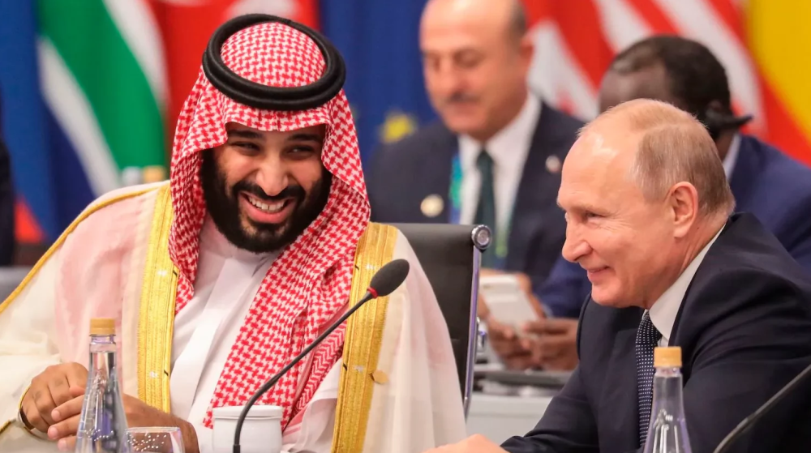

# “沙特从俄罗斯疯抢柴油，再把自己的油卖给欧洲”

（观察者网讯）据彭博社当地时间25日报道，随着欧盟对俄罗斯能源禁令的持续，沙特阿拉伯正从莫斯科抢购欧洲国家无法购买的数百万桶柴油，同时将自己本来对国内的供应转而出口到欧洲。

5月初，沙特宣布下调销往亚洲的原油官方售价，同时上调欧洲售价。此外，沙特能源大臣近来公开对石油做空投机者发出警告，也引发OPEC+将在6月4日的会议上考虑进一步减产的担忧。

_截图自彭博社_

报道援引大宗商品数据提供商Kpler汇编的数据称，今年4月份，沙特每天从俄罗斯进口17.4万桶柴油和汽油，现在的进口量甚至比这个数量更多。此外，从2月以来，沙特取代俄罗斯成为了欧洲最大的供应商。

Kpler数据还显示，从上个月开始，这个中东国家超过美国，成为世界第二大柴油和汽油出口国。

4月份，沙特出口总量中的35%左右从该国的朱拜尔港（Jubail）和延布港（Yanbu）运往欧盟和英国，一部分运去了非洲。

与此同时，俄罗斯的油桶则运抵沙特的拉斯坦努拉港（Ras
Tanura）和吉赞港（Jizan）。彭博社补充道，这一数据与另一家能源分析公司Vortexa分析的基本一致。

文中称，由于违反欧盟对俄制裁，沙特不会将自己从俄罗斯进口的燃料再倒卖给欧洲。一名知情人士透露，沙特额外出口的燃料都来自该国国内的不同地区，规格也不同，并且往往有长期供应承诺。

彭博社认为，沙特让该国原油和燃料能够保持大量流动的运作，只是石油市场迄今为止想办法消化西方对俄罗斯石油销售的严厉制裁以及价格上限的一个例子。

费氏全球能源咨询公司（FGE）中东部董事总经理伊曼·纳塞里（Iman
Nasseri）表示，在今年接下来的时间里，预计沙特的柴油类燃料进口量将从2022年的平均每天3.15万桶，激增到每天15万桶左右。

作为全球主要的石油出口国，沙特为大多数中东石油出口国提供定价参考，通常在每个月的第五天左右公布下一个月的价格。

据路透社5日报道，沙特国家石油公司沙特阿美宣布下调面向中国、日本、韩国和印度等亚洲买家的旗舰原油售价。在其他地区，沙特将6月对西北欧的阿拉伯轻质原油价格每桶上调1.1美元。

4月初，沙特主导的OPEC+宣布将每天减产逾100万桶，称这是稳定市场的“预防措施”。此举一度提振油价至每桶近90美元，而现在随着市场情绪再度转为悲观，国际油价再度回落至70美元左右。

在5月3日公布的最新经济预测中，国际货币基金组织(IMF)表示，沙特需要国际油价达到每桶80-90美元，才能在今年实现预算平衡，然而目前的油价并没有达到这一水平。

路透社推测称，OPEC+或将进一步减产。加拿大皇家银行资本市场公司（RBC Capital markets LLC）大宗商品策略主管克罗夫特（Helima
Croft）表示，这表明OPEC+稳定石油市场的决心，OPEC组织可能届时会选择再次减少原油供应。

本周早些时候（23日），沙特能源大臣阿卜杜勒-
阿齐兹·本·萨勒曼在第三届卡塔尔经济论坛上表示，各产油国的产能正在耗尽，而对石油天然气领域的投资却不足，这将引发市场大幅波动。

他还对石油做空投机者发出警告，称4月初宣布减产后油价飙升的情况可能会重演，“我一直在劝告他们小心栽跟头，结果4月份真的栽了。这回我只想跟他们说：当心！”安达公司高级市场分析师等分析人士认为，这番发言可能意味着OPEC+将在6月初的例行会议上考虑进一步减产。

**本文系观察者网独家稿件，未经授权，不得转载。**

