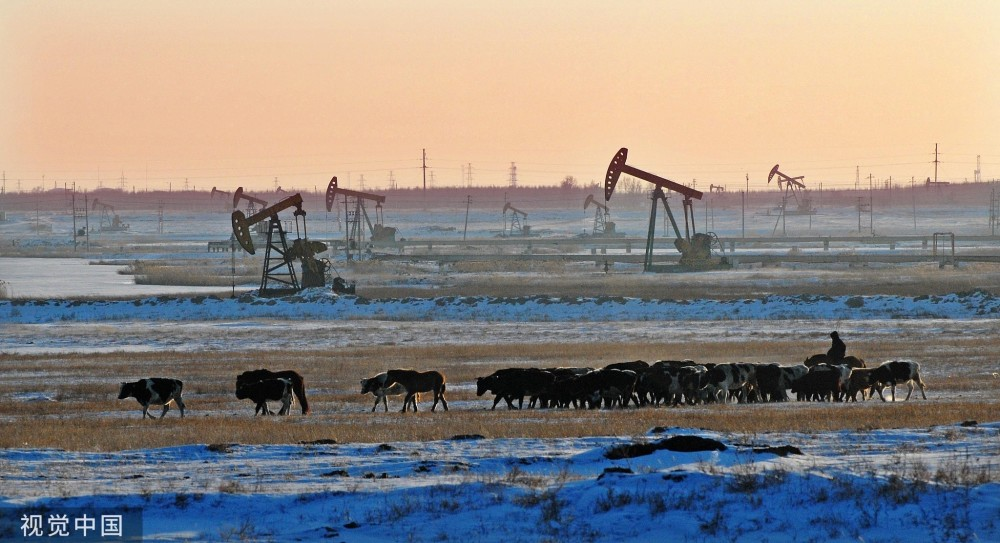
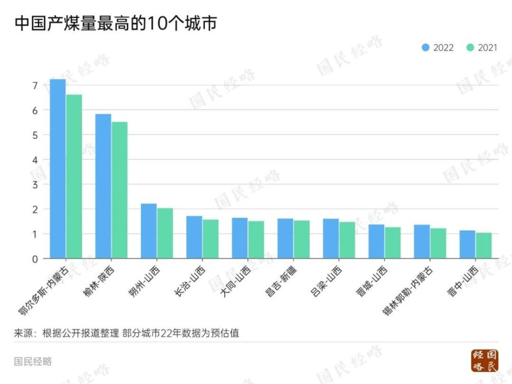
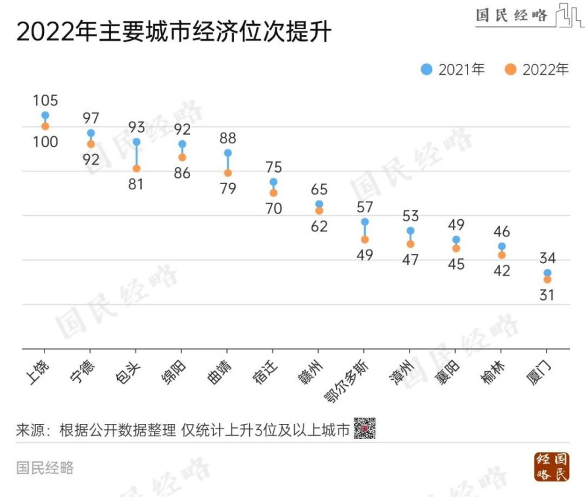

# 人均GDP吊打北上深，这些四线小城普遍“家里有矿、富得流油”

**文|凯风**

不以GDP论英雄，正在成为自上而下的共识。

在经济总量之外， **人均GDP、地均GDP、人均收入** 的重要性正在愈发凸显，成为衡量城市发展水平的重要指标。

然而，在中国内地， **人均GDP最高的城市，不是京沪深，不在江浙** ，而是一众三四线城市。

01

谁是全国人均GDP最高的城市？

如果将港澳台地区都纳入统计，澳门、香港和台北显然一路领跑。

回到内地城市， **谁在人均GDP上拔得头筹？**

日前，随着各地陆续披露统计公报及常住人口数据，内地人均GDP十强城市终于正式揭榜：

**鄂尔多斯、克拉玛依、无锡、北京、苏州、深圳、榆林、上海、海西、南京。**

与大众习以为常的GDP排行榜完全不同，人均GDP十强城市，不仅罕见出现 **四个中小城市** 的身影，而且状元与榜眼之位都被西部普通地级市所垄断。

与往年不同的是， **鄂尔多斯取代克拉玛依** ，成为内地人均GDP第一城。

当然，如果不计资源型城市，在主要大中城市中， **无锡** 力压北上深，成为人均GDP第一城。

至于GDP总量位居前十的 **广州、重庆、成都、武汉、杭州全部落榜。**

广州杭州排在20名左右，武汉排在30名左右，而成渝两地双双落到了50名开外，而多数省会排名并不靠前。（参阅《揭榜！最新全国100强城市排行》）

众所周知，中国城市向来是以行政区划作为区分，而国际上往往以城区来界定城市。

这就带来一个结果，合并的地市越多，城市面积越大，人口规模越大，GDP总量自然就容易水涨船高。

所以，这些年， **大量省会城市通过合并周边地市迅速做大** ，从而得以跻身万亿城市俱乐部，乃至晋级超大特大城市之列。

然而，人均GDP的提升却非一日之功，在以人均论英雄的时代，一些强省会的经济含金量有待提升。

02

四线小城，何以力压北上广深？

在人均GDP十强城市中，出现了 **鄂尔多斯、克拉玛依、榆林、海西州** 4个普通地级市。如果将视野放宽到20强城市，还能看到 **东营、阿拉善**
的身影。

这些地市，都有一个共同特点： **家里有矿** ，且坐享大宗商品价格暴涨的狂欢。

鄂尔多斯和榆林，都是当之无愧的 **“煤都”。**

鄂尔多斯、榆林在2022年的煤炭产量分别高达7.22亿吨、5.82亿吨，分别占全国的15.8%、13.6%。

地处新疆的 **克拉玛依，则将“富得流油”** 诠释得淋漓尽致。

这座在戈壁滩上诞生的新城，正是基于石油开采而来，也因石油而富。2022年克拉玛依原油产量1441万吨，占全国的7%。

位于青海的 **海西州**
，虽然名不见经传，但柴达木盆地可谓无人不知，世界上最大的盐矿储地、中国最大的铅锌矿床、中国最大的石棉矿田等都位居于此，让海西州成了西部最大的能源富矿之一。

这些地市均属于资源型城市，只要资源不陷入濒临枯竭之困，经济发展一般都不会遭遇太大问题，顶多随着能源周期而波动起伏。

同样是资源型城市，东北的 **鹤岗、双鸭山、阜新、大庆** 等地，在历史上也都一度阔过，人均GDP在全国遥遥领先，但随着资源枯竭，无一例外都沦为
**收缩型城市。**

早在2009年到2012年，我国先后确定三批 **69个资源枯竭型城市** ，主要集中在东北和中部地区，而偌大的西北只有入围的城市并不多。

事实上，无论是鄂尔多斯和榆林的煤矿，还是克拉玛依的油田，抑或海西州的盐矿、铅锌矿， **探明储量都相当丰富，短期并无枯竭之忧。**

所以，在能源价格一路高涨之时，这些资源型城市往往一飞冲天。

根据《揭榜！最新全国100强城市排行》提供的数据，过去三年， **鄂尔多斯经济位次上升19位，榆林上升15位** ，双双跻身50强城市之列，就是典型城案例。

然而，一旦能源周期逆转，这些地方的经济往往也会面临巨大震荡。

当然，无论形势如何，家里有矿的地方，总比那些一穷二白只能靠自力更生的地方，更容易达成经济增长的目标。

03

人均GDP，并不能作为衡量城市经济含金量的唯一指标。

显然，资源型城市的存在，搅乱了城市经济矩阵，也让人均GDP与人们的日常感受出现明显背离。

事实上，与人均GDP相比，城镇居民人均可支配收入更适合作为衡量“民富”的指标。

从 **人均收入** 与 **人均GDP** 的对应关系来看，这些四线小城集体出现背离，人均收入排名大幅跑输人均GDP排名。

鄂尔多斯、克拉玛依人均GDP位列全国前二，但人均收入却排在30名开外；而人均GDP双双跻身前十的榆林、海西州，人均收入更是排在50名之外。

究其原因，GDP总量，即国民生产总值，由税收、企业盈余和劳动者报酬构成， **属于居民收入的只是劳动者报酬及转移性支付这一部分。**

换言之，一些资源型城市靠着采矿业迅速做大税收和GDP，但矿产创造的收入，更多体现在政府税收和企业利润层面，能惠及普通劳动者的部分相对有限。

这就导致 **资源型城市人均收入与人均GDP出现大幅背离**
，人均收入仅占人均GDP的20%左右，而全国平均为43%左右，而一些东部经济强市可以占到50%以上。

当然，家里有矿，财政充盈，并非不能让全国市民共同受益。地处榆林的神木市，成了全民免费医疗的先行者，依仗的正是煤炭创造的巨大财税。

有钱好办事。充沛的财力完全可以转化为招商引资的动力，当无数城市为地方债务困扰之际，资源型城市反而有了异军突起的可能。

然而，虽然不是每一个能源城市都会迅速直面资源枯竭之困，但每一个城市都难以逃脱 **“资源诅咒”** 的困扰。

坐吃山空的教训在前，一旦过度依赖能源产业，而放弃了产业升级的努力，最终难逃“鹤岗化”的宿命，这是值得警惕的。

