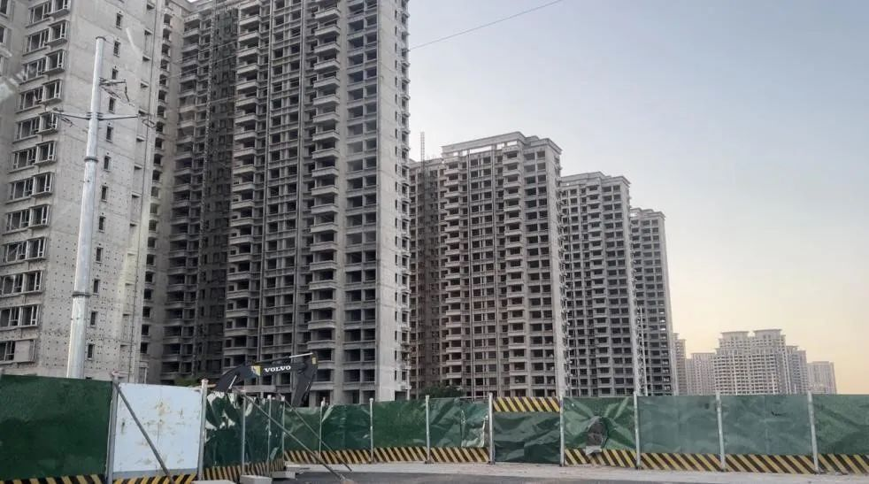
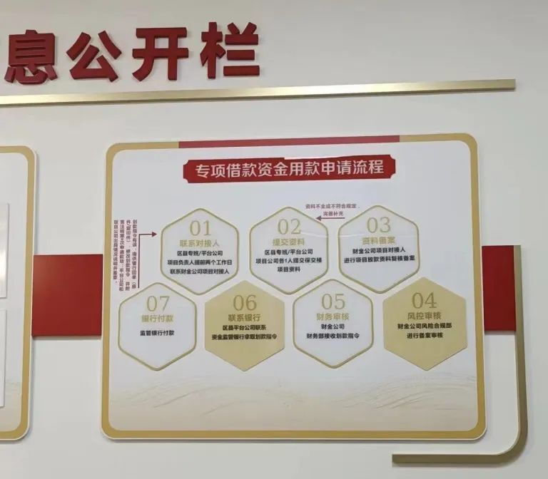
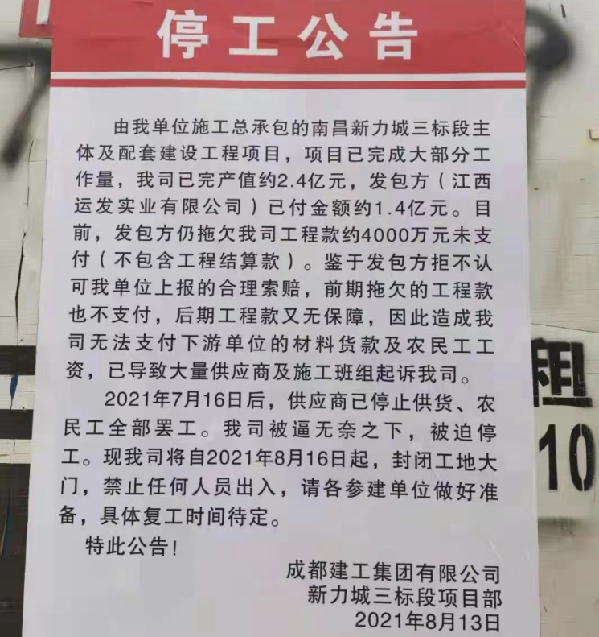
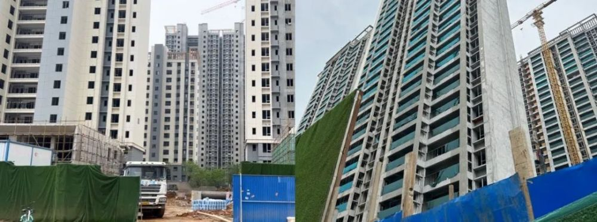

# 保交楼调查：缺钱缺人缺信用，交付率仅为34％

_图/视觉中国_

**文 | 《财经》记者 刘昕**

**编辑 | 王博**

乘车从西安城腹地钟楼出发，往西北方向行驶50分钟后，能看到一片占地8000余亩的建筑工地——这是尚未完全交付的西安恒大文化旅游城。

5月13日，《财经》记者与业主一起来到工地，现场仍有部分工人在作业。业主们进不去，时常通过工地外的环境判断上工数量。“要是工人多，门外会停满摩托车，到处是卖饭的摊点。”一位业主朝略显空旷的门口指去。

_西安恒大文化旅游城某一期工地门外。摄影：刘昕_

根据规划，西安恒大文化旅游城将被打造成一个集居住、游乐、文化、商业于一体的城市综合体。原计划建设14期住宅，能容纳3万户居民，如果全部入住，相当于一个小型县城。

**目前，该项目卖出的8期住宅，都存在不同程度的延期交付问题，最长的已经延期约两年。**
《财经》记者在现场看到，售楼处仍然开放，不过已改为楼盘专班的临时办公室。时值周末，许多业主从西安周边的城市赶来，只为看一眼房子的施工进度。

自去年7月开始，随着恒大、融创、泰禾、奥园、世茂等头部房企陆续出现流动性危机，全国范围内停工或延期交付的楼盘越来越多。

_武汉市青山区海伦国际，未交付的楼栋被铁皮围起来，内部仍在施工。摄影：刘昕_

2022年7月28日，为支持刚性和改善性住房需求，中央政治局会议提出，压实地方政府责任，保交楼、稳民生。此后，纾困政策不断落地，保交楼成为重点任务，地方政府、金融机构、房企、建工集团、城投公司，纷纷下场，盘活难题。

然而，克而瑞研究中心的调研结果显示， **2022年末，32个典型城市的290个前期停工项目中，有126个仍处于停工状态。**

近日，建筑行业B2B信息服务平台“百年建筑网”的一份调研报告显示， **5月，全国各地1114个保交楼项目交付率仅为34%。**

如今，距2022年7月停贷潮已过去近一年，仍有不少问题楼盘业主在网络平台维权，担心交房无期。

保交楼真实的进展如何，那些进展缓慢的项目到底难在哪？带着这些问题，《财经》记者5月上旬分别走访了此前停工较严重的武汉、西安、南昌等地，部分楼盘业主、专班领导、开发商给出了答案。

**根本性难题：缺钱**

缺钱，是大多数楼盘停工的根本原因。

业主们疑惑，预售时自己从银行贷了款，钱也进了开发商的账户，为什么盖楼的钱还会不够？

其实，在2022年2月国家出台全国性的预售资金规范之前，预售资金的监管是“一城一策”，各地的监管细则和执行力度并不相同。因此，
**实际操作中存在漏洞，监管不够严格的城市，可能会出现预售资金被违规挪用、甚至预收款根本就没进监管账户的情况。**

2020年之前，房地产高周转时期，卖房回款、开发贷、企业债等来钱方式都可以帮房企弥补单个项目的资金缺口。但是，2020年以来，以上渠道都不灵了，行业“拆东墙补西墙”的玩法无以为继，许多楼盘账户里的剩余资金不足以支撑建设，施工便陷入停滞。

**如何找来新钱，是停工楼盘复工的首要难题。**

为此，国家推出了一系列扶持政策
，如去年8月底，国家开发银行、中国农业发展银行等政策性银行推出了2000亿元“保交楼”专项借款，三个月后，央行给六家商业银行推出了2000亿元“保交楼”无息贷款。

保交楼专项借款成为很多问题项目的救命稻草。 **“很多企业就差那一口气，可能来一两个亿，项目就转起来了。”**
武汉经济技术开发区住房和城乡建设局相关负责人说。例如，武汉经开区的佳兆业滨江新城项目，在保交楼专项借款的帮助下，已经完成交付。

但是，保交楼专项借款的申请有条件限制。上述负责人告诉《财经》记者，该借款是阶段性政策，只针对原计划在2023年3月31日前交付的项目。例如，位于武汉经开区的恒大时代新城项目是分批次交付，该楼盘申请到的保交楼专项借款只能优先用于今年3月31日前交付的批次。今年3月31日之后交付的批次，需要运用其他政策工具拟定相关方案。

他透露，目前，新方案政府正在推进，正式落地前可能会有细节上的调整，方案不成熟时不便向业主公开太多信息，否则业主容易失去对政府的信任，“保交楼过程中，信任是非常重要的。”

**另外，《财经》记者了解到，保交楼专项借款“粥少僧多”，申请难度大，金额需要主管部门审批，且审批极为严格。**
南昌新力城项目专班负责人透露，申请时还需要上报项目实际卖出去的套数以及每套房子的业主信息，防止虚报。曾有新力城业主表示接到过回访电话，被询问是否真的在该小区买了房子。

_保交楼专项借款资金用款申请流程。来源：受访者供图_

事实上，保交楼专项借款毕竟数额有限，即使借到了，也不一定覆盖全部的项目资金缺口。

以新力城为例，目前已借到保交楼专项借款2.243亿，但要保证项目完成交付，总共需要4亿多。另外，因新力债务纠纷，绍兴中院于2021年10月强制划扣了新力城项目1.99亿元监管资金，专班花一年多时间，将这笔监管资金全部追回。两笔资金陆续到位，基本能覆盖剩余的工程，才实现了大面积复工。

_南昌市新力城，有工人在施工。摄影：刘昕_

西安恒大文化旅游城业主告诉《财经》记者，目前整个项目申请到8亿多的保交楼专项借款，一位总承包方领导对业主透露，预计整个楼盘全部盖完需要20亿元。

保交楼专项借款无法覆盖全部资金缺口的情况下，项目展开自救尤为重要。西安恒大文化旅游城业主了解到，恒大正通过处置资产回笼资金，目前恒大在该楼盘已有三栋楼被国资公司接手，能拿到约4亿元。

前述武汉经开区住建局负责人对《财经》记者说， **“保交楼不是用资金给项目托底，而是让项目回到良性运行的轨道。”**
他用华宇东原金科渝樾大观项目举例，该楼盘由三家房企合作开发，政府在持续协调三家开发商对项目返投；另外，让项目继续融资，恢复造血功能；项目恢复正常后，还要帮其打开销路。通过这些方式，项目正逐步回到正轨。

**总包、分包难以为继**

楼盘建设是一个环环相扣的过程，开发商是最上游的一环，下游还有项目公司、总承包方、施工班组、供应商等。

总承包方起到承上启下的作用，负责协调和管理整个建筑工程。工地中临时用于施工的“临水”、“临电”系统和垂直运输设备，都由总承包方建立。这意味着，如果总承包方采取关门、停水停电、关闭垂直运输设备等措施，整个工地将陷入“瘫痪”。

2021年8月，成都建工将一纸停工告示张贴在新力城工地大门外。表示因前期被拖欠工程款，后期工程款也无保障，成都建工被大量供应商和施工班组起诉，被迫停工。成都建工将封闭工地大门，禁止人员出入。

_成都建工停工公告。来源：受访者供图_

新力城业主向《财经》记者提供的一份2022年8月的信访局会议记录中也提到，成都建工对工地采取了断水断电、锁人货电梯等措施，导致新的单位都不愿意进场施工。

为推动复工，新力城专班两次去成都建工总部谈判，但进展缓慢。拉扯约一年后，为了保交付，最终启动备选方案，新力城项目通过公证并发函解除总包方成都建工施工合同，由新建区当地的国企建筑公司进行工程扫尾，施工才得以推进。

其实，在保交楼任务中，总承包方处于十分尴尬的境地。西安恒大文化旅游城一位总承包方领导对业主说，
**“你们业主不用太担心，房肯定会交，反而是我们这些施工单位，一辈子的锅算是背上了。”**

**他透露，他们干的活产值超5亿元，然而现在到手的钱不到1亿元。**
去年有审计人员问他，开发商不给钱，为什么还要干活？他无奈回应，结构没封顶，设备不能撤。而且，当时项目的监管户上还有钱，没有理由不干。最后他们发现，专班介入后，保交楼成为一项必须完成的任务，干不干活已经不是承包方能自主决定的了。

然而，多个楼盘的业主向《财经》记者反映，少了经济利益驱动，会极大影响总承包方的复工积极性。

武汉市东湖高新区的绿地光谷星河绘分为A区和B区，A区的总承包方是一家民营企业上海盛房建设有限公司，B区的总承包方则是湖北省属的一家国企湖北省路桥集团。目前A区整体进度落后于B区，有业主了解到，可能与A区总承包方和绿地存在工程款纠纷、导致其复工意愿不强有关。
**B区的总承包方是国企，政府协调起来相对容易。**

_武汉绿地光谷星河绘，左图为B区，右图为A区。摄影：刘昕_

2022年7月《新京报》对此楼盘的报道中也提到，绿地光谷星河绘的负责人表示，B区正常施工，A区出了点问题，初步判断是工程款拨付的问题。

总承包方得不到稳定的资金保障，会在下游产生连锁反应。武汉恒大时代新城一位总承包方领导对业主表示，由于资金没衔接上，有施工班组停工20天后离开了工地。

西安市远洋春风与山水项目，因拖欠工程款和供应商货款，也曾在2022年底发生过维权事件。根据业主提供的资料，有负责水电的工人将车停在工地门口，阻碍施工车辆进场。项目方与下游各单位矛盾重重，后来在政府协调之下，项目才得以复工。

一位问题楼盘的工程总监对《财经》记者说，以前，施工方为了与大开发商合作，甚至愿意垫钱干活，开发商可以把工程款拖两三个月再结清。但是，他所在的公司陷入资金困境后，
**从工程分包单位、供应商到农民工，面对该楼盘的第一反应是——他们的活还能接？大家都担心，干了活拿不到钱。**

因此，要说服施工单位复工，会经历漫长的谈判过程。该问题楼盘体量大，分包单位有100多家。正式复工之前，上述工程总监与团队花了四五个月与各方沟通。复工条件对施工方来说谈不上优厚：之前项目欠工程方的债务先搁置不管，后续的工程款能保障，但付款比例可能会少一点。

在此条件下，愿意来的施工方可能需要重新铺排施工计划，有的施工方不愿来，就要找新的施工方接替。只有所有工序上的施工单位都愿意按照这个条件配合施工，工作才能往下推动。上述工程总监将这个过程称为“铺高速公路”。

路铺好了，项目正式运转起来，会经历一个重建信任的过程：资金到位后，要让大家知道项目有钱了，施工方来干了活，要让他们能实实在在拿到钱。因此，该项目刚复工的前两三个月，工人都是日结工资。这些消息传递出去，信任才能一点一点建立起来。

**另外，出于防范资金风险的考虑，项目的施工周期也会被拉长。**
上述工程总监举例，假设要购买价值1000万元的空调外机，他不会一次性把1000万都付给供应商，而是每次付200万元，分五次付清。

之所以这样做，一是公司流动性出现问题的情况下很难向供应商赊购，短时间也凑不齐太多现金；二是，项目可能之前就欠供应商钱，如果一次性付清1000万元，会面临供应商卷款走人的风险。为了把风险控制到最低，他可能还要去了解供应商下游的付款情况。这些风控措施都会导致施工周期比正常项目更长。

**行业下行的连锁反应**

开发商一旦出现流动性危机，首先摧毁的是外界的信任。这时，银行、购房者、地方政府都会为了及时止损，互相拉扯。

《财经》记者了解到，位于武汉市汉阳区的纽宾凯紫御、云座项目，就因此前债务纠纷导致地块未解押，多家银行以抵押物不足和防范风险为由，不愿发放部分业主的在途贷款，使项目用于建设的资金更加紧张，导致工程进展缓慢。

对此，负责该项目的政府工作专班承认，近来，项目上确实出现怠工现象，但工作专班已经提示该企业保持施工进度，并已协调相关单位做好工作预案，选派具备能力的企业继续完成后续建设任务。

**阻力还来自项目团队内部。一位南昌业主透露，项目出问题以来，其工作人员除了面对来自政府、业主的压力，还面临着裁员、降薪。人员配备降下来了，一个人干好几个人的活，
效率难免降低。**

前述工程总监提到，他手下团队的人数从巅峰时期的40多人，降到目前的10人，每个人承担的工作量比以前大了。例如资料员，除了日常的资料记录工作，还要担负起法务、财务方面的工作，不懂的需要现学。该工程总监的管理和协调难度也随之增加。

《财经》记者在与地方保交楼专班人员的交流中了解到，保交楼是一项体系繁杂、矛盾众多的系统性工程。解决每一个问题都涉及到利益，需要跟开发单位、施工单位和金融机构等相关单位协调沟通，这本就不是一蹴而就的事情。

**仍在持续的“战役”**

困难是真实存在的，改变也在发生。

2023年3月以来，随着融创、佳兆业等房企在港交所复牌，部分头部房企也在慢慢恢复元气，其保交楼项目也在有序推进。

前述南昌新力城专班负责人提到，去年以来，新建区有新力大境天城一期、正荣中奥悦玺台、中至未来里、广茂汇等四个问题楼盘已经完成“销号”（即风险解除）。

截至发稿前，《财经》记者获悉，上述武汉市汉阳区的纽宾凯紫御、云座项目，已基本保障新增建设工程的进度款支付。政府工作专班正在开拓渠道，筹措下一步建设资金，目前，已经取得实质性进展，但涉及商业秘密现阶段不易公开具体信息。

前述武汉经开区住建局负责人认为，今年保交楼的形势比2022年缓和很多，对于多数问题项目，保交楼政策工具作用明显，一些困难比较大的项目也在持续推进中。

**《财经》记者发现，那些进展较快的项目都有一个共同点，地方政府牵头，让金融机构、房企、购房者、施工单位可以坐在一个谈判桌上。**

一位出险房企负责保交楼的高管告诉《财经》记者，其公司多个项目在地方政府的协调下取得进展。

**如苏州的一个项目还差几千万元资金才能完工，街道政府不仅借给企业钱，还帮忙找来当地的施工单位，同时，也帮助企业做业主沟通工作，每周接待两次业主咨询。**

这家公司在上海市崇明区的一个项目出现困难后，区政府向上汇报后，在合规的前提下，将其部分地块性质由自持改为可售。另外，区政府还找来当地的一家平台公司，接手其可售资产，帮助公司更快收回投资成本，缓解流动性压力。

据悉，杭州相关部门还会出面帮开发商同金融机构沟通，协调使用监管账户资金、公积金贷款和商业银行没发放的在途贷款，让项目逐步回归正轨。

我们看到，过去十个月，保交楼取得成绩有之，但对那些还未交付的楼盘，这场“战役”仍在持续。保交楼是民生工程，购房者值得一个更高效、完满的结局。

（实习生任德辉对此文亦有贡献）

