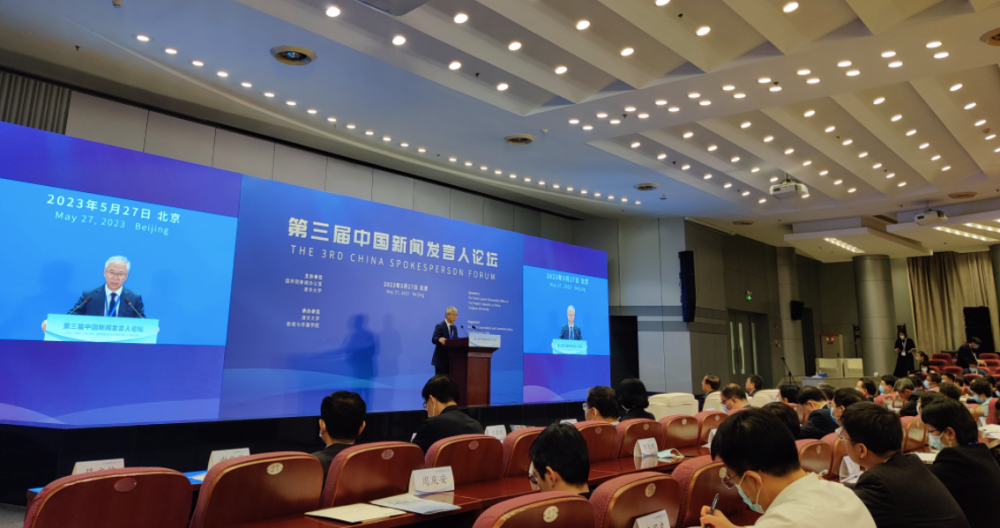

# 国家卫健委新闻发言人：越是敏感的问题，越是提前进行研判，主动回答

_第三届中国新闻发言人论坛现场。澎湃新闻记者
程婷 图_

5月27日，由国务院新闻办公室、清华大学主办的第三届中国新闻发言人论坛在清华大学举行。100余名来自中央部门、地方政府的新闻发言人以及部分专家学者、媒体负责人进行了研讨交流。

澎湃新闻注意到，论坛上，多名新闻发言人谈到，“要坚持人民至上的宗旨，积极回应人民关切”“人民关心什么，我们的发言就要按此来聚焦”“新闻发布很重要的一点，就是不回避热点、敏感问题”“新闻发布应坚持民有所呼、我有所为，坚持及时发声、权威定调”。积极回应人民关切、及时回应热点问题已成为中国新闻发言人们在新闻发布工作中的共识。多名新闻发言人还在论坛中提到，要不断适应新形势，提升新闻发布效果。

此外，谈到提升中国国际话语权时，外交部新闻司副司长、新闻发言人毛宁表示，要讲好中国故事，也要回击污蔑，面对反华敌对势力的舆论抹黑，不做沉默的羔羊、不做绅士，要做战士。

**“越是敏感的问题，越是提前进行研判，主动回答”**

“我们组织新闻发布，要及时，要实时，绝不能拖拖拉拉，延误最佳时机。”国家发展改革委副主任、新闻发言人赵辰昕在论坛中说道。

赵辰昕还表示，“作为新闻发言人必须坚持人民至上，这要求我们时时站在人民的角度。在我们的工作领域，人民关心什么，我们的发言就要按此来聚焦。”

谈及新闻发布工作，多位与会新闻发言人提到，要积极回应人民关切，及时回应社会热点、焦点问题。

在分享对立法发言人机制和工作的思考时，全国人大常委会法工委研究室主任、新闻发言人臧铁伟强调，要牢记新闻发布工作的任务使命，服务党和国家工作大局，如通过及时回应涉法的热点问题等，来阐明原则、立场，营造良好的国际国内舆论环境；要坚持人民至上的宗旨，积极回应人民关切，从而激发广大人民群众参与立法工作的热情，推动相关法律有效实施；要用心用情用力讲好立法故事，努力提升国内国际传播效果。

“新闻发布很重要的一点就是，不回避热点、敏感问题。”论坛上，国家卫健委宣传司副司长、新闻发言人米锋结合抗疫期间的新闻发布工作说道，“对于媒体和网友关心的热点、焦点问题，我们照单全收，应答尽答。越是敏感的问题，我们越是提前进行研判，主动回答，正面回应。”

米锋表示，正是权威、及时的信息发布，推动了正面信息先入为主、一锤定音，引领着舆论和媒体报道方向，一点一滴释放积极信号。实践证明，权威、及时、共情、有效的新闻发布与人民群众始终在一起，这已经成为14亿多中国人民同心抗疫取得重大决定性胜利的重要一环。

北京市委宣传部副部长、市政府新闻发言人徐和建也谈到，三年来，北京疫情防控发布会做到每有政策必有权威解读，每有热点必有及时回应，每有疑问必有专业解答，每有传言必有及时澄清，每有谣言必有及时辟谣，每有涉疫违法行为曝光、必有案件处理通报，每有防疫要求必有知识科普引领首都舆论，维护了社会稳定。

山东省委宣传部常务副部长、省政府新闻发言人袭艳春也在论坛上指出，新闻发布当有激浊扬清之勇，面对国内外复杂多变的舆论环境，直面问题和挑战，解疑释惑，凝聚共识。同时，新闻发布应坚持民有所呼、我有所为，坚持及时发声、权威定调，坚持人民至上、生命至上。

“面对突发事件和敏感热点舆情，山东主动抢占信息第一热点，我们曾经针对一次突发事件，连续举行了6场新闻发布会，发布20多次信息，以及时、准确、全面的权威声音，有效引导了舆论，赢得了民心。”袭艳春说。

**适应新形势、创新话语体系，说老百姓听得懂的家常话**

“没有媒体的报道和传播，没有公众的需求和信任，单方面的发布没有任何意义。”赵辰昕指出，新闻发言人组织的新闻发布行为，说到底是与媒体和公众的互动，因此绝不能自说自话，孤芳自赏。

多位与会新闻发言人、学者在论坛上提到，新形势下，新闻发布工作要创新话语体系，转向受众导向，要说老百姓听得懂的家常话。

赵辰昕认为，新闻发言人要以科学的态度对待科学，以真理的精神追求真理，以满腔热忱对待一切新生事物，不断创新方式方法和话语体系，善于说老百姓听得懂的家常话。

同时，他指出，新闻发言人既要把发现的问题、解决问题的思路办法以及进展讲出来，也要把遇到的困难、付出的努力讲出来，以此争取公众最大的理解和支持。

最高法院政治部副主任、新闻局副局长、新闻发言人李广宇则在论坛中指出，任何道理要深入人心都不能光靠说教，要用接地气的话语，要有一个好的载体。他表示，案例诠释司法理念、承载公平正义，是最直接的法律教科书，是最鲜活的法治公开课，也是人民法院新闻发布的有效载体。

北京大学国家战略传播研究院院长程曼丽在接受澎湃新闻采访时提到，新时代背景下，新闻传播生态已发生变化，新闻发布工作从过去重视现场发布、主流媒体发声，转向重视多平台、多方式的发布方式，且转向了受众导向，更加强调与公众、与网民的沟通。

在针对新闻发布工作提出建议时，中国人民大学党委副书记、副校长胡百精谈到，应进一步适应并引领社交化、移动化、智能化、视觉化的媒体格局、舆论生态，持续更新话语风格和修辞体系，让表达本身为发布赋能、创造可对话的意义空间。

此外，针对当前发展新形势，袭艳春提到，做好新闻发布工作要致力于构建舆论引导新平台，致力于汇聚媒体传播新动能，致力于探索新闻发布新形态，比如让发布现场从发布厅走到田间地头，让基层一线的代表和典型模范当话题主角，使新闻发布更富活力，更具人气。

**加强国际传播能力建设，不做沉默的羔羊，要做战士**

党的二十大报告中明确，要加强国际传播能力建设，全面提升国际传播效能，形成同我国综合国力和国际地位相匹配的国际话语权。因此，不仅对内的新闻发布工作很重要，对外的新闻发布工作同样重要。

外交部新闻司副司长、新闻发言人毛宁在论坛中谈到，国际社会期待听到响亮的中国声音和精彩的中国故事，这为我们提升国际话语权提供了难得的历史机遇，但另一方面，提升我们的国际话语权仍然任重道远。

对于提升中国国际话语权，毛宁表示，“要积极主动发声，我们既要会做、也要会说。”

“从2011年9月开始，中国外交部每个工作日都举行例行记者会，如今已经成为世界上唯一一家每个工作日都举行记者会的外交部。”毛宁说，“去年我们一共举行了241场，回答了3600多个问题，有问必答，受到外国记者的高度肯定。通过我们的不懈坚持和努力，国际社会对中国外交部记者会的关注报道不断增多，去年国际媒体对外交部例行记者会的英文报道量同比增长了32%，中国声音更多地为外界听见。”

毛宁还表示，要提升中国国际话语权，就要讲好中国故事，同时也要回击污蔑。

“发言人捍卫的是国家利益、民族尊严和中国形象。面对反华敌对势力掀起的一波又一波的舆论抹黑浪潮，我们不做沉默的羔羊、不做绅士，要做战士，在尖锐激烈的国际舆论斗争中，确保话语阵地不丢，坚决维护国家的利益、形象和尊严。”毛宁说。

毛宁指出，要提升我国国际话语权，还需要方方面面协调配合——官方民间协同，地方部门配合，国内国外呼应的立体发声。“我们也愿意进一步加强同各地方、各部门的密切配合，在更好地对外传播中国声音的同时，也更好地服务国家的改革发展。”毛宁表示。

