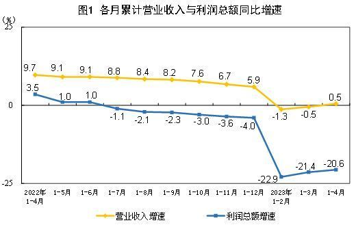

# 国家统计局：1-4月份全国规模以上工业企业利润下降20.6％

1—4月份，全国规模以上工业企业实现利润总额20328.8亿元，同比下降20.6%（按可比口径计算，详见附注二）。

1—4月份，规模以上工业企业中，国有控股企业实现利润总额7579.8亿元，同比下降17.9%；股份制企业实现利润总额14962.4亿元，下降22.0%；外商及港澳台商投资企业实现利润总额4679.9亿元，下降16.2%；私营企业实现利润总额5240.3亿元，下降22.5%。

1—4月份，采矿业实现利润总额4752.4亿元，同比下降12.3%；制造业实现利润总额13723.7亿元，下降27.0%；电力、热力、燃气及水生产和供应业实现利润总额1852.7亿元，增长34.1%。

1—4月份，在41个工业大类行业中，13个行业利润总额同比增长，1个行业持平，27个行业下降。主要行业利润情况如下：

电力、热力生产和供应业利润总额同比增长47.2%，电气机械和器材制造业增长30.1%，通用设备制造业增长20.7%，汽车制造业增长2.5%，石油和天然气开采业下降6.0%，专用设备制造业下降7.4%，煤炭开采和洗选业下降14.6%，非金属矿物制品业下降27.4%，纺织业下降30.2%，农副食品加工业下降36.3%，计算机、通信和其他电子设备制造业下降53.2%，有色金属冶炼和压延加工业下降55.1%，化学原料和化学制品制造业下降57.3%，石油、煤炭及其他燃料加工业下降87.9%，黑色金属冶炼和压延加工业下降99.4%。

1—4月份，规模以上工业企业实现营业收入41.07万亿元，同比增长0.5%；发生营业成本34.98万亿元，增长1.6%；营业收入利润率为4.95%，同比下降1.32个百分点。

4月末，规模以上工业企业资产总计158.55万亿元，同比增长7.3%；负债合计90.80万亿元，增长7.8%；所有者权益合计67.75万亿元，增长6.5%；资产负债率为57.3%，同比上升0.3个百分点。

4月末，规模以上工业企业应收账款21.94万亿元，同比增长12.6%；产成品存货6.13万亿元，增长5.9%。

1—4月份，规模以上工业企业每百元营业收入中的成本为85.18元，同比增加0.91元；每百元营业收入中的费用为8.40元，同比增加0.31元。

4月末，规模以上工业企业每百元资产实现的营业收入为78.2元，同比减少5.6元；人均营业收入为169.9万元，同比增加6.2万元；产成品存货周转天数为20.8天，同比增加1.3天；应收账款平均回收期为63.1天，同比增加6.4天。

**4月份工业企业利润降幅继续收窄**

**——国家统计局工业司统计师孙晓解读工业企业利润数据**

4月份，工业生产继续恢复，企业营收增长加快，利润降幅继续收窄，工业企业效益状况呈现以下主要特点：

一是工业企业当月营收增长加快。随着经济社会全面恢复常态化运行，工业生产继续恢复，产销衔接水平提升，企业营收增长加快。4月份，规模以上工业企业营业收入同比增长3.7%，增速较3月份加快3.1个百分点。在当月营收改善带动下，工业企业累计营收由降转增。1—4月份，规上工业企业营业收入同比增长0.5%，一季度为下降0.5%。

二是企业利润降幅继续收窄。4月份，规模以上工业企业利润同比下降18.2%，降幅较3月份收窄1.0个百分点，连续两个月收窄。多数行业盈利改善。在41个工业大类行业中，有23个行业利润增速较3月份加快或降幅收窄、由降转增，占56.1%。少数行业下拉工业利润增速明显。4月份，受产品价格降幅较大等因素影响，化工、煤炭采选行业利润分别下降63.1%、35.7%，合计下拉规上工业利润增速14.3个百分点。

三是装备制造业利润明显恢复。4月份，受新动能产业发展较好、同期基数较低等因素作用，装备制造业利润同比大幅增长29.8%，实现由降转增，拉动规模以上工业利润增长6.4个百分点，是拉动作用最大的行业板块。装备制造业利润占规上工业的比重为34.3%，较3月份提高1.5个百分点，带动工业利润行业结构改善。装备制造业利润普遍回升，其中汽车行业因同期基数较低，利润大幅增长20.4倍，增速较3月份显著加快；电气机械行业受光伏设备等产品带动，利润增长37.5%，增速加快26.2个百分点；通用设备行业受产业链恢复带动，利润增长63.7%，增速明显加快。

四是电气水行业利润持续快速增长。4月份，电力、热力、燃气及水生产和供应业利润同比增长36.5%，增速较3月份加快8.9个百分点。其中，随着经济运行向好，用电需求增加，电力生产持续加快，带动电力行业利润增长45.3%；燃气生产和供应业、水的生产和供应业利润分别增长7.3%、17.4%。

五是外资企业利润由降转增，私营企业利润降幅明显收窄。4月份，外商及港澳台商投资企业受汽车等行业带动，利润同比增长16.3%，由3月份的下降转为正增长，增速连续两个月回升。私营企业利润降幅较3月份收窄7.3个百分点。

总体看，工业企业效益延续恢复态势，但也要看到，国际环境严峻复杂，需求不足制约明显，工业企业盈利持续恢复面临较多困难。下阶段，要着力恢复和扩大需求，进一步提高产销衔接水平，持续提振经营主体信心，把发挥政策效力和激发经营主体活力结合起来，推动工业经济持续回升向好。

**附注**

一、指标解释及相关说明

1、利润总额：指企业在生产经营过程中各种收入扣除各种耗费后的盈余，反映企业在报告期内实现的盈亏总额。

2、营业收入：指企业从事销售商品、提供劳务和让渡资产使用权等生产经营活动形成的经济利益流入。包括主营业务收入和其他业务收入。

3、营业成本：指企业从事销售商品、提供劳务和让渡资产使用权等生产经营活动发生的实际成本。包括主营业务成本和其他业务成本。营业成本应当与营业收入进行配比。

4、资产总计：指企业过去的交易或者事项形成的、由企业拥有或者控制的、预期会给企业带来经济利益的资源。

5、负债合计：指企业过去的交易或者事项形成的、预期会导致经济利益流出企业的现时义务。

6、所有者权益合计：指企业资产扣除负债后由所有者享有的剩余权益。

7、应收账款：指资产负债表日以摊余成本计量的，企业因销售商品、提供服务等经营活动应收取的款项。

8、产成品存货：指企业报告期末已经加工生产并完成全部生产过程、可以对外销售的制成产品。

9、营业收入利润率=利润总额÷营业收入×100%，单位：%。

10、每百元营业收入中的成本=营业成本÷营业收入×100，单位：元。

11、每百元营业收入中的费用=（销售费用+管理费用+研发费用+财务费用）÷营业收入×100，单位：元。

12、每百元资产实现的营业收入=营业收入÷平均资产÷累计月数×12×100，单位：元。

13、人均营业收入=营业收入÷平均用工人数÷累计月数×12，单位：万元/人。

14、资产负债率=负债合计÷资产总计×100%，单位：%。

15、产成品存货周转天数=360×平均产成品存货÷营业成本×累计月数÷12，单位：天。

16、应收账款平均回收期=360×平均应收账款÷营业收入×累计月数÷12，单位：天。

17、在各表的利润总额同比增长栏中，标“注”的表示上年同期利润总额为负数，即亏损；数值为正数的表明利润同比增长；数值在至-100%之间（不含）的表明利润同比下降；下降幅度超过100%的表明由上年同期盈利转为本期亏损；数值为的表明利润同比持平。

18、在主要分组中，国有控股企业包括国有绝对控股企业和国有相对控股（含协议控股）企业等。外商及港澳台商投资企业包括中外（或与港澳台资）合资经营企业、合作经营企业及外资（或港澳台资）的股东占公司注册资本比例达25%以上的股份有限公司等。私营企业包括私营有限责任公司、私营股份有限公司、私营合伙企业和私营独资企业等。

二、规模以上工业企业利润总额、营业收入等指标的增速均按可比口径计算。报告期数据与上年所公布的同指标数据之间有不可比因素，不能直接相比计算增速。其主要原因是：（一）根据统计制度，每年定期对规模以上工业企业调查范围进行调整。每年有部分企业达到规模标准纳入调查范围，也有部分企业因规模变小而退出调查范围，还有新建投产企业、破产、注（吊）销企业等变化。（二）加强统计执法，对统计执法检查中发现的不符合规模以上工业统计要求的企业进行了清理，对相关基数依规进行了修正。（三）加强数据质量管理，剔除跨地区、跨行业重复统计数据。

三、统计范围

规模以上工业企业，即年主营业务收入为2000万元及以上的工业法人单位。

四、调查方法

规模以上工业企业财务状况报表按月进行全面调查（1月份数据免报）。

五、行业分类标准

执行国民经济行业分类标准（GB/T4754-2017），具体请参见http://www.stats.gov.cn/sj/tjbz/gmjjhyfl/。

