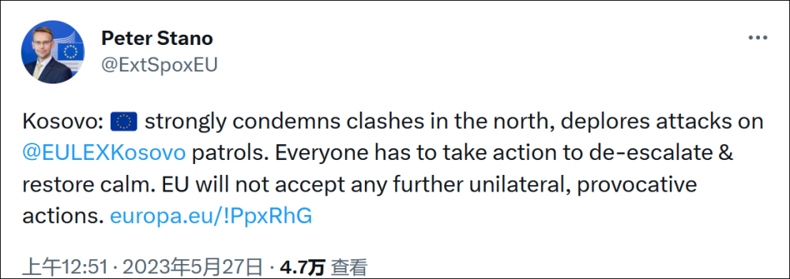

# 美英法意德发表联合声明，要求科索沃当局缓和局势

【文/观察者网
刘程辉】就当全球目光都聚焦于乌克兰问题时，近两年来科索沃问题也多次引发局势紧张。近日，科索沃北部塞族和阿族再起冲突，科索沃当局强行进入当地塞族行政大楼，引发塞尔维亚宣布军队向科索沃方向开拔。

5月26日，美国、英国、法国、意大利和德国发表联合声明，谴责科索沃当局强行进入塞族聚居区行政大楼的决定，呼吁科当局改弦更张，缓和局势。同日，美国国务卿布林肯还在一份单独声明中谴责科索沃“违背美国和欧洲的建议”，将对双边关系造成影响。

_美国国务院网站上发布的五国联合声明_

美英法意德五国在联合声明中写道：“我们谴责科索沃当局不顾我们保持克制的呼吁，强行进入科索沃北部市政建筑的决定。我们呼吁科索沃当局立即收手并缓和局势，并与欧盟驻科法治团和驻科部队密切协调。”

声明还称，“我们对塞尔维亚决定提高其武装部队在科索沃边境的战备水平感到关切，并呼吁各方保持最大限度的克制，避免煽动性言论”。

同日，布林肯还在另一份声明中“谴责科索沃当局采取单边行动”。

_布林肯另外发表了一份声明谴责科索沃当局_

“美国强烈谴责科索沃当局不顾美国和科索沃的欧洲伙伴的建议，强行进入科索沃北部市政建筑的行动。这些行动导致紧张局势不必要地急剧升级。”

布林肯指责科方“破坏了我们帮助科索沃和塞尔维亚实现关系正常化的努力”，“将对我们与科索沃的双边关系造成影响”。

布林肯呼吁科索沃当局领导人阿尔宾·库尔蒂改弦更张，并希望各方不要采取任何加剧紧张局势和冲突的进一步行动。

欧盟外交事务发言人彼得·斯塔诺（Peter
Stano）27日在社交媒体推特上发声，呼吁各方“必须采取行动缓和局势，恢复平静”，他称欧盟不会接受任何进一步的单方面挑衅行动。

同日，北约发言人瓦娜·伦格斯库（Oana
Lungescu）也在推特上发文：“我们敦促科索沃当局机构立即缓和局势，各方应通过对话解决问题”。她称，驻科索沃北约部队将继续保持戒备以确保环境安全。

_欧盟外交事务发言人27日发推呼吁各方保持克制_

5月26日，科索沃警察和科索沃当局任命的塞族聚居区区长强行进入塞族聚居区行政大楼，其间与聚集在行政大楼前的塞族民众发生冲突，科索沃警察使用催泪弹和震爆弹暴力驱散塞族民众，导致数十人受伤。在社交媒体上流传的各种视频中，可以听到枪声和震爆弹声，数辆汽车被点燃。

_5月26日，科索沃防暴警察与塞族民众发生冲突/路透社
图_

因科索沃局势紧张，塞尔维亚总统武契奇26日当天下令军队进入全面战备状态，并命令部分部队向靠近科索沃的边界移动。

塞尔维亚防长米洛什·武切维奇表示，该国武装部队将执行总统的命令，并在最困难的地方履行（民众）对军队的期望，捍卫塞尔维亚共和国的自由和独立，捍卫所有公民的自由，捍卫所有公民的生命权和财产权。

5月27日，塞尔维亚国家安全委员会就如何应对当前局势召开会议。会后发布的公告表示，塞尔维亚军队将继续保持最高战备状态，国家安全委员会会议期间商定了所有必要的安全举措，以加强塞尔维亚的国防能力。

公告还指出，北约驻科索沃维和部队没有按照联合国安理会第1244号决议开展工作，塞方将直接联系北约驻科维和部队指挥官，确保维和部队履行职责保护科索沃塞族民众。塞尔维亚将坚定不移地保护自己的人民。

_26日，武契奇在贝尔格莱德的大型集会上发表讲话_

近两年来，科索沃问题多次引发局势紧张。武契奇多次表示，塞尔维亚拒绝“把科索沃拱手让出”，西方则一直在给塞尔维亚“制造麻烦”。同时，在法德牵头下，欧盟多次撮合塞尔维亚与科索沃当局对话。今年2月，欧盟表示双方均已同意关系正常化文本。而武契奇表示，塞尔维亚不会承认科索沃独立。

与此同时，塞尔维亚国内局势当前也极其敏感。本月，塞尔维亚首都贝尔格莱德连续发生两起大规模枪击事件，引发当地民众抗议，反对派借机要求政府下台。

就在塞族与阿族爆发冲突的26日当天，武契奇在首都贝尔格莱德举行的大型集会上发表“告别演讲”，并宣布他定于27日辞去塞尔维亚执政党、议会第一大党塞尔维亚前进党主席职务，将组建一个新的全国性政治运动。

武契奇还表示，近期组织抗议活动呼吁他下台的反对派都是“秃鹫”和“鬣狗”，这些人想利用本月初出现的枪击案悲剧，试图在没有选举的情况下通过武力掌权，而他绝对不会让这些人如愿，“政府将只能通过选举和人民的意愿选出”。

科索沃是原南联盟塞尔维亚共和国的自治省，1999年6月科索沃战争结束后由联合国托管。2008年2月，科索沃单方面宣布独立，但塞尔维亚始终坚持其对科索沃的主权。

**本文系观察者网独家稿件，未经授权，不得转载。**

