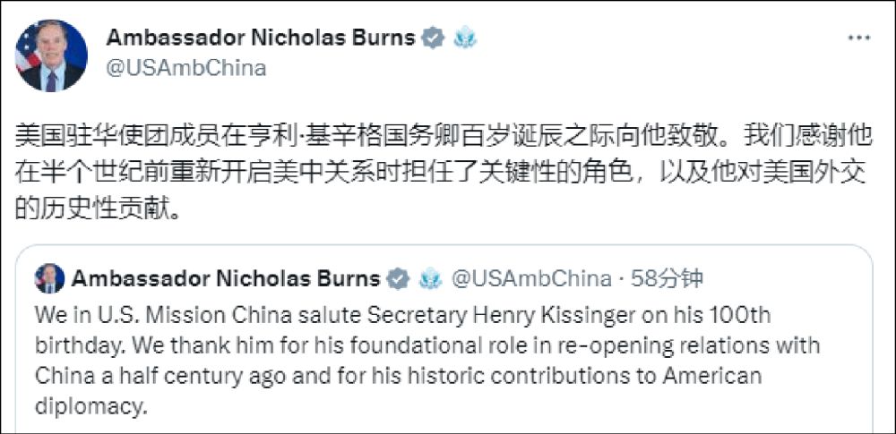
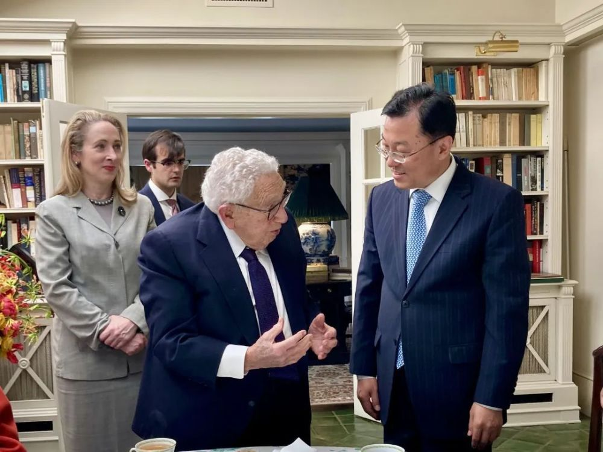

# 迎来百岁生日之际，基辛格谈中美：美国自诩正义，但其他国家并不买账

【文/观察者网 周弋博】

当地时间5月27日，美国前国务卿基辛格迎来百岁生日。此前一天（26日），《华尔街日报》发布对基辛格的专访。

专访中，这位曾在中美建交中扮演重要角色的外交家，分享了他对国际局势的最新看法：在中美竞争的背景下，大部分“主要国家”都已迷失基本方向，在“应该尝试‘微调’超级大国行为”还是“要争取一定程度的自主权”之间举棋不定，以至于让他觉得“无序”。

基辛格还表示，美国在外交政策上始终抱有“自诩正义”的行事风格，认为其观点理应天然占据主导地位，但中国等国对此并不买账。他认为，中国是在寻求“安全”而不是想要统治世界，为了避免与中国发生军事冲突，美国需要克制盲目的对抗，转而寻求对话。

在谈及俄乌问题时，基辛格认为“提议乌克兰加入北约”导致了俄乌冲突的爆发，而结束这场冲突的条件应该包括“将除克里米亚以外的所有领土归还给乌克兰”。

_美国前国务卿基辛格 资料图_

5月26日，中国驻美大使谢锋在康涅狄格州肯特郡会见基辛格，表达了中方对基辛格博士百岁寿辰的祝贺。双方就中美关系和共同关心的国际地区问题深入交换意见。

27日，美国驻华大使伯恩斯在推特发文致敬基辛格，感谢他“在半个世纪前重新开启美中关系时担任了关键性的角色，以及他对美国外交的历史性贡献”。

数十年来，亲身见证了中美从建交到合作，再到竞争与对抗的这位百岁老人，在《华尔街日报》报道的专访中，分享了他对国际形势、中美关系与俄乌冲突的最新看法。

这篇题为《亨利·基辛格百岁之际再度审视世界》的报道由印度裔英国记者瓦拉达拉扬撰写，对基辛格的专访于5月23日在他的办公室进行。

报道称，当基辛格审视当今世界时，他看到的是“无序”（disorder）。基辛格称，几乎所有的“主要国家”都已迷失方向，这些国家中的大多数缺少内部导向，并且正在改变或适应中美竞争与对抗之下的新环境。

_《华尔街日报》报道截图_

基辛格认为，像印度这样的大国以及许多“从属”国家，大部分都“没有他们对于想世界上取得何种成就的主要观点（dominant
view）”——究竟是应该尝试“微调”（modify）超级大国的行为，还是要“争取一定程度的自主权”，这些国家举棋不定。

例如，英国选择了与美国的密切合作，而法国选择了战略自主，但这是一种“在影响全球均衡的问题上与美国紧密联系”的战略自主。

今年4月，法国总统马克龙在结束访华行程不久后，就开始呼吁欧洲同胞不要“仅仅成为美国的追随者”。尽管有观点主张马克龙此举是在“贴近中国”，但基辛格认为这是法国追求战略自主的一个实际例子，只是体现了法国的文化特点。

“法国人的行事方式是让他们的对手相信自己是愚蠢的。”基辛格说，“（英国人）试图把你拉进他们的思想框架并说服你，而法国人则试图让你相信你的想法是不充分的。”

在谈及美国的行事方式时，基辛格称，“美国人认为自己的想法就是正义的。”

“我们相信我们是无私的，我们没有纯粹的国家目标，而且我们的国家目标在外交政策中很难实现，以至于当我们通过讨论来修改这些目标时，我们会对对手产生怨恨。”

“我们期望自己的观点能占上风，不是因为我们认为自己在智力上更胜一筹，而是因为我们认为这些观点本身应该占主导地位。”基辛格说，“这是一种强烈道德情感与强大力量相结合的表现。”

_中国驻美大使谢锋（右）在康涅狄格州肯特郡会见基辛格
图源：中国驻美国大使馆网站_

不过，当被问及美国的这种“自诩正义”的行事风格是否能得到其他国家的认同时，基辛格直言“当然没有”，比如“中国就绝对不会买账”。

“这就是我们之间的内在差异。”基辛格表示，“我认为，把与中国的关系描述为一种互相关切的关系，让双方都认为这样做对自己最好故而达成协议，这才是艺术。”

在基辛格看来，拜登对华政策并没有比特朗普的好到哪里去，“两者在很大程度上是同质的，我们的政策是宣布中国为对手，然后迫使对手做出让步，我们认为这些让步将阻止它实现其愿望。”

同时，基辛格也将中国视为“美国危险的潜在对手”，并认为双方有发生冲突的可能性，“我们面对着两个拥有全球历史观的社会，尽管两者文化不同，但却彼此对峙”。

“现在可以进行的最重要的对话是（中美）两国领导人之间的对话，双方都同意，他们将以减少爆发军事冲突的方式执行自己的政策。”

“对美国而言，这么做的危险在于，在这样的讨论中，人们会产生这样的信念，即中国已经从根本上改变了，我们将永久处于和平状态，可以减少军事力量了——这将让美国变得羸弱。”

基辛格承认，南海争端是中美关系所面对的问题之一，“我想看看我们能否找到某种方法，在‘海洋自由’的框架内解决这个问题。如果我们做不到，就会出现对抗。”

_特朗普与拜登_

此前，基辛格在接受《经济学人》杂志专访时，将“冷静外交”视为唯一防止毁灭性冲突的方法。他认为，人类的命运取决于美中两国能否和平相处，并建议美国政客认真考虑中国的担忧。

基辛格指出，中国对西方口中的所谓“基于规则的秩序”感到不满，认为这实质上是“基于美国的规则和美国的秩序”。中国的一些声音还认为，美国永远不会平等对待中国。

在谈及“紧迫的台湾问题”时，基辛格称，中美此前达成的谅解维持了50年，就被特朗普政府推翻了。特朗普想要迫使中国在贸易问题上让步，从而为自己打造“强硬形象”。拜登政府也想要效仿特朗普，只是他们选择的措辞有所不同。

基辛格同时警告美国政府不要曲解中国的雄心。他分析说，中国想成为强大的国家，中国的行为始终基于对国家利益和能力的敏锐感知，“华盛顿声称中国想要统治世界……但这不是他们对于世界秩序的看法，他们也从未这样想过。”

在《华尔街日报》的专访中，基辛格也提到了这个问题。基辛格表示，中国是在寻求“安全”，而不是想要“统治世界”。

_《经济学人》网站截图_

据《华尔街日报》报道，基辛格提出了他对俄乌冲突的最新看法。他称，拜登政府在该问题上做了“很多正确的事情”，“在我看来，乌克兰战争是胜利的，因为它阻止了俄罗斯对欧洲盟国的攻击——这种情况也不太可能再次发生了。”

“在我们结束战争的时候，我们应该记住，数百年来，俄罗斯在该地区发挥了重要影响，它陷入了自己的矛盾心理，既钦佩，又感到自卑，又担心来自欧洲的危险。”基辛格称，这种矛盾心理是俄乌冲突爆发的原因之一。

“我认为，让乌克兰加入北约的提议是一个严重的错误，这导致了这场冲突的爆发。但冲突的规模和性质是俄罗斯方面的问题，我们完全有理由抵制这场冲突。”

基辛格还称，乌克兰“现在是欧洲武装最精良的国家”，理应加入北约。

“具有讽刺意味的是，当我反对（乌克兰）加入北约时，我是孤身一人；当我支持（乌克兰）加入北约时，我几乎还是孤身一人。”基辛格称，他希望结束这场冲突的条件能够包括“将除克里米亚以外的所有领土归还给乌克兰”。

_乌克兰总统泽连斯基（右）与北约秘书长斯托尔滕贝格
图源：路透社_

1971年基辛格秘密访华，与中方携手促成了1972年尼克松总统对中国进行“破冰之旅”，实现了震撼世界的“跨越太平洋的握手”。

这一段传奇历史，中国人耳熟能详。包括基辛格在内的中美老一辈领导人和政治家从两国人民根本利益出发，以非凡的战略眼光和卓越的政治勇气，超越意识形态和社会制度的差异，作出了历史性的政治决断。尼克松此行是“极少数对国际事务产生深远影响的国事访问之一”，影响了此后数十年中美关系乃至世界格局的走向。

**本文系观察者网独家稿件，未经授权，不得转载。**

