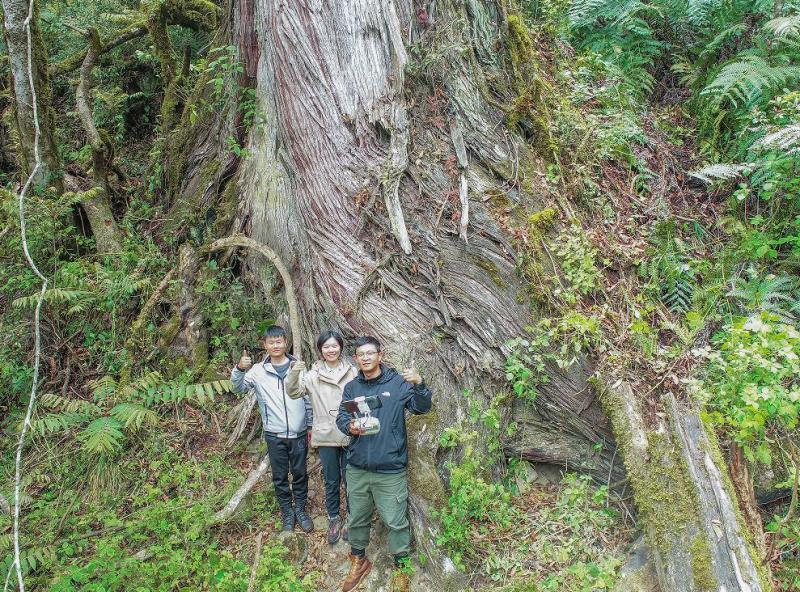

# 高达102.3米！中国最高树纪录刷新，测量人员：或是树木竞争的结果

中国最高的树在哪里？近日，这个问题有了新的答案，5月27日北京大学遥感所介绍，近日，由该所牵头的联合调查队在位于西藏林芝市发现了一棵高达102.3米的西藏柏木。此次发现刷新了按树种排名的世界最高树列表，成为仅次于美国海岸红杉的世界第二高树种，不但创造了新的中国最高树纪录，也刷新了亚洲纪录，成为目前已知的亚洲第一高树。

参与测量这棵巨树高度的科研人员告诉北青报记者，站在树下她感受到了大自然的精巧，“让我既感到震撼，又感到兴奋和激动。”

**西藏发现已知亚洲最高树木调查人员：感受到了大自然的精巧**

北京青年报记者5月27日从北京大学遥感所获悉，近日，由该所郭庆华教授牵头的联合调查队在位于雅鲁藏布国家级自然保护区的林芝市波密县通麦镇境内，发现了一棵高达102.3米的西藏柏木。此次发现刷新了按树种排名的世界最高树列表，成为仅次于美国海岸红杉的世界第二高树种，同时也刷新了亚洲纪录，成为目前已知的亚洲第一高树。

据介绍，此次调查的参与单位包括北京大学郭庆华与吕植课题组、西子江生态保育中心、北京数字绿土科技股份有限公司以及山水自然保护中心等。

5月27日，西子江生态保育中心负责人李成告诉北青报记者，今年2月时，调查人员在当地发现了一棵约86米高的西藏柏木，当时这棵树已经打破了中国树的高度纪录。因此今年4月郭庆华教授牵头组织了联合调查队，并在5月抵达当地开展精确测绘工作。

在这个过程中，研究人员发现当地不但有多棵85米以上的巨树，还有90米以上的，最终更是发现了此次公布的高度超百米的西藏柏木。

北京大学郭庆华团队博士后任淯是此次到现场对巨树进行测量的团队成员之一，她回忆说，从团队到现场调查到最后完成测量工作，历时将近一个月的时间。

她介绍，此次发现的亚洲第一高树位于山谷中的原始森林中，一路过去的路都非常陡峭、泥泞，常常需要爬山、渡河，甚至还会遇到毒蛇等。科研人员克服了诸多困难，对森林中不少巨树逐个进行测量，最终发现了这棵高达102.3米的西藏柏木。

“当时我感觉巨树非常庞大，它的支撑根像一座巨大的雕塑一般，让我感觉大自然好精巧。站在这棵树下，让我既感到震撼，又感到兴奋和激动。”任淯回忆说。

**此次共发现25棵90米以上高树 彼此竞争或促成树长得更高**

郭庆华介绍，此次对巨树高度的测量采用的是无人机和激光雷达来进行精准测量。任淯介绍，利用这些设备，团队可以先对整个区域进行扫描，查找出相对较高的树木。“无人机激光雷达可以对区域继续大面积扫描，激光雷达向目标发射探测激光束，然后将接收到的从目标反射回来的信号，与发射信号进行比较，从而获取距离信息。利用这个原理，我们可以把一片区域的树高的情况基本测量出来。”

但郭庆华表示，由于当地的森林极为茂密，树之间的遮挡效应很明显，因此有时树根、树干的位置在无人机激光雷达的扫描中难以确定。这时调查人员深入原始森林深处，在潜在最高树附近的林窗位置的空地放上长方体“靶标”，采用无人机激光雷达与背包激光雷达进行同步测量，通过配准，获得完整的激光雷达三维点云模型，从而获取巨树的准确高度。

据介绍，通过此次调查，除西藏柏木最高树外，科研人员还发现了大量85米以上的树木，其中包含了90米以上高树25棵，相比去年在台湾发现的高84.1米的原中国第一高树，此次发现大幅提升了中国乃至亚洲的树高纪录，该地区也成为目前我国乃至亚洲经过精准测量发现的巨树高度和分布密度最高的区域。

任淯说，之所以此次能在该区域发现如此之多的参天巨树，首先得益于当地良好的气候条件，“这里位于藏东南的河谷地区，气候非常湿润，温度也很适宜树木的生长。此外，西藏柏木本身就是一种高度生长潜力巨大的树种，这两个条件共同的作用下，使得这里呈现出了巨树集中的现象。”

“当然，即使有这些因素，一棵巨树能够长到超过百米高也需要一定的‘机缘巧合’。”郭庆华说，这棵树生长在山谷区域，减少了大风与雷击等的影响，与此同时，由于这片区域巨树集中，也使得树木之间产生了竞争的关系，“每棵树都在争取更多的阳光，因此它们也会在竞争中长得更高。”

**161张照片拼出巨树等身照 未来或还能在藏东南区域发现中国巨树新高度**

科研人员此次还发布了这棵超过百米高的巨树的“等身照”，照片中这棵巨大的西藏柏木屹立在山坡上。任淯还展示包括她在内几名科研人员与巨树的合影，几个人的身高相比巨树显得十分渺小。

郭庆华介绍，此次发布的巨树“等身照”并不是一次拍摄出来的，由于巨树所在地树林非常密集，不可能找到合适的角度用一张照片拍下整棵巨树，因此科研人员采用无人机搭载高清相机，从树底部起飞，停留在不同的高度进行拍摄，最后拍摄了161张照片，将这些照片拼接后形成了这张巨树的“等身照”。

李成说，西藏柏木主要分布在我国藏东南区域，仅在雅鲁藏布大峡谷国家级自然保护区局部有少量分布，分布区域很狭窄，种群数量稀少，被列为国家一级重点保护植物。此次调研发现的102.3米的西藏柏木，增加了学术界对于这一珍稀树种的认识。

李成表示，高树的存在能够揭示其生长区域生态系统的原真性和完整性等特征。除此之外，高树本身也具有非常复杂的分枝系统与垂直结构，为一些濒危的动植物提供了必要的微气候以及理想的生存和栖息环境。因此，高树在生物多样性以及生态价值方面具有不可替代的作用。

“未来我们还会继续在这里进行探索，也欢迎其他的研究者一起参与到寻找高树的过程之中。”郭庆华说，“未来很可能还会在藏东南发现中国树木的新高度。”

文/北京青年报记者 屈畅 实习生 杨彤彤

