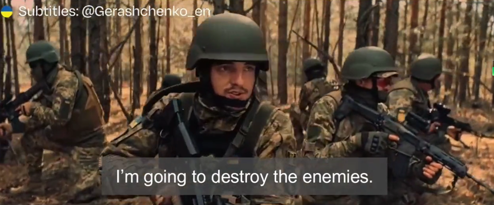
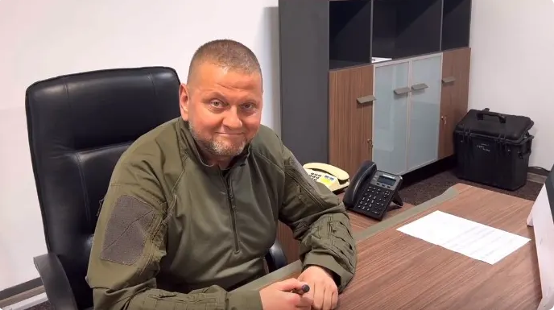
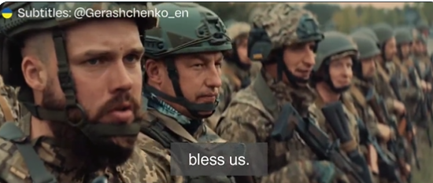
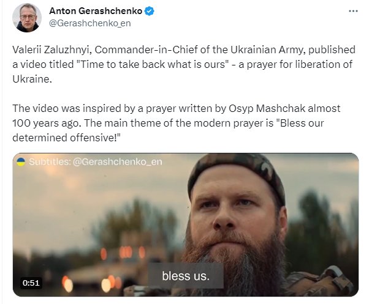

# 乌军总司令发备战视频宣称即将反攻，美媒：暂未发现大规模兵力调动

当地时间5月27日上午，乌克兰武装部队总司令扎卢日内的社交平台账号发布一段宣传乌军备战和展现“消灭敌人”决心的视频，标题为“是时候夺回属于我们的东西了”。美国《新闻周刊》和《纽约时报》对此解读称，这是乌军宣布即将发动反攻的声明，但尚不清楚乌军会在何时何地发动反攻。

同一天，乌克兰国家安全和国防委员会秘书阿列克西·丹尼洛夫在接受英国广播公司（BBC）采访时宣称，反攻已经准备就绪，可能“明天，后天或一周内”拉开帷幕。《纽约时报》称，27日上午尚无公开迹象表明前线有大规模兵力调动。

_视频截图_

近期一直没有公开露面的乌克兰武装部队总司令扎卢日内，继出镜乌克兰国防部新闻处25日发布的意在打破其“失踪”传闻的视频后，其Telegram账号27日更新了一则题为“是时候夺回属于我们的东西了”的视频。

_乌克兰武装部队总司令扎卢日内_

视频描绘了乌军士兵备战的情况并展现了乌军的武器，出镜的士兵齐念一段祈祷词，并高喊“我要去消灭敌人”，称希望国家和天父保佑其“决定性进攻”和“神圣的复仇”能取得胜利。

_视频截图_

但扎卢日内的账号并未说明这场反攻试图在何时何地发动。

乌克兰内政部顾问安东·格拉什琴科在推特发文称，该视频是为了“解放乌克兰”而作的祈祷，主题是“保佑乌军坚定的进攻”，灵感来源于乌克兰民族主义政治家和活动家奥西普·马尔沙克约100年前写下的祈祷文。

《纽约时报》称，该视频显示：经过数月筹备，包括近期加大对俄军后勤目标的攻击以及制造旨在让俄军紧张的假信息等准备动作，乌军的反攻已准备就绪。

报道还称，这段精心制作的视频似乎旨在让已经疲于15个月战争的乌克兰重新振作起来，并试图给俄军内部制造焦虑。

同一天（27日），乌克兰国家安全和国防委员会秘书阿列克西·丹尼洛夫在接受英国广播公司（BBC）采访时宣称，乌军的反攻已经准备就绪，随时可以发动进攻。但他不愿意透露具体日期
，只称当指挥官计算出“我们在战争的那个时间点能取得最好结果时”，反攻就会发动，可能开始于“明天，后天或一周内”。

丹尼洛夫还称，乌克兰政府在这一决定上“无权犯错”，因为此役是一个他们“不能失去的历史性机遇”。

BBC称，丹尼洛夫是乌克兰总统泽连斯基战时内阁的核心人物，当天的采访被泽连斯基的一条电话留言打断，丹尼洛夫被泽连斯基召走参加讨论反攻的会议。

对于俄罗斯和白俄罗斯5月25日签署协议，确定在白俄罗斯领土上部署俄罗斯战术核武器一事，丹尼洛夫称自己对此“完全平静”（absolutely
calm），因为对乌方来说，这“不是什么新闻”。

BBC称，乌军迟迟未发动反攻，是因为其需要尽可能多的时间来训练部队和接收西方盟国援助的军事装备。乌克兰政府向乌克兰民众和西方盟友宣称，他们此次反攻能够突破俄罗斯的防线，结束军事僵局。

与此同时，俄军一直在准备防御。BBC还通过数百张卫星图像分析自去年10月以来俄方在乌克兰南部大规模建造战壕和其他防御工事的行动。

《纽约时报》称，当地时间27日上午仍没有公开迹象表明在目前的战线上有大规模部队在调动。报道称，乌克兰官员在讲述他们的军事计划时“故意含糊其辞”，很可能是希望在这场已被广泛宣传的反攻中保持“出其不意”。乌方曾称，反攻不会以单一事件为标志，很可能一开始就以佯攻和欺骗为特征。

**本文系观察者网独家稿件，未经授权，不得转载。**

