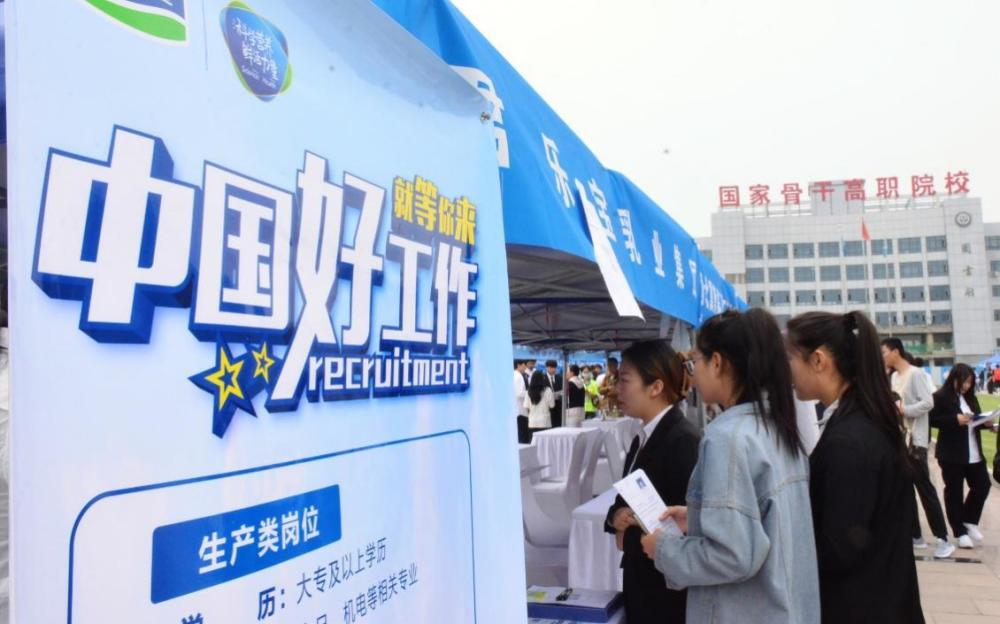

# 高职两年实习“卖课卖药”，广东一毕业生将学校告上法庭

_2023年5月25日，石家庄，一场高校毕业生就业招聘会。图文无关。（视觉中国/图）_

“学校说不去实习就没毕业证。结果我被安排去药店卖药，还有同学被安排去了超市卖菜、杀鸡。”李明（化名）说。长期以来，职业教育领域的学生实习存在诸多争议纠纷，本案近期引起关注。

2022年6月，大专毕业一年后，李明以与学校存在“教育培训合同”纠纷为由，将学校告上了法庭。

李明是广东省梅州市五华县人，2018年9月考入广东工程职业技术学院就读商务管理（三年制高职）专业。2019年7月，李明和同学按照教学要求前往与学校合作的公司去实习。但他没想到的是，实习内容是“卖药”“卖菜”“杀鸡”。

李明认为，在实习的两年中，学校没有提供任何与所设专业相关的教育服务，且要求的两年实习期限违反了教育部等八部门联合印发的《职业学校学生实习管理规定》。因此，他要求学校退还缴纳的学费一万元。

2022年12月，本案开庭审理。校方代理律师辩称，基于法律规定，学校与学生属于管理与被管理的不平等关系，并非平等主体间的民事法律关系，因此关于教学模式、是否存在违法安排实习的争议不属于民事法律关系调整范围，学生无权以学校未提供教育服务内容、违法安排实习为由主张违约责任。

距离开庭已过去6个月，李明还在等待广州市天河区人民法院的判决结果。

因维权开始学法律

2019年5月，大一临近结束，随着实习的日子渐近，李明和同学们听到的关于实习的“风声”也越来越多。

“听说实习是去杀鸡、切猪肉，而且原先说好的‘包吃包住’也没了。”学生间积累的疑问在2019年5月7日爆发，下课后，李明和班上的同学坐在教室不走，打算问个清楚。

当时，李明所在的管理工程学院一位负责人得到消息后赶到教室，李明对过程进行了录音。

这段录音中，有同学问：“吃住的问题？”学院领导回应：“这个问题我们会再和企业沟通，但是如果你们大家都说不包吃住就不去，这个事怎么解决呢？你们不去参与教学的话，是没有毕业证的。”

李明的同班同学朱某杰对南方周末记者回忆，“虽然大家都挺抗拒，但听说不去没有毕业证，大家都忍着去干。班上有一位同学直接退学了。”

南方周末记者联系李明曾在广东工程职业技术学院就读时期的班主任对于此事的看法，对方称“这个事不方便说”。随后挂断电话。

《广东工程职业技术学院2018自主招生章程》显示，李明及其同学所报考的商务管理专业实施“现代学徒制”培养模式，即校企联合办学、招工招生同步。报考此专业的考生除应符合招收基本报考条件外，必须与培养企业签订劳动合同。该校《商务管理专业人才培养方案》显示，此专业采用“一年在校系统学习、两年在企跟岗学习”的教学方式。

2019年7月到2021年6月间，李明前后分别去到广州市某艺术文化发展有限公司、广州某医药有限责任公司实习。

在两年的实习中，李明的主要工作内容分别为推销课程、卖药，每天工作8小时、一个月休息4天，平均一周工作时间48小时，月平均工资1400元。还有一些同学分被分配到菜市场从事卖菜、杀鸡工作，工资也相近。

知道实习的“真相”时，李明开始产生维权的念头，“当时我也在网上搜过相关的法律，但是看不懂，后来无意间看到西南政法大学关于民法学的视频，就开始学法律，后面报考了专升本（法学）专业的考试，更认真、系统地学习”。

2021年5月，李明考入广东某高校法学专业本科。2022年，经过一年的专业系统学习后，在本科院校老师的帮助和指导下，李明起草了民事起诉书，向广州市天河区人民法院提起诉讼，请求确认广东工程职业技术学院的行为违法，并退还实习期间这两年缴纳的一万元学费。

“现代学徒制”模式

从2022年开始，李明通过各种方式“维权”。

2022年2月，李明向广州市劳动仲裁委员会申请劳动仲裁，同年4月1日得到的回复是“不予受理”，原因为申请人主体不适格、申请人的仲裁请求不属于劳动人事争议处理范围。

换言之，实习生与实习单位建立的是非劳动关系。《中华人民共和国劳动争议调解仲裁法》规定用人单位与劳动者发生劳动争议才适用劳动仲裁。原劳动部于1995年颁发了《关于贯彻执行

此前李明向法院提请立案，也曾得到“本案不属于民事诉讼受理范围，请向有关部门反映处理”的通知。经过多次努力，2022年6月6日，李明收到了广州市天河区人民法院受理案件通知书。

法院最初认为，学校是行政机关，学校与学生是管理与被管理的关系，不属于平等民事主体间的纠纷，因而不予立案。李明随后搜集整理好相关论文和案例到法院解释，“管理关系是内部的，依据的是内部的管理规定，但学生交钱给学校，学校给学生提供教育服务，本质上就是金钱换服务的行为”。

《职业学校学生实习管理规定》第十条规定，顶岗实习一般为6个月。李明在起诉书中称，学校要求的两年实习期限违反法律规定。

对此，校方在答辩状中辩称，早在李明就读前，现代学徒制“一年在校系统学习、两年在企跟岗学习”的教学模式已在学校官网中充分公示，学校与学生之间就该教学模式而言属于管理与被管理的不平等关系，关于教学模式的争议不属于民事法律关系调整范围，李明无权以学校未提供教育服务为由主张违约责任。

此外，关于实习工作内容为推销课程、卖药，李明主张，这违反《教育部职业学校学生实习管理规定》“实习岗位应符合专业培养目标要求，与学生所学专业对口或相近”以及《广东省高等学校学生实习与毕业生就业见习条例》“安排学生在需要相应职业资格的岗位上顶岗实习”的规定。

庭审中，校方辩称，“现代学徒制”与“一般校内授课为主、校外实习为辅”的教学模式不同，应另行遵照“现代学徒制”相关的专门法律规定、部门规章制度实行，该校的“现代学徒制”模式早已通过教育部的验收。

现代学徒制是教育部借鉴西方学徒制经验在职业教育领域推行的一项试验。

2019年5月15日，教育部办公厅发布《关于全面推进现代学徒制工作的通知》，文中提到“校企共同制订和实施招生招工方案，规范招生录取和企业用工程序，推进招生招工同步，明确学徒的企业员工和职业学校学生双重身份，保障学徒的合法权益”。据《光明日报》报道，2015年至2020年上半年，全国范围内共有562个单位参与现代学徒制试点，覆盖一千多个专业点，每年惠及九万余名学生（学徒）。

本案尚未宣判。李明将自己的经历、维权方案发布到网络平台，引发社会关注，“我不想自认倒霉，就算一审判决结果不理想，我会继续上诉”。

南方周末记者 翟星理 南方周末实习生 邓林

