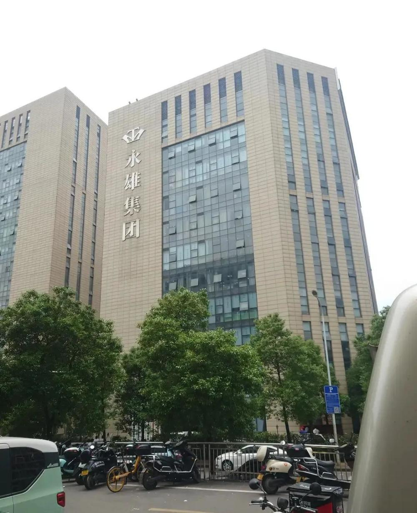

# 催收巨头永雄公司前员工：花钱买欠债者资料，骚扰威胁打110寄花圈

5月25日凌晨，国内催收巨头湖南永雄资产管理集团有限公司官方公号发文，宣布从即日起停业，安徽警方跨省抓捕其公司百余员工的行动，引发公众高度关注。

5月27日晚间，曾在永雄公司娄底分公司供职过的年轻男子小石，向华商报大风新闻记者讲述了亲历的“催收江湖”。

湖南分公司近十家，

娄底分公司员工逾600人，

商业银行、美团是主要客户

5月27日晚间，小石（化名）告诉华商报大风新闻记者，他是在2020年入职永雄娄底分公司。当时，从一所二本院校毕业不久的他，收到朋友邀请，加之薪水待遇看上去在四五线城市颇具吸引力，没考虑太多，便加入永雄。

小石更是看上了永雄的雄厚实力，除在长沙的总部外，永雄仅在湖南省内设置的分公司不少，例如娄底、衡阳、新化和邵阳等等分公司，近10家左右。

出事前，永雄娄底分公司约有600余人，承接的主要是平安银行等商业银行、美团贷款等金融平台的逾期贷款业务，“我们帮他们催收，拿佣金。”

真正加入永雄，小石才意识到干催收这个活儿并不容易，但嫌离职麻烦等各方面考虑，他没有离职，“待遇算好。”

在永雄的薪资构成，通常是底薪2500元加提成。如果成功内推1个人，每月底薪增加800元，2个人是1500元。

提成算法较为复杂，主要依赖于员工的催收业绩完成情况，也看催收难度。比如公司每月完成美团4000万的贷款催收额度，提成最高10%封顶。员工催收成功金额达2万元，提成8%，完成4万为10%。

同时提成比例还与贷款的“手别”相关联，“一手”为逾期2~3个月的订单，“二手”为逾期3~4个月的订单，“一手”订单没催收成功，自动升为“二手”订单。催收难度越高，提成比例也水涨船高。

如果公司当月整体完成业绩不佳，提成比例也随之下降。一般来说，娄底分公司的大客户以美团为主，单个欠债者欠款金额最高为6万，2020年曾有四五十万的金额。

小石在职期间，扣除五险一金和资料费等后，通常平均月收入为7000元以上。这在就业机会较少、2022年人均可支配收入25578元的小城市娄底，已经算高收入，办公环境也不错，于是他坚持了两年多时间，“还有离家近的优势。”

调取资料方式领导不会透露，

“欠债者所有的信息都跑不掉”

小石称，在公司坚持下来并不是一件易事。

每个月，每个员工约有100~130个订单要催收，需要先花费1000~1500元，向团队管理者部长购买欠债者资料，通常从公司拿到金融平台需要催收的订单，员工先对欠债者筛选一轮，债款额度为3000元以下的“不做，因为（提成）金额太低。”

“我们一般只有欠债者的电话和身份证等信息。”筛选完后，员工将需要催收的欠债者名单交给部长，部长再去调取欠债者的“资料”。这份“资料”通常包含欠债者亲友同事的电话、个人通讯录等全部信息。

“调资料是更加危险的行为。”领导不会明面上向普通员工透露如何调取。据小石所知，这样的信息泄露，通常来自于一些APP、
“XX绑定号码”等渠道，可调取欠债者的社保、公积金、户籍等信息，“应该是买通了，内部人员全部可以搞出来。”

“你欠钱的话，所有的信息都会展露出来，跑不掉。”小石还透露，欠债者申请借款时，下载的借款APP，就会把手机通讯录读取完毕。

还可以找人花钱调取信息，以便催收者针对欠债者“爆通讯录”，每天短信轰炸。有相关外部人员使用专业的病毒软件“我的安卓手机”，只要输入欠债者的手机号码等，就会自行导出个人信息，“欠债者名下所有的电话号码都可以被调取，无论你用不用，安卓手机一下就搞出来了。”

此外，每个月员工还有一个群发外部短信的中介费用，所谓的外部短信即为对欠债者狂轰滥炸的骚扰短信，公司外有专人帮忙发送。通过副总牵线，并交400元，员工自行编写好短信内容就可以了。为了测试外部短信是否被发送，员工们一般还会将自己的号码附上。

小石说，一个团队副总月薪3万左右起步，管理一个数十人的团队，“每个月还可以赚几千元的中介费。”

“应该是慢慢发展到这个规模的。”按小石的说法，经过数年发展，永雄的催收业务涉及到的各环节，已被设计得严丝合缝，形成了成熟的产业链。员工更像一个螺丝钉，安上去就能迅速上岗执行催收，但很多人却无法接受适应这套运行规则，选择辞职或被淘汰。

骚扰欠债者手段花样百出：

短信电话骚扰寄花圈订外卖

小石也坦承，他和同事们发送给欠债者的短信，通常威胁意味较重。如果客户一直没还钱，就会被一轮轮催收下去，第二次催收还要向公司交资料钱。

为了保证催收业绩，员工们骚扰欠债者的手段花样百出。最常见的比如代欠债者订水订外卖等所谓的“上门服务”，“喊送水就喊十几桶，喊十几个外卖，半夜叫开锁修马桶的，2020年有人还喊送花圈。”

在小石的经验中，假如对方是公职人员，催收成功率是最高的。因为可以向其供职单位施压，一般忌惮体制内的铁饭碗和名声，欠债者会快速还钱。甚至欠债者供职于派出所，员工们会给110报警电话一直打电话，催其还钱，“110要我们别打了，会影响别人报警，我们就会说让对方把钱还了。”

“反正你上班我也上班，我就轰你8个小时。”
小石说，如果欠债者是上班族，催收员工们会从上班开始打电话骚扰对方供职单位，什么也不说，就说要找欠债者，一直轰炸到下班为止，“比如4S店（员工），我们会找一些莫须有的理由去总部投诉。”

在这样的轰炸下，70%欠债者可能会还钱，也可能出现投诉。催收员工们也会根据欠债者的态度和人品来判断，决定是否采取行动，“如果你还有一定的人际关系，人还比较正常，不是烂透的了，比如农村的，我们会给村委会打电话，要求村主任和家里人沟通。”

打通电话后，催收者有话术，一般不会提“我是美团的”，而是称“你有一个欠款”。如果对方态度不好，催收者会采取行动，甚至和欠债者对骂。

小石说，永雄之所以坚持这么久，是因为规模大，不像小公司“一下就被抓走”。

在这个年轻人看来，创始人谭某作为民营企业家善于经营。除了纳税大户的身份，永雄积极捐款做公益。

月初就传出公司要出事风声，

“永雄应该会卷土重来”

不过，这一次永雄的变化过于突然，连员工都没有反应过来。

小石说，这个月初，前同事们听到的公司要出事的风声，娄底分公司开始以业绩和考勤为由裁员，大约裁员了300~400人，并要求员工上班不能用自己的手机打，要用陌生号码打，“让留下的正常上班。”

“当时不知道是安徽那边抓人，但知道肯定是有分公司出事了。”小石说，一般湖南的分公司扎根很深，一出事就是外地的分公司。5月25日凌晨，他们也看到了那封引爆舆论的《告全体员工书》。

“估计是停业，它过段时间应该还会开业的。”小石说，前两天，自己还问了同事，娄底没有人被抓走。邵阳等分公司应该是要关的，“肯定很多人离职。”

他认为，永雄要再开，应该会正规催收一段时间，但这样很难催收成功。公司要继续运行，还是要依靠“非常规”催收，“既然是老赖了，打电话都停机，有什么用呢？”据其所知，这次安徽警方的行动，主要是安徽有人投诉到金融办等监管部门，拿了一些实质性的证据。

小石说，成年人都知道这样催收是有问题的，但他并不是很担心出事。永雄此前都是在广西百色等地方出事，过去曾有过和领导闹僵的员工，拿着该公司催收的证据，向派出所举报无果。

小石说，公司明面上声张不允许违法催收，连员工给欠债者打电话都“不能大声”。对上述此类“非常规”的催收行为，公司假装不知道，“都是员工私下的行为。”

员工离职率高，

被PUA、罚款是常态

尽管身处湖南中部四线小城，但小石和同事们的工作节奏和一线白领996相差无几。

公司要求员工，每天8点20必须到岗，不能踩点，每天开4次会，中午1点半集体喊口号。员工晚上加班到7点半，管理层晚上10~11点才能回家。

每周只能休息半天，周六上全天。国庆的7天假期，公司也会设法从周末补回来，“反正让你占不到一点便宜。”

小石说，领导们开会经常给下属洗脑，还要口号比拼，“业绩是给你们自己算钱，为了你好”、“你在娄底去哪里找一个这样的好工作？”

这样高压的工作节奏和环境，导致永雄的离职率也很高，人员流动性强。很多人做几天就走了，离职理由多数是无法接受加班、开会，以及高昂的资料费等等，“运气不好，业绩不好，一个月扣了五险一金和资料费，甚至只能到手几百元。”

“又不包吃不包住。”小石说，有些人甚至要借钱过日子，业绩好的员工只占到了40~50%。包括他自己都出现过借钱的情况。

尽管永雄招聘的门槛较低，只要求应聘者会说普通话，识字，“是个人就行”
。永雄的员工大多数在18岁~38岁之间，女性占多数，因为“女性耐心好一些，做事更细致，更有责任心。”

干得长的也有，2016年开始干的老员工都有。30岁的员工因为追求稳定，有房贷车贷养家，一般抗压能力比20多岁的年轻员工更强。

离职前不久，因为催收，小石被一个欠债者投诉到银监会，被公司视为最严重的投诉，可以直接开除，“因为已经让美团的官方来和我们对接。”

最终，公司的处理方式，是扣除他当月的所有业绩，“扣钱是一千一千地扣，我有个同事最多扣6000元， 扣1.2万的都有，有要赔2万的。”

一旦惹上投诉，风险由员工自行承担。在小石看来，调资料的行为都是公司暗地里要员工做的，出了事把员工推出去，他不禁心灰意冷，“不想做了。”

“辛苦，有点累。”在过去2年，小石耿耿于怀的还有要挨骂。公司一层楼都是大通间，领导常常当着所有人训斥下属，不给人留任何面子，“业绩好他就和你笑嘻嘻，业绩不好上厕所都要说你。”

投诉发生后没多久，小石辞职了，也彻底离开了娄底，前往外省发展，找到了一份新工作。他说，自己再也不会考虑这类工作了。

**华商报大风新闻记者 陈思 编辑 王喆楠**

