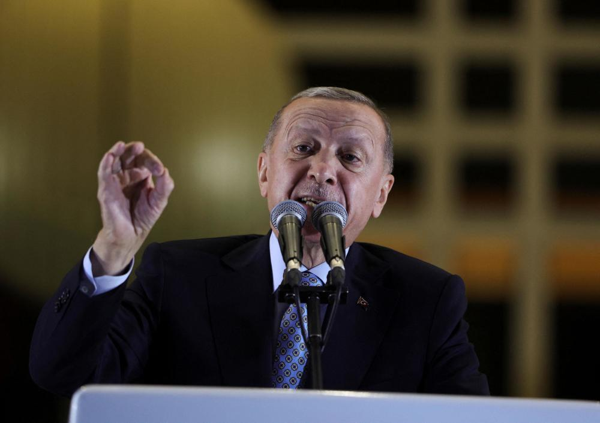
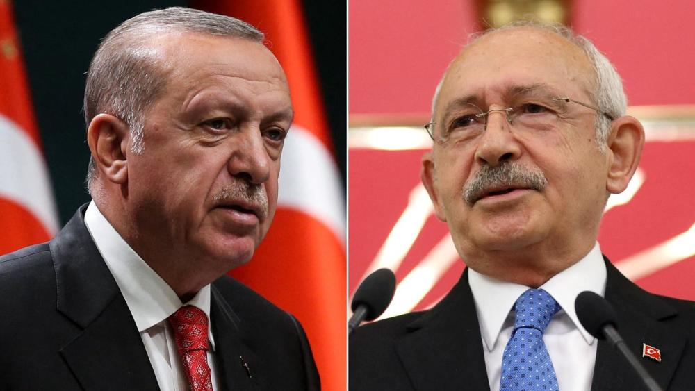
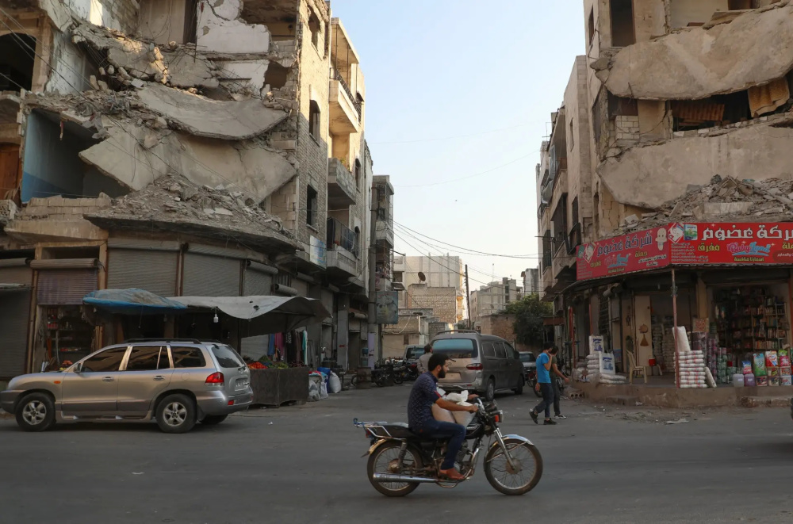
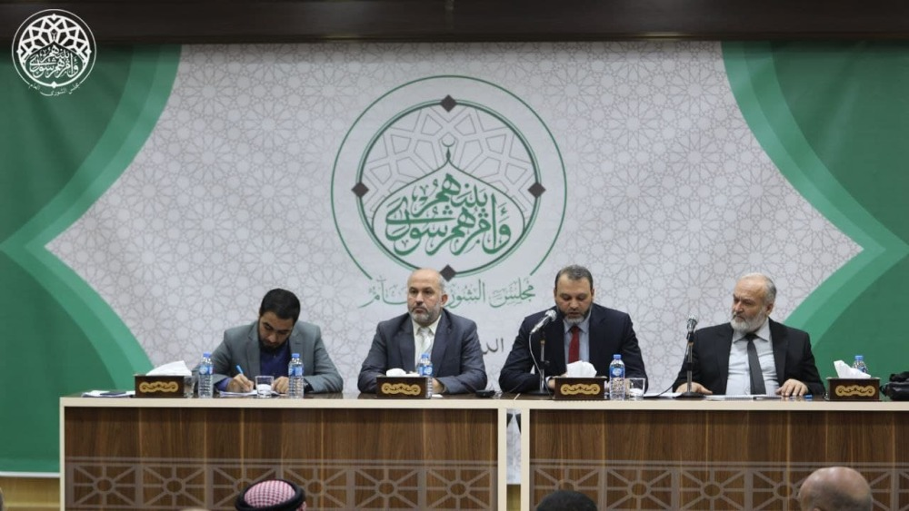
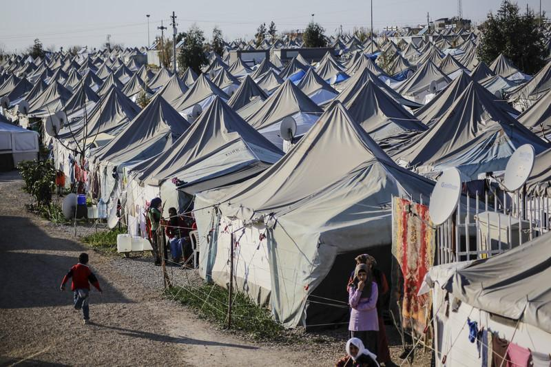
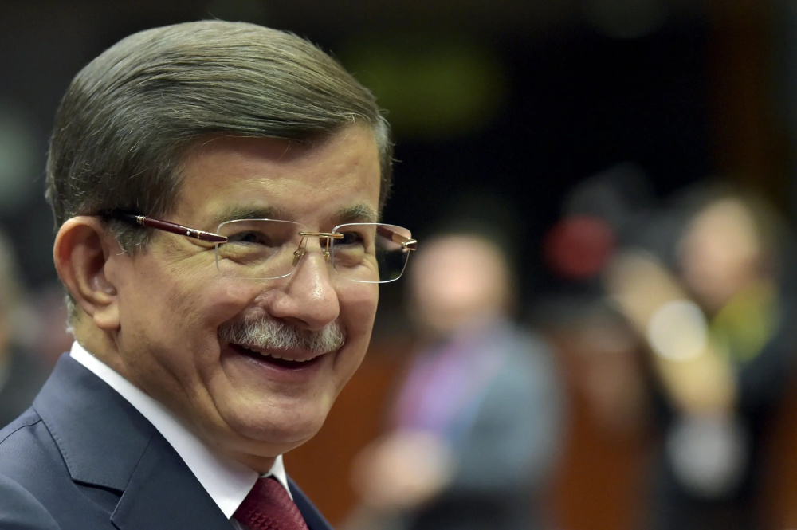
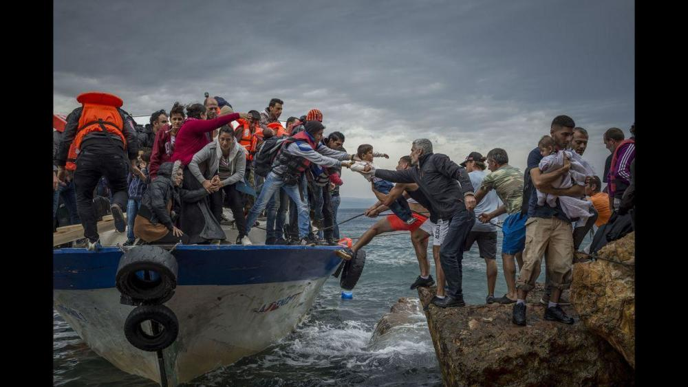
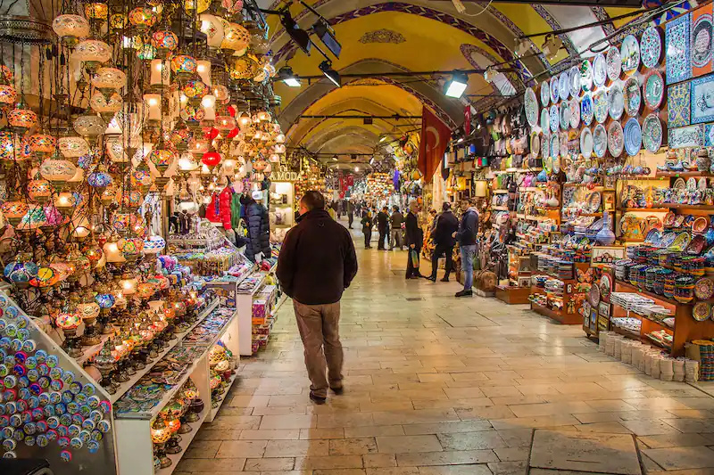
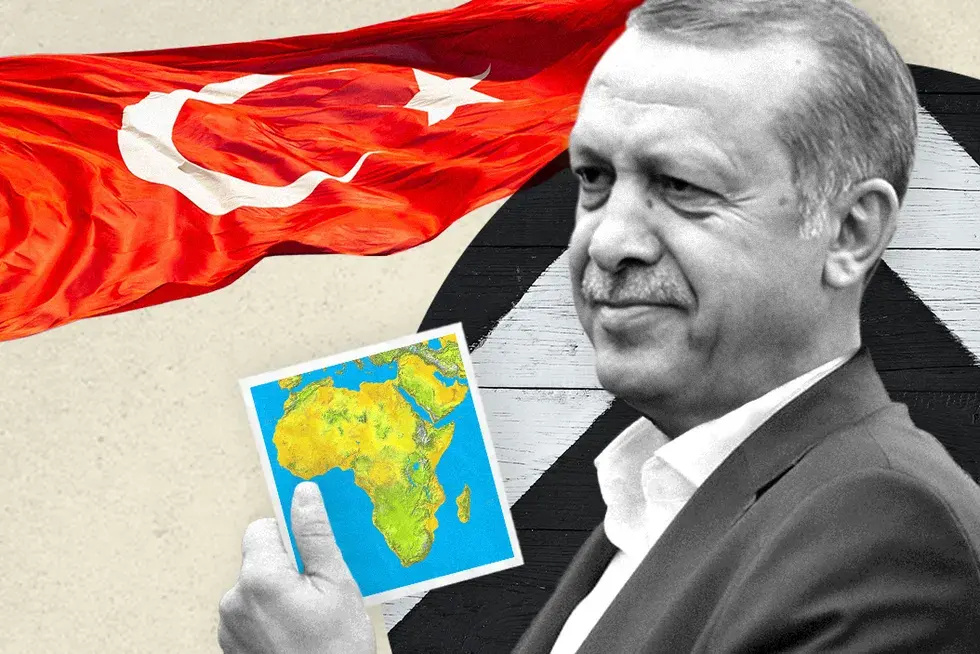
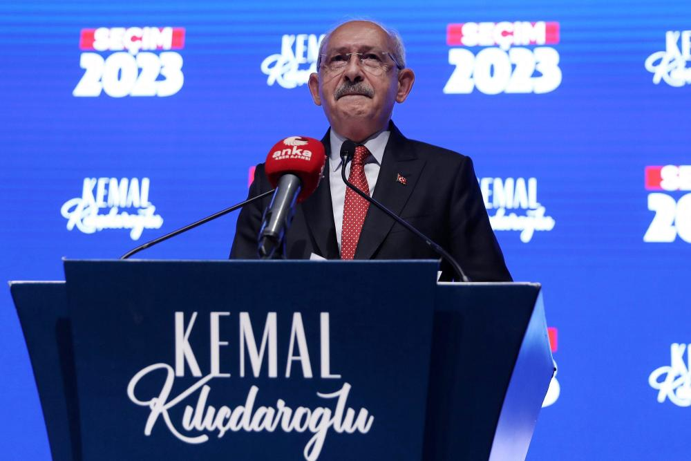

# 埃尔多安带领土耳其走向何方？不靠东方，不选西方，坐上大国博弈牌桌

**文/程靖**

**编辑/漆菲**

“克勒奇达尔奥卢不是土耳其人。他是土耳其的叛徒和西方的代理人。土耳其会在他手里终结。”这是土耳其大选前，现任总统埃尔多安对反对党候选人克勒奇达尔奥卢最典型的一句辱骂。他甚至还在一场集会上把话筒递给一个10岁孩子，让他称后者是个“叛徒”。

_2022年1月，埃尔多安在一次集会上把话筒递给一个10岁孩子，后者称共和人民党党首克勒奇达尔奥卢是“叛徒”。_

如此不遗余力攻讦对手，埃尔多安的目的只有一个，就是在2023年大选中获得连任。最终他赢了。当地时间5月28日深夜，根据土最高选举委员会对99.43%票箱的计票结果，埃尔多安赢得52.14%的选票，反对党阵营“民族联盟”候选人克勒奇达尔奥卢获得47.86%的选票。

埃尔多安当晚发表讲话感谢选民支持，表示不会辜负支持者的信任。他同时承诺，为土耳其下一个建国100周年而努力工作。

_5月28日，土耳其安卡拉，埃尔多安宣布胜选。_

按照他和正义与发展党（AKP，下称“正发党”）的设想，2023年是“土耳其世纪”的开端：100年前，穆斯塔法·凯末尔带领土耳其人赢得抵抗协约国的独立战争，现代土耳其于奥斯曼帝国的废墟上破土新生；100年后，当土耳其共和国进入建国后第二个世纪时，将在政治、经济、科技、军事和外交方面成为世界上最强大的十个国家之一，并给世界每一个角落带去“民主、发展、和平与福祉”。

埃尔多安掌权的20年，恰好是土耳其经济腾飞、国际地位跃升的20年，在国际事务上与美俄等传统强国平起平坐。他将自己视为带领土耳其开启新世纪的不二人选。但埃尔多安的强势也极具颠覆性：他让土耳其偏离了建国以来亲西方的外交路线，在中东推行激进民族主义外交政策，影响到叙利亚、利比亚等国数百万人的生活，其溢出效应同样冲击了土耳其国内政治，反对党因此提出与之南辕北辙的主张。

在反对党联盟的强势冲击下，2023年大选被外界称为土耳其建国百年之际的“路线公投”。克勒奇达尔奥卢曾承诺，他若上台，将恢复民主和法治，因为这两者将有助于土耳其重启与欧盟的谈判。他希望恢复美国和欧洲对土耳其的信任，加深与北约的同盟关系，并在俄乌问题上维持平衡立场。埃尔多安则提出，要努力缓和与地区邻国的紧张关系，发展以土耳其为核心的盟友。

作为世界20大经济体之一和北约盟国，土耳其大选的影响远超该国边界，受到全球瞩目。埃尔多安的下一个五年，将带领土耳其走向何处？

_2023年大选被外界称为土耳其建国百年之际的“路线公投”。_

“他一直在保护伊德利卜”

谈到埃尔多安在大选中的对头克勒奇达尔奥卢时，叙利亚人纳赛尔（Mohammed
Nasser）连名字都念不清，总是含混着念成“克勒多卢”，他还把“埃尔多安”念成“埃尔多甘”。但最近一个月，当地社交媒体全是土耳其大选的新闻，纳赛尔和朋友们聊天时，内容也主要是关于这两位总统候选人的。

纳赛尔来自叙利亚西北部伊德利卜省达纳市（Al
Dana），是一所私立学校的英语老师。他不是土耳其公民，自然没有投票权，但他告诉《凤凰周刊》，自己和身边的叙利亚朋友们都希望埃尔多安获胜。

虽然人在叙利亚，纳赛尔的生活中处处是土耳其的痕迹。叙利亚内战爆发至今，伊德利卜省所在的西北部仍被多个反对派武装团体占据，人员和物资无法与政府军控制区流通。连年交战破坏了基础设施，当地许多居民只能依赖人道主义援助过活。然而，援助物资只能从北边的土耳其——通过两地间唯一的过境点巴布·哈瓦（Bab
al-Hawa）来到这里。

_2019年的伊德利卜。_

达纳市所在的伊德利卜省，则由“叙利亚救世军政府”（SSG）所管辖。它是叛军团体“沙姆解放组织”（HTS）组建的民事机构，后者被土耳其认定为恐怖组织。

但从2020年6月起，“救世军政府”宣布弃用叙利亚镑，将流通货币改为土耳其里拉，声称是为了维持当地居民的购买力、应对美国制裁下叙镑大幅贬值。除了日常生活物资，当地连维持社会运转的油气、电力也均从土耳其进口。

只不过，用里拉购买的来自土耳其的物资，物价也跟随土耳其国内经济状况而浮动。纳赛尔直言，伊德利卜的生活严重依赖土耳其，这让他有一丝陌生感，“改用土耳其里拉后，我对钱没了概念，以前觉得贵的东西，现在随手就买了，导致根本存不下什么钱”。

土耳其似乎乐见于此——不仅默许“救世军政府”的存在，甚至会干涉后者和叙利亚政府的接触，从而不让两边开通新的过境点。生活在反对派武装盘踞的地区，纳赛尔身边支持叙政府的人不多，但他会想，如果叙总统巴沙尔·阿萨德拥有无边的意志，他早能收复全部国土了，“恰恰是因为土耳其不允许，所以他做不到”。

_2021年11月，“救世军政府”经济部门召开新闻发布会。_

纳赛尔口中的“土耳其”，指的是埃尔多安和正发党十几年来的对叙政策。起先，土耳其积极扶持叙“自由军”等反对派，竭力推翻阿萨德政府。但从2016年8月起，土耳其派出地面部队直接介入战事，在叙北部发起四次军事行动，不仅占领叙北部省份阿夫林，还在土叙边境建立“安全区”，军事打击“伊斯兰国”和叙利亚库尔德民兵。

连年战乱，使得数百万叙利亚人越境进入土耳其，如今登记在册的360万叙利亚难民大多生活在土叙边境城镇，以及伊斯坦布尔等大城市。叙利亚人的涌入，使土耳其人口增加了5%，一些地区的人口结构由此改变，当地租房和劳动力市场也受到冲击。

近年来土耳其经济不景气，反难民和种族歧视现象愈演愈烈。是否要把叙利亚难民“送回家”，成了土耳其政坛博弈的核心话题之一。5月14日总统选举首轮结束后，得票率暂时落后的克勒奇达尔奥卢重申，一旦他上台，会立刻把所有叙利亚难民送回国。

纳赛尔直言，如果要遣返难民，就要先和叙利亚政府恢复关系，这也意味着会把伊德利卜“交出去”；而若“救世军政府”不同意，土方可以直接掐断运输物资的通道，“那样我们就会‘窒息’而死”。他感叹道，“相比之下，埃尔多安一直在保护伊德利卜。”

在遣返难民问题上，埃尔多安的表态则较为温和。他此前表示，计划在叙利亚北部重新安置100万因战争逃离祖国的叙利亚难民。“迄今为止，我们已让近 60
万人以自愿的方式回到叙利亚境内的安全地区。通过正在与卡塔尔开展的一项新的重新安置项目，我们确保，未来几年将有100 万人重返家园。”他说。

_土耳其境内的一座叙利亚难民营。_

对库尔德人穷追不舍

沿着土叙边境向东行驶500公里，抵达土耳其、叙利亚和伊拉克三国交界的库尔德人聚居地，又是一个完全不同的世界。

当地库尔德人担心，若埃尔多安成功连任总统，可能会对叙东北部发起新一轮攻势。法哈德（化名）来自叙东北部哈塞克省的的边境城市塞雷卡尼耶（Sere
Kaniye）。2012年以来，这座小城两次遭遇大规模攻击，分别来自伊斯兰激进武装团体“努斯拉阵线”和土耳其。他于2019年逃离家乡，带着家人辗转两座城市，最终落脚在同省省会卡米什利（Qamishli）。

自20世纪初奥斯曼帝国崩溃、土耳其和叙利亚各自建国以来，两国在领土和资源上有过诸多摩擦，但其中最大的“定时炸弹”，非库尔德人问题莫属。

上世纪80年代起，时任叙利亚总统哈菲兹·阿萨德为制衡土耳其，为土库尔德工人党（PKK）领导人奥贾兰及其追随者提供庇护，并默许后者在土叙边境发展壮大。2002年埃尔多安和正发党上台后，积极和库尔德人修复关系，结束了土东南部长达15年的紧急状态，还在国内开设库尔德语广播，一定程度上承认了库尔德人的文化和政治地位。

但随着叙利亚内战爆发，各方艰难维持的力量平衡被打破。2011年7月，叙利亚北部库尔德人组建“人民保护部队”（YPG）以求自保。2012年11月，“努斯拉阵线”包围塞雷卡尼耶，和当地守卫的叙政府军交火。

_叙利亚库尔德“人民保护部队”女兵。_

法哈德向《凤凰周刊》回忆说，战事打响后，边境上的土耳其军人宣布开放国境，欢迎叙利亚平民前去避难。他抵达土耳其后发现，当地难民营半年前就已建好，这让他忍不住怀疑“努斯拉阵线”的攻击是提前部署的。

另有媒体报道，战争初期西方情报曾指责土耳其为“努斯拉阵线”提供后勤和医疗支持，在西方盟友的压力下，土耳其于2014年将后者认定为恐怖组织。

法哈德在土耳其难民营停留了20天后决定回家。随着战事持续，塞雷卡尼耶的叙政府军不是被歼灭，就是被前来营救的援军接走，最终由成立仅一年多的“人民保护部队”承担战斗任务。

艰难守城8个月后，“人民保护部队”宣布解放塞雷卡尼耶，但“努斯拉阵线”前脚刚离开，“伊斯兰国”又来了。面对极端组织的威胁，2015年7月起，“人民保护部队”和一些叙反对派组成“叙利亚民主军”（SDF），在美国的空中支援下抗击“伊斯兰国”，逐步取得叙北部大片领土的控制权。

眼看着边境另一侧的库尔德人势力壮大，土耳其坐不住了：土方认为“人民保护部队”是库尔德工人党在叙利亚的分支，会威胁其国家安全。

库尔德工人党成立于上世纪70年代末，自1984年开始，寻求通过武力在土耳其与伊拉克、伊朗、叙利亚交界地带的库尔德人聚居区建立独立国家，被土耳其、美国及欧盟列为恐怖组织。

2019年春天起，法哈德就听说土耳其会攻打叙利亚北部。10月的一个下午，土耳其发起“和平之泉”军事行动，炮火直抵塞雷卡尼耶。法哈德带着孩子和怀孕的妻子迅速逃离，“当时，我满脑子都在担心妻子会不会受伤。除了证件、钱，我们什么都没带。”

_2019年11月，卡米什利遭遇连环爆炸事件，致6人死亡，22人受伤。_

法哈德一家在卡米什利落脚后不久，土耳其军队在边境上建立了数十公里宽的“安全区”，他的家乡塞雷卡尼耶则被土耳其支持的“叙利亚国民军”（SNA）占领。土耳其的这次军事行动招致国际社会谴责，包括芬兰、瑞典在内的一些国家禁止对土耳其军售。

直到现在，法哈德的紧张情绪依旧无法消除：“我害怕的是，哪一天走在路上，身边的汽车突然就爆炸了。”对于土耳其“维护国家安全”的说法，法哈德完全不认可：“2022年9月，卡米什利工业区一个12岁孩子被炸死了。但土耳其人说，他们攻击的是库尔德士兵。”

埃尔多安自2022年6月确认参选总统后，就一再表示要向叙北部发起第五次军事行动。即便今年2月发生大地震，给土叙边境带来重创，土耳其仍在向叙利亚和伊拉克一侧的库尔德武装开火。

法哈德所在的叙东北部，2016年3月宣布成立联邦制自治政权“北叙利亚民主联邦”，但未被叙政府承认。因此他认为，叙利亚的“终局之战”很可能会发生在政府军与库尔德人之间。他知道，若土耳其再次挥兵叙利亚北部，自己将无处可去——他的家乡已被占领，而他作为库尔德人，不愿进入叙政府控制区，否则尚未服兵役的他将被征召入伍，未来可能要攻打自己的同胞。

近年来，埃尔多安在邻国领土上合纵连横，搅动着纳赛尔和法哈德等人的生活与命运。但这些人从来都不是他的真正目标。卡内基欧洲研究中心欧盟—中东事务资深研究员西卡迪（Francesco
Siccardi）曾撰文称，自2016年以来，土耳其每次打击库尔德人，或越境攻打叙利亚，都恰逢土耳其举行重要选举，包括2017年修宪公投、2018年总统和议会大选，以及2019年的市政选举。

也就是说，埃尔多安每一次“重拳出击”，驱动力都来自国内政治形势，并且都成功帮助他和正发党保住了权力。

与欧美渐行渐远？

破土于奥斯曼帝国废墟之中的土耳其共和国，自建国以来就在国父凯末尔的带领下全盘西化、拥抱西方。1963年，土耳其成为欧盟前身欧共体（EEC）的联系国，在此基础上形成后来的土耳其—欧盟关税同盟。1987年，土耳其申请加入欧盟，但到2005年才启动入盟谈判。为了实现“加入欧盟”这一基本国策，埃尔多安2003年当选总理后，开始了艰难的经济和政治改革。

长期以来，土耳其的世俗主义精英都将自己视为欧洲的一部分。埃尔多安的昔日盟友、曾担任土耳其总理的达武特奥卢（Ahmet
Davutoğlu）2011年向美国《纽约时报》提到“土耳其转向东方”的论调对土耳其来说是一种侮辱。他说，土耳其应与西方国家一样，是国际关系中的“主体”而非“客体”，土耳其不希望被国际社会视为一种亟待解决的“危机”，而应是能解决危机的“国际社会中的一员”。

_土耳其前总理达武特奥卢。_

彼时的土耳其是一个正在崛起的新兴大国。2008年起席卷全球的金融危机，土耳其平稳渡过，到2010年时以接近8%的经济增长率瞩目全球，被外界评为“中东地区唯一正在面向未来的国家”。如此成功的叙事，也为埃尔多安后来提出“土耳其世纪”的宏大计划提供了充足的想象空间。

然而，埃尔多安早就意识到，土耳其对欧盟的热忱不太可能得到回应。毕竟，双方有着宗教和文化的差异，土耳其与欧盟成员国希腊和塞浦路斯存在历史纠葛，埃尔多安执政以来土耳其的威权倾向，以及库尔德人问题等，全是欧盟将其拒之门外的理由。

2010年，埃尔多安对欧盟迟迟不愿接纳土耳其表示不满，“如果你们不想要我们，就明确说出来，不要浪费时间”。两年后，在德国访问的埃尔多安被问到能否在2023年（也就是土耳其建国100周年时）正式加入欧盟，他带着警告意味地回答，“他们应该不会拖那么久，但如果真的拖到那时，欧盟将面临损失，至少将会失去土耳其。”

同年年底，革命浪潮从突尼斯开始，席卷整个中东北非地区。许多反对阿拉伯旧体制的年轻人羡慕土耳其的经济增长和现代化模式，将埃尔多安视为伊斯兰世界理想的领导人。那时的土耳其似乎不再需要欧盟了：2012年的一份民调显示，53%的土耳其人对欧盟印象不佳；只有44%的民众认为加入欧盟对经济有利；大多数人认为，就国家利益而言，土耳其转向亚洲更重要。

从那时起，埃尔多安发现了实现大国崛起的另一条路径：他先是公开支持突尼斯、埃及民众推翻强权，再支持利比亚反对派，接着与叙利亚断绝外交关系、积极扶持叙反对派以推翻阿萨德政府。至此，埃尔多安上台时推行的“睦邻无问题”外交政策宣告结束。

不过，也有人用“先赢后输”来总结“阿拉伯之春”期间土耳其的境遇：周边国家政局和战事发展超出了土耳其的预期，土耳其最先支持的埃及穆兄会政权很快被军政府取代；阿拉伯人的民主意识鼓舞了土耳其的库尔德人，加剧了后者的分裂倾向，努力多年的和平进程化为泡影；大量叙利亚难民涌入，给经济下行的土耳其带来沉重负担，极端组织也借机在土境内发动恐怖袭击，还让土耳其与欧盟的关系变得更加复杂。

据联合国数据，自2011年到2015年初，超过170万叙利亚难民抵达土耳其。但许多人并没有把土耳其当作最终目的地，而是为了前往欧洲。由于接纳难民成本高昂，土耳其从自身利益出发，默许难民向西偷渡的行为。在“难民危机”达到峰值的2015年，抵达欧洲的难民超过100万人，其中八成是从土耳其海岸出发，渡过爱琴海抵达希腊。

_难民危机达到高峰的2015年，有超过100万人渡过爱琴海和地中海抵达欧洲。_

由此，欧盟与土耳其摩擦不断：前者要求后者将难民拦在欧盟边境之外；后者则要求前者共同承担收容难民的责任。2016年3月，双方达成历史性的《欧盟—土耳其难民协议》，欧盟承诺分批给予土耳其60亿欧元，以帮助后者在境内安置难民，同时要求土耳其封锁边境；土耳其则要求欧盟给予土国民赴欧免签，并尽快同意土耳其加入欧盟。时任比利时首相米歇尔（Charles
Michel）抱怨说，土耳其提出了很多要求，“显示出敲诈的性质”。

让法哈德一家逃离家乡的“和平之泉”军事行动，使得叙利亚北部超过30万人流离失所。埃尔多安不久后访问匈牙利，但他对匈牙利民众的抗议无动于衷，反而呼吁欧盟为土耳其在土叙边境创建的“安全区”给予财政支持。他再一次“挟难民以令欧盟”称，如果土耳其接纳的难民超出一定限度，就不得不“开闸”，放任其涌入欧洲。

2020年，土耳其和希腊在地中海油气资源勘探问题上再起争端，引发整个欧盟与之对抗。2021年5月，欧洲议会投票通过一项提议，旨在暂停土耳其加入欧盟的谈判，并呼吁土耳其改变在法治等方面的方针，作为该国加入欧盟的先决条件。这份提议言辞激烈，称土耳其政府“越来越背离欧盟的价值观和标准”。

不光与欧盟嫌隙丛生，土耳其与美国和北约的关系也屡遭考验。美国外交政策委员会（CFR）认为，冷战期间美国与土耳其的统一战线掩盖了双方的矛盾，冷战结束后，因没有共同的敌人更没有共同利益，两国关系渐行渐远，如今“既不算朋友，也不是敌人”。

美国中东研究所（MEI）土耳其项目创始主任古努·托尔（Gönül
Tol）指出，埃尔多安成功将土耳其从一个“制度化的民主国家”转变为一个权力高度集中的国家，但和沙特、埃及等强人统治的国家不同，与土耳其打交道并不意味着与他一个人打交道，而是要面对他的个人权威和土耳其国内反美舆论的双重力量。

托尔认为，如今土耳其军队中支持北约的派系逐渐遭到清洗，军队变得偏向极右翼。另一方面，在叙利亚，美国支持库尔德武装，土耳其支持与“基地”组织关联的激进团体（例如“努斯拉阵线”及其延伸出的团体），由此也产生了冲突。

美土关系中的龃龉远不止这些。例如，美国指责土耳其试图通过国有银行替伊朗规避制裁，土耳其认为美国“包庇”涉嫌策划2016年政变的反对派宗教人士居伦。2020年，因土耳其购买了和北约系统不兼容的俄罗斯S-400导弹防御系统，美国宣布对土耳其实施制裁，并将后者从联合制造F-35战机的项目中除名。美国外交政策委员会认为，这都是土耳其作为美国和北约伙伴“不太可靠”的体现。

当埃尔多安宣布胜选后，美国总统拜登和英国首相苏纳克都在推特上向他表示祝贺。拜登写道，“身为北约盟国，我期待在双边议题和共同的全球挑战上一起继续努力。”苏纳克的说法与此类似。他表示，期待“继续我们两国之间强有力的合作，从发展贸易到应对安全威胁。”北约秘书长斯托尔滕贝格和欧盟委员会主席冯德莱恩也表示祝贺，期待继续发展同土耳其的关系。

不在东西方之间做选择

西方国家一度担心土耳其要“倒向”俄罗斯和中国。土耳其右翼爱国党（Vatan Party）主席佩林切克（Doğu
Perinçek）今年2月接受《凤凰周刊》专访时直言，土耳其、中国、俄罗斯和伊朗，是挑战美国作为全球化霸主地位的伙伴。熟悉土耳其外交政策的人士告诉《凤凰周刊》，爱国党和正发党关系密切，也是土耳其对华关系中重要的联络者。

2015年，土耳其加入“一带一路”倡议，在核能和燃煤发电厂等基建项目上获得了中国投资。自土耳其出现经济危机后，中国向其提供了数十亿的紧急贷款。2020年中土两国庆祝建交50年之际，土耳其驻华大使奥宁说，“我们认为土中外交关系不仅是政府间的关系，而且是作为亚洲最西端和最东端门户的两个古老文明之间不可或缺的交流。”

不过，土耳其安卡拉大学政治学院教授塞壬（Seriye
Sezen）对《凤凰周刊》分析称，2010年土中关系上升为“战略合作级别”，当时定下的贸易目标——贸易额2015年达到500亿美元、2020年达到1000亿美元——至今仍未达到，土耳其的贸易逆差却在不断飙升：中国官方数据显示，2022年两国贸易额为385.5亿美元，其中中国出口额340.3亿美元。其中一个背景是，土耳其作为能源进口大国，贸易长年呈现逆差。因俄乌战事以来的能源价格上涨，2022年土耳其贸易逆差屡创新高。

_土耳其伊斯坦布尔的大巴扎。_

塞壬提到，土耳其在中国全球投资和“一带一路”倡议中所占份额也低于预期。她认为，未来土中两国可以在大规模基础设施投资、可再生能源、电信和科技领域开展更多合作，促进以高附加值、高新技术和技术转让为基础的投资，从而帮助土耳其走出经济困境。

土耳其与俄罗斯的关系则更为复杂。近年来，土耳其在能源和旅游业上都相当依赖俄罗斯，但在利比亚内战、叙利亚战争、2020年的纳卡冲突中，土俄两国分别支持敌对两方。2015年11月，俄罗斯一架苏-24M战斗轰炸机在土叙边境被土耳其军队击落，其中一名飞行员在弹射逃生中身亡。俄方立刻对土耳其发起制裁，两国关系降至冰点，埃尔多安则向俄方道歉。

2016年，时任俄罗斯驻土大使安德烈·卡尔洛夫被一位土耳其警察枪杀，两国却因“打击恐怖主义”的共同愿景，意外拉近了关系。到2019年土耳其购买俄罗斯武器时，两国又重新亲密了起来。

_2016年12月，俄罗斯驻土大使在出席一次活动时遇刺。_

2022年乌克兰危机爆发以来，土耳其尽力在俄乌之间维持平衡，一方面对西方在联合国谴责俄罗斯的动议表示赞成，并为乌克兰提供无人机、集束弹药和电子战系统；另一方面却不参与西方的对俄制裁，可谓“左右逢源”到了极致。战争期间，埃尔多安多次在伊斯坦布尔接待俄乌双方的和谈代表，还促成《黑海粮食协议》的达成，让被困乌克兰港口的谷物通过海上人道主义走廊，重新运向世界。

埃尔多安的长袖善舞背后有诸多现实考量。沙俄与奥斯曼帝国之间的血腥战争曾跨越几个世纪，俄罗斯自始至终是盘踞黑海北方的强邻。近十年里土耳其经济增长缓慢，埃尔多安需要保持俄罗斯的能源进口、维持住每年数百万赴土观光和消费的俄罗斯游客及侨民，才能保证国内经济不进一步滑坡。

时隔多年，埃尔多安昔日盟友达武特奥卢的宏愿——“让土耳其成为国际关系的主体而非客体”，在国际舞台上得到回响。土耳其是唯一一个加入北约的伊斯兰国家，也是第一个被指定为海湾合作委员会战略伙伴的非海湾国家。2015年，它与中国签署关于对接“一带一路”倡议同土耳其“中间走廊”的谅解备忘录。

2022年9月上合峰会期间，埃尔多安在一次非正式聚会上的照片引发全球热议。照片中他坐在“C位”，身边是阿塞拜疆总统阿利耶夫、塔吉克斯坦总统拉赫蒙、俄罗斯总统普京和白俄罗斯总统卢卡申科。最引人瞩目的，普京将两只手叠放在一起，眼睛专注地望向埃尔多安。

_2022年9月上合峰会期间的一次非正式聚会，埃尔多安坐在“C位”滔滔不绝地对其他国家领导人说话。_

5月14日大选首轮投票前，家住土耳其南部城市阿达纳的艾哈迈德·厄塞图尔基（Ahmet
Özeltürkay）驱车近2000公里前往伊斯坦布尔，接上父母后再驱车返回，就是为了给克勒奇达尔奥卢投票。

艾哈迈德在阿达纳经营一家汽车配件公司，他告诉《凤凰周刊》，这届大选是土耳其“挽救民主制度的最后一次机会”。他早就不满埃尔多安的威权作风，希望反对派能将土耳其打造为一个“司法是司法、经济是经济”的国家。

而在埃尔多安和正发党推行的诸多政策中，艾哈迈德唯独赞赏其外交上的举措——除了能打击叙利亚北部的“恐怖分子”外，埃尔多安还将土耳其影响力拓展至非洲，这给他的公司增加了不少非洲客户。

《非洲商业》（African
Business）杂志提到，埃尔多安执政20年来，土耳其与非洲的贸易额已增长4倍以上；2009年到2021年之间，埃尔多安访问了27个非洲国家，比任何一个非洲以外领导人都多。文章称，他正在把土耳其打造成一个“非洲—欧亚国家”。

_执政20年来，埃尔多安积极在非洲拓展伙伴关系。_

谈到大选后的外交政策时，不少专家指出，无论谁上台，土耳其的外交大方向或许会在东西方之间有所侧重，但绝不会回到过去全面倒向西方的可能。政治学者塞壬对《凤凰周刊》分析称，埃尔多安曾多次表示要加入上海合作组织（SCO），但这不意味着他会在东西方之间做出选择，其外交政策仍将从国家利益出发而制定。

针对反对党候选人克勒奇达尔奥卢“重返欧盟、恢复西方信心”的主张，来自叙利亚大马士革大学政治系的土耳其学者迈迈提·尤瓦（Mehmet
Yuva）向《凤凰周刊》指出，土耳其已在欧盟门口徘徊了50多年，这年头无论谁提到欧盟，都只是一种选举策略，“土耳其是一个穆斯林为主的国家，加入欧盟会极大改变欧盟内部的力量平衡。因此无论土耳其反对什么、跟随什么，欧盟都绝不可能接纳土耳其。”

_5月28日，克勒奇达尔奥卢在安卡拉的共和人民党总部发表讲话。_

他同样不认同土耳其加入欧盟的必要性：“土耳其的经济体量更大、更健全，和常年经历债务危机的‘欧猪四国’（葡萄牙、意大利、希腊和西班牙）相比，土耳其要是加入欧盟，真不知道谁是谁的负担。”

在尤瓦看来，克勒奇达尔奥卢犯了战略性错误。“埃尔多安2002年上台前，获得过西方政府和国际财团的支持。如今反对派仍然相信这些国际力量的作用，但事实上，西方对土耳其政局的影响力早就没有20年前那么大了。”他直言，这也给了埃尔多安机会，可以攻击对手“通过出卖国家利益以换取西方支持”。

土耳其《每日晨报》形容，随着西方力量的衰减，土耳其在原奥斯曼帝国土地上开始变得愈发重要，成为中东、北非和巴尔干地区的“游戏规则改变者”。专注中东的政治风险管理公司“国际利益”董事总经理萨米·哈姆迪（Sami
Hamdi）因此表示，埃尔多安的外交政策仍会是奥斯曼帝国政治遗产的延续，即提升在穆斯林世界的软实力。

亦有观点认为，无论埃尔多安是否当选，土耳其都将进入“后埃尔多安时代”，不再有连任需求的他会软化自己的激进立场，寻求“软着陆”。但塞壬认为，由于埃尔多安常常在政策上“急转弯”，目前还很难预测他是否会改变立场。

