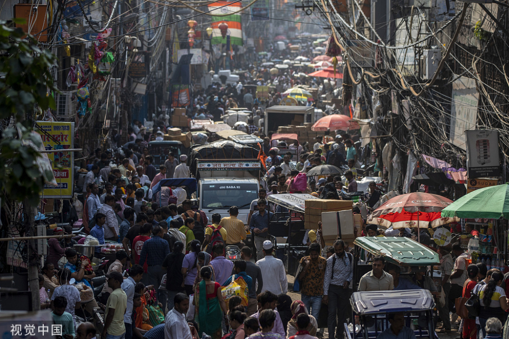

# 就业形势异常严峻！印度“经济奇迹”背后藏“定时炸弹”

【环球时报特约记者刘皓然】新议会大厦揭幕、GDP预期增速“破6近7”、首超中国成为第一人口大国……近日，印度以一系列的积极信号站上了全球瞩目的“C位”。种种迹象表明该国经济建设向快向好发展，“经济奇迹”一词俨然成为舆论热点。然而近日，美国有线电视新闻网（CNN）对印度青年人进行了一项随机采访，结果发现，在民生层面，就业难等尖锐问题始终严重困扰着印度社会生活，即将成为国家经济建设主力军的青年人群备感迷茫。

_资料图_

**求职难，硕士生做清洁工**

据CNN27日报道，28岁的苏尼尔·库马尔来自印度哈里亚纳邦，自幼坚信“读书改变命运”，现已拿下硕士学位。然而，他的工作却是一名清洁工，在某乡村学校拖了5年的地板。加上给学生补习的一份兼职，他每月收入仅85美元（约合600元人民币）。他愤愤不平地表示：“读了这么多书却没有一份像样的工作，我很生气。这是政府的问题，他们应该为民众创造更多工作机会。”

CNN称，库马尔的遭遇仅仅是印度千百万青年人的缩影。与一些面临老龄化问题的国家不同，印度人口整体相对年轻，适龄劳动者未来10年有望突破10亿，无论是劳动市场还是消费市场均潜藏着巨大能量。但在美好愿景的背后，却是居高不下的失业率。智库机构“印度经济监测中心”数据显示，截至2022年12月，全印度25岁以下人口占国家总人口40%，但这个庞大群体中有高达45.8%的人没有工作。专家警告，如此规模的失业水平就如同一枚“定时炸弹”，随时可能引发社会动荡。

**竞争激烈，出路在国外？**

CNN表示，不少印度青年自幼面临激烈竞争，一些印度家庭花高额学费供孩子读书。然而毕业后，他们仍要面临“千军万马过独木桥”的竞争场面。作为百万“考公”大军中的一员，28岁的阿格瓦尔考了4年仍然无果，按他的话说，备考的费用已“够买三四台车”。某公务员考试辅导机构负责人称，印度公务员录取比例还不到申请总数的1%。随着人口的增加，竞争只会越发激烈。

其他热门就业领域也不容乐观。据世界报业辛迪加网站报道，以工作相对稳定的铁路单位为例，2019年全印度有1250万人竞争铁路公司3.5万个岗位，平均每个岗位的申请人数达357人。2022年1月，铁路部门宣称停止社会招聘，大失所望的申请者发起了一场暴动。印度农业领域吸纳了全国约45%的劳动力，这样的高负荷导致行业内不充分就业问题突出，内卷严重。数据显示，在2022年，印度平均每天约30名农民迫于压力而自杀。

糟糕的就业形势也在倒逼印度人才外流。《卫报》26日报道，印度留学生人数逐年递增10%左右，去年留学人数达77万，其中14万人去了英国。据英国国家统计署披露，该国去年高达1/4的签证都发给了印度人，其中留学生占一半。留英学生尤贝罗伊表示，在英国工作是她留学的主要目标，因为在印度根本找不到合适的岗位。

**“纸面繁荣”掩盖现存弊端**

近日，美国高盛集团提高了对印度经济增长的预期，预计该国2023年的国内生产总值增幅将达到6.3%，高于去年的6%。还有一些市场分析公司认为该国的GDP增速将达6.8%至7%之间。不过对于这样的高增长预期，印度国内一些媒体持保留态度。印度《德干先驱报》称，印度目前仍处在高度贫穷状态，社会的不平等会长期对国家经济与政治形成负面影响，并导致投资的减少和失业率的上升，形成恶性循环。尤为讽刺的是，印度政府还曾试图在统计数据上大做文章，被该报戏称“从现实上消灭不了贫穷，就从数字上消灭贫穷”。

香港《南华早报》近日撰文称，媒体舆论对印度所谓“黄金时代”的过度宣传更像是某种“数字游戏”，很容易掩盖真正的社会问题。该报表示，金融机构对印度经济的增长预期很大程度上是基于新冠疫情经济衰退后的反弹，对印度“经济繁荣”进行过度描绘，其本质上只是为糟糕的经济现状套上了一个美好的愿景。如今，严峻的就业现状只会让印度的“人口红利”变为“人口负担”。该报称，未来10年印度需要创造2亿个就业岗位来消化庞大的就业人群，几乎是“不可能完成的挑战”。

