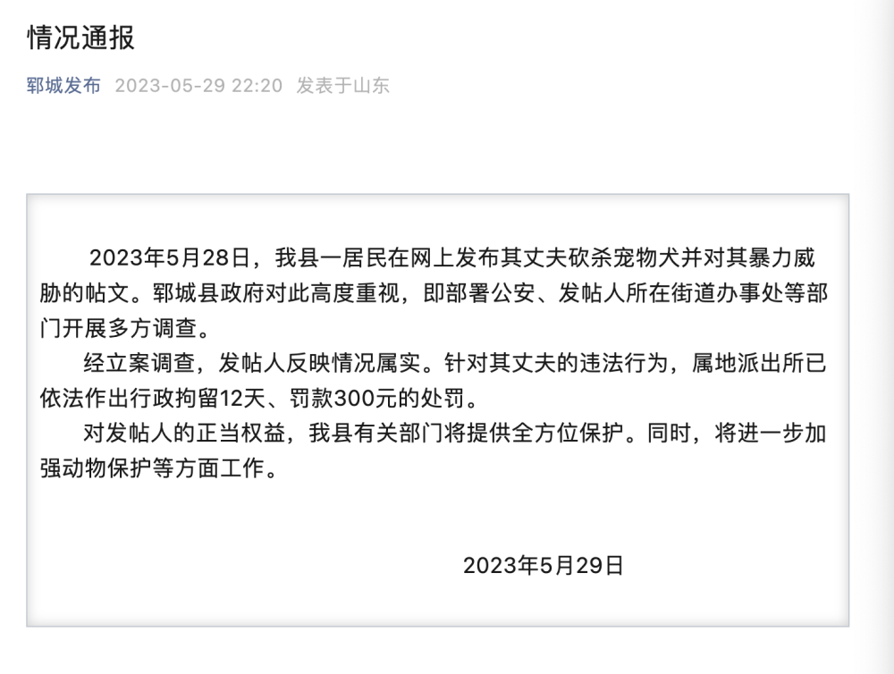

# 山东郓城通报“柯基被砍”事件：涉事男子行拘12天、罚款300元

据“郓城发布”，5月29日，郓城县政府发布情况通报。内容如下：

2023年5月28日，我县一居民在网上发布其丈夫砍杀宠物犬并对其暴力威胁的帖文。郓城县政府对此高度重视，即部署公安、发帖人所在街道办事处等部门开展多方调查。

经立案调查，发帖人反映情况属实。针对其丈夫的违法行为，属地派出所已依法作出行政拘留12天、罚款300元的处罚。

对发帖人的正当权益，我县有关部门将提供全方位保护。同时，将进一步加强动物保护等方面工作。

（郓城发布）

当事人发声

男子砍杀宠物狗并威胁妻子被拘12日，当事女子：婚一定要离

