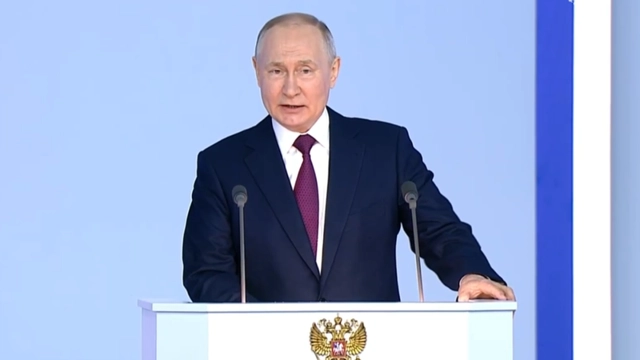

# 快讯！俄媒：普京签令，废止《欧洲常规武装力量条约》

【环球网快讯】综合俄新社、《消息报》等多家俄媒报道，根据俄法律信息网站5月29日发布的相关文件，俄罗斯总统普京签令废止《欧洲常规武装力量条约》。

_普京，资料图_

据媒体此前报道，北约和华约组织1990年签署《欧洲常规武装力量条约》，条约对两大军事集团的各类常规兵器总量、核查方式等作出规定。华约解散和苏联解体后，北约和俄罗斯对条约部分条款作出调整，但北约成员国一直未批准调整后的版本。俄方因此于2007年暂停履行该条约。俄罗斯总统普京本月10日签署命令，委托俄副外长里亚布科夫协助审议俄方废止《欧洲常规武装力量条约》有关事宜的工作。

