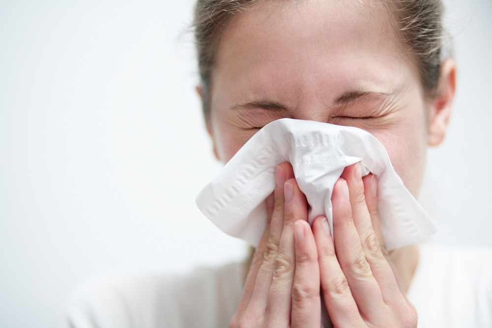
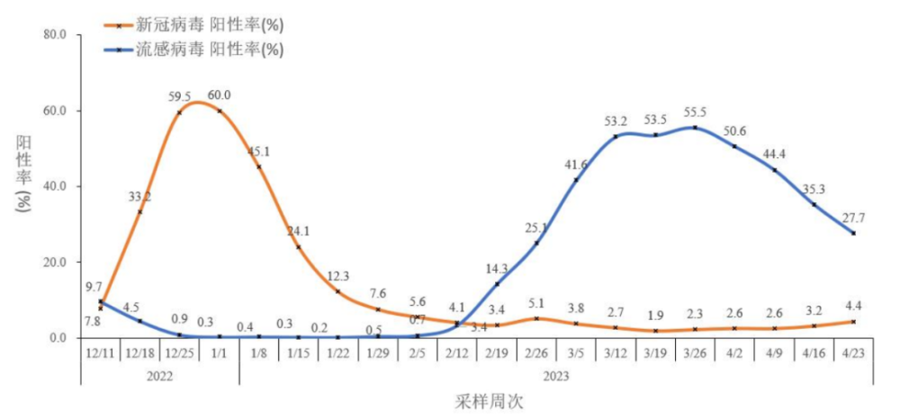

# 新冠感染高峰又至，但人群感染率未知，每过半年就要感染一次吗？

第二波新冠感染高峰来袭。

但人群真实感染率如何？无人知晓。

5月22日钟南山院士表示，根据预测模型，第二波疫情4月中旬起峰，5月底波峰约4000万/周，6月底波峰约6500万/周。不过他也提醒，这是基于模型的计算预测，“可能不准”。

中国疾控中心已经整整一个月没有更新新冠疫情数据，而模型预测又过于专业、遥远。对于普通民众而言，只能通过“身边统计学”，去推测自己所在城市的当下感染情况。

令人不安的消息陆续传来。国际上，新加坡总理李显龙首度确诊，国内呼吸科病房再次满员；首次感染的人在微信朋友圈中陆续晒出“二道杠”，表示自己终于“赶上”；二次感染的人则大多失去晒图的兴趣，只能通过空着的工位来判断其当下的状态。

近半个月来，人群的讨论、搜索引擎上“新冠疫情搜索指数”都在表明，第二波新冠感染高峰正在到来。

只是，社会齿轮并未停转。行业会议高朋满座，同行们抓紧一切机会沟通、交流；演唱会、足球赛如期举行，座无虚席，三年的压抑，使得娱乐成为刚需；高校、医院等人群聚集的地方，第二次感染的工作人员依然坚持上岗。

第二波感染高峰之下，无论新冠有没有变成类似“流感”的疾病，它都似乎已经被社会“流感化”了。

无论轻视还是重视：当人们不再掌握第二波感染数据时，是否意味着这件事不再重要了？未来，新冠是否会像流感一样和人类相生相伴？“重复感染”会有几次，何时是个头？

新冠数据未发布，二次感染高峰“眼见为实”

继大规模群体感染不到半年，新冠病毒再次吸引了所有人的目光。

新冠病毒又开始流行了？看到身边有朋友、同学、家人相继二次感染，在微信朋友圈频繁刷到抗原试剂“二道杠”的图片，很多人发出疑问。

答案是肯定的，医护们的感受更加直接。

据中部城市某三甲医院重症科主任观察，最近一轮ICU收治新冠患者是在5月前后，该患者是此前从未感染过的老人。

在北京，某医院感染科主任严明（化名）感到，新冠患者数量从4月底开始增加，5月份迅速攀升，“我们医院每天就诊上百人，有的大型医院每天就诊两三百人，现在已经是接近高峰的水平”。

在北方某三级医院的呼吸科病房里，4间被划为阳性病房的12张床位，几乎呈接续满员状态。

“患者转阴或者出院了，床位空出来，但很快有新的阳性患者住进去。”科室医生单华（化名）介绍，这几乎是该院目前应对乙类乙管的新冠感染者唯一“特殊”措施——让阳性患者住在一起。

多位医生告诉八点健闻，医院接诊的新冠患者，尤其在新冠住院患者中，以首次感染的老年人为主，甚至可以占到80%。

首次感染对免疫力薄弱的人群而言，依旧伴随挑战，“有大面积肺炎的、单侧肺炎的”，但相比上一次的感染高峰，“动不动两肺全白”，严重程度还是变轻了。

严明收治的二次新冠感染患者里，虽然有人出现了中度肺炎，但至今仍未出现一例重症。“对大部分人来说，第二次感染新冠的疾病严重程度都要轻于第一次”。

“5月初首次感染的患者还多些，现在二次感染的患者正在逐渐增加，”武汉大学人民医院呼吸与危重症科主任医师余昌平认为，“没有感染过的人数相对比较少，绝大部分人都感染过。当下，没有感染的容易感染些，但二次感染患者会逐渐增加。”

医护人员也免不了二次感染新冠。

有人借此机会补上了去年没休的“新冠假”——上一次突如其来的新冠暴发，很多医护一边忍受病痛的痛苦一边继续工作，有医院因此承诺了调休假期，但医护们因为后续的甲流疫情，一直没有休息。

也有的仍需带病上岗，这在护士中尤为明显。

一位北京本地的护士长告诉八点健闻，上次新冠疫情暴发之后，很多外地的护士辞职，几乎医院各个科室都出现了“护士荒”，当下人手不足，大家只能“轻伤不下火线”。

高校也针对此次感染潮作了应对。

据八点健闻了解，有高校要求，抗原检测结果呈两道杠的学生把结果上报给辅导员后，可以自由选择在宿舍自我隔离，或是前往学校的健康驿站单独隔离。然而，本月初有2周里，单独隔离点的人数爆满，想要单独隔离的学生，只能前往5公里外的另一个校区。

总体而言，在不可忽视的第二轮新冠感染潮中，公众对此轮新冠感染的认知与判断，几乎全部基于自身及对周边现象的观察。

统计学与大数据在此轮流行中“沉默不语”。

中国疾控中心的新冠感染周报，已经整整一个月没有更新。

自今年1月份以来，中国疾控中心每周都会公布全国新冠感染情况，似乎已经形成规律，但4月29日之后，周报数据未再公布过。

中疾控于2023年4月29日发布的《全国新型冠状病毒感染疫情情况》，是迄今最新一次公开的疫情数据。

在去年底的国务院联防联控机制新闻发布会上，中国疾控中心传防处主任医师殷文武表示，新冠病毒公布的频次将根据疫情的情况作动态的调整，最终回归到乙类传染病每月公布一次。

虽然按《传染病防治法》要求，仅提出“卫生行政部门定期公布全国传染病疫情信息”，并未对公布频率进行明确要求。但此前的规律是，由中国疾控中心每月公布一次全国传染病疫情信息。

或许，在5月全国法定传染病疫情概况中，我们将看到新冠病毒感染不再单独发布，而是正式回归乙类传染病中的一种，自此每月公布一次。

北京市疾控中心每周还在更新疫情周报，但内容简单，仅包含当周全市报告法定传染病种类数、例数，以及报告病例数居前5位的病种。

有媒体根据新冠感染连续4周占据报告病例数的第一位，以及第20周报告的全市法定传染病总例数是第17周的近4倍做出推测，新冠感染的二次高峰似已到来。

4月底初现端倪，从“新冠”到“甲流”再到“新冠”

新冠病毒就像在“查漏补缺”。

多位传染病专家表示，本轮感染中的感染者，很大一部分属去年12月大海啸时期的“幸存者”。

病毒学家常荣山也指出，本轮感染中，二次感染比例只占一成，更像是“补阳”——病毒正在将没感染的人“一网打尽”。

实际上，这轮感染高峰在4月底就已经初见端倪。

据中疾控2023年4月29日发布的《全国新型冠状病毒感染疫情情况》，2022年12月9日以来，我国各省份报告人群中，新冠病毒核酸检测阳性数及阳性率呈现“先增加后降低”的趋势，阳性人数在去年12月达到高峰后波动下降，于2023年4月20日下降至2661例。

但是，在4月的最后一周，也就是4月21日~4月27日，阳性人数又开始呈上升趋势，于4月27日重新增至6752例。

这份报告中关于“全国哨点医院流感样病例新冠和流感病毒阳性率变化趋势”的描述还提示了一个重要信息——2022年第49周（12月9日）以来，流感样病例的新冠病毒阳性率和流感病毒阳性率呈现明显的“此起彼伏”状态。

_图源：2023年4月29日《全国新型冠状病毒感染疫情情况》_

类似的情况香港也曾出现。香港大学李嘉诚医学院生物医学学院教授金冬雁发现，自去年4月香港新冠高峰期后已接近一年，顶峰过后，三年来第一次出现的季节性流感高峰出现在今年4月。

这说明，香港的经历与内地高度类似。

全面放开以来，先是新冠感染狂潮席卷全国，随后甲流反常来迟缠绵月余；如今天气渐热，流感偃旗息鼓，新冠又开始抬头，颇有些“你方唱罢我登场”的意味。

以北京为例。5月24日，北京市卫生健康委发布2023年第20周疫情周报中显示，北京新冠的报告发病数已连续四周列于榜首。第17至20周全市报告法定传染病从6438例一路狂飙到25544例，这意味着在短短4周里，新冠病毒感染者增长了接近4倍。

这意味着，新冠正在重新挤占呼吸道传染病的生态位。

日前，中国工程院院士、知名专家钟南山就预测，2023年新冠第二波疫情高峰将发生在6月底。

“五一假期的大规模人口流动，是近期部分区域出现显著性地方流行的主要原因。”常荣山总结道。交通运输部数据显示，五一假期期间，全国铁路、公路、水路、民航预计发送旅客总量超2.7亿人次，XBB
1新变异株的高传染性，R0值在18左右，就不难解释近期的阳性出没。

同时，新冠病毒痊愈后的抗体也是影响因素。

香港流行病学专家明伟杰发现，新冠正在呈现周期性的感染规律。随着时间的推移，“感染屏障在变弱，重新感染的风险在增加。”

但多位专家都表示，在北京、上海等大城市，疫情高峰期可能来得更快。“现在就已经是高峰。”严明说，他认为，这一数值可能到6月初就会下降。

门诊量的浮动从侧面显示这一变化：以上海一家诊所为例，5月20日前后，日均门诊量达到了300例左右，比正常多出五六倍；而时间进入五月底，又下降三分之一。

但横向看来，波峰也不尽相同。严明发现，相较北京发热门诊的数量猛增，5月初的江西新冠感染病例较少，就诊率和住院率都不高，新冠的第二波爆发尚在酝酿。

无论进程快慢，无数证据都指向新冠的阶段性。至少在很长一段时间里，新冠都将在传染病榜单中占据一席之位。

第二波感染高峰将至，社会齿轮没有再次停转。但这次，如何与新冠和平相处，正在成为新的挑战。

主流毒株XBB致病性变弱，第三波、第四波感染潮未知

无论是医生还是普通人，大家共同的感受是，最近感染后的身体负担似乎没有那么重。

当时间来到5月，新冠主流变异株已经成为了XBB系列。中国疾控中心病毒病所研究员陈操曾指出，监测数据显示，奥密克戎XBB系列变异株占比持续处于高位，在5月15日到5月21日的采集序列当中，占比达到了95.2%。

金冬雁认为，XBB系列变异株致病性呈现减弱趋势。“XBB在新加坡流行了一年时间，当地重症率、住院率和死亡率一直很低，还一直往下走。”XBB系列变异株Rt值（疫情实时传播指数）通常低于2，“它传不太起来”。

“我们这三年来唯一看到的，这个病毒是越变越弱，这是一个常理，也是个真理。”流行病学专家、复旦大学公共卫生学院姜庆五教授总结道。

另一方面，去年冬天那波超过七成国人感染所形成的免疫屏障也在发挥作用。“今年5月这一波中绝大部分人没有被感染，就说明上次感染还是形成了有效的免疫屏障。”病毒学专家常荣山表示。

“温和”过峰之后，未来我们还会迎来第三波、第四波疫情吗？

令人失望的是，虽然影响在逐渐降低，但新冠病毒似乎已经打定主意在人类世界“扎根”，甚至试图将自己的片段写入人类的基因组。短时间内让它像SARS一样消失，似乎不再存在可能。

中国香港的情况或许可以成为内地的参考。在2022年2月~4月间，经历了“大海啸”般的感染高峰之后，香港又经历了3波疫情高峰。时间分别是半年之后的9月、12月~2023年1月，以及当下。

据凤凰卫视报道，当下香港正在遭遇新一轮疫情，平均每天有超过6000人次到公立医院急症室求诊，每天确诊呈报个案大概有480~500例左右。不过，香港特区政府专家顾问刘宇隆认为，“这是小波浪，5月初似乎已经见顶。”

金冬雁判断，在香港同一时间受XBB系列变异株影响的人最多3%~5%，“这一波高峰加起来，也在20%以下，和季节性流感烈度差不多，但是它可能频繁一点”。

南方科技大学公共卫生及应急管理学院流行病学教授魏晟强调，对待新冠病毒，目前还做不到像流感一样，预测可能流行的毒株，然后提前生产疫苗。“新冠病毒的变异速度前所未有，我们了解还不够。”魏晟说，现在难言我们已经打败了新冠。

这提醒我们，还无法将新冠病毒和流感画上等号。

姜庆五说，新冠病毒大部分时间会处于低水平的传播中，偶尔能看到小范围地区病例多一些，“或称为局部爆发也行”。他进一步认为，下一个“暴发季”或许在11月之后，人群的免疫水平的下降与呼吸道疾病传播季节相遇，会形成又一个感染高峰时期。新冠的传播会“越来越有规律了”。

面对下一波可能到来的感染高峰，需要做的仍然是保护好易感人群，尤其是尽快明确对于感染者的后续疫苗接种策略。

据国务院联防联控综合组4月6日下发的方案，中国内地目前可接种疫苗的人群仅限于：（一）未感染且未完成既定免疫程序的人群；（二）已感染且未完成基础免疫的人群。

而在中国香港，感染3个月后的老人就可以免费接种新冠疫苗加强针；而感染6个月后的年轻人，则可以付费接种加强针。

站在当下第二波感染高峰的时间节点向未来眺望，第三波、第四波也许无法避免，但它的杀伤力或许会变得越来越小。

“最近的疫情没有显著的波峰，呈现出典型的地方性流行。”常荣山说。

姜庆五认为，未来新冠病毒在大众中的存在感会进一步降低，“大众不用太关注，专业问题交给专业人士去判断”。

对新冠病毒可以无感，但3年新冠疫情过后，有一些东西一定不能回到原点。

明伟杰强调，“我们比较薄弱的公众教育应该借着新冠疫情来增强，教育公众面对传染病时如何保护自己护他人，否则我们过去几年的教训就没有任何收获了。”

宋昕泽、田 为、牛益彤丨撰稿

严雨程、李 琳丨责编

**本文首发于微信公众号「八点健闻」，未经授权不得转载**

