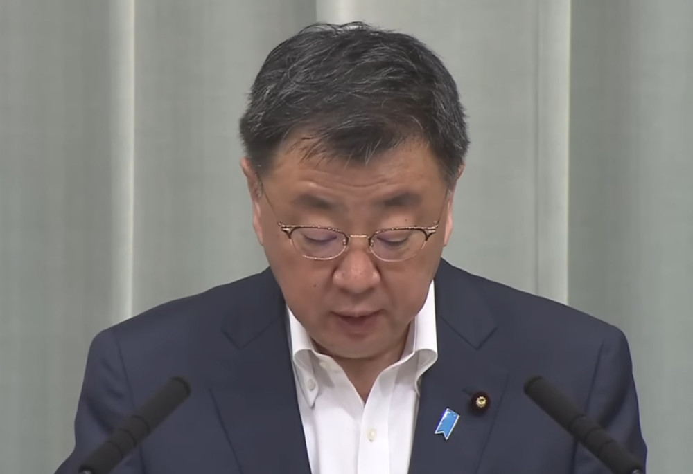
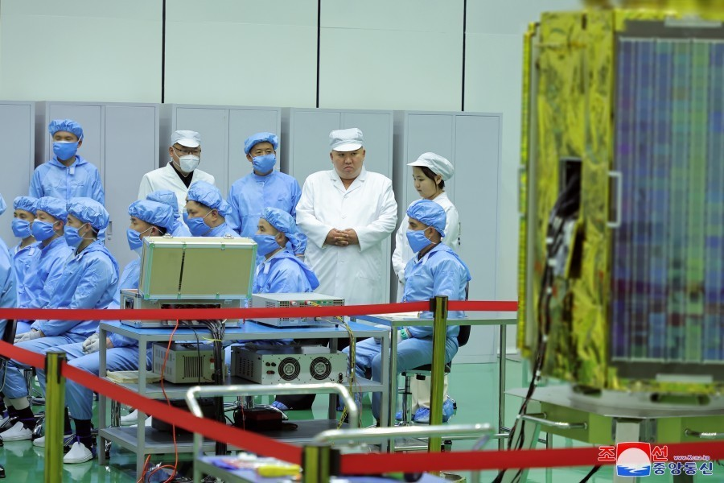

# 日本：接到朝方通报，朝鲜将在5月31日至6月11日间发射军事侦察卫星

（观察者网讯）据日本广播协会（NHK）5月29日报道，日本政府接到了朝鲜即将发射卫星的通报，日本首相岸田文雄已经指示相关部门收集信息，并与美国、韩国等有关国家合作采取应对措施。日方谴责朝鲜使用弹道导弹技术从事发射活动违反安理会决议，要求朝方“保持克制”。

报道称，朝鲜海事部门在当地时间29日凌晨告知日本海上保安厅，朝鲜将在5月31日至6月11日之间择机发射军用侦察卫星，并在朝鲜半岛以西和菲律宾以东划出3处可能有火箭残骸坠落的“危险海域”。日本海上保安厅已根据该通报发布航行警告。

_日本共同社报道截图_

日本广播协会（NHK）提到，在接到这一通知后，日本首相岸田文雄29日召开政府部门会议，指示有关部门尽可能收集和分析信息，并与美国、韩国等有关国家合作采取应对措施，敦促朝鲜“保持克制，不要发射”。

日本内阁官房长官松野博一称，根据朝方提供的信息，卫星有可能从冲绳上空经过。冲绳县知事玉城丹尼表示，针对朝鲜的卫星发射计划，当地已经设立危机管理对策本部，“我们将继续与政府合作，收集相关信息并作出适当回应。”

松野博一还谴责朝鲜违反联合国安理会决议，他在29日上午的新闻发布会上称，“朝鲜以卫星的名义发射弹道导弹是对日本安全的‘挑衅’。朝鲜使用弹道导弹技术从事发射活动，违反联合国安理会有关决议。”

此外，日本防卫大臣浜田靖一已向自卫队下达“摧毁措施准备命令”，要求自卫队做好拦截准备，以防朝鲜卫星落入日本境内。NHK称，现在日本自卫队正在部署导弹拦截部队，日本附近海域还将部署24小时待命的宙斯盾舰。

_5月29日上午，日本内阁官房长官松野博一举行新闻发布会
视频截图_

去年12月18日，朝鲜国家宇宙开发局负责人宣布，在平安北道铁山郡西海卫星发射场进行了朝鲜军事侦察卫星的最终阶段一次重要试验。该机构当时表示，计划在2023年4月完成朝鲜首颗军事侦察卫星的发射前准备工作。

据朝鲜中央通讯社5月17日报道，朝鲜劳动党总书记、国务委员长金正恩5月16日现场指导了朝鲜非常设卫星发射筹备委员会的工作，察看了最终通过总装状态检查和宇宙环境试验后搭载准备就绪的军事侦察卫星一号。

_5月16日，朝鲜最高领导人金正恩指导非常设卫星发射筹备委员会工作
图自朝中社_

金正恩在视察过程中表示，成功发射军事侦察卫星是出于国家安全环境的迫切要求，是朝鲜劳动党和共和国政府的最优先加强国防力量政策的正确实践过程，也是在太空军事及科技开发工作中取得的显著进展。他还批准了非常设卫星发射筹备委员会今后的行动计划。

此前，金正恩已在4月18日对朝鲜国家宇宙开发局进行现场指导，并指示如期发射军事侦察卫星一号。金正恩要求抓紧推进项目的准备工作，争取接连发射并部署多颗侦察卫星，增强侦察和情报收集能力。

**本文系观察者网独家稿件，未经授权，不得转载。**

