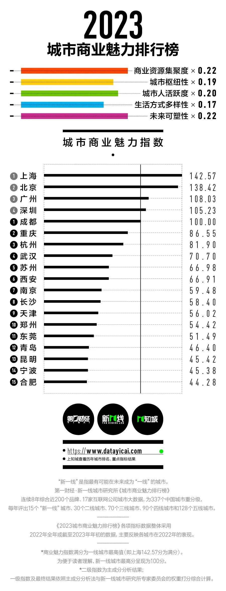
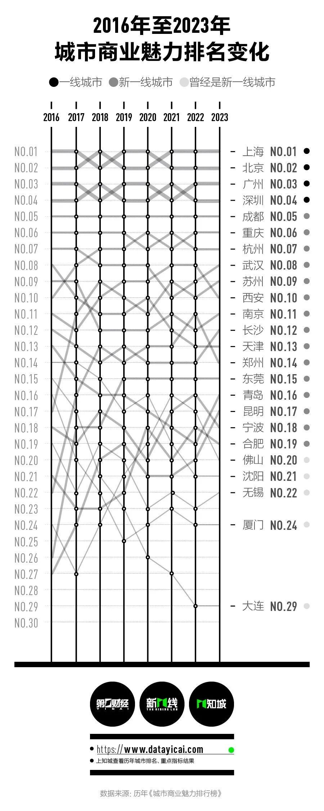

# 2023新一线城市名单官宣：昆明回归，青岛上升，北方城市仅占四席

我们的城市回来了，那些个喧闹、热烈、可爱的城市。让我们重新和它们打一声招呼。

中国城市已处在向上生长的惯性中，城市之间开始通过寻找差异化的路径来谋求各自的发展；在这一过程中，人们也在舒适自在的状态中享受城市，共同获得滋养。虽然其中有起落，也有波折，但整个进程所带来的力量，让我们满怀期冀。

城市的韧性比我们所想的要强得多。当人们重新自由流动，享受生活，城市的迷人之处便再次绽现。

新一线城市研究所的《城市商业魅力排行榜》也已经连续发布到第8年。通过近200个品牌、17家互联网公司和数据机构的城市大数据，围绕商业资源集聚度、城市枢纽性、城市人活跃度、生活方式多样性和未来可塑性五大一级维度来评估337座地级及以上城市，2023年这份榜单里的15座新一线城市依次是
**成都、重庆、杭州、武汉、苏州、西安、南京、长沙、天津、郑州、东莞、青岛、昆明、宁波、合肥。**

受数据时效的影响，《2023城市商业魅力排行榜》各项指标主要采用的是2022年全年或者截至2023年年初的数据，其中的非常态和不确定性因素有较多干扰。

结果依然显示出了新一线城市与二线城市在分界线上的竞争焦灼。相比上一年，昆明重新回归新一线，替代了此前攀升较快的佛山；此外，二线城市的头部还包括沈阳、无锡等曾经的新一线城市。

“未来几年，中国若干个‘二线’城市的多个指标将达到目前一线城市的水准。大公司正寻找并促成这些城市的升级。我们把这些城市命名为‘新一线’。”2013年8月5日，我们将这段话写在当期《第一财经周刊》的封面，首次提出了“新一线城市”的概念。

10年前，我们挑选出的明星城市包括杭州、天津、成都、苏州、武汉、重庆、青岛、南京、沈阳、大连等。当下来看，其中不少新一线城市的综合魅力一定超越了10年前的一线城市水平，甚至它们之中已在一些领域追上了当前的一线城市；但也有几座城市，不再出现在新一线城市的名单里。10年的时间，我们见证了成渝
“第四极”的崛起，中部地区出现多座超过预期的新兴城市，同时我们也看到了一批北方城市的失速与没落。

这10年时间里，不同城市间的商业语境正在被拉齐，商业空间激增且进化出各种形态；新生代的消费群体掌握了需求端的话语权，他们迫使品牌、甚至城市从不同向度上提供更多层次的选择；一线城市不再具备绝对吸引力，更多城市的产业繁荣与就业岗位提升能为年轻人提供近在眼前的工作和理想收入。

在经济高速增长的周期里，城市的个性一定程度上是被漠视的。想要跟上大家的步伐，从高线城市照搬发展模式是最容易也最有效的办法。从消费品牌的迁移，到产业路径的效仿，与发达城市越来越像，似乎就能代表自身的成长。的确，它从数字和感受上，都实现了城市的社会经济发展和市民生活水平的提高，在滚滚的城市化浪潮中，拼命追赶的低线城市没有被甩在后头。

但埋头向前冲的成长总归存在缺憾。它可能推倒了传统的建筑和肌理，将城市的商业活力集中在了新筑的大盒子里；或许向城市现有空间之外索取了过多的发展空间，城市与乡村、与自然之间的共生问题的优先级后退了；又或者，在地文化的认同被暂搁一旁，城市的外向性和包容度被提到了更靠前的位置……这些未必都有明确的黑白错对，在特定的时间和空间里，大都是顺应时代潮流而留下的选择。

只是，每座城市都有它的山水和市民，有它的历史渊源与传统根基，有它与周围独特的关系，也有本就属于它的性格与气质。无论地域，无论规模，它应当成为它自己。那样的城市，才是我们真正想要认识、感知、深入、共情的城市。

**2023城市商业魅力排行榜指标解读**

《城市商业魅力排行榜》的指标体系包含了商业资源集聚度、城市枢纽性、城市人活跃度、生活方式多样性和未来可塑性五大一级维度。榜单的一级与二级维度权重以新一线城市研究所专家委员会打分的方式计入，二级维度以下指标数据则采用主成分分析法。

**商业资源集聚度**
聚焦大品牌青睐度、城市商圈实力和基础商业能级。不同于上一代品牌对城市经济、行政地位的重视，当前主流消费品牌更多将客群的消费理念质素、城市商业消费的氛围、城市自身的热度等纳入考量，如海口、厦门、无锡等外向型二线城市会受到更多品牌青睐。从空间来看，新一线城市商圈的物理边界仍在扩张。

**城市枢纽性**
由城际交通基础设施、交通联系度、物流通达度、商业资源区域中心度指数构成。过去一年，西南地区，尤其是偏远城市的枢纽性指数整体跃升显著，云南、四川、贵州高速公路通车里程跃至全国第2、3、4位。受2022年疫情期间物流站点的不稳定因素影响，苏锡常地区和上海的物流时效性出现大幅下降。

**城市人活跃度指数**
，衡量消费、社交和夜间三个维度的活跃情况。高度依赖旅游业以及边境城市整体排名受影响最为明显。黄冈、宜昌、鄂州等湖北城市的外卖活力回归。同时，线上社交活跃度受影响最小，淘宝直播与抖音短视频互动仍处上升期。在夜间活跃度整体下滑的背景下，广州是唯一一个去年夜间出行人数仍有上升的城市。

**生活方式多样性**
主要测量出门新鲜度、消费多样性和休闲丰富度。城市咖啡馆数量较去年同期增加近1万家，过半数增长发生在二三线城市。尽管演出场地减少，但从演出形式、情绪风格和主流IP来看，剧场承载更多情绪释放和疗愈价值。短视频助推二线及以下城市被更多Z世代青睐。

**未来可塑性**
通过产业创新、人才吸引、消费潜力与城市增长评价城市发展潜力。新一线城市中，仅有青岛前进3位，其余城市排名变化不超过1位。从投融资、专精特新培育能力、产业链集中度等维度来看，珠海、宁波、常州等城市的数据表现更为突出。在广佛、深莞加速一体化发展的背景下，珠三角城市群有四座城市的人口吸引力指数排在全国前10。

**2023年城市分级完整名单**

（包含中国内地337个地级及以上城市）

