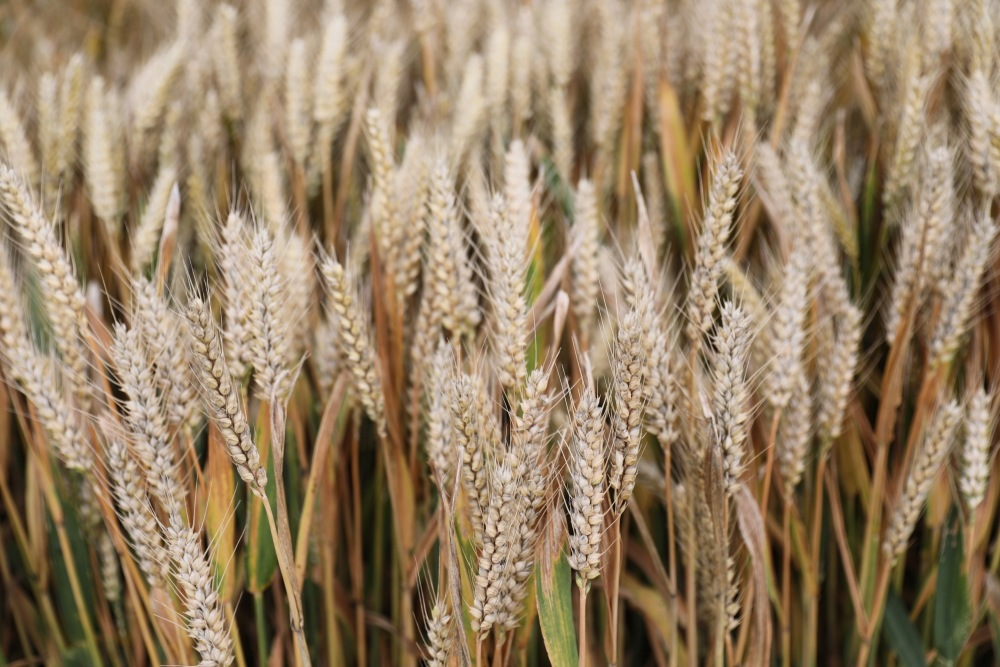
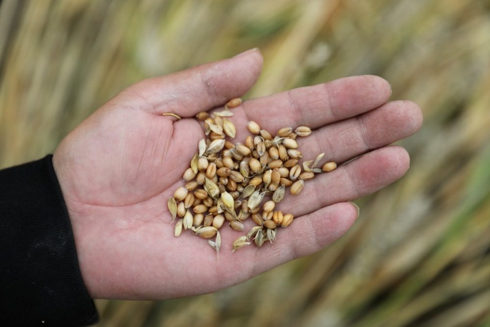
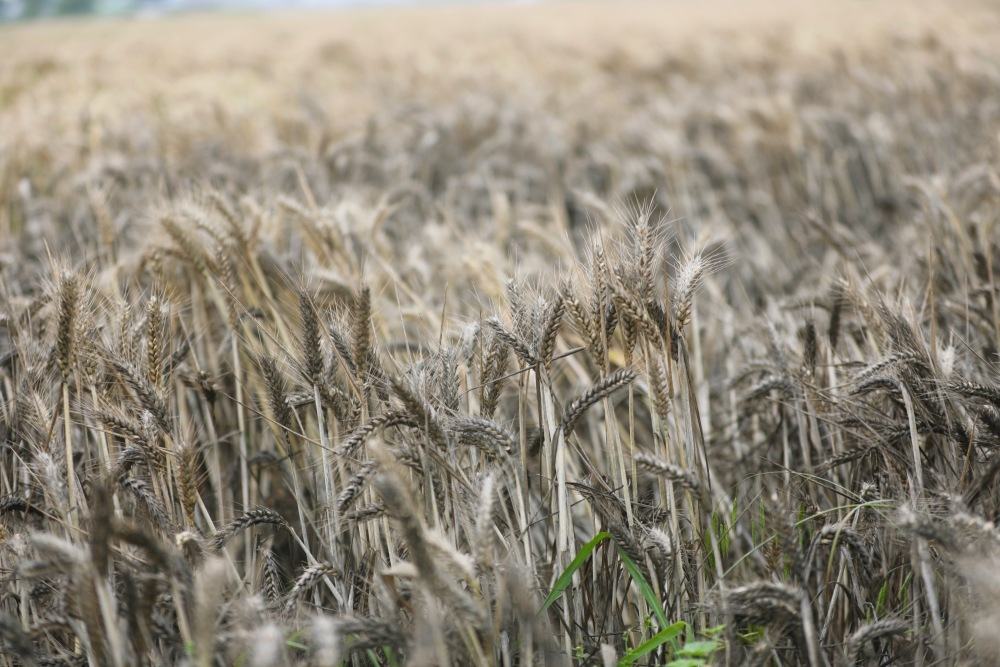

# 下不了高速为何却能上高速？六问“上百台收割机无法下高速事件”

央广网北京5月30日消息（记者汪宁）5月28日，央广网报道了“河南南阳上百台收割机无法下高速问题”（此前报道：小麦收割农忙时节，河南南阳上百台收割机无法下高速，农业农村局回应），引发社会广泛关注。就此，记者做了进一步的追踪。

5月29日，南阳市农业农村局工作人员在接受采访时表示，此前由于部分运输农机的车辆未办理大件运输手续，在高速收费站遇到了通行问题，现在问题已基本解决。此外，目前部分小麦受损主要是受雨水影响。

同日，南阳市三夏生产交管支队服务热线工作人员称，目前农机车辆已不需要办理大件运输手续，也不再对农机车辆超限情况进行收费。

据了解，5月30日，经河南省政府专题研究决定，省财政紧急下拨资金2亿元，专项用于小麦烘干，确保小麦质量、确保颗粒归仓、确保农民收益。

_因连日降雨，南阳市方城县券桥镇部分小麦受到影响（央广网发受访者供图）_

**一问：“跨区作业证”作用是什么？**

近日，曾前往南阳唐河县收割小麦的农机手韩先生说，自己往年也去南阳收割过小麦，对“跨区作业证”的办理规定较为熟知。在他同行中，有些农机手就没办理“跨区作业证”，交纳高速通行费用后才让下高速。“有些农机手还要承担雇佣司机费用，这无疑增加了经济负担。我认为在抢收小麦的关键时候，应开通绿色通道予以放行。”

根据《收费公路管理条例》相关规定，符合条件的联合收割机和运输联合收割机车辆可以免交车辆通行费，但需要办理农业农村部统一印制的收割机“跨区作业证”。

南阳市农业农村局党组成员、市农业机械技术中心主任李奇表示，“跨区作业证”本是一项惠民政策，实行属地办理，农机手凭此证可免费通行，否则需交高速公路通行费。

南阳地区一高速口收费站站长刘灯（化名）说，“跨区作业证”的作用是引导农机手合法跨区作业，也为农机手进行跨区作业时减轻经济负担、带来便利，而且这个措施已经实施多年了。

**二问：运输收割机的车辆是否需办理“大件运输证”？**

韩先生介绍，他提前从朋友口中得知需办理大件运输手续。5月18日下午，他从焦作市武陟县嘉应观高速口上高速时，接受了“跨区作业证”和大件运输手续检查。

河南省12328交通运输服务监督热线工作人员介绍，往年根据《收费公路管理条例》规定，办理了收割机“跨区作业证”的联合收割机和运输联合收割机车辆可以免缴车辆通行费。

2023年4月和5月，交通运输部出台了两个文件，要求对跨区作业的联合收割机和运输联合收割机车辆，除了要有“跨区作业证”之外，如果车辆超限，必须办理超限运输证（大件运输证），如果没有办理超限运输证，超限车辆必须交纳通行费。

记者注意到，5月29日，南阳市交通运输局官方网站发布的农机大件运输《超限运输车辆通行证》办证指南提到，根据国务院物流保通保畅工作领导小组办公室和省交通运输厅通知要求，2023年车货总重或外廓尺寸超限的农机（收割机、插秧机）运输车辆，应当依法办理《超限运输车辆通行证》。

收费站站长刘灯表示，按照规定，他们需严格按照政策进行执行，否则年终就会被罚。面对车辆拥堵情况，虽然他们制定相应预案，但预案的执行也需满足相应条件。他说：“如果不满足条件就放行了，高速通行的费用就需要我们垫上。”

中国公路学会发展中心主任徐丽认为，实际上，出于道路安全考虑，大件审批超宽、超高、超重，需要提前审批，农机车辆需提前办理超限运输证（大件运输证），因此运输主体应有遵守相关法律法规意识、安全意识，严格按照审批的规定路线行驶。

“因为道路的修建和维护需要巨额资金，超限车辆上路也可能带来交通安全隐患，给人民群众造成生命危险，”徐丽说，对于收割机运输上高速时未审查相关手续、导致下高速不便的情况，她建议上高速时就进行审查，而不是把问题留在终端。

**三问：下不了高速的收割机为何能上高速？**

部分前往河南南阳的农机手说，他们从其他地区上高速时未经严格检查相关手续，而是在下高速时被拦。

“他们在有些地方上高速时会检查是否超限，但有些地方并不检查。即使有些地方工作人员检查，也会放行。”韩先生说，目前，不同地方在上高速时对运输收割机的货运车辆大件运输手续审查情况不一。

但是，李奇认为，既然有超限管理规定，超限的农机车辆就不能直接上高速，需办理托运手续，在下高速时也需按照高速运输相关规定，但去年他并没听说这个规定，也没有遇到这种情况。这次“上百台收割机无法下高速事件”中，有些农机手没有办理大件运输手续，在高速收费站遇到了通行问题，主要集中在唐河、新野等地区。

刘灯表示，运输收割机的车辆超限需办理大件运输证，这虽然是全国统一标准，但每个省份具体执行情况可能不一样，上高速时，车辆两轴不超过18吨、六轮不超过64吨。但下高速时就会严格按照标准审查，超限需要缴费。目前，河南虽然开通便捷通道，但牵涉道路安全问题，省里政策还是引导大家依法办理相关手续。

对此，李红昌表示，从原则上讲，农机车辆的大件运输需要提前申请大件运输证，否则不能上高速。办理完手续后，农机车辆要按照专门的路线来行驶，这是出于道路安全和人民生命健康考虑，但在现实中不同地区确实存在执行不同的情况。

**四问：小麦发芽与收割机未能及时下高速有无关联？**

_受雨水影响的小麦（央广网发受访者供图）_

河南省南阳市作为小麦主产区，近期面临小麦收割的农忙时节。受连日降雨影响，南阳和驻马店部分地区的小麦收割受到一定影响。

河南省农业农村厅公布的最新信息显示，5月25日以来出现的大范围持续阴雨天气，已经严重影响小麦正常成熟收获。这次降雨过程与豫南地区小麦成熟期高度重合，持续长达6天，覆盖全省17个省辖市和济源示范区，特别是对驻马店、南阳等地影响更大。

河南省农业农村厅称，这次阴雨天气过程，导致一些地方麦田积水，小麦点片倒伏、发霉，全省部分地区出现籽粒萌动和穗发芽现象，是近10多年来最为严重的“烂场雨”天气。

河南省农业农村厅还称，河南省有400多万亩小麦种子田，种子产量38亿斤，占全国的38%以上，其中60%分布在豫北地区，受此次降雨影响较小，但今年豫南的小麦种子可能会受一些影响。

南阳市新野县种粮大户何先生今年种了百十亩麦子。他表示，新野县小麦成熟时间晚于唐河和邓州等地，下雨前并未成熟，目前新野县的小麦已出现了发芽情况，主要原因是连续降雨，“一连续下雨，就算麦还青着，它也发芽发霉。”

_南阳市社旗县唐庄乡有部分小麦受降水影响发霉（央广网发受访者供图）_

驻马店市泌阳县种粮大户戚先生说，因为连续降雨，他今年所种的百十亩小麦同样出现发芽和被泡问题，已于29日开始收割。“下雨前，它不熟。后来一下雨就出芽了，但因一直下雨机器没法下地收割。”

南阳市唐河县大河屯乡一名工作人员表示，唐河南边乡镇的小麦比北边乡镇早成熟7天到10天。雨前，因麦子熟的少，收割的也就少，近日遇到连续降雨，小麦就发芽了。当地部分小麦发芽主要还是因为受到连日降雨影响，和收割机被堵高速并无关联。

李奇介绍，根据记录，他们共接到3起收割机无法下高速的情况反映，最早时间是5月17日。事发时，他们及时进行了协调。据他了解到的，未发现货车在高速口连续滞留五天的情况。

他说，南阳的小麦收割时间最早在5月23日，收割机不让下高速的事情发生在这之前，地点是南阳市唐河县高速路口。南阳市农业农村局得知情况后，及时和当地交通部门进行了协调，事发当天解决了问题。

**五问：当地政府是否提前预警？**

_小麦抢收（央广网发受访者供图）_

唐河县某乡镇工作人员表示，唐河县相关部门于5月22日组织督促群众收麦，紧接着村干部挨家挨户动员连夜抢收。“每年我们都对农机车辆跨区作业需要办理什么手续进行宣传，但有些新农机手可能还不清楚。”

_唐河县一乡镇组织麦收工作通知（央广网发受访者供图）_

他还表示，这次连日降雨给小麦收割带来的影响，也暴露出产粮大县唐河农业生产的短板，以及当地应对极端天气灾害的能力不足。“雨前，有极少数有烘干设备的企业收购湿麦，可是仅收了两天就不收了，因为湿麦太多，处理不了。很多农民明知道要下雨，可是没办法，湿麦收回来了，没法晾晒，造成发霉、变质。”他建议，国家可以加大烘干设备的支持扶持力度。

据了解，每年都有大量外地收割机到南阳市进行跨区作业，为了保障农机安全通行和“三夏”生产顺利进行，南阳市农业农村局每年都会提前做好相关准备工作，包括发布通知、印发指南、建立服务站等。

李奇介绍，目前，南阳市设立了几十个接待站，包括气象服务、供油服务等，现在收割机供应充足，下一步还需根据天气情况继续关注供需进展。由于下雨地湿，5月29日，南阳市一些地方进行了小面积作业，在不下雨情况下，次日下午便可大面积作业。

29日，南阳市新野县歪子镇寺门村党支部书记乔俊峰表示，寺门村紧邻高速口，因下雨不能进地作业。目前，有10台轮式联合收割机在村子里，等待天晴后收割。

**六问：各方该如何积极协调、完善机制？**

根据公路法等有关法律法规规定，超过公路限载、限高、限宽、限长标准的车辆，不得在公路行驶。对于超载、超长、超高、超宽装载运输的车辆通行高速公路，不仅对自身安全造成影响，也会对在高速公路上行驶的其他车辆行驶形成严重的安全隐患。载运联合收割机等不可解体物品的超限运输车辆，应当依法办理有关许可，按照规定的时间、路线合法通行，并依法享受免费通行政策。

“收割机不能直接上高速，用货车运输收割机的话，一般就会超限，”部分农机手说，大件运输手续虽是规定，但有时可能会带来不便，比如按照既定时间、路线行驶，但在实际跨区作业抢收庄稼时，他们有时又会面临因天气等突发因素，而临时改变路线和采取紧急行动。

对此，李红昌表示，这些证件的办理有其科学性和必要性，但关键在于简化审批流程，提高审批速度，可以采取备案制。此外，还应加强各部门间协作和监管，保障证件办理的高效、便捷。

中国社会科学院贫困问题研究中心主任吴国宝分析，目前，农机跨区域作业是解决社会化服务的一个必然选择，也关乎农机拥有者、作业者和需求方的切实利益，但要保障其顺利进行，需各方努力。

吴国宝认为，从目前来看，此次事件中，部门之间的政策协调和地方执行的灵活性可能存在一定问题，有些部门对时间点的把握和部门之间的协调存在偏差。比如，有些收割机属于大型超高超宽货车，以前可以按照常规管理方式下高速，而现在需提前办手续，一些农机手可能对新政策不适应，所以政府应该提前做好相关政策的宣传。

此外，他表示，有关部门应充分认识到农业生产的重要性，即使政策在实施过程遇到冲突，应给基层提供灵活处理相应问题的方案，并从管理层面完善相应机制，而不能一味苛责基层。

（来源：央广网）

