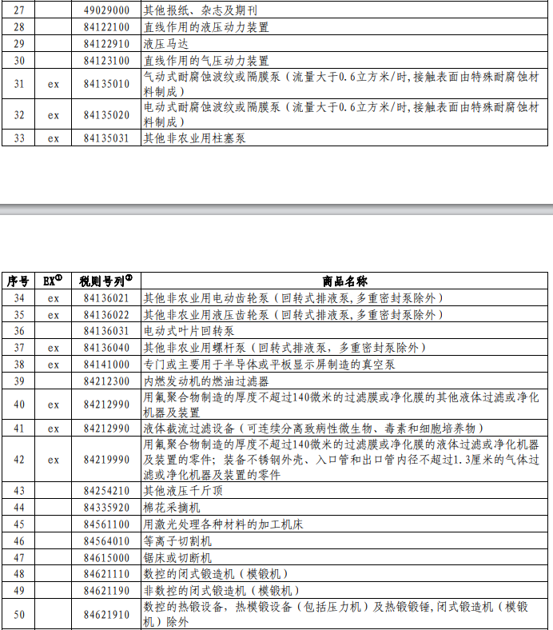

# 国务院关税税则委员会发布对美加征关税商品第十一次排除延期清单

国务院关税税则委员会发布关于对美加征关税商品第十一次排除延期清单，自2023年6月1日至2023年12月31日，对附件所列商品，继续不加征我为反制美301措施所加征的关税。

**国务院关税税则委员会关于对美加征关税商品第十一次排除延期清单的公告**

税委会公告2023年第6号

根据《国务院关税税则委员会关于对美加征关税商品第九次排除延期清单的公告》（税委会公告2022年第10号），对美加征关税商品第九次排除延期清单将于2023年5月31日到期。国务院关税税则委员会按程序决定，对相关商品延长排除期限。现将有关事项公告如下：

自2023年6月1日至2023年12月31日，对附件所列商品，继续不加征我为反制美301措施所加征的关税。

