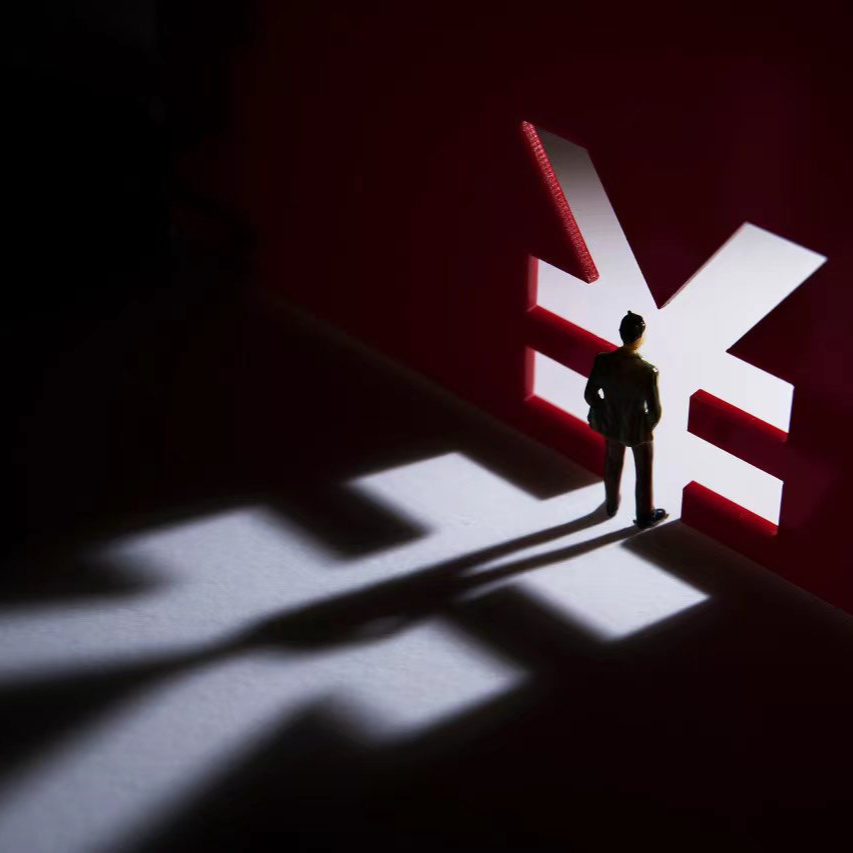

# 垄断市场致救命药短缺，这两家原料药企被罚没3.2亿

本文来源：时代财经 作者：李傲华

_图片来源：图虫创意_

原料药领域再现反垄断高额罚单。

5月28日，国家市场监督管理总局发布消息，依法对远大医药（中国）有限公司（下称“远大医药（中国）”）和武汉汇海医药有限公司（下称“武汉汇海”）达成并实施了销售重酒石酸去甲肾上腺素和肾上腺素原料药的垄断协议、滥用市场支配地位案作出处罚，责令上述两家企业停止违法行为，并没收远大医药（中国）违法所得1.49亿元，并处以罚款1.36亿元；没收武汉汇海违法所得3092.48万元，并处以罚款412.68万元。

此案合计罚没金额超过3.2亿元，是今年以来原料药领域开出的最大反垄断罚单。

远大医药（中国）为上市公司远大医药（00512.HK）的核心子公司。Wind数据显示，远大医药持有远大医药（中国）99.84%的股权。

财报数据显示，2020-2022年，远大医药的营业收入分别为63.53亿元、85.98亿元和95.62亿元，净利润分别为17.93亿元、24.03亿元和20.79亿元。

远大医药披露公告称，远大医药高度重视并积极配合国家市场监督管理总局的调查，接受处罚并根据要求组织整改。此次处罚金额占集团近一个财政年度经审计综合营业收入和本公司持有人应占溢利的比例分为3.48%和15.85%，预计不会对集团生产经营产生持续影响。

5月29日，远大医药开盘急跌逾10%，最终报收4.73港元/股，跌2.07%，总市值167.89亿港元。

**因原料药垄断被罚**

远大医药（中国）前身是武汉制药厂。2002年，中国远大集团对武汉制药厂进行注资，2008年完成战略重组，间接实现在香港上市。目前，远大医药的核心产品涵盖了抗肿瘤、心血管急救制剂及高端心脑血管介入医疗器械、抗病毒抗感染、呼吸及五官科及生物健康产品和精品原料药等领域。

重酒石酸去甲肾上腺素（下称“去甲肾上腺素”）注射液和盐酸肾上腺素注射液是临床常见的急救药品，而涉事的两种原料药正是制剂生产的必需原料。

国家市场监督管理总局调查显示，远大医药（中国）是中国唯一能够持续稳定生产和销售去甲肾上腺素原料药和肾上腺素原料药企业，是相关制剂企业采购两种原料药的主要对象。2010
年以来，除个别年份外，市场上两种原料药的供应商只有远大医药。远大医药（中国）在中国去甲肾上腺素原料药和肾上腺素原料药市场的占有率长期在90%～100%之间，只有个别年份除外。因此，远大医药（中国）对这两种原料药市场有很强的控制能力。

2010年至案发，中国境内具有去甲肾上腺素原料药和肾上腺素原料药生产资质的企业只有远大医药（中国）和山西振东泰盛制药有限公司（下称“山西振东泰盛”），武汉汇海通过包销方式，实际控制了山西振东泰盛的两种原料药的销售。

2016年，远大医药（中国）与武汉汇海达成了口头协议，约定武汉汇海停止销售两种原料药，远大医药则通过两种方式对武汉汇海进行补偿：一方面向武汉汇海低价销售去甲肾上腺素注射液和盐酸肾上腺素注射液，再以高价回购，另一方面要求相关制剂企业低价向武汉汇海低价销售上述制剂，再由武汉汇海高价转卖。

国家市场监督管理总局指出，上述行为导致去甲肾上腺素注射液和盐酸肾上腺素注射液市场竞争不充分，两种产品价格逐年上涨，时常出现短缺，被列入国家临床必需易短缺药品重点监测清单，部分地区列入短缺药品清单，不仅影响患者正常用药，还增加了患者用药成本和国家医保支出，损害了患者利益和社会公共利益。

药智网数据显示，不同地区、不同企业的去甲肾上腺素注射液和肾上腺素注射液价格差巨大，同一规格的去甲肾上腺素注射液在部分地区的价格高达198元，而在有的地区采购价为21元左右。盐酸肾上腺素注射液的采购价格则从4.8元～50元不等。

根据2018年健康时报的报道，2015-2018年，去甲肾上腺素注射液的价格上涨近4倍。

辽宁省集采小组办公室2018年发布的一份易短缺药品预警通知显示，远大医药（中国）自述由于原料/企业生产线改造/厂址搬迁问题导致产能不足为由，申请停产去甲肾上腺素注射液。

**原料药为何是垄断高发区？**

2011年，顺通公司（后更名“隆舜和”）因操纵盐酸异丙嗪原料药被罚近700万元。当时国内只有两家企业生产该原料药，顺通公司与生产企业签订独家代理销售协议，试图通过向下游制剂企业施加原料压力，要求制剂企业提高原料药招标价格和给予回扣。在遭到下游企业拒绝后，顺通公司转而设法操纵盐酸异丙嗪市场价格，导致其价格暴涨近15倍。

该事件被4家制剂企业联手举报而曝光，最终顺通公司被发改委重罚近700万元。

自此以后，原料药一直是反垄断部门高度关注的行业。健康时报记者梳理了2011-2021年的原料药反垄断案件发现，24家药企因涉嫌垄断行为，累计被处以超过5.2亿元的罚款。

2021年11月18日，国家反垄断局在国家市场监督管理总局办公大楼正式挂牌。同一天，国家市场监督管理总局发布了《国务院反垄断委员会关于原料药领域的反垄断指南》。

重拳打击之下，原料药行业的垄断行为却屡禁不止。

就在远大医药此次被罚之前，今年2月，东北制药（000597.SZ）因滥用其在中国左卡尼汀原料药市场的支配地位，以不公平高价销售原料药，被辽宁省市场监督管理局罚款1.33亿元。

中伦律师事务所律师侯彰慧对时代财经指出，原料药是垄断行为高发的行业，这主要与其行业特征有关。一方面，由于审批严格，原料药的许可资质数量有限；另一方面，很多原料药的上游是化工产业，对环境的影响比较严重，这也是原料药许可证数量稀少的原因。

“常见情况是，某个品类可能发放了几张许可证，但实际上只有一两家企业在进行生产，导致原料药行业出现了垄断或寡头垄断市场特征，在定价和对下游企业供应方面有很强的议价权。由于企业数量少，它们也容易达成横向垄断协议，联合涨价或者对下游施加不合理条件。”侯彰慧表示。

国家药品监督管理局审评中心数据显示，截至目前，去甲肾上腺素原料药有12家企业登记备案，肾上腺素原料药则有11家企业登记备案。

IQVIA数据显示，2022年前三季度，去甲肾上腺素制剂国内市场规模约11.56亿元，原料药市场规模约116公斤。

随着垄断者被罚及越来越多的企业加入竞争，去甲肾上腺素原料药和肾上腺素原料药市场是否有望回归正常？

