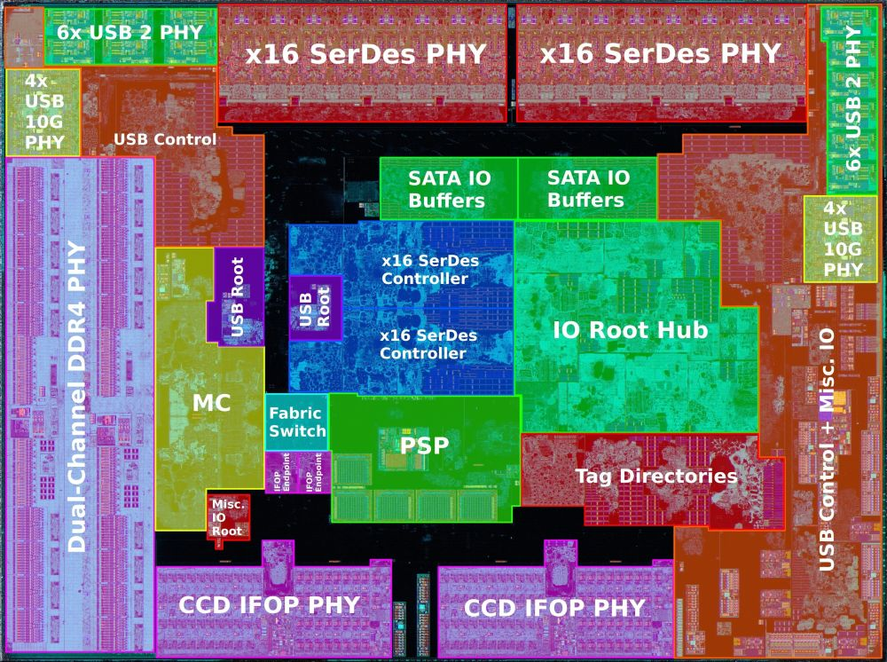
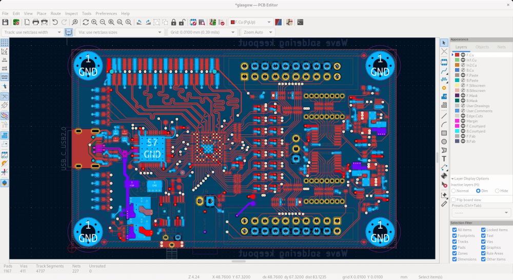
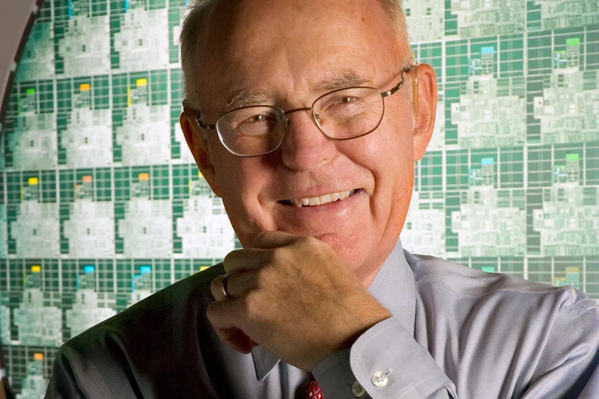
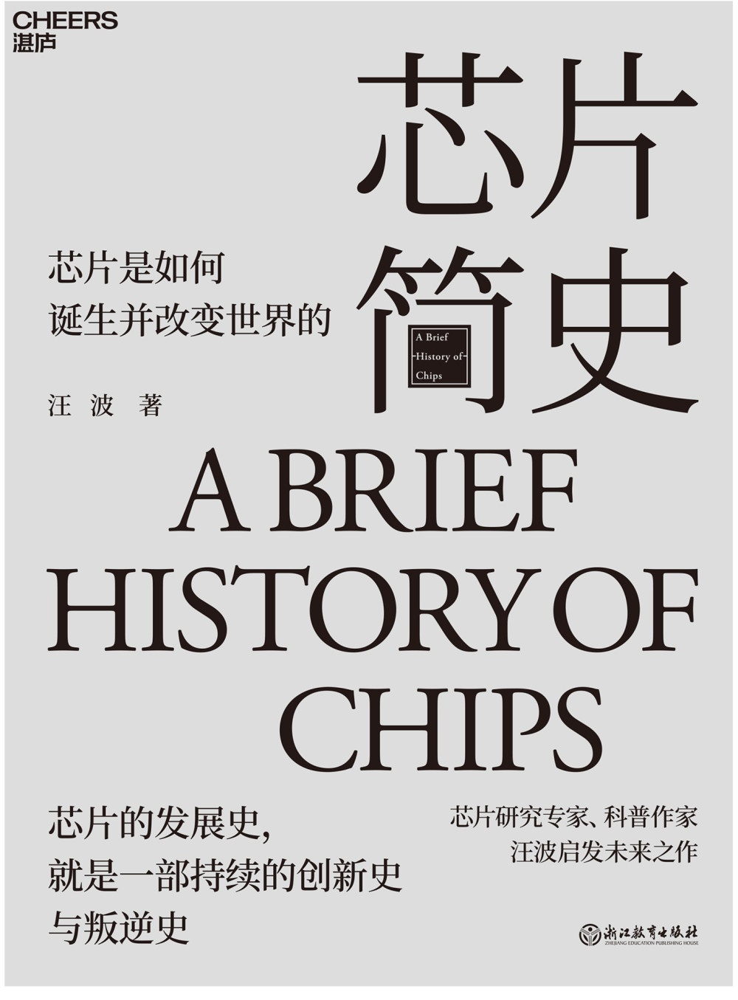

# 对话资深专家汪波：中国芯片，只缺光刻机？

_“芯事重重”是腾讯科技半导体产业研究策划，本期对话资深芯片专家、《芯片简史》作者汪波，聚焦芯片发展历程和全球芯片产业发展现状的分析解读。_

**划重点：**

  * _1_ 一个典型的芯片技术，从实验室研发到走向市场大约需要十年甚至更久，技术突破固然重要，稳定性、可制造性、良率也值得关注。
  * _2_ 即使是西方盟友之间也不可能分享最核心的芯片技术，只能通过自主研发，欧洲和日本的发展就是其中的例子。
  * _3_ 没有高端的EUV光刻机，我们只是造不出最先进的芯片，而没有EDA设计软件，所有的芯片设计公司都要停工。
  * _4_ 摩尔定律也是一个关于人的信心和希望的定律，只要人类心中还有这两样东西，摩尔定律的脚步就不会停下。

**文 / 腾讯科技 苏扬**

过去几年，芯片产业风起云涌，潮起潮落。

从汽车一芯难求，到台积电收缩产能，从芯片法案到美光被中国“拉黑”，再从Marvell裁员到OPPO解散芯片设计公司哲库。从明星大厂到从业者，无一例外的经历了周期轮动的冲击。

抛开周期论，这个发展历程不到百年的行业之所以如此引人关注，底层逻辑则在于——尺寸可能不到指甲盖大小的芯片，已成为现代科技的数字基石。小到手机、平板，大到汽车、飞船，芯片无处不在，而它们无一例外的遵循着英特尔创始人戈登·摩尔在20世纪六七十年代提出来的“摩尔定律”，——当价格不变时，集成电路上可容纳的元器件数目，约每隔24个月便增加一倍。（注：摩尔在1965年提出是的翻倍周期，即12个月，1975年修正为24个月）

摩尔定律是如何诞生的，芯片产业百年之旅的起点在哪里，我们在资深芯片研究专家汪波的新作《芯片简史》中找到了一些答案，并有幸和他就芯片技术、光刻机、摩尔定律等诸多话题进行了深度的交流。

作为资深芯片研究专家、科普作家，汪波早年留学法国，获法国里昂国立应用科学学院集成电路硕士学位和利摩日大学高频微电子学博士学位，后分别在华为、法国里昂纳米国家实验室和北京大学深圳研究生院从事集成电路设计的教学与科研工作。

汪波是“摩尔定律”坚定的拥趸，在被问及摩尔定律是否失效时，他巧妙的化用摩尔定律，“每过两年，相信摩尔定律已死的人的数量就会翻倍。”

《芯片简史》反复提及“芯片的创新来自于叛逆的想法。”，这些新技术、新方案，在诞生初期并不受认可，但可能在未来的某一天，在某一个客观条件下，会在技术进步的过程中扮演至关重要的角色。

这个结论也可以回答“代工巨头们为何执着于追求3nm、2nm极限工艺”这类问题，用汪波的话说，“让我们先把技术打通，然后再探索其可能的、会给我们带来可感知好处的‘iPhone时刻’。”

**以下是对话全文精华：**

01 芯片技术必须自主研发，中国不只是缺光刻机

**腾讯科技： 这两年国际环境迫使我们自主搞芯片，但回顾诸多过往案例，芯片研发典型特征之一即全球化协作，自主、全球化之间存在矛盾吗？**

**汪波：** 自主和全球化是并行不悖的，我们应区分芯片产品和芯片技术两个层面。
**芯片产品可以通过全球化获得，但我们不可能通过全球化获得芯片核心技术。**

**即使是盟友之间也不可能分享最核心的技术，只能通过自主研发，欧洲和日本的发展就是其中的例子**
。反之，如果我们通过自主研发有了核心技术，那么全球化也可以为我所用，使得芯片产品能推而广之。

_图为苹果M2处理器
die Shot_

**腾讯科技：海外芯片技术很多是从实验室里先研究出来，多年后才应用到产业，这是为什么，对我们有什么启示？**

**汪波：** 一个典型的芯片技术，从实验室研发到走向市场大约需要十年甚至更久的时间。

例如，1990年华人科学家王国裕、陆明莹以及他们在爱丁堡大学的合作者德尼尔和伦肖，在实验室里发明了第一颗单芯片CMOS图像传感器，但是直到2007年CMOS图像传感器的市占率才超越了CCD图像传感器。

还有，华裔科学家萨支唐和他的同事万拉斯于1963年，在仙童半导体的实验室里发明了CMOS技术，极大降低了芯片功耗，但是由于当时芯片规模小，功耗不大，CMOS技术并没有迎来应用的高潮，直到1982年，芯片的规模增大导致功耗急剧增加，英特尔才在80C51单片机上采用了CMOS技术，这项技术才成为主流。

这些案例对我国芯片企业的启示是，
**实现了首次技术突破固然很重要，但也只是迈出了第一步，后续还有稳定性、可制造性、良率等困难需要克服。除此之外还需要等到合适的市场时机**
，在这么长的时期内，这项技术很容易被遗弃。

如果认定一个方向就应长期坚持，不为外部的波动而改变，同时业界也应对新技术给予长期的支持，如此才能守得花开。

**腾讯科技：技术突破、长时间的磨合，最后再产业化应用，容易让人联想到国产光刻机，研发一台光刻机有多难？**

**汪波：** 诞生在上世纪50年代的最早的光刻机原型只是一台普通的三目显微镜，与之对比， **现在的极紫外线光刻机（EUV）则像一座小型冰山，占地约 80
平方米，大量管道和线缆埋在地下 10 米深处，然后才是露出地面的部分。**

_图为ASML工程师现场处理光刻系统相关工作_

EUV光刻机的波长只有13.5nm，业界从上世纪90年代就开始研发，但是一直无法产生13.5nm的激光。21世纪初，加州的西盟公司研发出一种二氧化碳激光器能发出这么短的波长。但是光源的功率又不够大，直到2018年才将功率提高到250瓦。

有了光源还不够，玻璃镜头会严重吸收EUV光，阿斯麦尔不得不将其废弃，转而发明新的反射式镜面，表面交替涂有硅和钼的薄层，每层只有几nm厚。利用两种材料不同折射系数的布拉格效应，每个交界面处都可以反射70%的
EUV 光。 EUV 光在到达晶圆台前要经过12个反射镜，最后只有约1%
的光线能照射到晶圆片上。如此微弱的光线需要光刻胶极其敏感，但高灵敏度的光刻胶又会引起加工精度的波动……技术难题层出不穷，解决完一个，又冒出一个。

经过多次延迟，阿斯麦尔公司最终克服了难以想象的困难，在2018年制造出了人类历史上最精密的光刻机，每台成本高达2亿美元。为了造出EUV光刻机，阿斯麦尔需要向全球数百家供应商采购零部件，而这些供应商又分布在荷兰、德国、日本、美国等世界各地，它们通力合作才有了今天的EUV光刻机。

**腾讯科技： 中国的芯片产业，缺的是光刻机吗？**

**汪波：** 除了缺高端光刻机以及相应的半导体材料，我们还急缺电子设计自动化设计软件（EDA）。

**没有高端的EUV光刻机，我们只是造不出最先进的芯片，而没有了EDA设计软件，所有的芯片设计公司都要停工。**
目前，中国大陆已经有了华大九天、概伦电子、芯华章等EDA厂商，但是体量比起新思科技、楷登电子和西门子EDA（原明导国际）等三大“巨头”仍很小，其中的新思科技一家就占据了约三分之一的市场份额。

_图为一款名为KiCad的EDA软件的UI_

当然最缺的是人才，例如，EDA行业需要复合型人才，既要懂编程和算法、又要懂半导体器件或电路等，培养起来难且慢。

此外，在芯片制造、设备、材料、设计、封装和测试等领域都需要更多有志于面对挑战的人加入芯片产业。

**腾讯科技：
从EDA、材料到设备，再到人才培养，芯片产业有明显的聚集性特征，硅谷早期就是半导体聚集地，国内也有芯片“包邮区”的概念，为什么会出现这种明显的聚集性？**

**汪波：**
芯片产业的确有聚集性，因为技术突破往往在一家领先的研究机构取得。早期，贝尔实验室就是这样一家机构，实验室的肖克利到加州创业，那里的斯坦福大学提供了廉价的办公场所和丰富的毕业生来源。接着从肖克利公司“叛变”出来的年轻人也选择在附近创立了仙童半导体，后来又衍生出了一系列的创业公司，即俗称的“小仙童们”。

_图为被称之为仙童“八叛逆”的8位科学家工程师_

这些创业者会瞄准仙童半导体的需求，为其提供所需的制造设备、半导体晶圆等，互相依存，在一个彼此靠近的空间内形成了一条完整的产业链，实现了共同繁荣。

在中国也有这种地域的聚集，例如在长三角地区，由于有中芯国际和华虹半导体等制造企业的聚集和吸引效应，一大批芯片设计公司也陆续落户在同一区域，形成了良性互动的局面。

在珠三角地区，从上世纪九十年代以及本世纪初开始，华为、中兴、国民技术、国微电子和比亚迪半导体等国内公司开始踏入芯片设计领域，带动了通信、汽车等领域的整机产品的发展，促使更多的芯片制造企业如中芯国际和粤芯等进驻这一地区。

02 国际局势深刻影响芯片产业，摩尔定律“不死”

**腾讯科技： 历史上，国际、社会重大事件事件持续推动着芯片产业发展，今天这个时代，哪些因素、趋势，会推动芯片技术发展？**

汪波：的确，历史上的重大事件会推动芯片技术的发展，例如第二次世界大战爆发，对高性能雷达的需求大大加速了对半导体硅和锗的研究；1957年苏联人发射了首个人造地球卫星，这促使美国加大了对半导体晶体管的研究投入；1961年苏联人实现了首次载人航天，这再一次刺激了美国，增大对刚刚问世的芯片的投入。

在今天这个时代，国际大事和趋势依然影响着芯片技术的发展，例如受到科技脱钩的影响，中国从国外引进芯片技术的途径受到限制，这让我们的产业感到阵痛，但也会促使我们下决心建立自己完整的研发生产链条。

从 **短期看，国产替代可先解决那些对与国计民生影响较大的芯片与器件的依赖** ，如射频器件、高性能Serdes和ADC等；

从 **中期看，突破光刻机和相关材料的技术难关，则会让我们与世界同步** ；

从 **远期看，在新器件（二维器件、碳基晶体管、忆阻器等）、新架构（存内计算、Chiplet等）方面的前沿领域研究，则有可能让我们引领世界** 。

除此之外，人们对大数据、宽带通信和人工智能算力的需求仍在不断增加，这些都牵引着芯片朝着满足其需求的方向发展。

**腾讯科技：
关于芯片的发展，不久之前去世的英特尔创始人戈登·摩尔，他给这个行业留下了诸多宝贵财富，人们津津乐道的摩尔定律即其中之一，芯片的发展长期遵循着摩尔定律的预测，但近年来也有观点认为——摩尔定律失效，您认同吗？**

**汪波：** 摩尔定律是20世纪最伟大的预测之一。
**关于摩尔定律寿终正寝的说法从上世纪九十年代开始就一直不断，例如有人说，“每过两年，相信摩尔定律已死的人的数量就会翻倍”。**

1990年，惠普科学家威廉姆斯断言摩尔定律将在2000年终结，理由是绝缘层将失效。到了2000年，他再次预言摩尔定律将在2010年死去，这次是由于制造成本不断攀升。到了2017年，他却放弃再次预言了，因为他觉得自己怎么也赢不了那些充满创意的工程师们。

_图为已故英特尔创始人戈登·摩尔_

尽管摩尔定律已经放缓是不争的事实，但说其现在已失效，可能为时尚早，因为摩尔定律也是一个关于人的信心和希望的定律，只要人类心中还有这两样东西，摩尔定律的脚步就不会停下。

当前，新兴的技术（3D集成、Chiplet等）仍在不断发展，顽强地支撑着芯片中元件数量的增长。未来，摩尔定律会如何“续命”？我在《芯片简史》中也详细介绍了未来摩尔定律发展的三条可能的道路——延续摩尔、扩展摩尔和超越摩尔。

延续摩尔，即继续缩小晶体管尺寸，提高芯片里晶体管的密度，使晶体管的工艺节点继续朝着2nm、1nm甚至更小的尺寸缩小。

扩展摩尔，即增加系统功能的多样性，在一个芯片上集成和实现丰富的功能，包括集成模拟、射频、数字、传感和存储等各种功能和电路。

超越摩尔，即在主流的 CMOS硅晶体管之外寻找更好的可能，包括碳nm管场效晶体管、隧穿场效晶体管、忆阻器等新型器件。

03 算力需求不断推动工艺迭代，硅基半导体仍将主导世界

**腾讯科技：
追逐摩尔定律的路上，主流大厂开始推动3nm量产，同时探索2nm、1nm工艺，人类追求这种工艺的提升，除了性能跃迁，有没有可以量化、可感知的好处？**

**汪波：**
未来，人工智能、6G通信、沉浸式场景体验、智慧城市、物联网、量子计算等应用会对芯片算力提出越来越高的要求，这些要求芯片有更快的处理速度、更大的存储容量，因而要求业界不断推进工艺的提升，我们可以大致感受到未来技术发展的趋势。不过具体到将来有哪些可感知的好处，现在并不容易预测出来。

实际上，在一项技术真正落地应用之前，我们很难预测出其可能的应用以及带来的好处，历史也是如此：20世纪60年代半导体红外激光器就发明出来了，但人们直到20年后才为它找到了一个广泛的应用：CD播放器。

为此，诺贝尔物理学奖获得者克勒默曾提出了一个“新技术引理”——
**“任何一个有足够创意的发明的主要应用点，过去是、将来也必定是由这种新发明本身创造出来的。”**

所以，让我们先把技术打通，然后再探索其可能的、会给我们带来可感知好处的“iPhone时刻”。

**腾讯科技：
这两年，碳化硅为代表的第三代半导体材料也被拿到台面上来，公开资料显示，特斯拉的碳化硅器件逆变器效率，提升8个百分点到90%，是不是意味着材料也是芯片、半导体性能跃升的思路之一？**

**汪波：**
材料是决定半导体芯片性能的关键因素，例如碳化硅、氮化镓材料在功率放大、显示、射频通信等应用上有着独特的、优于硅的性能，未来在新能源汽车、电源、射频器件等领域有着诱人和广泛的应用前景。

不过，每种半导体材料都有各自擅长的方面，在数值计算、数据存储、三维图形等这些信息处理领域，硅半导体由于成本低和技术成熟等特点仍具有其他材料无法替代的优势，在这些领域仍是未来主要的半导体材料。

**腾讯科技： 旧的技术因为成本优势，而让新技术被暂缓应用或雪藏，您的《芯片简史》中也有诸多案例，10年后再看硅基半导体，有没有可能重演这种剧情？**

**汪波：** 历史总是在上演相似的情形，尽管当事人毫无察觉。

目前CMOS硅晶体管是最具综合优势的芯片技术，为了维持这种优势，人们不惜花费投入巨资和成千上万的工程师研发最先进的光刻机、建造最复杂的晶圆厂，以维持晶体管尺寸的不断缩小。

这条路径目标最明确，由此带来的芯片速度和性能的提升也最明显，但这并不意味着CMOS硅晶体管将一代又一代，永远接续下去。

未来某一天，CMOS硅晶体管的缩小之路将不可避免地撞上量子力学所限定的最小尺寸的天花板，那时由于加工难度的显著提升，成本将不再下降，由于不断增大的漏电，功耗将达到理论极限，而新型的半导体器件将会在CMOS硅晶体管这些最薄弱的环节向其发起进攻。

尽管目前新型的半导体器件已经被一而再地研究，但在应用上仍被CMOS硅晶体管的成本优势压制着，无法被广泛应用到手机等主流产品中，而未来当CMOS硅晶体管遭遇天花板之时，这些新型器件将等来它们的时机、一跃登上历史舞台，让我们拭目以待。

04 芯片创新大多来自于叛逆的想法，芯片产业大有可为

**腾讯科技：回到您的新作《芯片简史》上来，它详实记录了芯片技术产业发展变迁，写作这本书的初衷是什么，最希望给读者传递哪些信息？**

**汪波：** 《芯片简史》介绍了芯片从诞生到今天的历史，其中一个核心思想是—— **芯片的创新来自于叛逆的想法** 。

_图为芯片简史书封_

这本书不是单纯地讲技术发展，而是将芯片技术的发展融入到历史事件和故事中。如果能激发一些年轻学子投身芯片产业，我就深感欣慰了。

写这本书缘起2020年，华为公司遭受到了美国政府第二轮制裁，疫情加剧了全球芯片的供货危机，芯片成为大众关注焦点。

**腾讯科技：会鼓励更多的年轻人加入到芯片产业当中吗， 会对他/她说些什么？**

**汪波：**
芯片产业大有可为。只要回顾一下芯片的历史就会发现，芯片的创新大多是由大胆的年轻人做出来的，例如诺伊斯发明芯片时只有31岁，姜大元发明MOS晶体管时只有29岁。

此外，芯片的各个发明人在面临人生道路选择时的决定，有些人进入芯片产业是因为那里气氛自由，有些人则是因为工资增速快，还有一些人则是为了挑战自己，例如摩尔从化学转到了半导体行业。

这些前人的抉择和考量，对年轻人选择专业和行业，有相当的参考和借鉴意义。

我还想对准备进入芯片产业的新人说，历史上的芯片创新推动了PC、互联网浪潮、机器人和智能电子产品的蓬勃发展，每一次摩尔定律面临难以挽救的危机时，就有新的活力迸发出来，拯救摩尔定律于存亡之间。

当前，无论是自动驾驶、人工智能、登月计划、还是5G通信、量子计算、超级计算机等，都离不开芯片的原始创新。未来，无论是在芯片设计、制造、还是工艺设备，只要能沉下心来踏实钻研，都有机会成为拯救芯片产业、推动科技进步的英雄。

