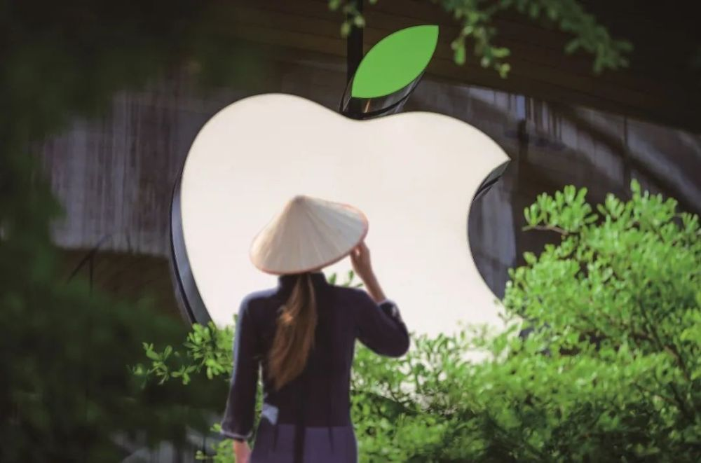
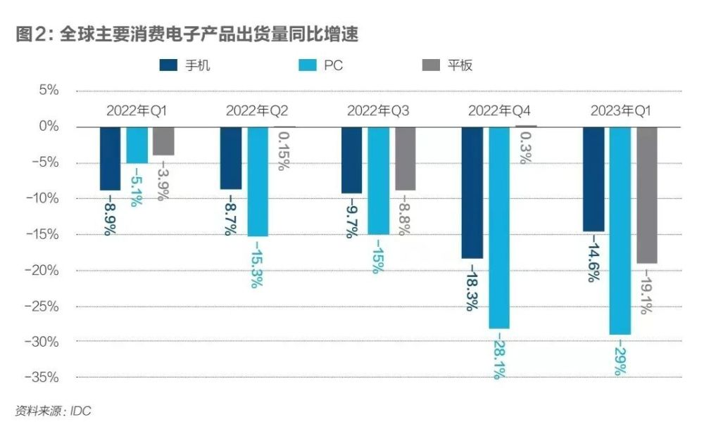
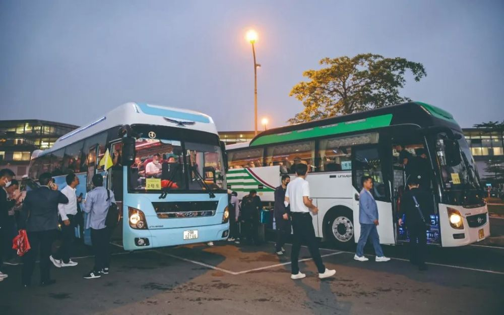
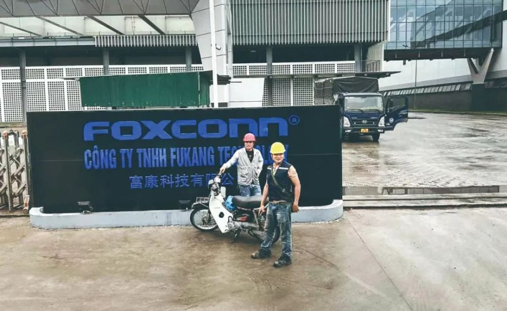
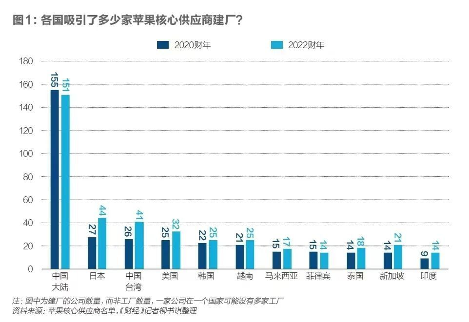

# 果链外迁，一场豪赌

苹果供应链公司从中国向越南转移，正在变成一场步步惊心的豪赌，外迁公司承受着最大的风险，并有可能错失中国市场的新机会。

**文 | 柳书琪**

**编辑 | 谢丽容**

4月中旬，天气阴沉的越南北部北宁省来了一批过百人的中国企业考察团。这种大型考察团上一轮的密集到访是在三年前，中国疫情政策调整后，高峰期再次到来。

在这个百人考察团里，有做薄膜的、做模具的、做模切的、做化工原料的、做工厂地面的、做无尘车间的，还有做劳务派遣的，绝大部分企业集中在深圳、东莞。

北宁省是中国考察团必访的一个省。它位于越南北部农产丰饶的红河三角洲（Red River
Delta）地区，是越南最小的省，同时也是人口密度最高的地方。离中国近、人口稠密、政策优惠，让北宁成为中国工厂南下的重要落脚点。

这几年来，北宁省对外商实行了“一个窗口”政策，及时帮助外商办理投资手续，最大化缩短审批时间，北宁工业区吸引了众多外企。苹果供应链上最大的组装供应商富士康的越南生产基地就在这里。

一位常驻北宁的中资企业负责人对《财经十一人》说，这是他第一次在北宁见到这么多中国人，中餐厅人满为患。当地的中资企业没有这么大的会议室，只能分批接待，或者腾出员工餐厅。

**对于北宁来说，一拨又一拨中国人到来是新的机会。** 但上述中企负责人观察，中资企业对越南的投资态度外热内冷。“嚷嚷着要出来的人多，实际落地的少。”

热闹之下，仍是犹疑。

徐进，某苹果供应链厂商海外业务负责人，随考察团第一次来到越南。这一天，他从轰鸣中的电子厂走出来，在门口急促地抽着烟。在他身后，年轻女工们扎着长长的麻花辫、穿着拖鞋，交谈间两手一折，不疾不徐地打包出一个成品。空气中弥散着轻微异味，粉尘浮动。

“至少有一半产线是停摆的。”徐进看出了蹊跷。他踩灭烟头，“日子都不好过”。

徐进近期去了一趟美国，苹果公司对接的客户负责人明确告诉他，要求他的公司一定时间内必须在越南或印度设立工厂，产能规模不作要求，但必须要有。

**中国公司跟随苹果全球生产策略往越南等东南亚国家迁移，最早要追溯到五年前。**
越南被公认为是东南亚最适合建设工厂的国家。能脱口而出的优势包括：劳动力丰沛、成本低。但近三年，越南的光环正在消退。

今年一季度，越南GDP（国内生产总值）同比增长3.32%至974.2亿美元，较去年8.02%的增速大幅放缓；出口同比下降11.9%，其中智能手机出货量同比下降15%，电子产品出货量同比下降10.9%。

全球消费电子行业低迷已超过三年。市场研究机构IDC数据显示，2023年一季度，全球智能手机、PC、平板电脑的出货量同比分别下滑了14.6%、29%和19.1%。

苹果被认为最具韧性，现在也显得吃力。2023财年二季报（为2023年一季度），苹果营收同比下滑2.5%至948.4亿美元，净利润同比下滑3.4%至241.6亿美元，已连续两个季度下滑。对于苹果供应链中的数千家公司来说，这不是一个好兆头。
**本就不充裕的订单里，飞往越南、印度的多了，飞向中国的就少了。**

考察团里的一位电子厂老板在餐桌上吐槽越南的各种不便，比如基建不全、配套不齐、地价过高。有人接了一句话，“但这里有订单。”

沉默了一会，他接上话：“不动是等死，出来或许还有一线生机。”

_规模庞大的中国考察团需要三辆大巴车才能装下。供图/主办方“中印越电子（手机）企业协会”_

**中国工厂向越南转移大致可以分为三个阶段：**
2010年后，越南承接的中国产业转移以鞋服等劳动密集型产业为主，主要出于人力、地价等成本要素的考虑；2019年中美贸易摩擦以来，美国连续多轮对中国进口产品加征关税，电子行业是重点，由此引发了以出口美国的电子企业为主的第二波转移潮；现在，外资企业的供应链策略加速由“all
in中国”转为“中国+N”，以苹果为代表的转移，成了一大新趋势。

**果链是以苹果为核心的供应链。**
在中国，果链上有超过150家供应商、259个工厂，分布在河南、广东、江苏、浙江、湖北、四川、重庆等地。这些供应商与它们的供应商自中国向东南亚、南亚迁徙，一条条无形的丝线已汇集成一张巨大的网络。

今年一季度，韩资企业对越南的投资额锐减70.4%至4.74亿美元。韩资在退场，中资却不得不入场。为了拿下美国市场的订单，到越南生产是一个必选项，哪怕越南的生产成本比中国更高。

但对于果链企业来说，到越南去，不再是一种选择，而是别无选择。但考察团成员认为，越南政策红利期最多还有三五年。

**潜在共识**

**向外走的果链从业者有着潜在共识：如果未来再出现一个iPhone4般的产品，要做好苹果不再眷顾中国的准备**

自越南首都河内向东北方向，40公里的公路需驾车一小时，穿过水塘和一年三熟、绿油油的水稻田，掠过南方农村常见的平房和小楼，如同时空穿梭，眼前迅速从田园牧歌式的景象跃入工业大生产时代。

富士康、立讯精密、歌尔声学、蓝思玻璃、领益智造、裕同包装……苹果供应链企业的园区鳞次栉比地排布在一起，厂房绵延，看不出边际，几块木板支撑起路旁瘦小的行道树。深蓝色的围挡里，塔吊、混凝土搅拌车和挖掘机又建设着新的厂区。

**苹果的抉择是商业与非商业因素叠加的结果。**
去年疫情曾造成苹果产品一时供应短缺，美国政府又向苹果施压。出于供应链安全的考虑，苹果加速将供应链转向越南、印度。越南以生产耳机、电脑和平板等产品为主，印度以生产手机为主。

第三方市场调研机构Counterpoint高级分析师Ivan
Lam对《财经十一人》解释，前者这类产品的生产难度比手机低，且印度市场需求没有显著增加，与中国接壤、物流方便的越南因此更受供应商青睐。而手机的生产体系复杂，需要庞大的资源，再加上苹果手机在印度的市场潜力巨大，印度也因此担负起了生产苹果手机的重任。

**多位越南及印度果链人士告诉《财经十一人》，苹果的策略很简单，一定比例的订单必须转移向海外，谁在海外有厂，订单就给谁。**

富士康、歌尔声学将分别投资1亿美元和2.8亿美元在越南新建工厂。苹果镜头、摄像头供应商舜宇光学今年3月提出，将投资20亿-25亿美元在越南新建工业中心。中国台湾笔记本电脑代工大厂广达近期也宣布，将投资约5000万美元，首次在越南建厂，业内人士猜测是为了生产苹果电脑。

**除了新建工厂，国内原有的果链产线也在外迁。**
2022年底歌尔声学在失去了一批苹果耳机订单后发布公告，将11条苹果产线转移至越南，占苹果产线的比例约为70%-80%，国内留下了研发团队，以及汽车、VR等产线。

歌尔声学对《财经十一人》回应，因保密协议不便透露客户生产线、供应链等问题，国内仍是公司的大本营，从零组件到相关整机研发，制造等。

但即便多家果链头部企业落地已久，越南的供应链生态土壤依然贫瘠。绝大部分原材料、设备依然要从中国进口，能在越南本地采购的品类少、质量一般，且价格高昂
**。“最夸张的一次是网线，越南本地的比深圳的贵60%。”一位越南中资企业负责人说。**

先一步来到越南的果链巨头们，又是各自供应链的链主。“我们肯定也会要求供应商来做配套。”

闫磊是一家在越南的中资果链企业负责人，他对《财经十一人》说，这不是他们公司的要求，而是终端客户的要求。从一级供应商到二级供应商，未来到三级供应商，越南本土化的目标逐步向上渗透。

越南政府不甘心只做来料加工，而是规定产品要从越南出口，必须获得越南制造（Made in
Vietnam）的产地证，其中一项标准就是产品必须有30%以上的成本在越南本地产生。

徐进所在的公司为富士康、立讯精密、歌尔等果链企业供应设备，在收到苹果转移的要求后，没有过多犹豫。做这个决定，除了硬性要求的考虑，也有对苹果的信心：
**“苹果不仅是客户，也是导师。”**

这家公司加入苹果供应链近十年。早期创业时，产品还很低端，但在随后的十年里，苹果对中国供应链企业倾注了大量心力，协助供应商研发创新、改进工艺、规范生产流程，给予从设备到技术的指导。十年来，苹果的订单量和利润相对稳定，且账期短，做苹果的订单让他的公司资金周转率大大提升。

徐进把果链外迁视作一次走出去的契机。“如果不是苹果，我们不会想到可以向外走。这是我们能力又一次提升的机会。”

何森在消费电子行业工作了20余年，他所在的企业为歌尔、瑞声等苹果耳机供应商提供扬声器材料。他告诉《财经十一人》，歌尔也希望他们搬去越南，但他们暂时还不敢搬。

扬声器、摄像头模组类的产品在电子行业中属于精密部件，已经是产业转移里相对靠后的环节。

“我们太上游了，都是中型设备，投资打底千万元级别的，中间部件、做加工的买几台二手设备，加上场地投资可能也就百八十万元。”何森预计，轮到材料端去越南做配套大约还要十年。

这批暂不打算重资产投入的企业，也在越南布下了据点，成立贸易公司、代表处，负责对接客户、售后服务。

先卡位——新到场的供应商们大多怀揣着这样的目标而来。新兴国家越南不乏机遇，但也风险四伏。入场太晚，竞争力不足；入场太早，又无法承受亏损。

人们时刻揣度着、判断着，何时是自己所在的细分赛道里最好的时机。“客户都到越南去了，你无非是在什么节点到越南去而已，迟早的事。”何森说。

有知情人士告诉《财经十一人》，苹果的玻璃盖板供应商如蓝思科技、伯恩光学虽然已在越南设厂，但还没有做规模化投资，订单较少，设备也不具备量产性，大量的加工仍在国内完成。但它们的卡位已经完成了，接下来，就是赌一个时机。

**越南看起来像是中国制造的外延。许多初来乍到的中国人都喜欢描述越南像多少年前的中国，但何森准确定位到了年份，“2005年左右”。**

这一趟越南之行，他看到了过去中国电子行业的倒影。2005年前后，中国电子产业的后端布局基本完成，主要生产国产手机，直到2010年苹果发布划时代的智能手机iPhone4，手机及电子制造业乘风而起，打响了中国制造——越南缺少的，是一个“iPhone4”时刻。

在苹果业绩衰退、消费电子行业低迷的时期，人们交错占位，盼望着这个时刻。有规模的企业很快下定决心、逆周期加注越南；小企业更三思而后行，但有不少也愿意租下一间办公室，保持观望。

向外走的果链从业者们有着潜在的共识：如果未来再出现一个iPhone4般的产品，要做好苹果大概率不再眷顾中国的准备。

**红利余晖**

**“赴越投资的政策红利期最多还有三五年，已经处于尾声了。” 张珩判断**

一场招商引资会上，越南工业园区一家开发商的越南工作人员操着普通话，指着大屏幕上的地图说，北部园区已经满了，只有中部、南部有在建的园区，但也需要提前预订。

考察团的工厂老板们交头接耳，有的说地价太高，怕自己是“接盘侠”；有的看中开发商的政府背景，能省去不少麻烦。

会后开发商提供的午餐上，一位工厂老板压低声音说，他曾参加国内一中部省份的招商会，开完会请吃饭、喝酒，最后招商官员客客气气地把他们送到机场。但深圳的招商会，自己打车来回。言下之意，越南工业园区的抢手程度应该介于二者之间。

另一位参会人士揶揄：“等他不请你吃饭的时候，你还投得进来？”

**在越南，最不缺地价暴涨的神话。**

当地中资企业家告诉《财经十一人》，两年多前OPPO曾以50美元一平方米的价格，买下越南40公顷土地50年的使用权，后来这片地一直没有开发，今年转手给歌尔声学的价格是170美元一平方米，涨了3倍多。通常外国投资者无法购买越南土地产权，只能购买50年的使用权。

五六年前，越南北部四五十美元一平方米的土地，现在80美元-100美元起步，交通便利、靠近港口的区域，价格还会更高。仅从地价而言，已超越东莞。即便如此，热门地段仍然一地难求。

越南劳动力价格也水涨船高——这是以往越南最具竞争力的成本要素。2014年越南河内周边普通工人综合成本是700元-800元左右，到2023年已涨至3200元-3600元，对比珠三角6000元-6500元左右的工人成本还有优势，但印度工人月薪仅为1500元左右。

更不妙的是，在产业链配套远不齐全的情况下，越南已经出现了劳动力紧张的苗头。越南人口约1亿，其中约50%为劳动力人口，在电子厂打工的劳动力更不算多，且技术人才稀缺。

张珩是一家越南中资企业负责人，他对《财经十一人》说，招工越来越难了，一两百号人还好招，但多了也有些吃力 **。“南部一些鞋服厂，还要从柬埔寨招工人来。”**
另一位中资企业人士补充道。只是如今订单有限，劳动力紧张的问题才有所缓解。

不过，越南与中国不同之处在于，无需建设或租赁员工宿舍，只需给员工一笔补贴费用，还要留够多的摩托车停车位。工人们住在邻近的村庄里，骑摩托车通勤。早晚高峰，摩托车大军会撑满整条马路。

越南水电成本与中国相当，原材料及设备有运费和时间差的劣势，当地基础设施建设尚不齐全。
**富士康前越南总经理卓宪宏在那场招商引资会上说，综合来看，越南的建厂成本大约比中国高出20%-30%。**

**“赴越投资的政策红利期最多还有三五年，基本已经处于尾声了。”张珩判断。**

_越南北宁省，富士康门前的两名工人。图/受访者提_

他所在的公司约十年前跟随三星到越南建厂，此后陆续生产过苹果、LG、小米等公司的耳机，以及电线、电缆、平衡车等产品。

在越南近十年，张珩最深的感触是，越南也无法逃脱全球经济放缓的时代基调。“一季度倒闭了4万多家企业。你看哪家企业不是要死不活的。”他估计，工厂能保持30%的有效利用率已经不错了。

以三星为代表的韩资企业是越南最重要的投资方。2022年，三星在越南的产值高达710亿美元，约占越南GDP总值的18%。但多位越南中资企业人士告诉《财经十一人》，近一年来，在消费电子行业衰退潮下，大量在越南的韩资工厂被库存、成本压垮，不得不关停。

今年一季度，韩资企业对越南的投资额锐减70.4%至4.74亿美元。韩资在退场，中资却不得不入场。

**中国资金涌向越南，一个重要原因是印度通道的堵塞。** 近来，印度对中国企业监管严苛，限制中国企业投资、封禁中国App、检查中资企业账目或罚款。

一家中资企业老板对《财经十一人》说，前几年在印度投资的公司从去年开始陆陆续续撤出了一批，他们公司的材料商一年在印度亏损500万元，良品率80%。直到现在，印度还在卡中国人的签证，1月递交的资料，4月还没通过。

**一位富士康印度管理层人士曾对《财经十一人》表示，对富士康这种重要的果链企业而言，中国员工遇到签证困难，会由苹果出面和印度政府沟通。但更上游的“泛果链”供应商们没有这个待遇。**

何森记得，2019年以前大约60%-70%的中国工厂老板看好印度，20%-30%看好越南。而现在，这个比例正在被中和，一批原先关注印度的人也将目光转向了越南。

越南计划与投资部外国投资局数据显示，2023年前四个月，流入越南的外国直接投资总额约89亿美元，在前三个月小幅下降后回升。
**该政府机构预测，今年全年，越南有望引进360亿至380亿美元的外国直接投资。**

_越南工业园区一家开发商介绍称，该公司的一个北部园区已全部售出。摄影/柳书琪_

2022年在对越南投资的国家和地区中，新加坡位居第一，其次依次是韩国、日本，再往后是中国大陆、中国香港和中国台湾。但一位在越南的中资银行人士估计，如果算上绕道新加坡、中国香港及中国澳门等地的资金，中国大陆的排名应该在第一或第二。

“越南成本是高，不过中国老板也还不至于投不起。”闫磊说，哪怕越南生产的成本比中国更高，为了拿下美国客户、市场的订单，到越南生产仍是一种必然。

如今公司订单不足，管理成本高，张珩打算，趁投资越南的窗口期还没关闭、地价还在高点时，将公司在越南的两个工厂卖出一个。

张珩的一些朋友很羡慕，后悔没有早来越南。他却情绪复杂：“海外有厂的痛只有自己知道，只能守着这点（土地）升值的东西安慰自己。”

**一场豪赌**

**现在的越南，为了活下来，大家都在抢订单、压价。如果苹果的订单减少乃至消失，供应商需要独自吞下苦果**

果链向海外转移，这绝不是一个轻飘飘的决定，而是一场步步惊心的豪赌。

“想要全球设厂、分散风险的是苹果，但实际的转移主体是供应商。”IDC台湾资深研究经理高鸿翔对《财经十一人》说。

天秤的一头是诱人的苹果订单，另一头是真金白银的投资建厂、劳神费力的人员管理。工厂来去、产线多寡，都与苹果无关，它是台面上唯一确定的赢家。

来到越南，中国电子厂会有一种和世界被折叠的错觉。“规模不大的企业，老板说我在做富士康、做三星，都很正常。”闫磊对《财经十一人》说。

某中资物流公司的一位负责人对《财经十一人》说，“在国内能随便见到比亚迪董事长吗？在越南我们可以一起打牌。”
比亚迪电子在越南富寿省设有电子工厂，生产平板电脑和光学镜片。今年比亚迪还计划扩大投资，新建电动汽车制造与组装的工厂。《财经十一人》无从印证他是否在吹牛。

由于越南供应链生态不成熟，许多转移来的小厂和国内的水平有差距，但富士康等大型企业会在当地扶持供应链，适当降低供应商的准入门槛。这些小厂的表面优势是快速响应、就近服务。

**越南是一个复杂的小世界，它既是高度浓缩的，将巨头和小虾米们压缩在一起；又是极度膨胀的，带着欲望与渴求，但如同泡沫般脆弱。**

Ivan Lam对《财经十一人》说，苹果通常会同时扶持多家供应商，当多家生产同类产品的供应商一齐外迁时，能吃下多少比例的订单是不明确的。

**这意味着，当苹果的订单减少乃至消失，供应商需要独自吞下苦果。**

三年前，苹果公司调整产品策略后，张珩所在的公司失去了它的核心零部件订单。越南工厂只得从零部件生产转型为代工企业，同时生产多家欧美、中国、韩国多国客户的多款产品。

张珩对此有深刻感悟：在越南有一个稳定的客户是不够的，客户和订单的多样性都要有保证。“消费电子行业像电风扇一样，转动速度很快，每个周期都很短。”

**他认为，中国企业最大的问题是没有靠山。**
“富士康、立讯精密在三星、LG面前还是个小公司。”前者带动的供应链量级在10亿元左右，而三星、LG带动的是30亿元、50亿元规模的公司。

韩资企业是紧密抱团的典范。以三星、LG为供应链链主，订单首先飞向韩国供应商，即便报价比中资企业贵2%-3%。但也不是完全不考虑中资企业，在订单量充裕或者中资企业价格优势大时，中资企业才有机会当上边缘合作伙伴。

身处其中的中资企业愈发步履维艰。闫磊发现，越南越来越“卷”了，很多客户对越南缺乏了解，理所当然地认为越南经济落后、成本低廉，对待海外工厂的要求是“价格必须低于中国”。

全球终端厂商都在缩减订单、延期项目、清理库存的情况下，到越南的企业却在增多，僧多粥少。很多电子厂之所以没有倒闭，是还凭着最后一口气撑着，希望挺到市场回暖时，还有机会。

**“为了活下来，大家都在抢订单、压价。”闫磊说，“盈利非常艰难，就算盈利也是微利，就是一点辛苦钱。”**

“你以为很多公司愿意做苹果吗？不做苹果以后，我活得比做苹果还好。”张珩大声直言。

Ivan
Lam发现，一些台湾比较成熟的厂商，已经对苹果祛魅、有意识地挑选利润更高的订单。但中国大陆的很多厂商仍在成长阶段，更倾向于忽略较高的运营费用，赚取微薄的利润。

**这是个危险的信号。** 越南现有的果链体系中，绝大多数都是缺乏技术壁垒的低端环节，价格战到最后可能是死路一条。

摩托车之战是所有电子厂老板熟知的故事。早年间越南的摩托车由中国品牌占领，但由于价格竞争，品质不断下降。越南的购买力上来后，日本摩托车迅速挤掉了中国的市场。如今在河内的大街小巷，几乎都是日本摩托车。

**苹果在中国搭建供应链体系时，中国企业有主场优势，但到了越南，任何国家的企业都在同一条起跑线上。**

在海外建厂后，苹果必然与当地政府合作，在本土寻求替代的供应商，比如买下伟创印度工厂的塔塔集团。“这就像苹果给本土企业一个机会，让它们练练手。”一位富士康印度人士称。

塔塔集团是印度最大的财团，旗下100多家公司涉及七个领域：通信和信息技术、工程、材料、服务、能源、消费产品和化工产品。其在信息制造领域目前的竞争对手富士康、立讯精密，已属于相对高端的环节。“果链中很多低端的环节，它们是很容易进入的。”闫磊说。

这些年果链企业在越南缓慢培养出了一批本地的技术骨干，它们自己建厂、成为富士康供应商。这些本土供应商的经验有限，短期内不可能取代原有果链企业的地位。但谁也说不准未来。

“没有自主品牌，都是做代工，有品牌也是很低端的。所以说为什么我们总是被别人牵着鼻子走。”闫磊感慨。这是中国制造多年以来难解的顽疾。

**中国会被掏空吗？**

**中国的产业转型与升级一直在进行中，留在中国的工厂都在寻找新出路**

果链往东南亚转移看起来势不可逆，人们开始担心，中国是否会被“掏空”，甚至有人担心，如果失去了富士康，经济与就业该何去何从？

“不必恐慌，（越南和印度）五年内要取代中国都不可能。”高鸿翔夸张地扬了扬手，“那怎么也得是100年以后的事。”

**越南与印度，一个作为中国邻国，吃的是风险分散的红利；一个是庞大的新兴市场，本身对苹果而言就有吸引力。二者都有增长潜力，但目前都难以动摇中国制造业的根基。**

Counterpoint对《财经十一人》提供的数据显示，预计2023年，中国在苹果手机、耳机、PC、平板生产中的份额均将下滑，印度的苹果手机份额由4%增至7%，越南的其他三类产品份额也有所提升。

尽管越南与印度的分量越来越重，但细究苹果供应链的生产国别比重，中国依然保持着惊人的94%的平均份额。

在参观一家工厂的流水线后，一家中国电子厂老板对越南工人的效率很不满意。他年轻时也曾在流水线上打工，“我们那时候手速都是刷刷的，哪里像他们慢吞吞的”。

一位越南中资企业人士评价，越南与中国文化相近，工人愿意加班工作，但由于城市化率不高、土地产权私有，水稻一年三熟，粮食充裕，他们的生活压力和进取动力都不大。而印度的工厂多次发生罢工和其他混乱事件，现在为了方便管理，富士康印度工厂更愿意招募女工。

除了手脚麻利的中国工人，中国消费电子制造业过去二三十年形成的深厚根基，很难短期内撼动。

这次考察之后，一家主营光学元器件、精密模具的公司负责人非常确定地对《财经十一人》说，越南没有这个条件。

上述公司生产的产品在消费电子供应链中属于技术壁垒较高的一类，对技术、设备、人才和管理的要求都更高。但越南目前严重缺乏理工科人才，技术骨干、管理人员都不具备。

**“制造业拼到最后拼的是什么？是保证品质和交付前提下的成本领先。”这位光学元器件人士说，中国在这三要素上的优势短期内难以被撼动。**

果链生态体系，好比广东常见的榕树。树冠是苹果，富士康、和硕、立讯精密这几大代工厂是粗壮的树干。而在泥土下盘根错节的，是由数百种细分门类组成的供应链世界。

高鸿翔认为，一个发展中国家要想提振工业能力，应当从低阶向高阶过渡，比如中国手机产业链的发展曾经历过山寨机泛滥、自主品牌井喷的过程，上游制造业也在产业变迁中逐步完善工艺，这样才能切入苹果供应链。

越南和印度要想补齐这门课，需要从组装环节一步步向上渗透，这是个长周期的苦活。“即便有能力同步生产苹果新品，也不代表它们具备了先进制造的能力。”高鸿翔评价。

从这个角度而言，越南与中国实质上形成了分工合作的关系。中国是越南第一大的商品进口市场、第二大出口市场。2023年前四个月，越南从中国进口332亿美元，向中国出口164亿美元。虽然受经济环境影响，同比有所下滑，但中越贸易表现仍优于其他许多市场。

中国的产业转型与升级一直在进行中，留在中国的工厂都在寻找新出路。

瑞信亚太区财富管理部大中华区副主席陶冬告诉《财经十一人》，产业空心化听起来是个坏词，实则未必。欧美、日韩也曾经历过制造业外迁，但它们维持住了核心产业、支柱产业，比如航空、汽车、能源、半导体等。

智能电动车的兴起，为消费电子企业打开了窗口期。奥纬咨询董事合伙人张君毅对《财经十一人》说，汽车行业对零部件可靠性要求极高，供应链相对封闭，过去外来者很难打入这个体系，现在消费电子企业有了转型的机会，但“很短暂，稍纵即逝”。

汽车电子比消费电子的周期更长，尤其是涉及汽车安全性的技术，通常需要两三年的认证和合作周期。投入大、毛利低、账期长，都是消费电子行业需要警惕的。

在产业转移的浪潮下，果链企业在寻找新的增长空间。富士康、立讯精密、舜宇光学、蓝思科技、闻泰科技等多家企业都在向汽车领域渗透。《财经十一人》还发现，一些供应商也在同步拓展光伏、储能等领域。

**陶冬认为，产业升级长远来看对中国而言是乐观的，只是短期需要缓解就业等转型期的阵痛。**

何森最近在全国奔走，他的工作重心是发展汽车、氢能源领域的客户。过去熟悉的一整套逻辑都要大调整，何森需要重新学习，企业也需要重新思考布局，“一个结点变了，其他节点都要变，投入成本是非常高的”。

但何森很坚定。“要么有核心技术，要么产业转型。”这是中国制造必须经历的过程。

（应受访者要求，闫磊、张珩、 徐进、何森为化名）

