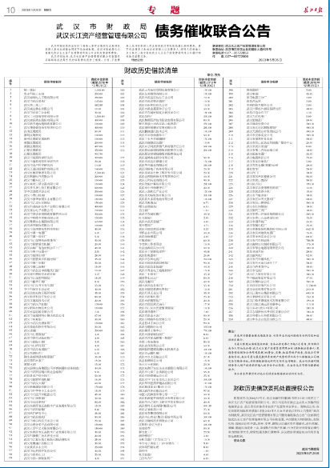
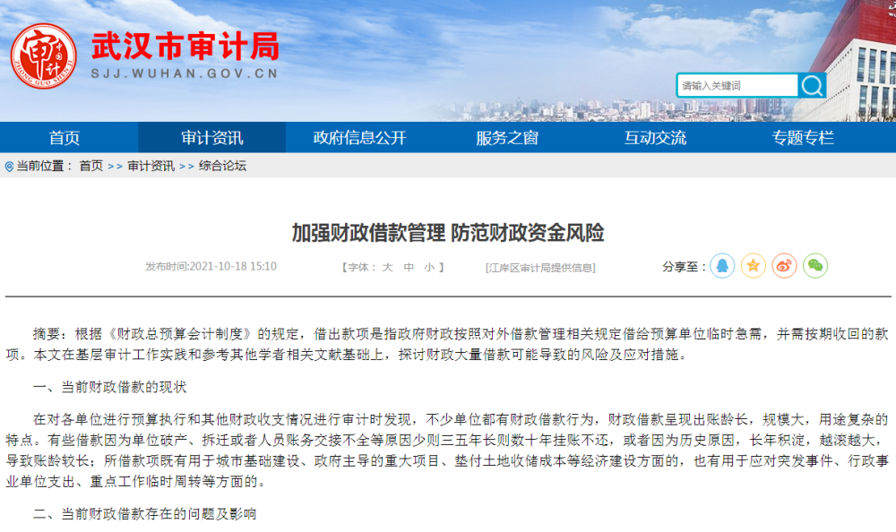

# 武汉财政局公开催债后续：辖区多个区财政局称还在查账，属历史遗留问题

5月26日，武汉市财政局在报纸刊登催收公告，公开“喊话”259家单位及时偿债，名单涉及知名企业及辖区多个区财政局，引发舆论关注。红星资本局检索发现，这259家单位中，部分企业已经注销，部分被吊销，也有不少企业仍在存续期。

5月30日，红星资本局从债务名单中的多个区财政局获悉，目前正在查账，也在和武汉市财政局沟通。一名区财政局工作人员称，“这是历史遗留问题。”红星资本局拨打武汉市财政局多个部门电话和公告中武汉长江资产经营管理有限公司的联系电话，均未获有效回应。

有财税专家向红星资本局表示，过去几年听到过的是地方融资平台向社会筹集资金、到期后债务偿还出现困难的消息，此次是地方政府部门作为债权人遇到社会债务主体偿还困难，并在媒体上刊登催收公告，还是较为少见。

_↑5月26日，武汉市财政局、武汉长江资产经营管理有限公司在《长江日报》刊登的联合债务催收公告，目前此公告已被删除_

**多个区财政局回应**

**还在查账，属于历史遗留问题**

被“催债”的259家单位，包括武汉市下辖各区财政局、企事业单位，还有地方国企、上市公司子公司和少数民企，截至2018年12月20日，借款本金余额总额超过1亿元。其中，欠款最高的达2354万元，系东风武汉轻型汽车公司；欠款超过1000万元的还有知名企业统一集团、武汉工业国有投资有限公司和武汉红桃开集团有限公司。武汉市下辖的汉南区、蔡甸区、新洲区、黄陂区和江夏区等五地财政局，欠款数由50万元到1252万元不等。

红星资本局注意到，前述公告称，武汉市财政局、武汉长江资产经营管理有限公司前期已采取邮寄送达等方式对该等债权进行了催收，但截至公告发布，名单中的债务人及相应担保人仍没有向武汉市财政局履行相关债务。

5月30日，红星资本局从债务名单中的多个区财政局获悉，他们多是在武汉市财政局的催收公告发出后才得知的这一消息，部分区财政局目前正在查账，也在和市财政局沟通，建议记者直接向市财政局了解情况。

“这个事情我们也不太清楚，我们也感到非常奇怪，多方打听也搞不出个所以然来。”汉南区财政局一名工作人员表示，该项借款年份久远，目前“无账可查”，连局里的老同志也不清楚。

黄陂区财政局一名工作人员表示“还在核对”，借款涉及的具体项目还不清楚，“可能有一二十年了。”新洲区财政局一名工作人员则表示，“我们还在跟他们（市财政局）对账，因为这是历史遗留问题，不是近期的事情，是上世纪八九十年代的事情。”

5月30日，红星资本局拨打武汉市财政局多个部门电话了解该情况，未获有效回应。记者多次拨打公告中武汉长江资产经营管理有限公司的联系电话，均未接通。

据经济观察网报道，一名东部某市地方财政部门负责人介绍，武汉市财政局列出的欠款很多属于历史遗留问题。上个世纪末，财政部门给国企、事业单位的一些借款，还有一些是以前政府部门给国企等担保产生的欠账。该负责人称，大部分县区财政欠市级财政的款项很多，比如债券利息，担保补贴等，但不应把县区财政也公布出来，可以通过体制决算来解决问题。

该负责人猜测，武汉市财政局有可能被监督部门查到以前预算不规范所产生的历史欠账，所以才通过武汉长江资产经营管理有限公司理清并处理历史上的债权、债务关系，然后再寻找一个合适的方法核销，这也是预算管理规范的一个过程。

**公开“喊话”较少见**

**不是一种普遍的情况**

地方财政局公开催债的情况较为少见，因此此次武汉市财政局登报“喊话”259家单位，还向公众有偿征集相应债务人的财产线索，引发舆论关注。

中央财经大学财政税务学院教授曾康华向红星资本局介绍，过去几年，听到的是地方融资平台向社会筹集资金、到期后债务偿还出现困难的消息，此次是政府部门作为债权人遇到社会债务主体偿还困难，并在媒体上刊登催收公告，还是较为少见。政府部门依据出借款项的相关合同到期后正常收回欠款，也是作为债权方维护利益的体现。

广东一名不愿具名的财税专家向红星资本局介绍，我国财政体制属于“一级政府一级财政”，市级财政和县区级财政相对独立，均具有完整的预算体系，不过两者也属于上下级关系，因此财政系统内部的相互借款和债权债务的定期清理均属于正常情况，一般来说会通过内部发文传达，不会公之于众。该专家猜测，武汉市财政局此举可能是因为“通过正常渠道去催县区财政的钱催不到，所以需要通过公开的方式加强舆论监督。”

华北地区一名财税专家向红星资本局表示，我国对财政支出有严格规定，地方政府有一定的资金管理权限，财政资金用于促进当地社会经济发展，因此通过有偿借贷的方式扶持某一行业的发展、某些产品的开发也属于正常范畴，过去在国外也有类似情况，“但是必须要符合一定时期的特殊财政政策，这也不是一种普遍的情况。”

据21世纪经济报道，有知情人士表示，这是按财政部要求清理历史借款，政策要求在一定时限内完成财政暂付款的清理。债务催收公告，跟当地财政困难无关，跟地方债也无关，是按政策要求清理财政周转金。列举的借款信息，有些时间比较长了，有些是2002年，过了法律时效。

**多地都在清理财政暂付款**

**有地方已取得进展**

红星资本局注意到，2021年10月，武汉江岸区审计局在武汉审计局官网上发文《加强财政借款管理
防范财政资金风险》表示，借出款项是指政府财政按照对外借款管理相关规定借给预算单位临时急需，并需按期收回的款项。在对各单位进行预算执行和其他财政收支情况进行审计时发现，不少单位都有财政借款行为，财政借款呈现出账龄长，规模大，用途复杂的特点。

_↑截图自武汉审计局官网_

针对“当前财政借款问题的原因分析”，该文章提到，借款管理制度缺失。第一，财政借款缺乏法律法规依据。上世纪末国务院取消财政部门的财政周转金借款以后，财政部门就不再具有财政借款的职能，因此目前财政部门的财政借款缺乏相关法律法规依据。第二，财政部门内部衔接不到位。财政内设机构的工作存在脱节现象，有的出借资金以前年度已经归还，但滞留在局内相关科室，未及时划拨给国库部门；有的借款业务有变动，却未及时通知相关科室调整账目，导致余额不对应等。

据第一财经报道，一名负责暂付款清理的地方财政人士介绍，今年中央发文要求进一步加强财会监督，其中清理包括财政借款在内的暂付款就是其中一项内容，因此今年不仅是武汉在清理，全国各地都在清理。另外，财政部之前也发文，要求今年原则上完成这项工作。

一些地方在清理暂付款方面取得了进展。今年4月28日，江西省财政厅印发《关于进一步严格财政暂付性款项管理及开展2023年动态清零试点工作的通知》，选择新余、宜春两个市本级，以及南昌市东湖区、景德镇市珠山区、莲花县等14个县区开展2023年暂付性款项动态清零试点，实现暂付性款项年终无余额。文章显示，江西从2022年启动市县暂付性款项动态清零试点工作，当年有19个试点区县及10个非试点区县实现暂付款项动态清零。

红星新闻实习记者 蒋紫雯 记者 俞瑶

编辑 余冬梅

