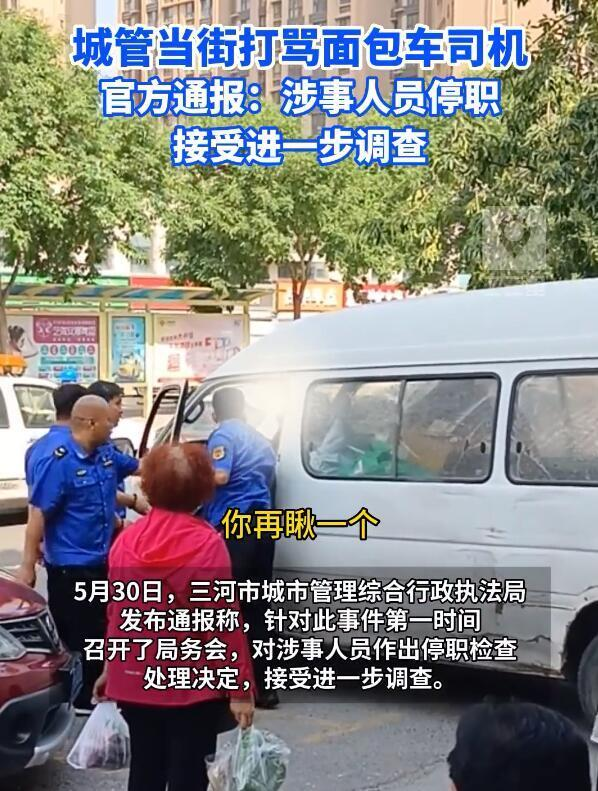
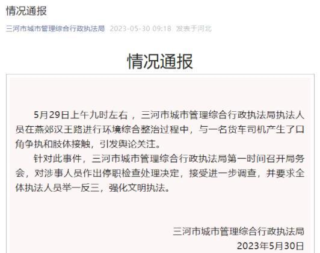

# 河北一城管当街打骂货车司机，官方通报：停职，接受进一步调查

5月29日，河北廊坊。一名身穿城管制服男子对一名面包车司机动手，嘴里还念念有词，身边还有几名身穿制服的人。有目击者称，打完第一次后，面包车司机看了他们一眼，城管就又对司机动了手，把眼镜都打掉了，司机全程没有反抗，也不敢吱声。

5月30日，三河市城市管理综合行政执法局通报：5月29日上午九时左右
，三河市城市管理综合行政执法局执法人员在燕郊汉王路进行环境综合整治过程中，与一名货车司机产生了口角争执和肢体接触，引发舆论关注。

针对此事件，三河市城市管理综合行政执法局第一时间召开局务会，对涉事人员作出停职检查处理决定，接受进一步调查，并要求全体执法人员举一反三，强化文明执法。

（来源：三河市城市管理综合行政执法局）

