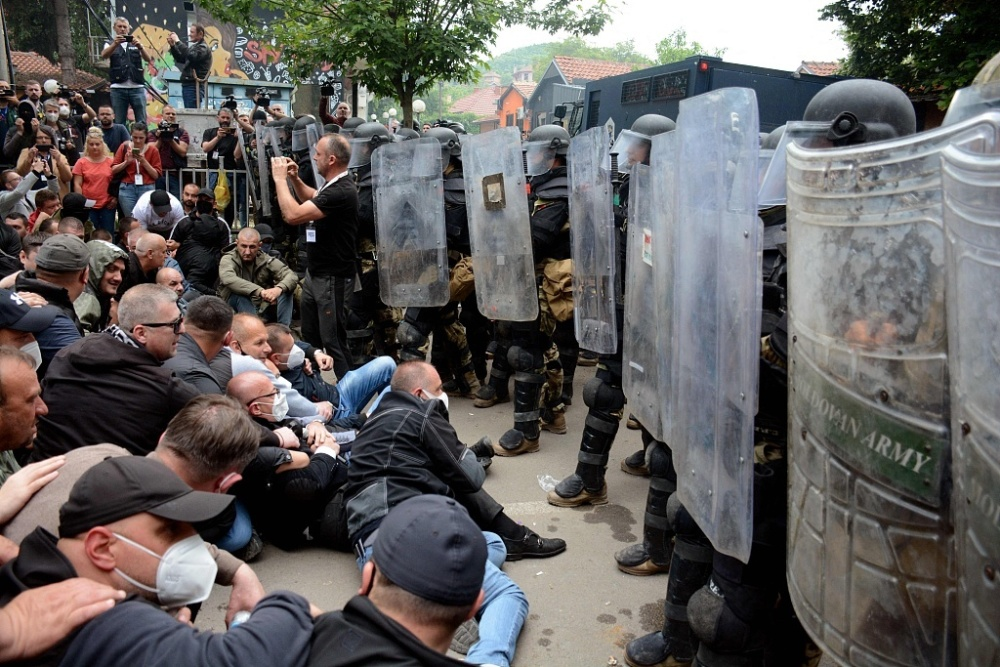

# 科索沃冲突致多方人员受伤，塞尔维亚、北约、意、匈官员表态

5月29日，科索沃警察和北约维和部队在科索沃北部与塞族抗议者发生冲突，造成超过30名北约维和人员受伤。塞尔维亚总统武契奇则表示，此次冲突还导致52名塞族人受伤住院，另有41名驻科士兵受伤。

_当地时间2023年5月29日，科索沃地区兹韦钱，在市政大楼外举行的要求罢免新当选的阿族市长的抗议集会中，塞族人面对防暴警察。视觉中国
图_

据英国《卫报》5月30日报道，在冲突发生后，武契奇已将塞尔维亚军队的战斗警报设为最高级别。

此次冲突的直接导火索是科索沃塞族对地方选举的抵制行动。5月29日，塞族抗议者在科索沃北部兹韦钱（Zvečan，塞族区）市长办公室外第二次发起行动，阻止新当选的阿尔巴尼亚族市长进入。在外值守的北约维和部队使用催泪瓦斯和震荡弹针对抗议者，与塞族抗议者陷入冲突。

北约驻科索沃维和部队（Kosovo
Force，Kfor）在一份声明中谴责了塞族抗议者，称这是“暴力行动”。“在应对抗议人群最活跃的一翼时，几名来自意大利和匈牙利的Kfor特遣队士兵受到了无端攻击。有燃烧装置爆炸，他们因此骨折和烧伤。”

Kfor指挥官里斯杜查（Angelo Michele Ristuccia）抨击这些攻击是“不可接受的”，强调北约特遣人员将“继续公正地履行任务”。

匈牙利国防部长克里斯托夫·萨莱·博布罗夫尼茨基在社交平台脸书上说，有20多名匈牙利士兵在事件中受伤，其中7人伤势严重但情况稳定。意大利外长塔亚尼表示，事件中11名意大利士兵受伤，其中3人伤势严重。

意大利总理梅洛尼表态称，不会容忍对Kfor的“进一步攻击”。“必须避免科索沃当局采取进一步的单边行动。所有各方必须退一步，降低紧张局势。”

塞尔维亚方面，总统武契奇说有52名塞族人在事件中受伤，其中3人伤势严重。另有41名驻科士兵受伤。武契奇谴责科索沃当局是紧张局势的制造者和推动者。

5月30日，武契奇召见美国、英国、法国、德国和意大利五国大使以及欧盟代表团团长，就科索沃紧张局势举行会谈。塞尔维亚国防部长武切维奇和武装部队总参谋长莫伊西洛维奇也出席会议。

