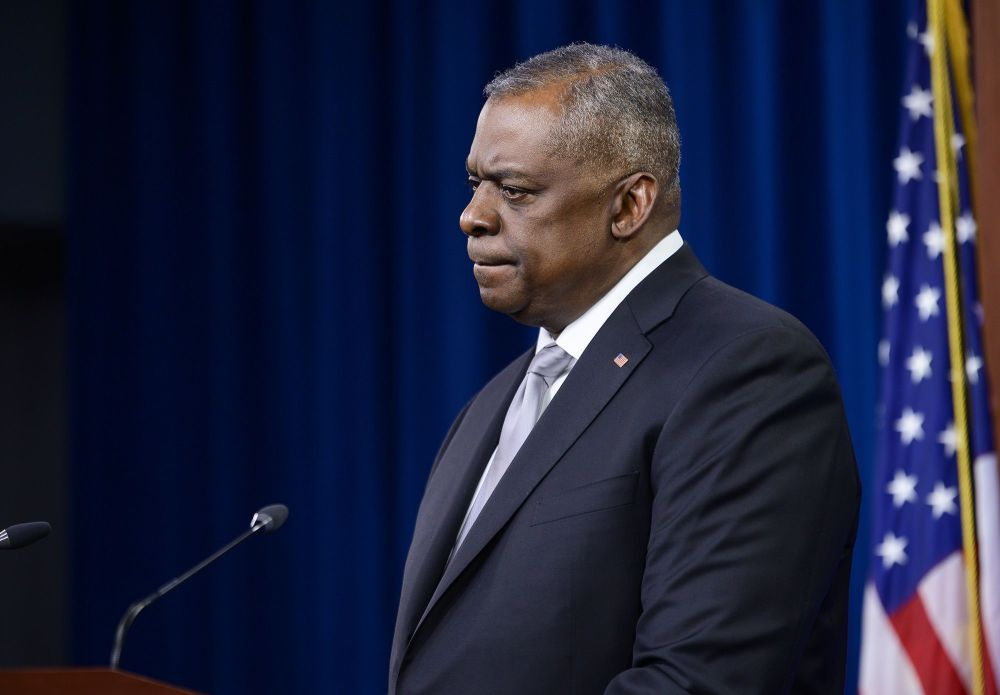

# 美国国防部：中方拒绝了中美防长在香格里拉对话会会面的请求

（观察者网讯）据《华尔街日报》5月29日报道，五角大楼当天在一份声明中称，中方正式拒绝了美国提出的两国防长在新加坡香格里拉对话会上会面的请求。有美国国防部官员称，以前类似的会谈往往在最后一刻才敲定，中方的拒绝发出了“不同寻常的直率信息”。

_《华尔街日报》：中方拒绝了美国防长_

五角大楼在给《华尔街日报》一份声明中表示：“一夜之间，中国通知美国，他们拒绝了我们5月初提出的关于奥斯汀部长与中国国防部长李尚福本周在新加坡会面的请求。”声明还称，“国防部坚信，为确保竞争不会演变成冲突，保持华盛顿和北京之间开放的军事沟通渠道很重要”。

报道援引美国国防部官员的话称，中方的拒绝“被视作一种不同寻常的直率信息”，因为在过去，这样的会晤通常是在最后一刻才敲定的，去年奥斯汀的几场会议甚至是在会前几个小时才决定的。

白宫没有立即回应置评请求。

_美国国防部长奥斯汀/资料图_

香格里拉对话会是全球规模最大、规格最高的多边安全论坛之一，今年会期落在6月2日至4日。奥斯汀早前宣布，计划于6月初访问新加坡，并参加在新加坡举行的香格里拉对话会。

国防部新闻发言人谭克非大校在29日的记者会上表示，国务委员兼国防部长李尚福将于5月31日至6月4日应邀出席第20届香格里拉对话会并访问新加坡。会议期间，李部长将就“中国的新安全倡议”议题作大会发言，会见有关国家代表团团长。访新期间，李部长将与新政府和防务部门领导举行会见会谈。

一些美国官员警告说，美国的东南亚盟友可能会对会谈搁浅感到担忧，因为他们不想被夹在中美两个大国之间。

报道称，在中方正式拒绝之前，美国花了一周时间试图确保会谈能够举行。

当地时间5月25日，美国负责“印太地区”安全事务的助理国防部长埃利·拉特纳出席美国智库“战略与国际研究中心”主办的论坛活动时称，五角大楼已向中方提出了两国防长6月在新加坡香格里拉对话会上会面的请求，但中方“至今没有回复”。

“奥斯汀防长和五角大楼提出了与中国防长李尚福会面的请求，但这一请求没有得到任何答复”，拉特纳在论坛上表示，两国防长是否能会面“现在由中方决定”。

英国《金融时报》5月11日援引消息人士的话称，两国防长对话面临障碍，在香格里拉对话会上会面的可能性很小。在当天例行记者会上被问及此事时，我外交部发言人汪文斌回应称，“关于你提到的问题，建议向中方主管部门了解”。

“当前中美关系遭遇困难，责任不在中方。”对于中美关系现状，我外交部发言人汪文斌此前指出，当前中美关系紧张的根源在于美方基于错误的对华认知制定和执行错误的对华政策。

汪文斌表示，美方应停止干涉中国内政，停止损害中国利益，停止一边声称要为中美关系加装“护栏”、一边破坏两国关系的政治基础，同中方相向而行，推动中美关系重回健康稳定发展正轨。

**本文系观察者网独家稿件，未经授权，不得转载。**

