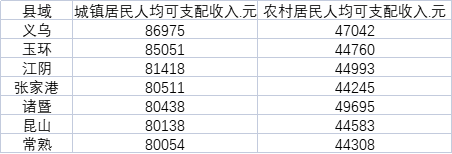

# 7县城镇居民人均收入超8万元，浙江义乌、玉环两地超过北上广深

一般来说，经济发达城市凭借优质的社会公共资源和良好的就业机会，对流动人口形成强大的吸引力。这些城市中，既有一二线大城市，也有一些中小城市。在县域层面，哪些地方的收入水平高呢？

第一财经记者梳理发现，去年有4个县居民人均收入已超7万大关。从城镇居民收入来看，有7个县域的城镇居民人均收入超过了8万元，比肩一线城市，义乌、玉环城镇居民人均收入超过了北上广深。

数据显示，2022年全体居民人均收入最高的10个县域全部集中在浙江和江苏，且浙江和江苏各5个。其中浙江的5个县域分别是义乌、玉环、诸暨、瑞安和乐清，其中，3个来自浙东南的温台地区，一个来自浙江中部的金华地区，一个来自绍兴市。江苏的5个县域分别是昆山、江阴、张家港、常熟，太仓，全部来自苏南的苏州和无锡。

经济发达的县域，城镇化水平较高，县城（县级市市区）的规模也比较大，城镇的就业机会多。那么，哪些县域的城镇居民收入高呢？

数据显示，2022年，我国有7个县域的城镇居民人均收入超过了8万元大关，分别是义乌、玉环、江阴、张家港、诸暨、昆山和常熟。其中，义乌和玉环两地的城镇居民人均收入都超过了8.5万元，超过了北上广深四大一线城市。

表：城镇居民人均可支配收入超8万元的县域（来源：第一财经记者根据各地统计公报、公开数据整理）

数据显示，2022年义乌城镇常住居民人均可支配收入为86975元，位居第一。人口方面，2022年末义乌全市常住人口188.8万人，比上年末增加0.3万人，城镇化达到80.7%。第七次全国人口普查数据显示，2020年义乌的城区人口达到118.4万人，居县级市第二位。义乌的城区人口比所在地级市金华还多38.5万，在全国也仅此一例。

义乌是全球最大的小商品集散中心，近年来电商发展十分突出，集聚了大量的从业人员。数据显示，2022年全年义乌实现电子商务交易额3907.28亿元，同比增长5.2%，其中电子商务内贸交易额2823.78亿元，同比增长4.5%；跨境电子商务交易额1083.5亿元，同比增长6.9%。

杭州规划委员会专家委员会副主任委员汤海孺对第一财经分析,义乌是小商品之都，个体户、企业比较多，近年来积极向电商转型，快递数量、电商直播都很突出，整体的收入水平较高。

义乌之后，玉环城镇居民人均可支配收入也达到了85051元，位居第二。玉环位于浙江东南部的温台地区，经商人群多，水暖管件、汽摩配件、五金机械等主导产业、特色产业发展十分突出。

苏南的江阴去年城镇居民人均可支配收入达到了81418元，位居第三。数据显示，截至2022年底，江阴纺织、冶金、化工三大主导产业产值占规上工业比重为47%，比3年前下降了10个百分点；高端装备、新能源、集成电路、生物医药四大战略性新兴产业产值占比则由29%升至37%。

同处苏南的张家港、昆山、常熟和浙江绍兴下辖的诸暨城镇居民人均可支配收入也都超过了8万元，超过了广深两个一线城市。这其中，昆山市素有“中国最强县”之称。昆山2022年全年完成地区生产总值5006.7亿元，按不变价格计算同比增长1.8%，成为全国首个GDP突破5000亿元的县级市。

中小城市研究院院长牛凤瑞对第一财经分析，昆山离上海很近，接受上海的辐射和功能外溢多。近年来昆山的转型升级在县域中是十分突出的，高新产业发展非常不错。

数据显示，2022年末昆山有效高新技术企业2744家。全年新增省级独角兽企业1家、潜在独角兽企业18家、苏州瞪羚企业133家。高新技术企业数量在县域中领跑。到2022年年末，昆山拥有1个千亿级IT（通信设备、计算机及其他电子设备）产业集群和12个百亿级产业集群。拥有大型工业企业113家、中型工业企业303家，产值超亿元企业1083家，其中十亿元以上企业138家、百亿元以上企业13家。

