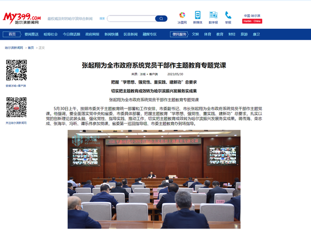
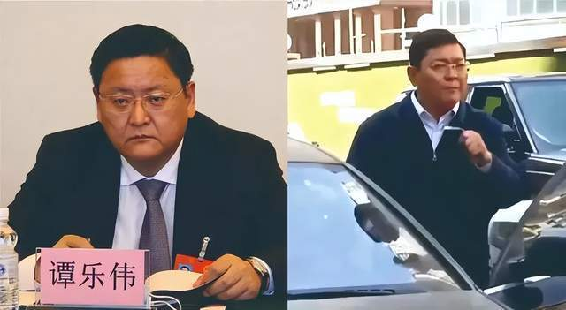
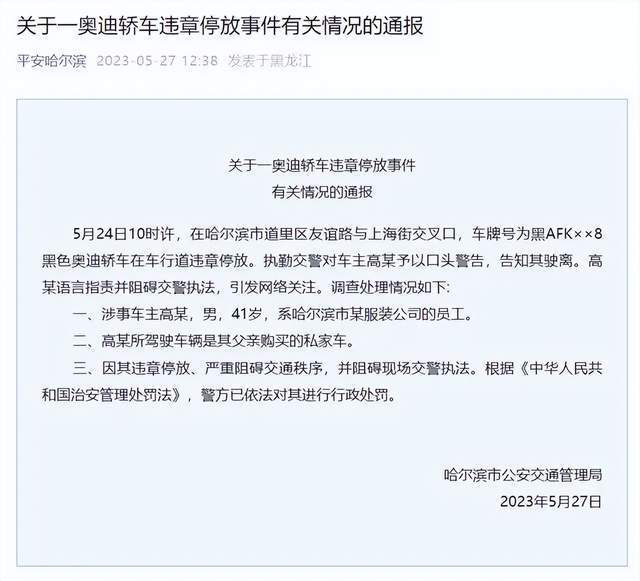

# “奥迪车主怼交警”官方辟谣3天后，谭副市长露面了

官方辟谣后3天，被部分网友误会的哈尔滨副市长谭乐伟公开亮相了。

哈尔滨官媒“冰城+”客户端5月30日的报道《张起翔为全市政府系统党员干部作主题教育专题党课》提到：5月30日上午，按照市委关于主题教育统一部署和工作安排，市委副书记、市长张起翔为全市政府系统党员干部作主题党课……蒋传海、栾志成、张海华、冯昕、
**谭乐伟** 参加党课。

这是“奥迪车主怼交警”事件发酵后，谭乐伟首次露面。

**事件回顾**

近日，哈尔滨市一男子疑似违章停放车辆，被交警口头警告后回怼交警的视频在网上传播。有网民称，视频中男子“疑似哈尔滨市某位副市长”。

对此，哈尔滨市交管局5月27日发布“关于一奥迪轿车违章停放事件有关情况的通报”称，涉事车主高某为某服装公司员工，非领导干部。

目前，高某因违章停放、严重阻碍交通秩序，并阻碍现场交警执法被行政处罚。哈尔滨市政府办公厅相关工作人员亦表示，有网民称“与交警发生争执的男子为哈尔滨市副市长”纯属谣传。

上一次谭乐伟出现在媒体报道中是5月22日，中间经历奥迪谣传风波，有8天没露面。此次出现在官方报道中，再次打脸谣言，名誉进一步澄清。

综合编辑：邢志彬

