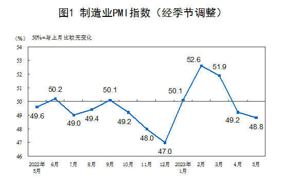
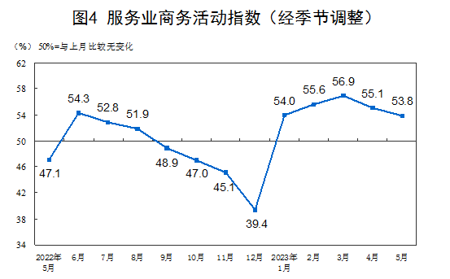
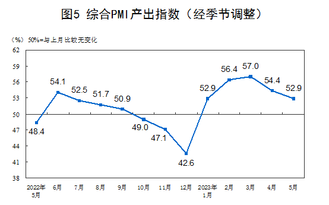

# 中国5月制造业PMI48.8，较上月降0.4个百分点，非制造业PMI54.5

国家统计局服务业调查中心

中国物流与采购联合会

**一、中国制造业采购经理指数运行情况**

5月份，制造业采购经理指数（PMI）为48.8%，比上月下降0.4个百分点，低于临界点，制造业景气水平小幅回落。

从企业规模看，大型企业PMI为50.0%，比上月上升0.7个百分点，位于临界点；中、小型企业PMI分别为47.6%和47.9%，比上月下降1.6和1.1个百分点，低于临界点。

从分类指数看，在构成制造业PMI的5个分类指数中，供应商配送时间指数高于临界点，生产指数、新订单指数、原材料库存指数和从业人员指数均低于临界点。

生产指数为49.6%，比上月下降0.6个百分点，表明制造业生产活动有所放缓。

新订单指数为48.3%，比上月下降0.5个百分点，表明制造业市场需求继续回落。

原材料库存指数为47.6%，比上月下降0.3个百分点，表明制造业主要原材料库存降幅有所扩大。

从业人员指数为48.4%，比上月下降0.4个百分点，表明制造业企业用工景气度下降。

供应商配送时间指数为50.5%，比上月上升0.2个百分点，表明制造业原材料供应商交货时间持续加快。

**二、中国非制造业采购经理指数运行情况**

5月份，非制造业商务活动指数为54.5%，比上月下降1.9个百分点，仍高于临界点，非制造业延续恢复性增长。

分行业看，建筑业商务活动指数为58.2%，比上月下降5.7个百分点；服务业商务活动指数为53.8%，比上月下降1.3个百分点。从具体行业看，铁路运输、水上运输、航空运输、电信广播电视及卫星传输服务、互联网软件及信息技术服务等行业商务活动指数位于60.0%以上高位景气区间；资本市场服务、房地产等行业商务活动指数低于临界点。

新订单指数为49.5%，比上月下降6.5个百分点，低于临界点，表明非制造业市场需求有所回落。分行业看，建筑业新订单指数为49.5%，比上月下降4.0个百分点；服务业新订单指数为49.5%，比上月下降6.9个百分点。

投入品价格指数为47.4%，比上月下降3.7个百分点，低于临界点，表明非制造业企业用于经营活动的投入品价格总体水平由升转降。分行业看，建筑业投入品价格指数为44.7%，比上月下降3.4个百分点；服务业投入品价格指数为47.9%，比上月下降3.8个百分点。

销售价格指数为47.6%，比上月下降2.7个百分点，低于临界点，表明非制造业销售价格总体水平较上月下降。分行业看，建筑业销售价格指数为46.9%，比上月下降4.6个百分点；服务业销售价格指数为47.8%，比上月下降2.3个百分点。

从业人员指数为48.4%，比上月上升0.1个百分点，表明非制造业企业用工景气水平略有回升。分行业看，建筑业从业人员指数为48.5%，比上月上升0.2个百分点；服务业从业人员指数为48.3%，比上月上升0.1个百分点。

业务活动预期指数为60.4%，比上月下降2.1个百分点，连续位于高位景气区间，表明非制造业企业对近期市场恢复发展持续看好。分行业看，建筑业业务活动预期指数为62.1%，比上月下降2.0个百分点；服务业业务活动预期指数为60.1%，比上月下降2.2个百分点。

**三、中国综合PMI产出指数运行情况**

5月份，综合PMI产出指数为52.9%，比上月下降1.5个百分点，继续保持在景气区间，表明我国企业生产经营总体延续恢复发展态势。

**5月份制造业采购经理指数小幅回落 非制造业商务活动指数保持扩张**

**——国家统计局服务业调查中心高级统计师赵庆河解读2023年5月中国采购经理指数**

2023年5月31日国家统计局服务业调查中心和中国物流与采购联合会发布了中国采购经理指数。对此，国家统计局服务业调查中心高级统计师赵庆河进行了解读。

5月份，制造业采购经理指数、非制造业商务活动指数和综合PMI产出指数分别为48.8%、54.5%和52.9%，低于上月0.4、1.9和1.5个百分点，我国经济景气水平有所回落，恢复发展基础仍需巩固。

**一、制造业采购经理指数小幅回落**

5月份制造业PMI继续位于收缩区间，在调查的21个行业中，有11个行业PMI位于扩张区间，行业景气度呈现一定程度分化。

（一）产需两端有所放缓。生产指数和新订单指数分别为49.6%和48.3%，比上月下降0.6和0.5个百分点，均位于收缩区间，制造业市场需求仍显不足，企业产能释放受到抑制。从行业看，食品及酒饮料精制茶、医药、专用设备、铁路船舶航空航天设备、电气机械器材等行业两个指数均连续三个月位于扩张区间，产需保持增长；纺织服装服饰、计算机通信电子设备等行业生产指数升至扩张区间，生产环比改善。化学原料及化学制品、非金属矿物制品、黑色金属冶炼及压延加工等行业两个指数均位于45.0%以下的低位景气区间，产需明显回落。

（二）价格指数持续回落。受近期部分大宗商品价格持续下行、市场需求偏弱等因素影响，主要原材料购进价格指数和出厂价格指数分别为40.8%和41.6%，比上月下降5.6和3.3个百分点，落至近期低点。其中，石油煤炭及其他燃料加工、化学原料及化学制品、黑色金属冶炼及压延加工等行业两个价格指数均低于31.0%，行业上下游市场活跃度不高。

（三）大型企业PMI升至临界点。大型企业PMI为50.0%，高于上月0.7个百分点，其中生产指数和新订单指数分别为51.5%和50.3%，比上月上升1.4和1.3个百分点，产需同步扩张。中、小型企业PMI分别为47.6%和47.9%，比上月下降1.6和1.1个百分点，中小企业景气度依然较弱。

（四）部分重点行业景气水平有所回升。装备制造业、高技术制造业和消费品行业PMI分别为50.4%、50.5%和50.8%，高于上月0.3、1.2和1.0个百分点，比上月有不同程度扩张。高耗能行业恢复动能不足，行业PMI回落至45.8%，为近10个月低点。

（五）企业信心总体稳定。生产经营活动预期指数为54.1%，高于上年同期0.2个百分点，运行基本平稳，企业对近期行业发展保持乐观。从行业看，调查的21个行业中，有16个行业生产经营活动预期指数位于扩张区间，其中铁路船舶航空航天设备、电气机械器材等行业连续5个月位于60.0%以上高位景气区间，行业市场预期持续向好。

二、非制造业商务活动指数保持扩张

5月份，非制造业商务活动指数为54.5%，低于上月1.9个百分点，今年以来始终保持在54.0%以上景气区间，非制造业延续恢复性增长。

（一）服务业稳步恢复。受消费需求加快恢复等因素带动，今年2—4月份服务业商务活动指数连续三个月位于较高景气区间，本月指数虽回调1.3个百分点至53.8%，仍高于上年同期6.7个百分点，服务业继续保持较快恢复态势。从行业看，在“五一”节日效应带动下，旅游出行、线下消费等较为活跃，铁路运输、航空运输、住宿、餐饮等行业商务活动指数均位于55.0%以上较高景气区间；服务业新动能行业发展向好，电信广播电视及卫星传输服务、互联网软件及信息技术服务等行业商务活动指数均位于60.0%以上高位景气区间，持续高于服务业总体水平。同时，资本市场服务、房地产等行业商务活动指数均位于收缩区间，行业景气水平下降。从市场预期看，业务活动预期指数为60.1%，今年以来始终保持在高位景气区间，且调查的全部行业均位于扩张区间，服务业企业对市场恢复发展持续看好。

（二）建筑业高位回调。建筑业商务活动指数为58.2%，低于上月5.7个百分点，仍位于较高景气区间，建筑业继续保持较快增长。从市场预期看，业务活动预期指数为62.1%，低于上月2.0个百分点，持续位于60.0%以上高位景气区间，建筑业企业对近期市场发展前景较为乐观。

三、综合PMI产出指数持续扩张

5月份，综合PMI产出指数为52.9%，低于上月1.5个百分点，继续保持在景气区间，表明我国企业生产经营总体延续恢复发展态势。构成综合PMI产出指数的制造业生产指数和非制造业商务活动指数分别为49.6%和54.5%。

**附注**

1、主要指标解释

采购经理指数（PMI），是通过对企业采购经理的月度调查结果统计汇总、编制而成的指数，它涵盖了企业采购、生产、流通等各个环节，包括制造业和非制造业领域，是国际上通用的监测宏观经济走势的先行性指数之一，具有较强的预测、预警作用。综合PMI产出指数是PMI指标体系中反映当期全行业（制造业和非制造业）产出变化情况的综合指数。PMI高于50%时，反映经济总体较上月扩张；低于50%，则反映经济总体较上月收缩。

2、调查范围

涉及《国民经济行业分类》（GB/T4754-2017）中制造业的31个行业大类，3200家调查样本；非制造业的43个行业大类，4300家调查样本。

3、调查方法

采购经理调查采用PPS（Probability Proportional to
Size）抽样方法，以制造业或非制造业行业大类为层，行业样本量按其增加值占全部制造业或非制造业增加值的比重分配，层内样本使用与企业主营业务收入成比例的概率抽取。

本调查由国家统计局直属调查队具体组织实施，利用国家统计联网直报系统对企业采购经理进行月度问卷调查。

4、计算方法

（1）分类指数的计算方法。制造业采购经理调查指标体系包括生产、新订单、新出口订单、在手订单、产成品库存、采购量、进口、主要原材料购进价格、出厂价格、原材料库存、从业人员、供应商配送时间、生产经营活动预期等13个分类指数。非制造业采购经理调查指标体系包括商务活动、新订单、新出口订单、在手订单、存货、投入品价格、销售价格、从业人员、供应商配送时间、业务活动预期等10个分类指数。分类指数采用扩散指数计算方法，即正向回答的企业个数百分比加上回答不变的百分比的一半。由于非制造业没有合成指数，国际上通常用商务活动指数反映非制造业经济发展的总体变化情况。

（2）制造业PMI指数的计算方法。制造业PMI是由5个扩散指数（分类指数）加权计算而成。5个分类指数及其权数是依据其对经济的先行影响程度确定的。具体包括：新订单指数，权数为30%；生产指数，权数为25%；从业人员指数，权数为20%；供应商配送时间指数，权数为15%；原材料库存指数，权数为10%。其中，供应商配送时间指数为逆指数，在合成制造业PMI指数时进行反向运算。

（3）综合PMI产出指数的计算方法。综合PMI产出指数由制造业生产指数与非制造业商务活动指数加权求和而成，权数分别为制造业和非制造业占GDP的比重。

5、季节调整

采购经理调查是一项月度调查，受季节因素影响，数据波动较大。现发布的指数均为季节调整后的数据。

