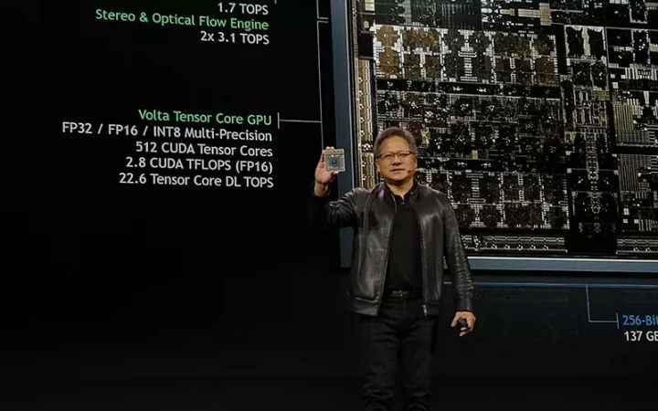

# 争夺中国市场！传英伟达CEO黄仁勋将访问中国大陆，并和厂商展开交流

**经济观察网记者 钱玉娟、周应梅**

“大家好，We are back!”

这是黄仁勋近四年来首次回到公众视野的第一句话。在5月29日启幕的台北国际计算机展（COMPUTEX）上，暌违公众近四年之久的英伟达（NVIDIA）首席执行官黄仁勋现身，他穿着为外界所熟悉的经典黑色皮衣，一如从前。

黄仁勋的“霸气”开场背后，是英伟达正在迅速恢复的“底气”：5月25日，英伟达收盘暴涨24%，一天涨出了一个阿里巴巴；美东时间5月30日，英伟达开盘即涨超4%，达405.93美元/股，总市值突破1万亿美元，这也意味着，英伟达正式跻身“万亿美金俱乐部”。

但也就是在不到一年之前，市场对于英伟达的业绩普遍持悲观态度。2022年英伟达游戏显卡业务出现大幅下滑，GPU库存严重，英伟达2023财年整体收入增长未到1%，而净利润则呈现腰斩。而随着虚拟货币热度降低、挖矿的潮水退去，这也直接使得市场对于高端显卡的需求不再，英伟达GPU销量进一步降低。

转折点发生在本轮AIGC浪潮爆发之后。自今年年初ChatGPT引爆AI浪潮之后，数据显示今年以来，英伟达市值已经累计暴涨超160%。而依据英伟达5月25日公布的2024财年第一季度业绩数据显示，其营收达71.92亿美元，这一营收指标高于分析师平均预期的65.2亿美元。此外，在整体收入同比下滑13%的情况下，数据中心业务创下新高达42.8亿美元，同比增长18%。该业务收入的占比59.6%。

黄仁勋在财报电话会中表示：“计算机行业正在同时经历两个转变，加速计算和生成AI。”在他看来，随着公司竞相将生成式AI应用到每个产品、服务和业务流程中，价值万亿美元的全球数据中心基础设施将从通用计算过渡到加速计算。

但对于这样一家新晋万亿美金巨头来说，要做的事情还有很多。据英伟达中国区一位代理商朱明透露，接下来的一周，黄仁勋将要到访中国大陆，并和一些厂商展开交流。对于黄仁勋的访华具体行程，记者就此采访英伟达中国，但截至发稿未获回复。

**争夺中国市场**

在本财年第一季度财报公布前夜，黄仁勋便强调，“中国是科技产业的一个非常重要的市场”，在他看来，美国政府对半导体供应的出口限制，让英伟达的手脚被束缚住了，他说，“英伟达无法在全球最大市场之一的中国开展业务。”

除了向中国市场专供替代型号芯片，以及向美国相关部门喊话外，黄仁勋也多次在公开场合讲出“塑料普通话”，以表示他对中国市场的重视。

据英伟达2023财年（2022年2月到2023年1月）年报显示，其在中国市场（含大陆、香港和台湾）实现的营收，在整体全球市场营收中的占比高达47%，接近半壁江山。“因为世界上没有其他中国，只有一个中国。”黄仁勋不希望之于英伟达最为重要的中国市场被剥夺。

作为底层算力供应商，英伟达被迫止步的另一面，是中国市场的需求激增。

在接受经济观察网记者采访时，戴伟民认为，中国在创新型应用上百花齐放，尤其像短视频平台抖音、快手这样在全球领先的超级应用程序，“上层应用层出不穷，青出于蓝而胜于蓝，问题是下层的算力谁来供应？”

戴伟民是芯原股份创始人、董事长兼总裁，他创立的芯原股份，是中国本土的一家依托自主半导体IP，为从事芯片设计相关业务的公司提供平台化、全方位、一站式芯片定制服务和半导体IP授权服务的企业。

如今，ChatGPT让AI世界从弱智能向强智能转变，身在其中的戴伟民愈发意识到，当下市场上越来越多人开始关注和使用ChatGPT，这让他判断，尽管中外在大模型等AI技术上有大约两年的差距，但不像IC领域面临材料、生产设备收到出口限制等卡脖子现象，“中国有足够多的人才，研究算法、写软件，拥有更丰富的数据资源”，戴伟民对中国的类ChatGPT的发展前景充满信心，甚至他认为，“中文版的会更好。”

采访中，戴伟民判断，不同于十几年前苹果iPhone引发的那一波“牛市”，大约用时三年，大家才看清楚硬件如何带动软件创新，而今由ChatGPT引发的新一波“牛市”，是软件催动硬件创新。他认为，2023年不过只是开始，至少到2025年这轮热潮才会真正爆发。

对于英伟达，戴伟民和朱明有个共同的认知，它不投机。朱明作为芯片代理商已经有十年光景，他一直记得，2016年中国兴起“挖矿”潮时，在那一波的财富流动中，不少人采集英伟达的芯片用于挖矿。为抓住机遇，2021年，英伟达推出了面向加密货币市场的“挖矿”专用芯片，之后的一个季度里，它就靠这类芯片实现了1.55亿美元的收入。

不过，英伟达也知道，“挖矿”背后的周期性问题，戴伟民告诉记者，当时不少GPU厂商转向去做了赚快钱的矿机，但英伟达没有盲目追逐，“坚持不做什么，有时比坚持做什么更重要。”他对英伟达的选择予以赞誉。

令朱明最为惊喜的是，在一万张英伟达的A100算力卡上，一个ChatGPT跑起来后，他看到生活的世界“可以被算力改变成从没有见过的样子”。

英伟达和本轮生成式AI浪潮的渊源可以追溯到2016年。彼时黄仁勋亲自去到OpenAI公司交流，那一行，英伟达还捐赠了一台搭载有8颗P100、价值百万的超级计算机DGX-1。将近六年之后，OpenAI推出ChatGPT，并实现GPT从3.5向4.0的创新迭代，整个过程中，作为芯片供应商的英伟达，一路见证着这个独角兽的成长壮大。

当黄仁勋说着，“生成式 AI
和加速计算正在改变世界”时，越来越多的人，亲身感受着这种变化。“英伟达是伟大的企业。”朱明认为，英伟达持续多年投入研发，押注数据中心芯片赛道，通过GPU降低算力成本，“它的投入巨大，由此收获利润也自然合情合理。”

**狂飙与焦虑**

5月29日，黄仁勋现身台北电脑展，介绍新产品。当天英伟达发布了超级计算机DGX GH200，黄仁勋称这个产品集成了英伟达最先进的加速计算和网络技术。

DGX GH200可用于支持生成式AI、数据处理的巨型模型等，目前谷歌云、Meta、微软等首批获得DGX
GH200访问权限，英伟达还计算向云服务商及其他超大规模计算厂商推广。

芯谋研究高级分析师张彬磊认为，这款产品堆砌了很多高精尖算力，在传输速度和存储容量相比传统超算更突出。“英伟达已经把所有的硬件和软件整合好了，有需求的用户不需要再去采购芯片来搭建一个专有功能的计算机。”张彬磊认为，后续还将有厂商会跟进超级计算机终端产品，但是没有公司像英伟达一样在AI和GPU领域积累如此深，短期内其他公司无法填补这个差距。

不过，超级计算机的发布，也被外界认为是此前一直处于幕后的英伟达，正在走向台前。

尽管英伟达是做图像计算加速起家，但陈沛的感知是，它一直就在台前，只是过去局限于游戏行业这一个小的垂直领域，直到搭乘上AI算力需求暴增的“高速列车”，英伟达被更为关注起来。

陈沛是新加坡Vibranium Consulting副总裁，关注B2B
Tech、云计算、AI领域的行业趋势和项目机会。他看到，早在十几年前，微软、谷歌等巨头就发现，“GPU在训练深度神经网络上很好用。”

伴随深度神经网络应用日趋广泛，从语音识别、图像识别，到近几年的语言应用，“深度神经网络的应用扩展，进一步带火了英伟达。”陈沛告诉记者，当前英伟达的GPU产品供不应求，它便通过云服务商来拓展销售渠道，“靠云服务商推广自己的框架和工具。”

此外，当天黄仁勋还与联发科首席执行官蔡力行共同宣布，双方合作开发车用SoC，在为软件定义汽车提供完整的AI智能座舱方案的同时，意味着英伟达将全面进入车载芯片领域。

不过，英伟达作为“晚来者”进入，虽然和联发科联手，但“他们才刚刚开始。”5月30日，正在香港参加摩根士丹利2023年中国峰会的戴伟民如此对经济观察网记者说到。

据戴伟民介绍，芯原股份也有自研的GPU
IP，在苹果公司2010年搅动起智能手机热潮时，芯原股份自研的GPU芯片曾被国内外知名手机厂商采用。那时的英伟达原本也可以“降维”做智能手机的通用CPU芯片，但这一巨头并未追赶这个热点，而是“Focus在数据中心领域。”

综合考虑市场环境和自身技术特点，在芯原转向汽车电子领域布局的十几年间，戴伟民看到，英伟达也始终专注，“决定不做什么，有时比决定做什么还重要，不追热点，坚定路线，很不容易。”

在英伟达财报发出当天，朱明在朋友圈发出了几张照片，那是他去年囤的一批英伟达算力表现较强的加速卡H100。“物尽其用。”朱明说，目前这样的一张卡基础售价25万元，多数厂商在蜂拥采购。“算力一直在持续采购，下半年的进度应该会更快。”

正在对自研大模型进行测试优化的孙进，是某AI厂商的产品总监，他认为当下的大模型创新热，“让英伟达稳赚”，不过想到美国西部“淘金”时代的故事，他又不免猜想，“最赚钱的可能不是淘金的人，而是卖消息、卖工具和搞服务的那些人。”

近几天，朱明确实忙于对接各类需求超强算力卡的厂商客户，当被记者问及生意赚利，他试图扭转外界的一个认知，“我们并不像外界说得那么挣钱，利润微弱。”对比之下，他认为，英伟达才是这场AI催动的生意潮中，“最赚钱的大富翁”。

早在今年四月初，朱明就劝身边的厂商朋友，“有资金，就闭着眼睛买英伟达。”朱明想要表达的，不仅仅是A800、H100、H800这些英伟达的GPU芯片值得囤，他更看好英伟达的股票，“当时进来的，如今看，果断赚50%。”5月30日上午，在接受记者电话采访时，朱明判断，现在的英伟达才刚刚进入狂飙时刻。

以GPU技术和产品见长的英伟达，在2021年发布首款基于Arm架构的数据中心CPU后，它的数据中心芯片路线图终于完备。不过，当英伟达以CPU、GPU和DPU这三类芯片征战市场时，其面临的竞争变得异常激烈。

记者看到，在英伟达的身后，追击者不乏以CPU见长的英特尔，后者也在自研GPU；也有CPU和GPU兼具的AMD，通过收购FPGA对其形成夹击。就连英伟达早自2012年因供应GPU而结交下的朋友谷歌，后者也不只是进行AI深度学习和研究，而是在AI芯片自研方面也有突破。

戴伟民提及谷歌2015年自研的TPU（张量处理器），其迭代型号不仅在算力速度上比英伟达A100还快出1倍多，功耗甚至更低。

在这种情况下，黄仁勋和他带领的英伟达能否持续保持狂飙，解题的关键可能还需要回到中国市场。

当巨头厂商展开AI芯片自研的同时，一个更为严峻的现实是，英伟达的主力市场因为受到出口限制，“中国厂商采购，被划定了一条红线”。戴伟民指出，自去年以来，像英伟达A100在中国被禁售，英伟达不得不向该市场推出替代型号芯片A800。

如今，即便是替代型号芯片也变得“贵得要命，还买不到”，戴伟民认为，当前全球兴起AIGC潮，在中国的类ChatGPT出现“百模大战”之际，底层算力的需求正在暴增，而英伟达的焦虑在于，因为受限于中美之间的芯片供给问题，英伟达无法覆盖这一巨大的增量市场，而对应的是，中国本土的算力芯片国产替代化正在不断加速。

**（文中受访对象朱明为化名）**

