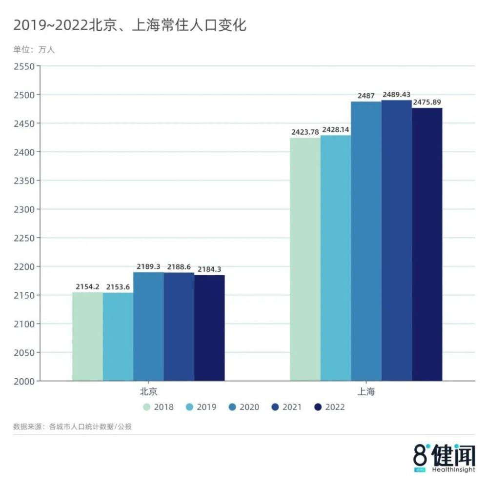
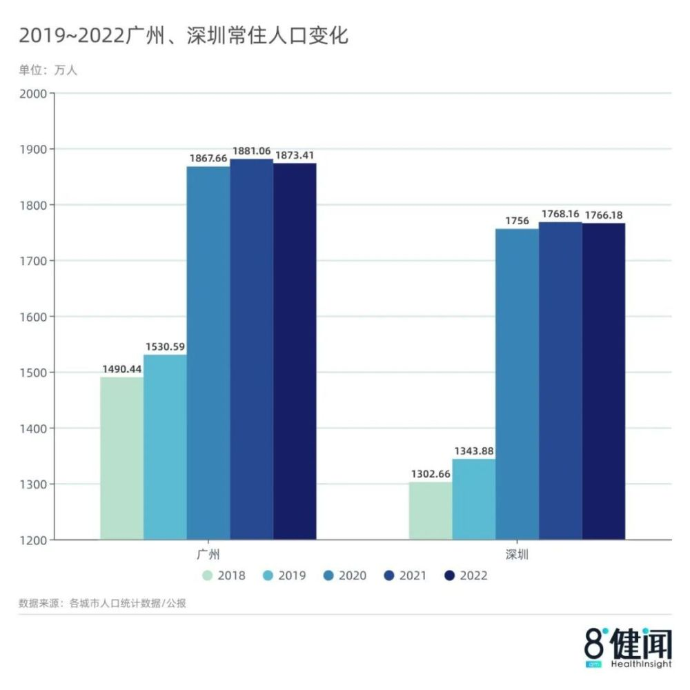

# 北上广深人口负增长，专家：广深的人力正被科技替代，人不再被需要了

过去的一年，充满了一次次的巨变。

城市经历了停滞、变化、重启；人群经历了静止、启动、活跃，从一种生活流向另一种生活。

人口流动的数据，也记录下了人群流动的方向。

5月12日，随着广州《2022年广州市国民经济和社会发展统计公报》姗姗来迟，《公报》显示广州常住人口1873.41万人，比2021年减少了7.65万人。这是5年以来，广州第一次人口下降。

2022年，人群不仅离开了广州，也离开了其他北京、上海、深圳，其他三个最繁华的一线城市。根据各地公报显示，截至2022年年底，北京、上海、广州、深圳这四座一线城市，同时迎来了常住人口负增长的时代。

_△2019年~2022年，北京、上海常住人口变化_

_△2019年~2022年，广州、深圳常住人口变化_

北京2022年常住人口为2184.3万人，比前一年减少了4.3万人；上海为2475.89万人，比去年末减少了13.54万人；而深圳为1766.18万人，同比减少1.98万人。

多位人口学专家表示，四大城市人口负增长背后的共性是就业岗位减少，非户籍人口流失，离开大城市。

“人为什么迁徙流动？人往一个地方聚集，或者离开一个地方的目的很简单，主要是为了就业。如果一个地方的就业环境不适合了，人们就会自然而然地离开。”中国人口学会副会长、南开大学经济学院人口与发展研究所教授原新说。

但离开大城市，也并非都是被动。

近几年，“逃离北上广深”的论调不绝，而今迎来负增长，不过是蝴蝶效应以年为单位的表现。

北上广深的人口负增长的“首次翅膀扇动”，始于哪一瞬间？也许始于年轻人里“逃离北上广”成了流行，从小镇去大城市反而成“逆行”；也许始于1993年，上海首次出现人口负自然增长率，从此愈发依赖外来的“新鲜血液”补充劳动力、缓解老龄化；也许始于某天，一线城市打工人突然意识到，体系成熟的一线城市越来越少有可融入的空间，“既不适合打工，又不适合生活”……

有人认为，经过2022年的低谷之后，每一步都是向上的，人们会在不远的未来再次回到大城市中；

但更多人认为，2022年只是开端，就业压力与经济放缓是长期的，大城市人口减少，也许会在2023年后愈发明显。

**回不去的理想乡，难栖身的大工厂**

正在济南的工作的白石，不止一次想过，要不要回上海。

但每当这时，脑海里理性的声音就会跳出来阻止他：这一回去，就又回到刚毕业的原点了。

985大学硕士毕业的济南人白石，刚毕业时一门心思想去上海。那是疫情还未出现的2019年春天，一切都在往欣欣向荣的方向发展，北上广深绝对是年轻毕业生们锻炼自己、增长见识的第一站。

“那时很好找工作。”白石说，他在毕业前拿了7、8个offer，最后选择了一家在上海的国企。

公司里年轻人多，大多都是“沪漂”，大家工作和生活都很合拍。他与同事出游，与出租车司机聊天，路过网红餐厅打卡，也享受这种大城市的“小资生活“。但白石从来没想过要留在上海，他明白，自己总有一天要回济南。

随着物价和房价的飙升，若想在上海落户、购房，压力便会像洪水般灌入生活，现在的生活质量会“大打折扣”。一年多之后，在父亲问他要不要参加一场济南的国企招聘考试时，白石没有拒绝。

他考上了，回去了。济南的工作并不比上海轻松，不如意时，他会像之前那样思考，要不要回上海去？

但他发现，离开上海的那一刻，这座城市像对他关上了一扇隐形的门，再回去变得举步维艰。

哪怕拥有四年的工作经验，在上海也找不到合适的工作了。“现在工作不好找。上海提供给年轻人的机会，远不像4年前那么多了。大部分招聘岗位都是留给应届生的。”

生活愈发稳定的白石，做好了在济南安家的准备，但上海仍像白月光一样笼罩在他的心上。对白石来说，上海是“回不去的理想乡”。

但对于刚毕业没多久的汪宇，上海则是“难栖身的大工厂”。

汪宇本科毕业于后，2022年春天，托关系进入了上海一家药企，负责数据分析与统计的工作。

汪宇只在公司上了一周的班。接下来就经历了2个月的封控。被迫转为线上远程工作的他，不仅“憋得慌”，领导也对他越来越“push”。而且由于封控，汪宇无法与同事朋友及时交流、见面，每天从睁眼到闭眼，都是“一个人在电脑前做自己的事情，有很强的孤立感”。

结束封控后的第二天，汪宇就辞了职，买了票回老家。他有想过重新在上海找份工作，但看着“硕士及以上”学历的要求、越来越少的岗位、越来越贵的房租、和自己不再拥有的应届生身份，实在没有信心。

“后来在宁波待了一段时间，感觉宁波、杭州、苏州这些城市经济发展也挺好的，没必要吊死在上海那一棵树上。”

北上广深，这四个城市繁华羽翼下的残酷现实，愈加被年轻人看清。在他们眼里，大城市不再是那个“追求梦想的必需品”。

**人不再被需要了**

北上广深四座城市，像四位性格迥异的人，各都有地位和“技能”。当经历人口负增长时，自然也各有城市特色。

四座城市人口负增长的原因，要属广州、深圳两地的人口负增长，最有“赛博朋克”的色彩——人力正在被科技替代，人不再被需要了。

多位人口学专家告诉八点健闻，产业转型升级与外贸形势变化，是广州、深圳两地人外来人口回流的主要原因之一。

长三角和珠三角，当下正处在产业升级的过程中。智能设备、数字化设备、还有科技化、机械化设备等对人工的替代，从这些地方率先开始。不仅如此，珠三角很长一段时间推行了“腾笼换鸟”，即用更加先进的产业，替代过去的加工制造业。

“这些都会体现在流动人口减少上，因为流动人口进入城市的主要目的很单纯，就是为了就业、获取经济利益。”原新说。

中国人口与发展研究中心副研究员刘厚莲也做过估算，“深圳去年一年净迁出人口，大约在18万人左右。”

漂浮在广州、深圳的普通人，无法像人口学家一样目光毒辣，预测到经济变化可能带来的就业、用工变化。但他们很多人在尽力像人口学家一样，深究这一切的变与不变，以此寻找人生转变的契机。

在深圳的东北人小欧，就是这么看的。

小欧和丈夫在深圳工作了五年，但去年，小欧丈夫所在的外企，突然经历了企业转型和结构变化，将整个项目裁员。“公司裁掉了深圳分部全部人员的近三分之二。”

借着这个机会，小欧和丈夫索性离开了居住工作了5年的深圳，搬到了苏州。

在离开之前的那5年，深圳高企的房价和教育资源，让小欧望而却步。深圳变化之快所带来的“没有归属感”的感觉，在5年来如影随形。

“每天睁开眼就工作、工作完回家就累得躺下。”小欧知道平安金融中心是深圳最高的楼，但在深圳五年，她从来没有去过。在离开深圳前一天下午，她专门去了一趟，待到了夜晚。“我想从楼上再看一眼这个城市，白天是什么样的，夕阳下是什么样的，灯光亮起的晚上又是什么样的。”

告别了深圳，而今，身处苏州的小欧虽然依旧远离家乡，但路程减半。苏州比深圳慢一些，小欧经常有空出门溜达、露营。

个体在不同城市间流动，寻找人生的解法。而城市，在人口增减中寻找良性发展的平衡。

不同于广州和深圳，上海的生育率是四座城市之末，老龄化程度又是四座城市之首。当经历2022年春天的那场停滞后，失业的人纷纷离开。上海迁出人口的变化，便在第一时间直接地反映在了人口规模变化上。

在人口学家看来，上海人口负增长是典型的疫情带来的突发波动。

而在北京，人口规模的“增长”似乎从来不是一个需要担心的议题。

市政府更在乎的是“如何控制人口”。

“北京的人口调控，大概在十二五时期换挡升级了。”刘厚莲回忆。“十三五时期，各方面产生的效果愈加明显。”典型的例子是京津冀协同发展、河北雄安新区的加快建设重大产业项目和公共服务资源优化配置等。因此，北京的人口负增长，从2017年就开始了。它是一种主动的人口宏观调控，主要是为了缓解自身在城市发展过程中面临的各方面问题，从而采取的一种积极战略。

除此之外，原新告诉八点健闻，人随业走是普遍规律，北京的一些非首都功能产业，如快递业、蔬菜批发业、服装批发业等劳动密集型产业，都转移到了河北，从事这些产业的就业者也就随之迁出，既转移了非首都功能产业，也疏散了部分人口。

在社交媒体上，一张照片曾被许多人转发：图片中间是一条河，河的左边是河北燕郊，高楼迭起、道路密布；而河的右边是北京通州，绿植遍野，万里无楼。

**离散的人还会回来吗？**

在北上广深，常住的非户籍人口占比高，这是人人已知的常识。

细究数据，尤其在深圳，非户籍人口占比甚至超过户籍人口，达到近67%。

_△2022年，“北上广深”非户籍人口占比_

“按照统计口径，我们在计算常住人口时，仅将在深圳居住了半年及以上的常住外来人口计入。如果加上居住半年以下的短期外来人口，深圳的实际服务和管理人口肯定超过2000万。”原新说，深圳是一座特殊的、由移民撑起来的新型超大城市，充满了活力和包容。

而在上海，虽然常住非户籍人口少于户籍人口，但同样也是城市人口变化的支柱。

“90年代初，上海就面临了户籍人口自然增长率为负的情况。”刘厚莲说，“但上海一直以来的常住人口都能保持增长，这就意味着，上海主要依靠迁入人口带来劳动力和人口规模增长。”

而现在，这四座依靠着“非户籍人口”带来劳动力的城市，同时出现人口负增长，背后相同的原因不可忽视：就业岗位减少。

毕竟，人随业走。业变了，人自然就离开了。

“今年我估计全国很多地方都日子都不好过，就业岗位的损失很大。”上海市人口学会会长、华东师范大学社会发展学院原院长丁金宏表示。

不过，他认为，这或许是疫情之后的一种负面影响，不代表长周期的现象。“我们还不能下结论说，四个城市的人口规模同时都到顶了，以后就都会继续减少。”

但丁金宏也认为，中国的城市化进程已经过了黄金时段，城市人口规模不会再像2010年之前一样膨胀式的发展，而是将会与2010年后一样，继续缓慢增长。他预计，今年大城市的人口规模仍然会“喘口气”，明年才会继续恢复增长。

在这方面，刘厚莲对深圳常住人口总量恢复上涨，保持着乐观。

今年春天，他去往广州和深圳调研，亲眼看到了深圳将要率先恢复人口规模的预兆。春节后的深圳，地铁、公共交通的人流量“一下就上来了”，城市一下又热闹起来，与去年12月空荡安静的街道，形成了鲜明对比。

“从具体数据也能看到，深圳人口年龄结构非常年轻，死亡率非常低，近几年自然增长每年都在十几万左右。现在人流量陆续恢复，加之各方政策推动，外来人口一旦找到工作回流，预期今年常住人口规模就很可能会继续恢复增长。”刘厚莲说。

“大城市总还是比其他地方更具有吸引力。”丁金宏说。

**中部城市崛起，吸引年轻人**

夏婷跟人口专家的观点并不一致，在她看来，正在崛起的潜力城市更有吸引力。

在夏婷眼里，大城市的人口减少，并不一定意味着经济下行。反之，有时它更反映了4大城市高度社会化分工、城市接近饱和的状态。

江苏人夏婷毕业后，在上海也工作了大半年。期间，她在一家媒体工作。办公室坐落在市中心的高楼上，有宽敞的格子间、大落地窗、和近百位与她一样，年轻热血的同事。

但她总是感到空虚。“公司的体系非常成熟，作为一个年轻人，越成熟的地方，好像就越没有机会。”夏婷说。直到离开上海，夏婷都只能做一个“螺丝钉”，指哪儿打哪儿。

夏婷离开了上海，毅然去了武汉。来武汉后，她发现，这片土地似乎仍然是未开发的、“百废待兴”的。她突然从迷茫的新人，变成了中坚力量。“我好像再也不是万能螺丝钉了。在一切处于创造阶段的武汉，这里有我的位置。”

她觉得，这也是时代造成的原因。

她记得父母告诉她，他们刚工作的时候，任何制度、产业，都是需要人去建设完备的，每个人都积攒着一股力量。“用我爸的话说，只要努力就能捡到金子。”但现在，夏婷在上海所接触到的所有东西都是成型的，“我只能在父辈打下的江山中工作，那就像一块钢板，根本踢不动。”

人口学家们，也看到了中部城市的崛起。

多位受访者告诉八点健闻，许多内地的省份，如江西、湖南，在近年来都会去往深圳招商引资，进而带动用工变化和人口流动。近年来国家越发重视城市群、特色小城镇和乡村振兴建设，为劳动力就近转移、就地就业和回流就业提供了许多机会，也造成了大城市暂时的人口负增长现象。

究竟，如何辩证看待北上广深人口的负增长？

对于白石、汪宇、小欧、夏婷来说，这些是基于生活与时代的个人选择。对于人口学家来说，这些是产业、经济与就业市场变化带来的波动。但没有一种看法能用“好与不好”来评判。它似乎仅代表了一种区间，或一种暗示。

“人们在乎人口增长的快慢，其实不是在乎它影响了什么，而是预示了什么。”丁金宏说，一个发达的大城市人口不增长，并不是因为城市没有吸引力了，而是在暗示：人们相信经济对人口的影响更大，而不是人口对经济的影响更大。

原新也表示，北上广深的人口负增长，不能与“经济不好”划上等号。

“相反，深圳这些科技型、智能型的产业蓬勃发展，代替了一些普通劳动力。这是一种产业升级和现代化的过程，是以知识和技术密集型产业替代劳动密集型产业，以人力资本替代人力资源，以高劳动生产率代替高劳动参与率，但这个过程也不可避免地会加剧就业的压力。”

“人口负增长，城市会害怕吸引力下降；而人口增长过快，城市也会想方设法调控。”丁金宏总结，对人们来说，人口负增长的象征意义，或许大于实际意义。

（白石、汪宇、小欧、夏婷均为化名）

张雨箫丨撰稿 数据收集

李 琳丨责编 制图

**本文首发于微信公众号「八点健闻」，未经授权不得转载**

