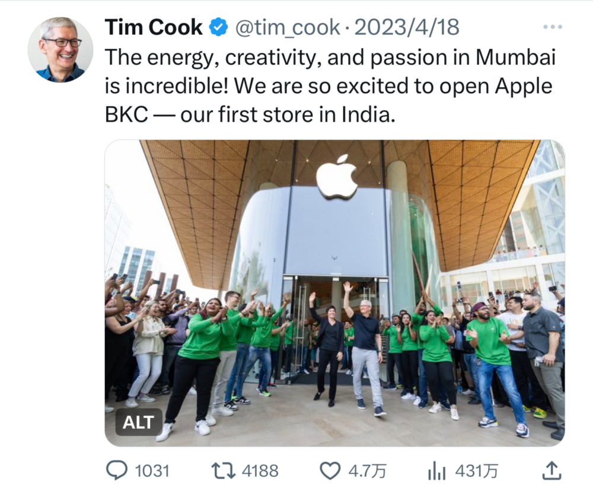
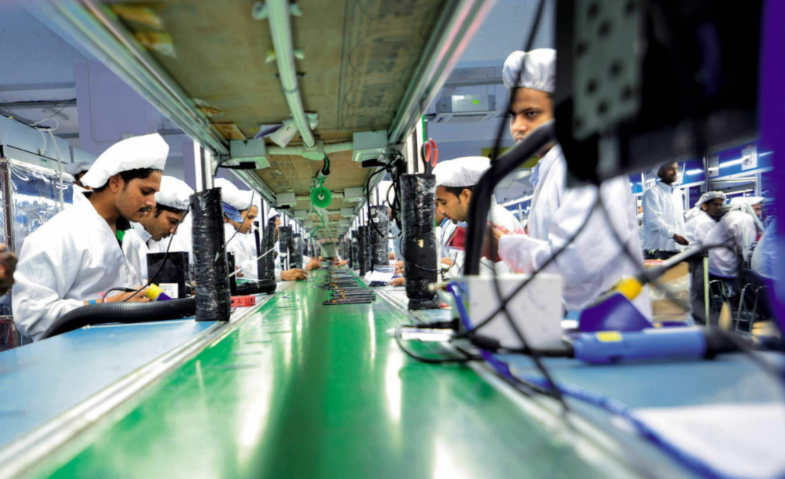
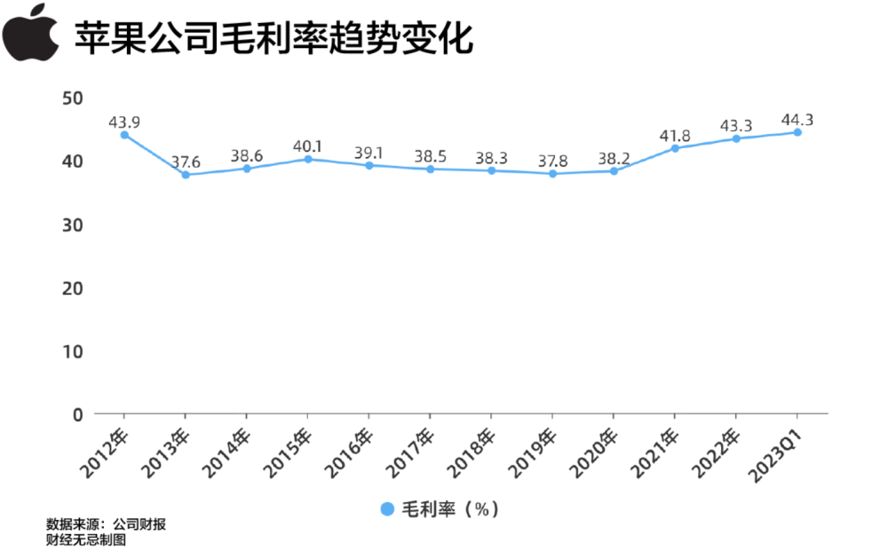
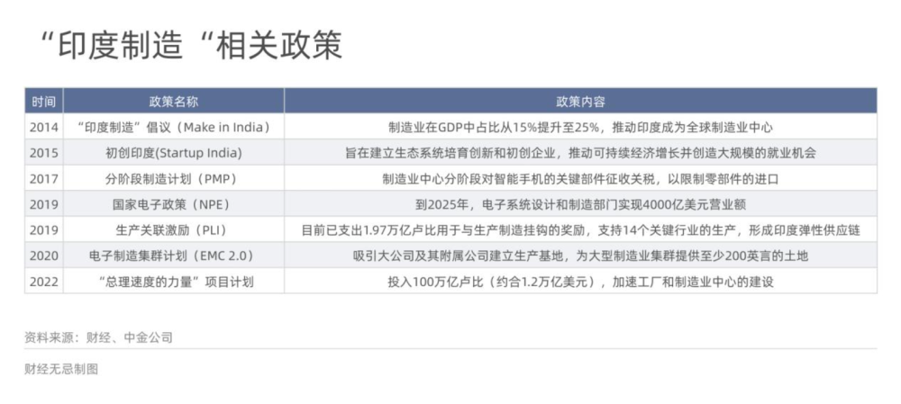
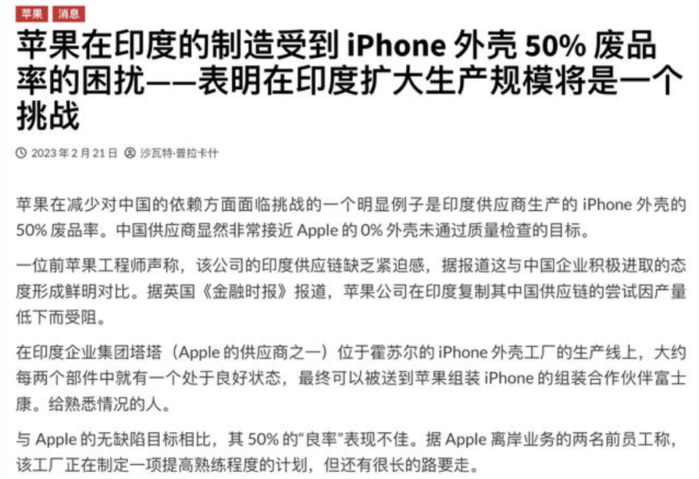
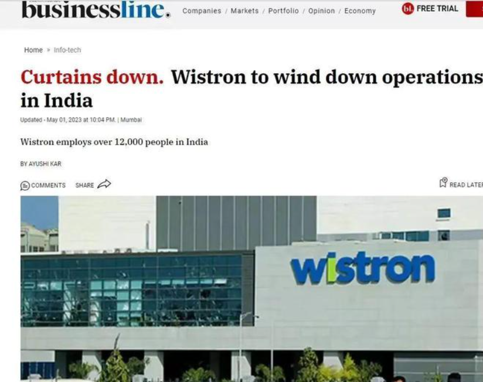
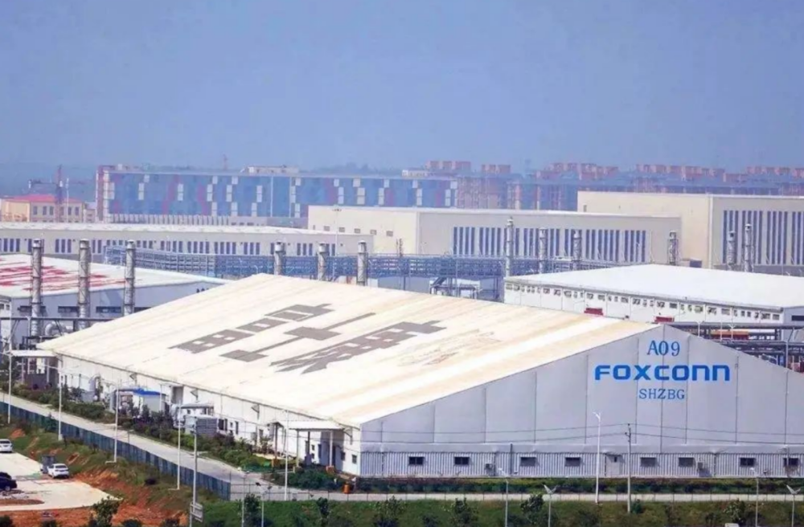

# 库克想在印度，为苹果的增长“续命”

_《果链风云》是腾讯科技推出的苹果产业链研究策划，本期聚焦苹果力推产业链及相关业务布局印度的主因及挑战的分析。_

**作者：山核桃**

1974年4月，19岁的乔布斯来到印度，正式开启了他长达7个月的修行之旅，彼时的他或许并没有想到，时隔半个世纪后，这片曾改变他一生观念的土地将会成为苹果的“战略重镇”。

同样是一个4月，在印度金融中心孟买，依旧是一身黑色T恤的库克出现在苹果首家零售店门前，一脸笑意地看着眼前人们的欢呼。无论是业绩表现，还是战略动作上，库克俨然将布局印度的野心也写在了日程表上。

_库克与印度果粉共同迎接在印第一家直营零售店的开业
图片来源：twitter_

在新一季财报发布后的电话会议上，库克提到了20多次印度市场，他强调：“印度市场十分让人兴奋，那里的市场活力令人难以置信。”

苹果新一季的财报显示，在收入上，包括印度在内的亚太其他地区收入增长了15%，已达到81.19亿美元，而曾经被苹果视为增长引擎的中国，营收却同比下降2.89%。

一边上升，一边下降，对与苹果唇齿相依的“中国果链”而言，随着供应链的转移，收缩的信号已十分明显。

苹果代工巨头纬创关闭了位于泰州的代工厂，包括富士康、昌硕等代工厂的用工缺口明显收窄。一位负责长三角地区的招工中介表现出了从未有过的担忧：“（纬创）曾经也是上万人的大厂，如今也撤了，今年压力很大”。一位在今年4月选择离职昌硕的工人表示：“过去旺季一个月能挣到七八千，现在一个月加班满打满算也只有4000多。”

产业链下游的阵痛来自于上游“链主”。在中美博弈与全球消费电子的缓慢复苏中，库克再度使用了苹果的“供应链艺术”，期冀在印度复制中国的奇迹。一位富士康印度园区管理层人士在接受国内媒体采访时，这样形容中印果链的生存状态：
**“淡季期间，减产减的也是中国产能，印度全是满产。”**

种种迹象均在表明，果链加速转移似乎已成为确定性的趋势，但印度并非是理想中的“淘金地”。就在5月初，据印度媒体消息，纬创或从印度整体撤离，计划在2024年解散其在印业务。

**某种程度上来说，重仓印度，既是库克与苹果“复制中国奇迹”的野心，也是业绩与政治双重压力下的一种无奈选择。而“果链”集体奔赴印度，确实为印度崛起与苹果带来了新的市场机遇，但这种野心注定是脆弱的。中印两国市场环境的巨大差异，让苹果copy
China从一开始起，就是一场漫长的游戏。**

**本文主要尝试解答三个问题：**

**1、库克为什么这么爱印度？**

**2、印度能copy China吗？**

**3、果链转移，对中国企业意味着什么？**

一、苹果与印度，一场漫长的游戏

2016年，库克访问印度，在会见了印度总理莫迪后，库克来到一座印度寺庙，在前额点上了红点，以祈求苹果在印度市场的好运气。

如今，尽管库克与苹果将印度市场取得的耀眼成绩写在了明面上，但不可否认的是，从首次在印度销售iPhone再到在这个全球第二大智能手机市场拥有自己的直营零售店，苹果整整花了15年。

时间拨回2008年，当iPhone首次亮相印度市场时，不仅比美国晚了将近1年，也尚未出现排队现象。如果梳理苹果的印度之旅，正如库克本人所言：“这是一段漫长旅途”，减速与加速同时存在。

事实上，尽管反复强调印度的重要性，但苹果在印度市场的表现此前并不尽如人意。

2015年，苹果在印度的年度销售额才突破10亿美元，苹果在印度的市场份额也都很小，巅峰时期不过5%。仅从出货量和年增长率来看，很长一段时间内，苹果在印度市场都被列为“others”，排名靠前的是三星与众多中国手机厂商。

减速的背后，是苹果对印度市场反应的迟滞。一方面，在定价与产品服务上，在对价格极为敏感的印度市场上，苹果依旧遵循了过往的商业模式与产品策略，放弃“机海战术”，依旧坚持用高价与有限机型打动印度消费者，同时在产品服务商也缺乏对本土市场的定制化。

另一方面，则是由于印度的关税政策限制，苹果缺乏本地产能与本地直营店。在中国企业纷纷在“印度制造”浪潮下，迅速建设本土手机制造工厂时，苹果则显得漫不经心。

**但转折发生在2017后，从产品到组织到供应链再到政府关系，苹果开始主动加速这段旅程。**

**一个最直接的信号，就是针对印度市场的降价策略。**

苹果借助大幅折扣吸引不同社会阶层的印度用户，同时区别于过去低调的营销策略，借助销售合作伙伴，为印度用户提供更多元的支付选择。

iPhone 11就曾是助推苹果印度市场反弹的功臣之一。为了迎合印度的排灯节促销，苹果打出了“购买iPhone
11系，送AirPods”的广告，并与Flipkart等在线合作伙伴推出了月付计划。

**另一个信号则是，苹果也开始劝说其供应商布局印度，以保证本土产能与成本优势。** 2017年，苹果代工制造商纬创开始首次在印度班加罗尔组装iPhone
SE，2020年，在印度政府宣布的大规模电子产品生产激励计划的16家公司中，富士康、鸿海、纬创与和硕等苹果代工厂均出现在这份名单上。

_在流水线工作的印度工人_

库克本人也在频繁向印度示好， **尽管并未频繁到访印度，但在苹果公司内部，印度市场地位正在提升。**

根据彭博社报道，苹果公司正在调整其国际业务管理层，印度也将首次成为苹果公司单独的销售区域。此前，负责印度、中东、地中海、东欧和非洲地区的副总裁Hugues
Asseman最近退休后，苹果也有意提拔此前的印度市场负责人Ashish Chowdhary。

而苹果目前主管全球供应链的运营副总裁Sabih Khan同样也是印度人，值得一提的是，上述管理层变动均发生在苹果对印度市场态度的转变期。

Counterpoint高级研究分析师Prachir
Singh向财经无忌分析：“在印度消费者中，苹果一直是一个令人向往的品牌。在过去几年里，价格曾一直是一个障碍。然而，随着苹果制造和本地化的增加，苹果通过提供各种优惠和融资方案，提高了iPhone在印度的接受度。”

二、重仓印度，库克的无奈之举

**看似重仓印度，但库克也充满着种种难以言说的无奈。**

**在业绩增长与政治博弈等多重压力下，印度成为了苹果一个“不得不”的选择。**

首先，在业绩与久无创新性爆品的压力下，尽管库克一直在强调“软硬结合”战略，但苹果这几年的营收支柱依旧靠iPhone挣钱，
**如何卖更多的货，寻求利润增长，作为新兴市场的印度毫无疑问是一个新增长点。**

一方面，消费升级趋势下，印度成为手机高端市场重要的增量市场。机构Canalys分析师 Sanyam
Chaurasia提到：“2023年，（印度）大众市场发展仍缓慢。尽管如此，高端市场仍有望增长，从而推动整个市场的平均售价的增长。随着（印度）可支配收入的逐步提高，消费者愿意在高端设备上花费更多。”

根据咨询机构 Counterpoint 的印度制造服务的最新研究，在2022年， “印度制造”的智能手机出货量同比下降
3%。这一下降背后的主要因素是宏观经济导致的消费者需求低迷，尤其是在下半年。由于当地需求下降，特别是在入门级和中级市场，上一季度出货量同比下降 19%。

但印度智能手机市场的潜在增长依旧客观。Prachir
Singh认为，这主要有两点原因：一是大量4G用户升级到5G智能手机，二是功能手机向智能手机迁移的增加，高端化趋势显著。

常居印度新德里的Salari对这种变化体感很深。在她看来，过去身边很多印度人对苹果并没有太大的兴趣：“苹果没有零售店，而且价格很贵，大多数人会选择苹果以外的选择，比如三星或联想。”但随着苹果零售店正式落地印度，一切似乎都有所改变。Salari发现，新德里当地的苹果零售店已经成为了印度年轻人和新中产的一个新打卡地。

**印度手机消费市场在升级，苹果自然也需要硬件“赚钱养家”。**

最新季报显示，在手机市场整体下滑的趋势下，iPhone营收同比增长1.5%，贡献了苹果营收的半壁江山
，且从硬件端36.7%的毛利水平来看，在大环境的成本压力下，苹果的硬件端的盈利能力依旧韧性十足。

**除此以外，中美关系的日益紧张，或许也是苹果加速印度布局的另一个关键原因。**

美国国家法律和政策中心（NLPC）曾提交了一份豁免征求，指责中国2020年以来的疫情清零政策直接导致苹果损失40亿至80亿美元，并呼吁苹果公司股东“罢选”库克连任CEO，理由是“库克治下的苹果过度依赖中国供应链。”

在英国《金融时报》的文章中，也表达了类似的看法。
**作者认为，今天的苹果正面临一场“清算”，苹果正面临政治、战略和投资者方面的压力，要求苹果减少对于中国制造的依赖。**

而回到苹果这家企业本身，
**从供应链角度来看，苹果重仓印度，实则是库克“供应链宗师”的惯常操作。苹果一直都是通过扶持供应商，通过转嫁风险，保证自己不被卡脖子且获得最大收益。**

**铁打的苹果，流水的果链。苹果一直通过“扶持一个，牵制一个”的策略倒逼供应商升级，富士康与立讯就是最好的例子，为了抢订单，上述果链间的竞争甚至一直打到了国外。**

富士康董事长刘扬伟就曾公开指责，竞争对手在越南“挖墙脚”：“这些工厂看到富士康在哪建厂，就特地跑去厂区旁边买一块地，想用这样的方式搭载顺风车，并且靠高薪挖角富士康的人才迅速进入市场。”

供应商之间竞争越激烈，反映出苹果对供应链的话语权越强。这一点，从苹果稳中有升的毛利率水平就能看出“链主”地位的强势。
**苹果的毛利率常年维持在40%上下，作为对比，国产手机厂商的毛利率多在10%到20%之间浮动。**

三、难以复制的“中国奇迹”

印度需要苹果，苹果也看好印度。眼下，苹果的印度版图已经取得了不俗的进展。

Counterpoint报告称，在2020年，印度产iPhone仅占其全球产量的1.3%，两年后这一数字上升至4%，预计今年将升至7%。去年，苹果“印度制造”出货量同比增长65%，产值同比增长162%，带动苹果在印度整体智能手机市场的比重从2021年的12%提升至25%。

短短一年时间，苹果市场份额的飙升，离不开印度对苹果态度的转变。
**自2014年印度总理莫迪宣布“印度制造”战略后，沿着“进口替代、吸引外资”的发展路径，印度与苹果正式进入了双方的“蜜月期”。**

_（库克与印度总理莫迪 图片来源：twitter）_

2016年5月，库克在印度贡献自己的“处女秀”后，一个月后，印度政府就决定放宽外国直接投资（FDI）规范，允许外国公司有限制地在印开展业务，其中包括单一品牌零售，这被视为给苹果等科技企业“开绿灯”，为其在印布局提供了一定的缓冲期。

而紧随其后的便是通过分阶段制造计划”（PMP）和“生产关联激励计划”（PLI）等多项政策，加大优惠力度，降低苹果科技企业在印投资布局的门槛，实则也是为苹果游税其供应商赴印给足政策端的排面。上述政策支撑加快了部分苹果供应商在印布局的信心，比如富士康。去年6月至今，不到一年内，印度总理莫迪曾两次会见富士康董事长刘杨伟。

苹果与印度之间的双向奔赴，似乎也让分析师对这一新兴市场充满信心。根据摩根大通的预计，
**至2025年，苹果将在印度生产四分之一的iPhone，而印度市场将为苹果贡献200亿美元的年收入。**

毋庸置疑的是，花费数十年时间与真金白银，苹果曾在中国建立了一个多层次且高响应的供应和生产体系，已然将苹果自己的命运与中国紧密联系在一起。

而这次押注印度，库克与苹果无疑是想要copy China，但一个关键问题也随之而来：

**印度能否接下苹果？又能否复制这样的“中国奇迹”？**

**一个最关键的阻碍是上下游供应链的成熟度与配套基础设施的差异。**

尽管在“印度制造”的高关税政策下，已有一些手机及零部件生产厂商已在印度投资设厂，但与中国完备且快速响应的供应链生态相比，印度注定还有很长的路要走。

在苹果公布的2020年全球200大供应商当中，
**一共有610个工厂参与了苹果产品的制造。其中，中国大陆的工厂有259个，占比超四成，而印度仅有9个工厂。**

换言之，打造供应链生态并非是只在当地建厂那么简单。组装厂搬走了，但组装厂的一级二级三级供应商依旧还在中国。《金融时报》曾举过一个简单的例子，如果富士康需要安装声波焊接机，它可以很容易地在中国召集任意数量的公司并雇佣劳动力来做这件事。

而在印度，当前一些手机精密零部件以及产线上的大型设备依旧需要从中国进口，这对本就赚着辛苦钱的苹果代工厂们而言，也无疑面临着更大的成本压力。

**苹果在印度的另一重阻碍则在于所谓的“人口红利”。**
作为人口大国的印度，低劳动力成本是其区别于中国工厂的优势之一。但具体到劳动力的水平与质量上，印度的劳动生产率远低于中国，包括文化语言、劳工素质等问题，一方面，严重影响着产品的良率。此前已有报道称印度生产商塔塔生产的
iPhone 外壳中，其良率只有 50% 。

这一点，先于苹果征战印度的中国手机厂商就深有体会。小米工程师为了让印度的工人熟悉改造后设备的操作规程，曾特意编写了一份英文教程。但是他们真正将这些教程发下去之后才知道，印度的官方语言众多，很多工人由于根本不会英语，这些教程他们也看不懂。

另一方面，与国内工厂严格的管理体系不同，缺少“狼性文化”的印度工厂，难以创造出中国工厂的制造奇迹。且在超前的劳工保护制度下，也无形之中放大了企业的隐形成本。

决意与印度“分手”的苹果代工厂纬创就是一个典型案例。据印度时报报道，因当地工人闹事、工资短付、医疗事故等问题，纬创内部已认为印度当前环境不适合正常经营。

**究其根本，实则是两国营商环境的差异，中国手机厂商就曾在印度有过许多伤心往事。**

雷军就曾坦言：“小米在印度其实都是用财务和法务在对公司进行管理。”印度的法律制度被形容为“高标准立法、普遍性违法、选择性执法。”包括小米在内的许多中国科技企业都曾在印度遭受类似的困境，花费巨大的精力应对印度地方各级部门的纠纷，应对随时而来的各类禁令、查税或罚款。

**一位在印度从事多年投资业务的专业人士形容外商在印度投资就像是“戴着镣铐跳舞”：“在印度投资需要交许多学费，是一门技术活，也需要运气。”**

**一位在外企负责印度市场拓展的行业人士认为印度市场是“事儿多，预算少”：“经常是下了班突然发邮件让我们交材料，条条框框特别多，很多材料涉及公司机密，说了无法提供，但还是追着要。”**

又爱又恨，这既是中国企业对印度市场的准确洞察，同样暗示了苹果在这片神奇国度上即将面临的挑战。可
**以肯定的是，无论是宏观的供应链、产业生态与营商环境，还是微观的人力管理，苹果在印度都无法复制中国过往的奇迹。**

四、果链赴印，态度不一

诺伊达，位于印度德里东南方向的卫星城，被称为印度的“手机之都”，有人形容这里酷似早年的中国深圳。这里，四处厂房林立，每天都进出着各类品牌商与代工商。

自2013年开始，诺伊达成为了一片新淘金地，吸引着各类中国企业。手机品牌有小米、华为、OV、传音等，ODM代工厂有富士康、闻泰、海派等，电池厂商则有欣旺达，其余手机配件有英通、小林电子、联创等，上述企业共同组成了一条手机产业链与庞大的供应链网络，每天应对着印度市场的变化。

这是中国手机厂商先于苹果在印度打下的供应链基础，但在苹果频频示好印度下，果链巨头们的态度其实也早已出现了分化。

此前，富士康、纬创与和硕3家台企苹果供应商已在印度生产苹果，苹果还与印度制造商Tata集团合作生产iPhone。

除了上述核心企业外，充电器组装商伟创力与领益智造、数据线供应商正崴精密和零部件供应商捷普科技也都已在印度设厂。

**其中，存在感最强的要数富士康。**

最新消息显示，富士康投资超5亿美元在特伦甘纳邦设立的工厂，已开始动工。此前，富士康也在班加罗尔科技中心附近买下了一块占地约 120
万平方米的土地，规划产线数量在18条左右，预计2024年将投产。

根据《财经十一人》的报道，富士康的“野心”是， **未来三年内，印度的产能可以与郑州持平。**

**但反观国内果链，针对印度市场，则表现出了不同的态度。**

负责苹果充电器组装的领益智造此前曾通过收购赛尔康、LOM India和Nokia India Pvt
Ltd等企业，布局印度市场，目前领益智造在印度清奈的工业园区已是印度第三大园区。据彭博社的报道，立讯精密、舜宇光学、“包装龙头”裕同科技和大族激光等企业也相继获得了印度的扩张许可。

但大多数的企业都表示出了观望态度。立讯精密董事长、总经理王来春就表示：“公司在五年前就在印度做相应布局，目前仍处于观察的状态，需要谨慎一点，毕竟印度跟中国的状态不一样，其产业链生态的完善跟国家的建设和人才培育有关系。”

果链“包装龙头”裕同科技早在2017年开始便布局印度市场，但在印度的经营困难比想象中要难许多。2022年，在接受《新华财经》采访时，其印度公司负责人就曾表示：

**“印度的海关等部门经常要求企业在一天内上交所需资料，这对企业来说，有时很困难。为应对印度政府检查，公司不得不聘请相关专业人士。这增加了公司的经营成本。”**

而为苹果提供蓝宝石激光切割设备的大族光电在近期就“印度订单情况”回复投资者：“公司2020年度印度地区营业收入占比不到0.2%，公司业务主要集中在国内市场。”

歌尔股份在回复投资者问答也提到：“是否在印度设厂需要结合公司的情况进行考虑，目前没有在印度设厂的具体计划。”

在成本与利润导向下，短期内中国果链更关注的是，如何赚钱以收窄盈亏。
**梳理A股25家果链上市公司一季度财报发现，有19家归母净利润同比负增长，其中12家同比跌幅超过50%，上述企业的合计归母净利仅为苹果的3.8%。**

因此，尽管苹果有意印度，但对中国企业而言，考虑到成本优势，上述企业似乎更愿意将目光放至与中国接壤且物流更方便的越南。

据财经无忌不完全统计，目前，歌尔股份、裕同科技、蓝思科技、领益智造、美盈森、伯恩光学等中国供应链企业都已在越南设厂，从工厂类型来看，已覆盖显示面板，精密器件，芯片与玻璃盖板等，呈现出明显的产业升级趋势。

尽管就产业生态而言，印度明显更优于越南，但在三星的带领下，越南也较已形成了初级组装生态。
**有业内人士认为，越南目前处于产业发展初级阶段，“很像早期的中国”，因此更容易与中国产业链形容协同，而非与印度的直接竞争。**

另一方面，一些成熟的果链巨头们也在寻找自身的“第二曲线”，摆脱“苹果依赖症”。例如，歌尔转型XR硬件生产，立讯精密、蓝思科技和欣旺达都已瞄准了新能源汽车领域。

可以肯定的是，“果链外迁”是必然趋势，但“外迁”实则是一个中性表达。从历史经验来看，过度的外迁固然可能会导致产业空心化，但合理范围内的产业外移实则是产业升级的过程，更有利于扩大中国产业链的国际影响力。

**当然，这既考验着苹果的供应链智慧，也对中国企业提出了更高的要求，这显然是一条更艰难的路，但注定是一条必须要走的路。（完）**

