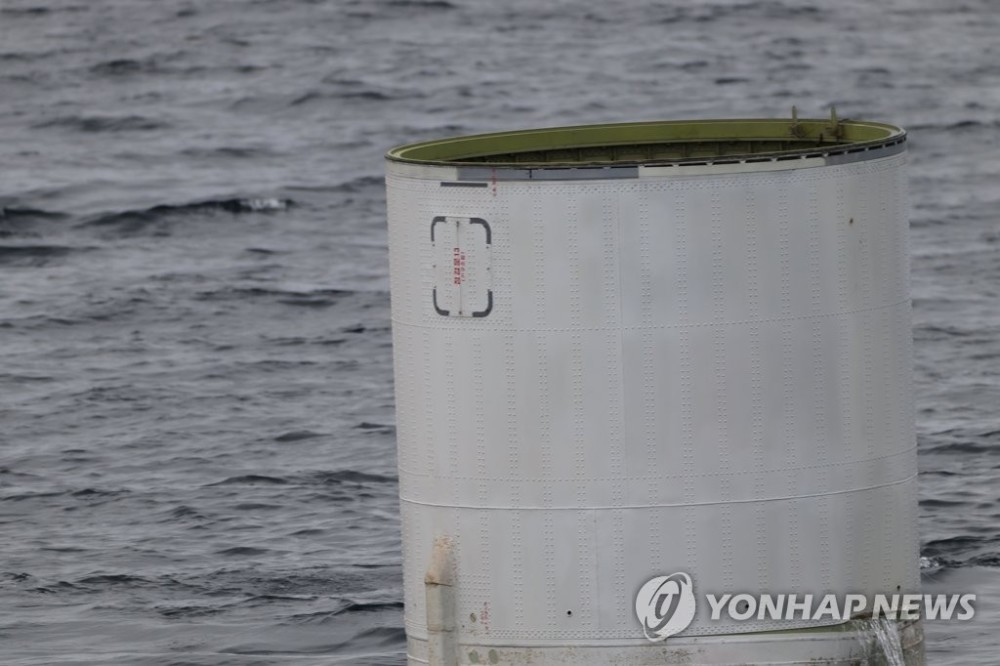
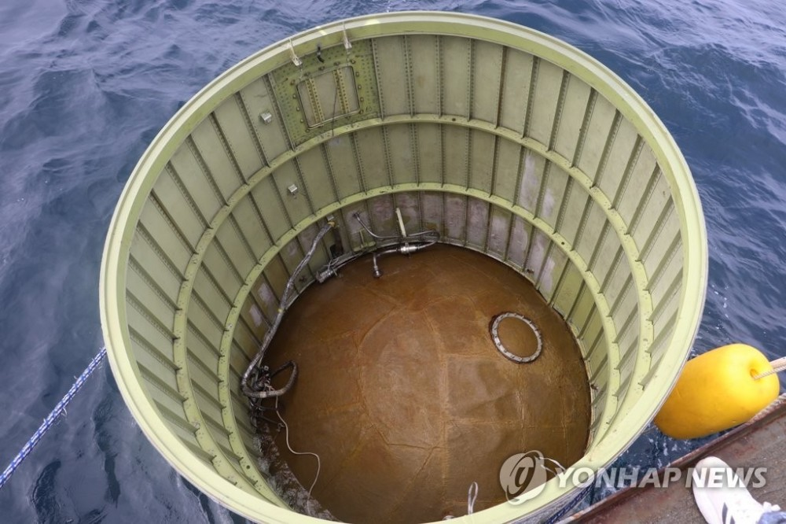
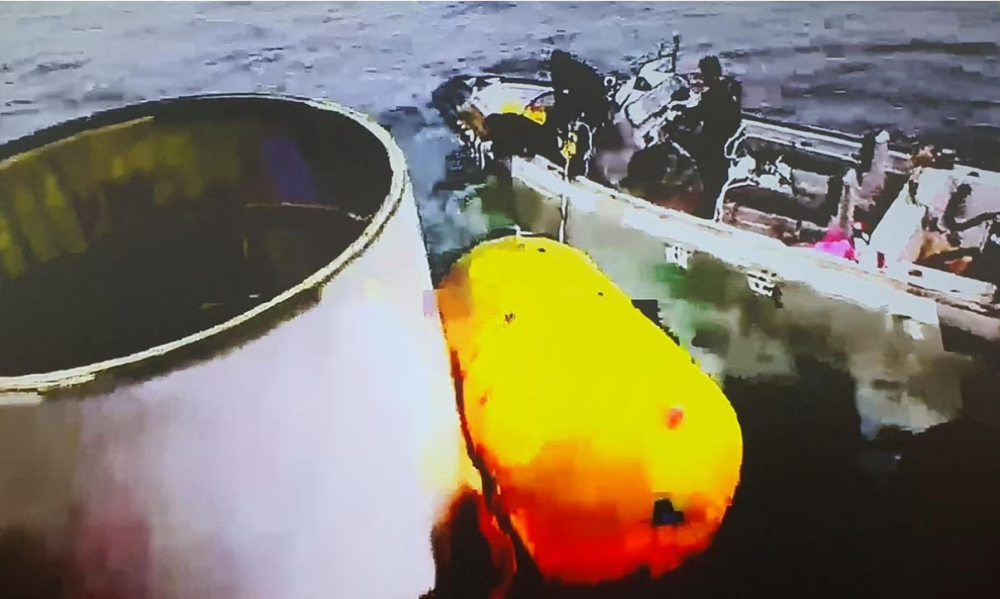

# 朝鲜发射卫星失败后，韩国“打捞了部分，计划回收后分析其性能”

（观察者网讯）据朝中社报道，朝鲜今（5月31日）晨开展的军事侦察卫星发射任务发生意外，运载火箭第二级发动机失灵并丧失动力，坠入朝鲜西部海域。

韩国联合参谋本部当天宣布，韩军在朝鲜航天器坠落地点打捞出疑为航天器部分组建的物体，并正在搜索和打捞其余残骸，韩军还计划在回收航天器后分析其整体性能、是否使用外国零部件及其技术水平等。

路透社称，此次发射活动在韩国和日本部分地区引发了警报和疏散通知。首尔市长吴世勋31日就首尔市政府发布有关预警而引发混乱一事致歉，但否认该预警为误报。日本外务省则称，美日韩三国官员通过电话“强烈谴责”了此次发射。

_韩军正在海上打捞疑为朝鲜所射航天器部分残骸的物体（图源：韩联社）_

朝中社报道称，当地时间5月31日上午6时27分（北京时间5时27分），朝鲜“千里马-1”型新型卫星运载火箭搭载“万里镜-1”号军事侦察卫星，在平安北道铁山郡西海卫星发射场按计划发射升空。运载火箭起初飞行正常，但在火箭第一级分离后，第二级发动机失灵并丧失推进力，后坠入朝鲜西部海域。

据韩联社报道，韩国联合参谋本部称，朝鲜当天上午6时29分许在平安北道东仓里一带向南发射一枚航天器，但该航天器在非正常飞行状态下于上午8时5分许落入韩国中西部於青岛以西约200公里处海域。於青岛位于全罗北道群山以西60多公里处。

韩国联合参谋本部称，韩军于当天上午在相关海域发现并打捞疑似朝方航天器的部分残骸。韩军推测称，已打捞出的物体是用于连接一级和二级火箭的圆柱形装置，待其余残骸被打捞出，韩军计划分析其整体性能、是否使用外国零部件及其技术水平等。

_疑似朝鲜航天运载器的物体。（图源：韩联社）_

韩国联合参谋本部有关负责人称，经过初步研判，朝方航天器的部分残骸落入“韩中暂定措施水域”（中方称“中韩渔业协定暂定措施水域”），即大约在韩中之间的海域。两国渔船可在未申报的情况下在该水域自由进行捕捞活动。

针对“朝鲜此次发射流程是否比之前更快”的提问，韩国联合参谋本部负责人称，此次发射流程确实比过去更快，韩军将继续跟进相关情况。

韩国联合参谋本部还声称，此次将朝鲜发射的物体称为“航天器”而非“弹道导弹”，是因为携带弹头才能叫导弹，朝鲜当天在东仓里（西海卫星发射场）发射飞行器，因此很可能是航天器。

另据路透社报道，31日上午进行的发射是朝鲜第6次尝试发射卫星，也是自2016年以来第一次，本次发射本应将朝鲜的第一颗军事侦察卫星送入预定轨道。

路透社公布了韩军从海中找到据信是朝鲜航天器残骸的现场照片，其中包括一个系在浮标上的巨大圆柱形物体。

报道称，31日上午朝鲜的发射活动在韩国和日本部分地区引发了警报和疏散通知，疏散通知随后被撤回，没有收到造成危险或损坏的报告。

_图源：路透社_

据韩联社报道，首尔市长吴世勋31日在首尔市政府大楼举行紧急记者会时，就首尔市政府当天上午发布有关朝鲜发射航天器的预警而引发混乱一事致歉。

吴世勋称，在朝鲜发射航天器的“紧急情况”下，首尔市消防灾难本部民防预警控制所在收到行政安全部的预警信息后，考虑到情况紧急而选择发送了预警短信。他称，朝鲜此前通常向朝鲜半岛东部海域发射飞行器，但此次则向南发射。对于需为千万市民安全负责的首尔市政府来说，面对该情况有必要立即采取措施，因此发送了预警信息。虽然这可被视为一线工作人员反应过度，但首尔市政府方面认为发布预警并非误报。

_5月31日，在首尔市政府大楼，首尔市长吴世勋举行紧急记者会。（图源：韩联社）_

日本外务省则称，美日韩三国官员通过电话“强烈谴责”了此次发射，称“三国将以高度紧迫感保持警惕”。

据朝中社报道，关于此次发射任务出现的意外，朝鲜国家宇宙开发局表示，事故原因在于运载火箭上的新型发动机系统缺乏可靠性和稳定性，燃料特性不稳定，相关科技人员和专家已着手对事故具体原因展开调查。

朝鲜国家宇宙开发局表示，将具体排查发射卫星时出现的严重问题，尽快采取相关科技攻关措施，经各部分试验后，将在短期内尽快进行第二次发射。

韩国总统办公室相关人士称，朝鲜此前通报国际社会称，其将在5月31日零时至6月11日零时期间发射军事侦察卫星，朝鲜很可能在其预告的6月11日之前再次发射军事侦察卫星，韩国政府正准备加以应对。

韩国国家安保室室长赵太庸31日上午主持召开韩国“国家安全保障委员会”常委会会议，讨论朝鲜再次发射飞行器相关动向，与会者商定将继续密切关注朝方再次发射飞行器的可能性，并与盟国保持紧密合作。

韩联社报道称，韩美日领导人此前曾对“实时共享”朝鲜导弹预警信息达成协议，但此次未能正式启动该机制。韩美日一直推进在朝鲜发射导弹后，三国共享发射地点、飞行方向和速度、预定落点等预警信息的方案。

韩媒称，目前，韩美和美日之间实时共享朝鲜弹道导弹情报，但韩日之间未实时共享相关信息。韩国总统办公室相关人士表示，预计6月韩美日军方进行工作协调后，将随即启动该机制。

**本文系观察者网独家稿件，未经授权，不得转载。**

