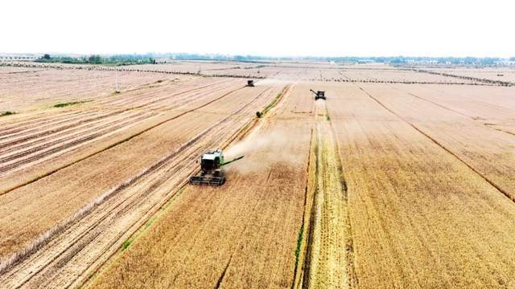
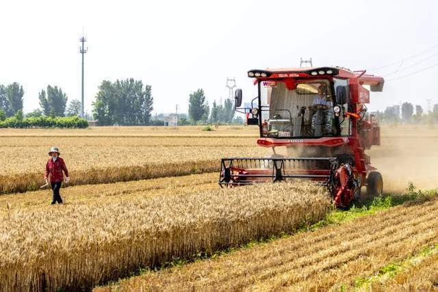
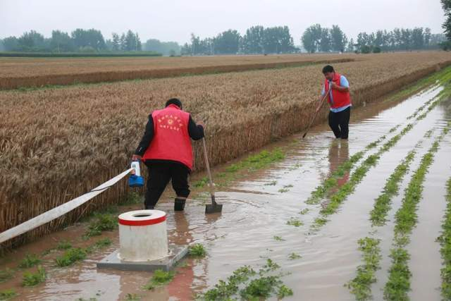
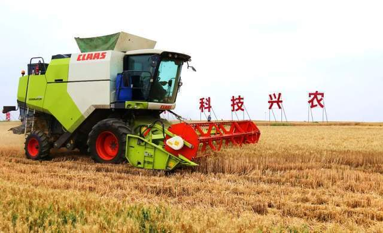

# 河南小麦怎么了：正值收割却发芽长霉，省财政紧急拨款2亿用于烘干

眼下正是河南小麦收割期，然而部分地区的小麦却长了芽发了霉。

近日，有关“数百台收割机被困南阳高速”的信息在网上热传，并引发了诸多网友关注。

据消息反映，由于收割机超高超宽，导致不能按时下高速去收麦，以至于出现上述情况。而小麦一旦发芽发霉，意味着粮食收入将大打折扣。

俗话说“中原熟，天下足”，河南是我国重要的粮食产区，更是最大的小麦产区，产量占据全国四分之一。河南的粮食安全不仅直接关乎当地农民的“饭碗”，也关乎国家粮食安全。

小麦发芽发霉，到底是什么原因？

“收割机的问题当天就解决了”

来自湖北的老唐（化名）是一名收割机手。5月22日，他与另外5名机手一道来到河南，准备在当地进行小麦收割作业。

然而，当他们在南阳唐河收费站准备出站时，却被工作人员拦住了，要求缴纳通行费，共计4000多元人民币。

老唐对中国新闻周刊表示，自己并不是第一次来河南收麦子，此前在高速上通行都免费，“并且我们持有跨区作业证”。

_5月26日，大型收割机在河南省南阳市内乡县牧原农业高产示范方内，冒雨收购小麦。图/中新社发
张中立 摄_

中国新闻周刊了解到，跨区作业证由农业农村部统一印制，实行属地管理。根据我国《收费公路管理条例》规定，进行跨区作业的联合收割机、运输联合收割机（包括插秧机）的车辆，免交车辆通行费。

老唐表示，他的证是今年4月17日在老家当地的农机站服务大厅免费领取的，有效期至2024年3月31日。

但唐河收费站的工作人员表示，仅持有跨区作业证还不够，因为今年有了新的要求——需要持有超限运输证。

超限运输证，全称为超限运输车辆通行证。根据我国公路法相关规定，超过公路限载、限高、限宽、限长标准的车辆，不得在公路行驶。

但考虑到实际情况，政策并没有一刀切，比如对联合收割机跨区运输超限的，在办理超限运输车辆通行证后仍可享受免费通行政策。

老唐对新要求表示无法接受。“按规定收割机不能直接上高速，必须是搭乘板车上路，我们当天六辆收割机共搭乘了两辆板车。这种情况怎么可能不超限呢？”

僵持了近一天后，老唐一行最终还是缴纳了这笔费用。老唐向中国新闻周刊回忆，在自己和工作人员掰扯时，还有十多名机手，也因为同样的原因滞留在收费站出口。

5月30日，中国新闻周刊向南阳市农业农村局求证，一位工作人员证实南阳市唐河县高速路口确曾发生此事，当地农业农村局得知情况后，已与当地交通部门进行协调，事发当天便得到了解决。

5月30日，河南交通投资集团南阳分公司发布通报称，5月22日当天从唐河收费站下站的收割机运输车共计159辆，期间有24辆收割机运输车集中下站并出现缓慢通行情况，原因是部分收割机运输车未办理《超限运输车辆通行证》，导致查验效率不高，其余135辆运输车均有序顺畅通行。5月22日至今，南阳分公司所属11个收费站未再次出现车辆滞留、无法下高速等情况。

至此，收割机无法下高速公路，并不是导致河南小麦问题的原因，那问题到底出在了哪里？

大范围持续阴雨天气是关键

5月30日，南阳市卧龙区英庄镇相子树村村民老谢（化名）看着自家100多亩麦子怅然若失——一周前还金灿灿的，如今却有些发黑了。对于麦农来说，收获期的小麦变黑意味着发芽了，这会对品质和收成造成不小的影响。

据河南省农业农村厅消息，5月25日以来，河南出现大范围持续阴雨天气，已严重影响小麦正常收获，是近10多年来最为严重的“烂场雨”天气。

从专业气象机构发布的信息来看，本次降雨有三个特点：一是持续时间长。从5月25日开始降雨，到5月30日基本结束，历时6天时间，与豫南地区小麦成熟期高度重合；二是影响范围广。降雨覆盖全省17个省辖市和济源示范区，特别是对驻马店、南阳等地影响更大；三是过程雨量大。截至5月29日，全省平均降雨量达到35毫米，有11个省辖市降雨量超过30毫米，其中商丘81.3毫米、周口55毫米、驻马店48.8毫米。

河南省农科院小麦研究所所长雷振生，是河南省小麦产业技术体系首席专家。他告诉中国新闻周刊，这次降雨恰逢河南南部小麦成熟期，确实对当地麦田收获造成了一定影响，不仅影响小麦收获进度，而且会导致小麦倒伏、发芽或霉烂，影响收成和品质。“从位置来看，河南南部比较重一点，情况比较普遍，中部则有一些地块，具体比例还需要等待进一步的统计。”

_5月31日，河南省滑县城关街道耿园村，收割机在收获小麦。图/中新社发
王子瑞 摄_

此次受降雨影响较大的豫南地区，从西到东分别是南阳、驻马店及信阳。河南农业农村厅工作人员告诉中国新闻周刊，2022年，南阳小麦种植面积1093万亩，驻马店1190万亩，信阳468万亩，今年的数据还没公布，变化不会太大，约占全省小麦种植面积的30%。

雷振生还补充道，发芽现象不仅和地理位置有关，不同品种的表现也不一样。

对于这一点，老谢也表示了认同，他告诉中国新闻周刊，豫南地区的小麦分早熟和晚熟两种，这次早熟受的影响大一些，出芽率在90%以上，晚熟的好一些，大概40%的出芽率。

目前，老谢家的小麦全部发芽，已达不到国家收购标准，所以无法按照粮食价格出售，只能当饲料卖。但粮食和饲料的价格差距不小，粮食地头收购价是1块3/斤，饲料只有8毛/斤。按照1亩1000斤的产量计算，意味着每亩损失将达到500元。

驻马店新蔡县的麦农魏宏宇（化名）也向中国新闻周刊反映，因连日下雨，自家种植的20余亩小麦普遍发芽。“发了芽的麦子不劲道，没营养，就算做成馍也是越嚼越细，很难吃。”

对于可能带来的损失，他表示，去年的价格是1块5，今年肯定没法当粮食卖了，大概率只能当饲料，“还得是鸡饲料，猪饲料都不行”。

尽全力抢收

河南省是我国十三个粮食主产区之一，更是小麦生产第一大省。2022年，河南小麦总产量762.54亿斤，比上年增产1.98亿斤，增长0.3%，占到了全国的四分之一。

中国社科院农村发展研究所研究员李国祥告诉中国新闻周刊，收割是否及时，一方面会影响农民的收入，另一方面还将直接影响秋粮播种的时机和进度。

事实上，河南许多地区采用的是“冬小麦+玉米”轮作的种植模式，夏收小麦收不上来，秋粮将无法播种，老谢的100亩地在收完小麦后就要赶快种玉米。

小麦收获窗口期很短，有着“麦熟一晌，龙口夺粮”的说法。雷振生表示，当务之急是发动力量，尽快抢收。

_2023年5月28日，河南省周口市淮阳区冯塘乡冯塘村防汛应急小分队志愿者在部分低洼积水的麦田中加紧抽水排涝。图/中新社发
杨正华 摄_

好消息是，雨水基本上已经过去。据气象部门预测，5月30日降雨基本结束，预计6月1日基本具备农机下地作业条件，6月2日黄河以南进入集中收获期，6月4-7日可形成收获高峰，6月13日前除局部零星降雨外，全省主要麦区以多云和阴天为主，利于大面积机收作业，预计6月15日前后麦收基本结束。

5月30日，河南省最新发布7条重点措施，积极抢收小麦，保障农民收益。

其中农机调度方面，当地将用好现有17万台轮式收割机和3万多台履带式收割机，同时协调周边省份，确保签约履带式收割机到位到田，加快雨后小麦抢收进度。

截至5月30日17时，河南省已收获小麦499万亩(约占全省种植面积的5.8%)，日投入联合收割机1.3万台。其中：南阳308万亩(27.7%)，信阳106.2万亩(21.3%)，驻马店62.9万亩(5.4%)，平顶山17.6万亩(5.1%)。

雷振生还提醒道，现在一方面是抢收，另一方面是得有仓储条件和烘干设备。“过去收割好以后直接就卖了，但现在收上来先得进行烘干，对于散户来说有没有这么大的仓库和地方需要打个问号。”

5月30日，经河南省政府专题研究决定，省财政紧急下拨资金2亿元，专项用于小麦烘干。同时，充分发挥162家国有粮食企业232个库点约200万平米的晾晒场地，1600多座约50亿斤空仓，2000多套通风设备等机械作用，为农民收获的湿粮提供产后服务。

李国祥还提醒道，要防范发芽霉变小麦在市场流通，进入到口粮消费领域，避免冲击粮食质量安全。“烘干之后，部分小麦可能质量还是无法达到安全食用标准，那就不能让它流入市场，但也不能让这部分粮食浪费了，最好就是国家委托收购起来，从流通市场中封闭起来。”

上述7项举措中提到，引导各类市场主体积极开展收购，发挥国有粮食收储企业主力军作用，加大收购力度。对于不符合食用标准的粮食，组织设点收购，确保不流入口粮市场，最大限度保护种粮农民利益。

如何未雨绸缪？

河南全省动员收粮，令人动容的同时，人们不禁要问，灾害天气来临前，我们如何提前做好准备？

据老谢介绍，暴雨来临之前，地方上确实有提醒早收抢收。“可一来抢收会影响产量，二来当时也没那么多收割机，等到收割机到了雨也到了，没法下地干活了。”

李国祥认为，这次还是反映出河南作为粮食大省，在应对农业灾害天气方面存在薄弱环节。

当前，在全球变暖的大背景下，极端天气气候事件呈频发重发态势。而我国恰好是全球气候变化的敏感区和影响显著区之一，这将给农业生产带来深远影响。

自然灾害特别是气象灾害，是造成农业歉收和波动的重要原因。因为气象灾害在多数情况下是不可预知的，而且农民在实际的生产过程中也没有足够的气象防护意识，导致一旦发生气象灾害，就容易造成农作物死亡，严重影响农民的实际经济效益。数据显示，2000—2019年我国农业气象灾害导致的受灾面积多年平均值为3596.03万公顷。

如果不进一步重视异常灾害天气增多的态势，未来我国粮食生产等还可能会遭遇被动。

眼下，黄河流域雨势渐停，雨带转向淮河流域，势必将对华北地区夏粮抢收产生考验。李国祥指出，相关部门一定要吸取河南的经验教训，早做准备。

他建议，应对异常灾害天气给粮食生产等带来的冲击，关键是要加强农业机械配套装备的储备。目前我国拖拉机总量充足，但在雨天也可以作业的拖拉机履带储备不足。一旦遭遇阴雨天气，常规的拖拉机下不了田，农民只能干着急。

_5月26日，大型收割机在河南省南阳市内乡县牧原农业高产示范方内，冒雨收购小麦。图/中新社发 张中立 摄_

“如果说过去遭遇极端异常天气是百年一遇、千年一遇，如今异常极端灾害天气发生频率增高，那么我们就要考虑在不同粮食主产区储备适度的履带，必要时提前布局到位。”

“从根本上来说，有关部门要认识到，帮农民朋友就是保国家粮食安全。”李国祥表示。

作者：余源

