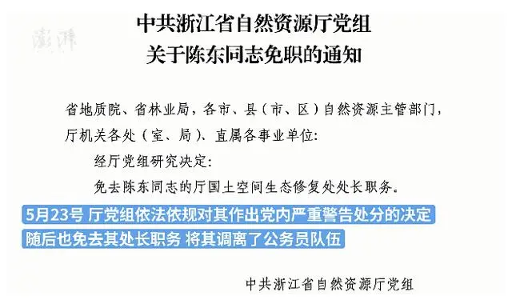

# 评论丨处长地铁猥亵他人被调至事业单位，是“保护性处罚”吗

行政拘留，这是任谁违法也逃不过的处罚，但是在底线处罚之外，处级干部是不是应该付出更多代价？

最近杭州一则地铁猥亵案引起各方关注。当事人陈东身份特殊，原为浙江省自然资源厅国土空间生态修复处处长，因为在地铁上对他人实施猥亵，且情节严重，被给予行政拘留十二日的处罚。此后被浙江省自然资源厅党组免去处长职务，调离公务员队伍。但据媒体了解，陈东已到浙江省自然资源厅下属的事业单位省海洋科学院任职，职务为“管理六级职员”。

就是这个新的职位，引来了舆论的不满。在地铁猥亵他人，这是近年来很受舆论唾弃的违法失德行为，一个处长却公然以身试法，在普通人看来就该“从重”处理。毕竟官方民间都有这样的共识：党员干部在遵纪守法、捍卫公序良俗上，应该坚持比普通人更高的标准。行政拘留，这是任谁违法也逃不过的处罚，但是在底线处罚之外，处级干部是不是应该付出更多代价？

而在这一点上，免去处长职务，调离公务员队伍，以体制内的眼光来看，可能已经算是很严重的惩罚，带着污点降级调岗，通常意味着当事人的前途大毁，不太可能再有上升空间。可是在普通人眼里，事业单位即便比不上公务员，也仍是旱涝保收的好单位，而且“管理六级职员”，也相当于副处级。这么一想，也就难怪有人怀疑这是不是“保护性处罚”了。

按照公职人员相关管理规定，行政拘留不等于刑事犯罪，确实不属于必须开除的范畴，除非“情节严重”。而在地铁猥亵他人，虽然听起来性质非常恶劣，可如果没造成什么人身伤害等后果，以法律的标准，是不太可能下“情节严重”定性的。或者说，这里存在自由裁量的模糊空间。如果以社会影响恶劣的由头开除，当事人可能也很难申辩；但若以够不上“情节严重”为由，网开一面，好像也很难挑出硬伤。

面对各方质疑，目前还没见到当地官方有新的回应，不知道后续还会不会有什么追加处理。只是，如果就此盖棺定论，恐怕很难过得了舆论关。
**从公务员到事业编，从处长到相当于副处级的“管理六级职员”，参照标准不同，所得出的结论差异甚大。**
丢了原来的处长职位，付出的代价不算小，可相比普通人的境遇，副处级事业编已属相当优待。而在社会对考公考编热情持续攀升的现实背景下看，一个违法失德的人还能稳坐如此岗位，不满的情绪也就可以理解。

总之，评价一个处罚措施是否合理，是无法脱离现实的社会语境的。这件事提供的教训之一，
**就是公务员、事业编的含金量越来越高的现实下，对公职人员的管理也理当越来越严。越多人羡慕公务员的位置，对公务员的监督意愿自然就越强。**
如果不想被舆论挑刺，公职人员个体就得更加谨言慎行，单位也要管理从严。而这，对于公职人员来说，确实也不算什么过分要求。

红星新闻特约评论员 守一

编辑 汪垠涛

红星评论投稿邮箱：hxpl2020@qq.com

