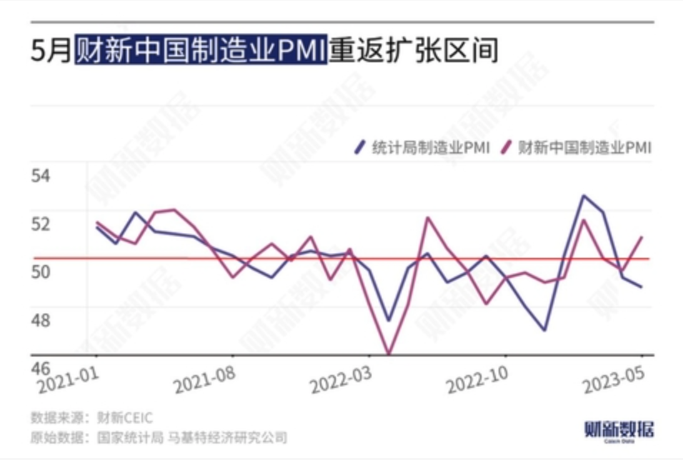

# 5月财新中国制造业PMI升至50.9 供需改善、就业和信心转弱

【财新网】5月中国制造业景气度回升至荣枯线以上，显示制造业生产经营活动仍具韧性，但就业形势持续恶化，企业信心也明显下滑。

6月1日公布的5月财新中国制造业采购经理指数（PMI）录得50.9，较4月回升1.4个百分点，时隔两个月重回扩张区间。

这一走势与国家统计局制造业PMI并不一致。统计局公布的5月制造业PMI为48.8，低于4月0.4个百分点，连续两月低于荣枯线。

从分项数据看，制造业供需小幅扩张。5月制造业生产指数升至2022年7月来最高，制造业新订单指数重新升至临界点以上，为过去两年来次高，仅低于2023年2月。受访企业表示，潜在需求改善、新客户增加，带动销售增长，产量也随之上升。分三大类产品看，投资品类是唯一生产、销售均下降的产品，中间品类和消费品类产销均上升。

在4月重回扩张区间后，5月新出口订单指数继续小幅反弹，显示外需改善，但幅度仍有限。分类来看，中间品类新增出口量上升，消费品类、投资品类则下降。

制造业供需改善并未传递到就业端，5月就业情况进一步恶化，就业指数降至2020年3月来最低。月内缩减用工的企业普遍表示，员工自愿离职后没有填补空缺，更重要的是需着力控制成本。产量上升，叠加新订单增速较低，企业处理积压订单能力增强，5月积压业务量指数近五个月来首次低于荣枯线。

受工业金属、食品和燃料等价格走低影响，制造业成本压力持续缓和，5月制造业原材料购进价格指数在收缩区间微升，降幅仍然显著，其中中间品类投入成本降幅最大。成本下降叠加市场竞争激烈，制造业出厂价格指数在荣枯线下小幅上升，为2016年以来次低。

供应商产能提升，再加上物流改善，推动5月供应商交货时间指数在扩张区间小幅上升，为近三个月来最高。

尽管制造业整体景气度改善，制造业企业家对未来一年的预期明显下滑。5月制造业信心指数降至2022年11月以来最低，低于长期均值。不少企业担心经济不稳定性仍将持续，尤其是海外市场，不利于生产经营。

财新智库高级经济学家王喆表示，5月财新中国制造业PMI冷热不均：市场供求大幅改善，企业采购和补库亦较为积极；与之形成对比的是就业恶化、价格水平下跌，以及乐观预期淡化。这种分歧反映出目前经济增长内生动力不足、市场主体信心不强的事实，更加凸显扩大和恢复需求的重要性。当前，就业形势严峻，通缩压力累积，通过积极财政政策稳定就业、增加收入、改善预期应是政策优先选项。

