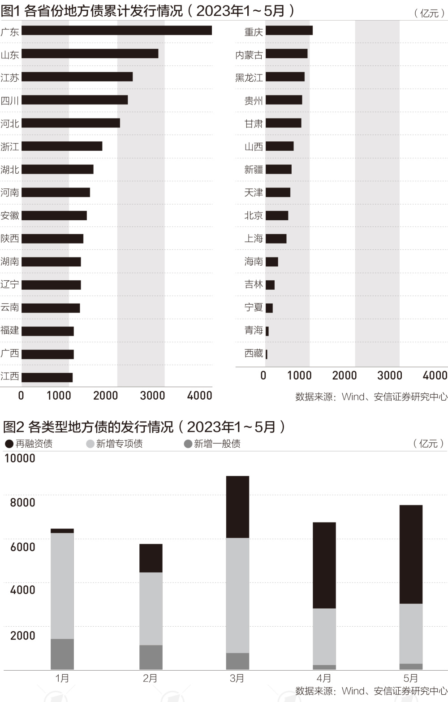

# 今年前五月地方“借钱”超3.5万亿，都花在哪了？部分用来还旧债

为了稳投资和还旧债，地方公开借钱规模超过去年同期。

根据安信证券研究中心及财政部数据，今年前5个月地方政府累计发行债券约3.54万亿元，同比增长约6.6%。其中，新增债券近2.26万亿元，同比下降约7.8%，再融资债券约1.28万亿元，同比增长约47%。

不难发现，今年以来地方借钱规模增长最快的，是通过再融资债券筹钱。而再融资债券是用于偿还到期债务本金，即借新还旧。

今年是地方政府债券偿债高峰期，预计今年到期偿还金额约3.65万亿元。近年受疫情等冲击，经济下行，叠加减税降费和楼市、土地市场低迷，地方财政收入受到明显冲击，而偿还如此巨额债务仍主要依赖于发行再融资债券来借新还旧，这缓解了地方偿债压力，有利于防范地方政府债务风险。

财政部数据显示，今年前4个月，地方政府债券到期偿还本金7916亿元，其中发行再融资债券偿还本金7398亿元，占比高达94%。

由于前些年地方政府债券发行期限较短，与融资项目期限并不匹配，而发行再融资债券一大原则是与同一项目剩余期限相匹配，解决了部分地方政府债券项目可能出现的期限错配风险。这也是再融资债券发行规模较大的一个重要原因。

为此，近些年地方发债期限明显拉长。财政部数据显示，截至2023年4月末，地方政府债券剩余平均年限8.8年，而2018年这一数字为4.4。

今年以来地方借的钱，除了还旧债之外，更多是用于投入新的重大项目，利于拉动投资稳增长。今年前5个月共发行约2.26万亿元新增债券：从月度发行规模看，一季度发债进度相对较快，4月和5月发行量有所回落。总体来看，今年地方发债节奏比较快，但低于去年。

今年以来新增债券筹资中，又以新增专项债券为主。今年3.8万亿元新增专项债限额中，前5个月发行规模占半，近1.9万亿元。这笔钱主要投向了重大基础设施建设项目。

根据安信证券研究中心数据，今年前5个月，约有48.5%的专项债投向传统基建领域（交通运输、市政建设和产业园区基础设施建设），较2022年的50.3%略有下降；投向保障房、旧改、棚改的专项债的占比约为15.2%，较2022年末的11.0%明显提升；1~5月支持中小银行专项债发行的占比约为6.3%，较去年末的1.5%明显上行。

专项债是带动扩大有效投资、稳定宏观经济的重要工具。随着4月份以来部分经济指标走弱，市场对于积极财政政策发力呼声渐多。

多位财税专家告诉第一财经，当前应该加快专项债发行节奏，并提高债券使用效率，以拉动有效投资，推动经济运行在合理区间。

近年来专项债额度分配进一步向经济大省、经济强省倾斜，因为这些省份财政实力相对较强，债务风险相对较低，且国家重大战略项目多。

安信证券研究中心数据显示，2023年1~5月共有5个省份地方债发行规模突破2000亿元，依次是广东、山东、江苏、四川和河北。与2022年同期相比，上述5个省份发债规模占比明显提升，地方债发行进一步向经济发达省份集中。

随着剩余的新增债券额度已经分配至各省市，市场预计6月份将迎来新一轮地方发债高峰。

安信证券固收首席分析师池光胜预计，6月地方债发行规模在1.01万亿，三季度和四季度的发行规模分别约为2.26万亿和9500亿元。

财政部数据显示，截至2023年4月末，全国地方政府债务余额37.05万亿元，控制在全国人大批准的限额之内（42.17万亿元）。

