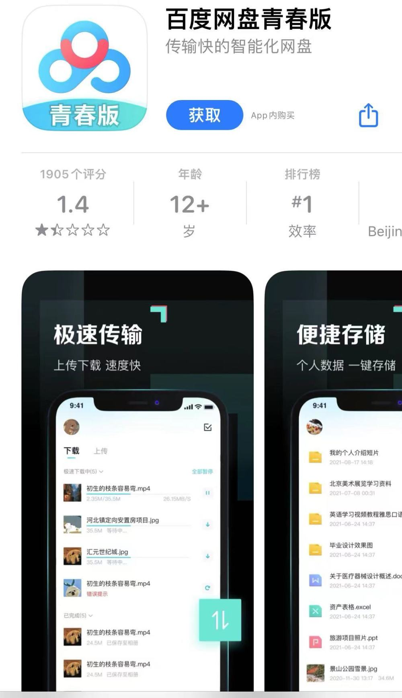
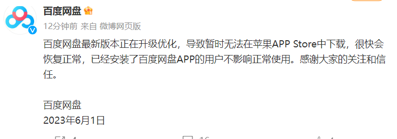

# 从苹果应用商店下架？百度网盘回应：新版本正在升级，很快会恢复正常

6月1日，苹果App
Store页面显示，目前百度网盘App已无法从该应用商店搜索到，输入“百度网盘”仅能搜索到百度网盘青春版。据页面显示，百度网盘青春版由百度网盘打造，但5分的满分评分下，该APP只有1.4分。

而从已下载App处点击百度网盘，显示无法连接网络。对此，百度网盘官方微博回应称：目前已紧急沟通中，可先在百度App小程序端使用网盘。随后，百度网盘补充称百度网盘最新版本正在升级优化，导致暂时无法在苹果APPStore中下载，很快会恢复正常，已经安装了百度网盘APP的用户不影响正常使用。

